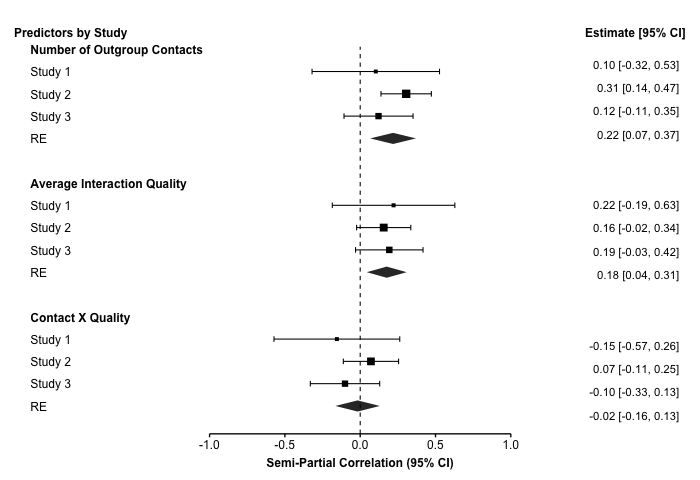
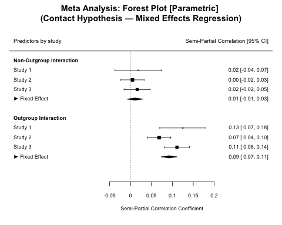
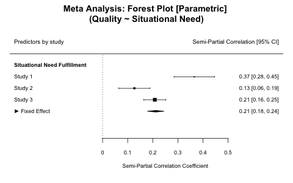
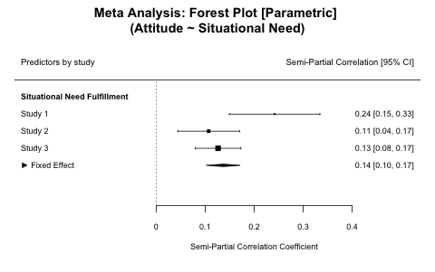
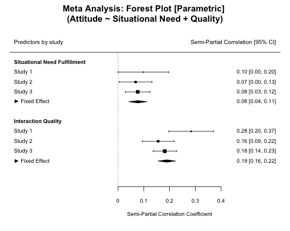
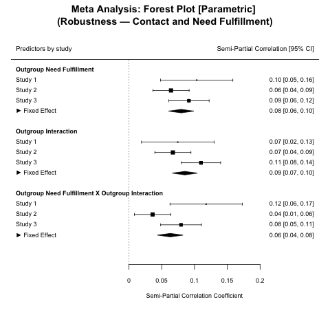

<style type="text/css">
.main-container {
  max-width: 1300px;
  margin-left: auto;
  margin-right: auto;
}
.table {
  margin-left:auto; 
  margin-right:auto;
}
</style>


```{r setup, include=FALSE}
# R Studio Clean-Up
cat("\014") # clear console
# rm(list=ls()) # clear workspace - use restart R instead [cmd/alt + shift + F10]
gc() # garbage collector

# Install and Load Packages
# !IMPORTANT!
# BEFORE FIRST RENDER:
# To install all relevant packages please run "renv::restore()" (or renv::init() and then initiate from lockfile) in the console before the first use to ensure that all packages are using the correct version.
# to store the packages in a contained library within the project folder: renv::settings$use.cache(FALSE) and add 'RENV_CONFIG_SANDBOX_ENABLED = FALSE' to an '.Renviron' file
lib <- c(
  "rmarkdown",
  "knitr",
  "remedy",
  "bookdown",
  "brms",
  "psych",
  "ggplot2",
  "ggthemes",
  "haven",
  "RColorBrewer",
  "plotly",
  "gridExtra",
  "ggpattern",
  "ggridges",
  "lme4",
  "nlme",
  "jtools",
  "gtsummary",
  "sessioninfo",
  "tibble",
  "pander",
  "devtools",
  "mada",
  "data.table",
  #"tidyr",
  #"tidyverse",
  "plyr",
  "dplyr",
  "Hmisc",
  "kableExtra",
  "papaja",
  "stringr",
  "stringi",
  "reshape2",
  "lubridate",
  "purrr",
  "metafor"
)
invisible(lapply(lib, library, character.only = TRUE))
rm(lib)

# Load Custom Packages
source("./scripts/functions/fun.panel.R")
source("./scripts/functions/themes.R")
source("./scripts/functions/binaryCor.R")
source("./scripts/functions/MlCorMat.R")
source("./scripts/functions/MlTbl.R")
source("./scripts/functions/metaLmer.R")

# Markdown Options
knitr::opts_knit$set(root.dir = rprojroot::find_rstudio_root_file()) # set working directory
knitr::opts_knit$get("root.dir") # check working directory
options(
  scipen = 999,
  digits = 4,
  width = 400
) # removes scientific quotation
# knitr::opts_chunk$set(echo = TRUE, cache = F, cache.path = rprojroot::find_rstudio_root_file('cache/')) # cache settings
knitr::knit_hooks$set(
  error = function(x, options) {
    paste('\n\n<div class="alert alert-danger">',
      gsub("##", "\n", gsub("^##\ Error", "**Error**", x)),
      "</div>",
      sep = "\n"
    )
  },
  warning = function(x, options) {
    paste('\n\n<div class="alert alert-warning">',
      gsub("##", "\n", gsub("^##\ Warning:", "**Warning**", x)),
      "</div>",
      sep = "\n"
    )
  },
  message = function(x, options) {
    paste('\n\n<div class="alert alert-info">',
      gsub("##", "\n", x),
      "</div>",
      sep = "\n"
    )
  }
)
htmltools::tagList(rmarkdown::html_dependency_font_awesome())

# Global Chunk Options
knitr::opts_chunk$set(
  fig.width = 12,
  fig.height = 8,
  fig.path = "Figures/",
  echo = TRUE,
  cache = TRUE,
  warning = FALSE,
  message = FALSE
)

# set ggplot theme
theme_set(theme_Publication())
```

<br/>

<i class="fas fa-exclamation-circle"></i> Note. Boxplots display the interquartile range (IQR, center box), and the whiskers extend 1.5*IQR from the lower and upper hinge. The white point indicates the mean and the white center line indicates the median.   

<br/>

<i class="fas fa-exclamation-circle"></i> Note. All multilevel assumptions are tested as usual including (e.g., for random slopes model with _j_ within person predictors):

$$
\begin{align}
  &\textrm{Level 1 Variance:}\ e_{ti} \sim \mathcal{N}(0,\sigma^2) \\
  &\textrm{Level 2 Variance:}\ \begin{bmatrix} u_{0i}\\ \vdots\\ u_{ji}\end{bmatrix} 
  \sim \mathcal{N}
  \begin{pmatrix}
    \begin{bmatrix} 
      0 \\ 
      \vdots \\
      0
    \end{bmatrix}, 
    \begin{bmatrix} 
      \tau_{00}^2 &  & \\ 
      \vdots & \ddots & \\
      \tau_{j0} & \ldots & \tau_{jj}^2
    \end{bmatrix}
  \end{pmatrix}
\end{align}
$$

</br>

<!-- <i class="fas fa-exclamation-circle"></i> Note. Multilevel effect size could be:  -->
<!-- \begin{equation} -->
<!-- (\#eq:MlEffectSize) -->
<!-- f_b^2 = \frac{R_{ab}^2 - R_a^2}{1 - R_{ab}^2} \\ -->
<!-- R^2 = \frac{V_{null} - V_{model}}{V_{null}} \\ -->
<!-- f_b^2 = \frac{\frac{V_{null} - V_{ab}}{V_{null}} - \frac{V_{null} - V_{a}}{V_{null}}}{1 - \frac{V_{null} - V_{ab}}{V_{null}}} -->
<!-- \end{equation} -->

<!-- <br/> -->

# **Data Preparation**  

In an initial preparatory step, we import the data into the R project environment and prepare the variables for further processing and later analyses.   

## Data Import  

The data were collected using two different survey tools. For the study with sojourners (Study 1: worker) we used the survey platform Qualtrics XM, whereas the studies with international students (Study 2: student), and the international medical professionals (Study 3: medical) were conducted using the survey framework FormR. This means that the datasets had inconsistent file formats and naming conventions. For the Qualtrics study we pre-processed some variables to ease the import process (for the syntax files see the SPS files in '_data/S1_Workers/processed/cleaned_' and for the raw data files see '_data/S1_Workers/raw_'). For the two other studies, we import the raw csv files from their respective folders.  

```{r formrImport}
# workers
# initial data cleaning was done in SPSS (syntax files are available in "")
dtWorker <- list(
  raw.pre = read_spss("data/S1_Workers/processed/cleaned/MT - Pre-Measure - 06-15-2018.sav"),
  raw.post = read_spss("data/S1_Workers/processed/cleaned/MT - Post-Measure - 06-15-2018.sav"),
  raw.morning = read_spss("data/S1_Workers/processed/cleaned/MT - Morning - 06-15-2018.sav"),
  raw.afternoon = read_spss("data/S1_Workers/processed/cleaned/MT - Afternoon - 06-15-2018.sav")
)

# students
dtStudents <- list(
  raw.pre = read.csv(file = "data/S2_Students/raw/AOTS_Pre.csv", header = T, sep = ","),
  raw.post = read.csv(file = "data/S2_Students/raw/AOTS_Post.csv", header = T, sep = ","),
  raw.daily = read.csv(file = "data/S2_Students/raw/AOTS_Daily.csv", header = T, sep = ",")
)

# young medical professionals
dtMedical <- list(
  raw.eligibility = read.csv("data/S3_Medical/raw/AOTM_Eligibility.csv"),
  raw.pre = read.csv("data/S3_Medical/raw/AOTM_Pre.csv"),
  raw.post = read.csv("data/S3_Medical/raw/AOTM_Post.csv"),
  raw.daily = read.csv("data/S3_Medical/raw/AOTM_Daily.csv")
)
```

## Data Cleaning & Data Exclusions  

### Study 1

For the sojourner sample data was collected in four separate surveys: (1) the pre-measurement, (2) the daily morning survey, (3) the daily afternoon survey, as well as (4) a post-measurement. We combine the four individual surveys into one cohesive dataframe and drop superfluous variables that are not relevant to the analyses relevant here. We then format the time and date variables and add person- and measurement indices (for easy and meaningful addressing of the data). We also exclude our own test data.  
<i class="fas fa-info-circle"></i> _Note:_ All data preparation steps are saved in the '_dtWorker_' list. 

```{r cleanWorker}
#  important names for Morning and Afternoon
names.m <- c(
  "StartDate",
  "EndDate",
  "Finished",
  "Duration__in_seconds_",
  "RecordedDate",
  "ExternalReference",
  "Meta_Operating_System",
  "Contact_dum",
  "number",
  "time",
  "duration_1",
  "dyad.group",
  "gr_size",
  "gr_type_1",
  "gr_type_2",
  "gr_type_3",
  "gr_type_4",
  "gr_type_5",
  "gr_type_6",
  "gr_type_7",
  "gr_type_8",
  "gr_type_9",
  "gr_type_10",
  "gr_type_11",
  "gr_type_12",
  "gr_type_13",
  "gr_type_14",
  "gr_type_15",
  "gr_type_16",
  "gr_type_17_TEXT",
  "gr_context_1",
  "gr_context_2",
  "gr_context_3",
  "gr_context_4",
  "gr_context_5",
  "gr_context_6",
  "gr_context_7",
  "gr_context_8",
  "gr_context_9",
  "gr_context_10",
  "gr_context_11",
  "gr_context_12",
  "gr_context_13_TEXT",
  "gr_context_14_TEXT",
  "gr_dutchness",
  "dyad_type_1",
  "dyad_type_2",
  "dyad_type_3",
  "dyad_type_4",
  "dyad_type_5",
  "dyad_type_6",
  "dyad_type_7",
  "dyad_type_8",
  "dyad_type_9",
  "dyad_type_10",
  "dyad_type_11",
  "dyad_type_12",
  "dyad_type_13",
  "dyad_type_14",
  "dyad_type_15",
  "dyad_type_16",
  "dyad_type_17_TEXT",
  "Context_1",
  "Context_2",
  "Context_3",
  "Context_4",
  "Context_5",
  "Context_6",
  "Context_7",
  "Context_8",
  "Context_9",
  "Context_10",
  "Context_11",
  "Context_12",
  "Context_13_TEXT",
  "Context_14_TEXT",
  "keyMotive",
  "keymotive_fulfillemt_1",
  "keyMotive_Dutch_1",
  "autonomy_1",
  "competence_1",
  "relatedness_self_1",
  "relatedness_other_1",
  "qualityAccidental_1",
  "qualityVoluntary_1",
  "qualityCooperative_1",
  "qualityDutchy_1",
  "quality_overall_1",
  "quality_meaning_1",
  "quality_star_1",
  "wantInt",
  "desire_type_1",
  "desire_type_2",
  "desire_type_3",
  "desire_type_4",
  "desire_type_5",
  "desire_type_6",
  "desire_type_7",
  "desire_type_8",
  "desire_type_9",
  "desire_type_10",
  "desire_type_11",
  "desire_type_12",
  "desire_type_13",
  "desire_type_14",
  "desire_type_15",
  "desire_type_16",
  "desire_type_17_TEXT",
  "desire_context_1",
  "desire_context_2",
  "desire_context_3",
  "desire_context_4",
  "desire_context_5",
  "desire_context_6",
  "desire_context_7",
  "desire_context_8",
  "desire_context_9",
  "desire_context_10",
  "desire_context_11",
  "desire_context_12",
  "desire_context_13_TEXT",
  "desire_context_14_TEXT",
  "Reason_nodesire",
  "keyMotive_noInt",
  "keyMotive_noInt_fulf_1",
  "autonomy_NoInt_1",
  "competence_NoInt_1",
  "relatedness_1_NoInt_1",
  "thermometerDutch_1",
  "thermometerDutchInt_2",
  "ExWB_1",
  "alertness1",
  "calmness1",
  "valence1",
  "alertness2",
  "calmness2",
  "valence2",
  "inNonDutch",
  "NonDutchNum",
  "NonDutchType_1",
  "NonDutchType_2",
  "NonDutchType_3",
  "NonDutchType_4",
  "NonDutchType_5",
  "NonDutchType_6",
  "NonDutchType_7",
  "NonDutchType_8",
  "NonDutchType_9",
  "NonDutchType_10",
  "NonDutchType_11",
  "NonDutchType_12",
  "NonDutchType_13",
  "NonDutchType_14",
  "NonDutchType_15_TEXT",
  "date",
  "time.0",
  "LocationLatitude",
  "LocationLongitude"
)

names.a <- c(names.m, "keyInteraction_1", "keyInteractionTime")

# Create reduced data sets for morning and afternoon
dat.mo <- dtWorker$raw.morning[, names.m]
dat.mo$daytime <- "morning"

dat.af <- dtWorker$raw.afternoon[, names.a]
dat.af$daytime <- "afternoon"

# merge morning and afternoon measurements with indicator [+ clean up]
daily.dat <- plyr::rbind.fill(dat.mo, dat.af)
daily.dat <- daily.dat[daily.dat$ExternalReference != 55951, ]
dtWorker$daily <- daily.dat
rm(dat.mo, dat.af, names.m, names.a, daily.dat)


# names for pre-measurement
names.pre <- c(
  "Finished",
  "age",
  "Gender",
  "Living",
  "roommate_1",
  "roommate_2",
  "roommate_3",
  "nationality",
  "SecondNationality",
  "timeNL_1",
  "Reason_2",
  "Reason_5",
  "Reason_7",
  "Reason_8_TEXT",
  "DutchLang",
  "occupation_1",
  "occupation_2",
  "occupation_3",
  "occupation_4",
  "occupation_7",
  "CurrentEducation_1",
  "education_level",
  "EduLang_2",
  "RUG_faculty",
  "Study.0",
  "association",
  "DutchMeetNum",
  "DutchFriends_1",
  "assimilation",
  "separation",
  "integration",
  "marginalization",
  "VIA_heritage",
  "VIA_Dutch",
  "SSAS_surrounding",
  "SSAS_privat",
  "SSAS_public",
  "autonomy",
  "relatedness",
  "competence",
  "anxiety",
  "swl",
  "alertness",
  "calmness",
  "valence",
  "date",
  "time",
  "City",
  "ZIP",
  "id"
)

# reduced data set for pre measurement
dat.pre.red <- dtWorker$raw.pre[, names.pre]

# merge with daily data [+ clean up]
df.pre <- merge(
  x = dtWorker$daily,
  y = dat.pre.red,
  by.x = "ExternalReference",
  by.y = "id",
  all = T
)
rm(names.pre)

# adjust duplicate names to fit to indicate daily or pre measurement
names(df.pre) <- gsub("[[:punct:]]x", ".daily", names(df.pre))
names(df.pre) <- gsub("[[:punct:]]y", ".pre", names(df.pre))

# names for post measurement
names.post <- c(
  "ExternalReference",
  "assimilation",
  "separation",
  "integration",
  "marginalization",
  "VIA_heritage",
  "VIA_Dutch",
  "anxiety",
  "swl",
  "rosenberg",
  "social_support",
  "stress",
  "discrimination",
  "discrimination_month",
  "NLE_1month",
  "NLE_6month",
  "NLE_12month"
)

# reduced data set for post-measurement
dat.post.red <- dtWorker$raw.post[, names.post]

# merge post measurement with pre- and daily data
df <- merge(
  x = df.pre,
  y = dat.post.red,
  by.x = "ExternalReference",
  by.y = "ExternalReference",
  all = T
)

# adjust duplicate names to indicate pre or post
names(df) <- gsub("[[:punct:]]x", ".pre", names(df))
names(df) <- gsub("[[:punct:]]y", ".post", names(df))

# add to list
dtWorker$combined <- df

# create data frame with cleaned data
df <- dtWorker$combined %>%
  filter(
    Finished.pre == 1,
    Finished.daily == 1,
    !is.na(ExternalReference)
  )

# add running number as measurement ID within participants
df$measureID <- rowidv(df, cols = c("ExternalReference"))

df <- df %>%
  mutate(
    PID = as.numeric(factor(ExternalReference)),
    # participant ID
    TID = measureID - 1,
    # time ID with t0 = 0 for meaningfull intercept interpretations
    date = substr(StartDate, 1, 10),
    # awkward way of extracting date (best converted to )
    time = substr(StartDate, 12, 19),
    # awkward way of extracting time
    daynum = as.numeric(factor(date)),
    # all days as numeric for ordering
    daycor = ifelse(
      daytime == "morning" &
        period_to_seconds(hms(time)) < period_to_seconds(hms("12:00:00")) |
        daytime == "afternoon" &
          period_to_seconds(hms(time)) < period_to_seconds(hms("19:00:00")),
      daynum - 1,
      daynum
    ),
    # correctly identify which date the questionnaire is about
    daycor.lead = sprintf("%02d", daycor),
    daytime.lt = ifelse(daytime == "morning", "a", "b"),
    # morning / afternoon to a / b
    day_time = paste(daycor.lead, daytime.lt, sep = "_"),
    # combine day id with morning / afternoon
    session = as.numeric(factor(day_time)),
    # day and time identifier as numeric id
    SubTime = chron::times(time.0),
    time.daily = as.character(time.daily),
    PPDate = as.Date(df$date.daily),
    number = tidyr::replace_na(number, 0),
    NonDutchNum = tidyr::replace_na(NonDutchNum, 0)
  )

dtWorker$clean <- df

# clean up
rm(df.pre, names.post, dat.post.red, dat.pre.red, df)

# Export reduced Data
# write.csv(dtWorker$clean, "data/processed/MT_clean-merged_07-05-2018.csv", row.names = F)
# save(dtWorker$clean, file = "data/processed/MT_clean-merged_07-05-2018.RData")
```

### Study 2

For the student sample data was, similarly, collected in three separate surveys: (1) the pre-measurement, (2) the daily survey sent out at lunch and dinner time, and (3) a post-measurement. We combine the three individual surveys into one large dataframe and drop superfluous variables that are not relevant to the analyses relevant here. We exclude our own test data as well as one participant who entered the study twice (but gave different responses during the pre-measurement). We also reformat missing values and format core ID variables.  
<i class="fas fa-info-circle"></i> _Note:_ All data preparation steps are saved in the '_dtStudents_' list. 

```{r cleanStudents}
# our own test IDs
ownIDs <- c(
  "beautifulLionfishXXXR5rcgVBzGu8hPvOqrK8UBJBw4owvi9nfRFSFu3lMzYhE",
  "niceDogoXXXmB8JI5SFu78SF3DVof84mGUPPNUr14p2HYFTtp31a6D1OwAzM6F-K",
  "amusedQuailXXXmhuc_fpTp8vPkMwDH1BzjaH1d1kHSO1bsPEfsnaEYk4WeVBfPi",
  "juwGAbtXX0_1kmZtSVqKh3PGaHOICqUyU4iBkrT3nDsI_uifuD1gzKcZerxaM5FL"
)

# Prepare dfs for Cleaning
df.pre <- dtStudents$raw.pre %>% 
  naniar::replace_with_na_all(condition = ~.x == "") %>%
  naniar::replace_with_na_all(condition = ~.x == "NA") %>%
  # mutate_all(na_if, "") %>%
  # mutate_all(na_if, "NA") %>%
  filter(!is.na(ended)) %>% # remove all who did not finish
  filter(!e_mail %in% .$e_mail[duplicated(.$e_mail)]) %>% # remove all who did the pre questionnaire multiple times (b/c inconsistent ratings scales)
  filter(!session %in% ownIDs) %>% # remove our own test
  mutate(session = as.character(session)) # turn factor into character strings (probably just precaution)

df.post <- dtStudents$raw.post %>%
  naniar::replace_with_na_all(condition = ~.x == "") %>%
  naniar::replace_with_na_all(condition = ~.x == "NA") %>%
  filter(!is.na(session)) %>% # remove own test runs
  filter(!session %in% ownIDs) %>% # remove our own test
  filter(session %in% df.pre$session) %>% # remove anyone who wasn't in the pre
  filter(!is.na(ended)) %>% # remove all who never finished
  filter(!session %in% .$session[duplicated(.$session)]) %>% # remove all duplicate sessions
  mutate(session = as.character(session)) # turn factor into character strings (probably just precaution)

df.daily <- dtStudents$raw.daily %>%
  naniar::replace_with_na_all(condition = ~.x == "") %>%
  naniar::replace_with_na_all(condition = ~.x == "NA") %>%
  filter(!session %in% ownIDs) %>% # remove our own test
  filter(session %in% df.pre$session) %>% # remove anyone who wasn't in the pre
  filter(!is.na(ended)) %>% # remove all who never finished
  mutate(session = as.character(session)) # turn factor into character strings (probably just precaution)

# merge daily with pre
dfPreDaily <- merge(
  x = df.daily,
  y = df.pre,
  by = "session",
  suffixes = c(".daily", ".pre"),
  all = F
)

# merge daily with post
dfCombined <- merge(
  x = dfPreDaily,
  y = df.post,
  by = "session",
  suffixes = c(".pre", ".post"),
  all = F
)

# add to list
dtStudents$clean <- dfCombined

# clean up workspace
rm(df.pre, df.daily, df.post, dfPreDaily, dfCombined, ownIDs)
```

### Study 3

For the medical professionals sample data was, again, collected in three separate surveys: (1) the pre-measurement, (2) the daily survey sent out at lunch and dinner time, and (3) a post-measurement. We combine the three individual surveys into one large dataframe. We exclude our own test data. We also reformat missing values and format core ID variables.  
<i class="fas fa-info-circle"></i> _Note:_ All data preparation steps are saved in the '_dtMedical_' list. 

```{r cleanMedical}
# our own test IDs
ownIDs <- c(
  "test_LeonieXXXSklxecPLW0-FBPM4796o3pUwUhAY5jb9KGw8jQsKxWmGpa1Jiy", 
  "test_MaxXXXtOp_5dTNefIq0yKXtXt2IN6eEKxeHoPY9mlyvdsqPpLp1B0NGg4UL",
  "test_JannisXXXBsNqk62fOpX6chbd2tMWPptUdjjnhAqnQ3uBqckZ7gLIEoPlfZ",
  "quaintLeopardCatXXXAJ9cfSj-_SZLwNwMDxv_xv_iyr1Bg5YFLTlYdrjW0UXZY",
  "blue-eyedIndianElephantXXXLf5zPMpQCDGS3umFzIj-YVky7ivTItvvozW49m"
)

# Prepare dfs for Cleaning
df.pre <- dtMedical$raw.pre %>%
  naniar::replace_with_na_all(condition = ~.x == "") %>%
  naniar::replace_with_na_all(condition = ~.x == "NA") %>%
  filter(!is.na(ended)) %>% # remove all who did not finish
  filter(!session %in% ownIDs) %>% # remove our own test
  mutate(session = as.character(session)) # turn factor into character strings (probably just precaution)

df.post <- dtMedical$raw.post %>%
  naniar::replace_with_na_all(condition = ~.x == "") %>%
  naniar::replace_with_na_all(condition = ~.x == "NA") %>%
  filter(!is.na(session)) %>% # remove own test runs
  filter(!session %in% ownIDs) %>% # remove our own test
  filter(session %in% df.pre$session) %>% # remove anyone who wasn't in the pre
  #filter(!is.na(ended)) %>% # remove all who never finished [disabled because only relevant if data is missing]
  filter(!session %in% .$session[duplicated(.$session)]) %>% # remove all duplicate sessions
  mutate(session = as.character(session)) # turn factor into character strings (probably just precaution)

df.daily <- dtMedical$raw.daily %>%
  naniar::replace_with_na_all(condition = ~.x == "") %>%
  naniar::replace_with_na_all(condition = ~.x == "NA") %>%
  filter(!session %in% ownIDs) %>% # remove our own test
  filter(session %in% df.pre$session) %>% # remove anyone who wasn't in the pre
  #filter(!is.na(ended)) %>% # remove all who never finished [disabled because only relevant if data is missing]
  mutate(session = as.character(session)) # turn factor into character strings (probably just precaution)

# merge daily with pre
dfPreDaily <- merge(
  x = df.daily,
  y = df.pre,
  by = "session",
  suffixes = c(".daily", ".pre"),
  all = F
)

# merge daily with post
dfCombined <- merge(
  x = dfPreDaily,
  y = df.post,
  by = "session",
  suffixes = c(".pre", ".post"),
  all = F
)

# add to list
dtMedical$clean <- dfCombined

# clean up workspace
rm(df.pre, df.daily, df.post, dfPreDaily, dfCombined, ownIDs)
```


## Calculate needed transformations  

### Study 1

For the worker sample, the data transformation stage had three main aims: 

1. We first corrected time indicators within the surveys. In some cases participants completed their daily diary surveys for the afternoon after midnight. In these cases the measurement still is in reference to the previous day and is indicated in the corrected variable.   
2. We then created indices of scales. Some indices were multi-item scales while some indices combine equivalent measurement for different situational circumstances (e.g., competence perceptions after interactions and at measurement occasions without interactions).   
3. Finally, we calculated several basic participant summaries (averages across all measurement occasions).   

```{r newVarsWorkers}
df <- dtWorker$clean

# Time and Date Variables
# remove seconds from afternoon time
df$SubTime[df$daytime == "afternoon"] <- paste0(substring(as.character(df$time.0[df$daytime == "afternoon"]), 4, 8), ":00")
df$time.daily[df$daytime == "afternoon" &
  !is.na(df$time.daily != "<NA>")] <- paste0(substring(as.character(df$time.daily[df$daytime == "afternoon" &
  !is.na(df$time.daily != "<NA>")]), 4, 8), ":00")

# Correct morning / afternoon date where survey was collected the day after to indicate the correct date that was targeted
df$PPDate[df$SubTime < "11:50:00" &
  df$daytime == "morning"] <- df$PPDate[df$SubTime < "11:50:00" &
  df$daytime == "morning"] - 1
df$PPDate[df$SubTime < "18:50:00" &
  df$daytime == "afternoon"] <- df$PPDate[df$SubTime < "18:50:00" &
  df$daytime == "afternoon"] - 1

# Interaction Quality
pairs.panels.new(
  df[c("quality_overall_1", "quality_meaning_1")],
  labels = c(
    "Pleasantness.",
    "Meaningfulness."
  )
)
df$interaction_quality <-
  rowMeans(df[c("quality_overall_1", "quality_meaning_1")], na.rm = TRUE)
df$interaction_quality[df$interaction_quality == "NaN"] <- NA

# Need scales
df$keyMotiveFulfilled <- rowSums(df[, c("keymotive_fulfillemt_1", "keyMotive_noInt_fulf_1")], na.rm = T)
df$autonomy.daily.all <- rowSums(df[, c("autonomy_1", "autonomy_NoInt_1")], na.rm = T)
df$competence.daily.all <- rowSums(df[, c("competence_1", "competence_NoInt_1")], na.rm = T)
# cor(df$relatedness_other_1, df$relatedness_self_1,use="complete.obs")
df$relatedness.daily.all <- rowMeans(df[, c(
  "relatedness_other_1",
  "relatedness_self_1",
  "relatedness_1_NoInt_1"
)], na.rm = T)

pairs.panels.new(
  df[c("relatedness_self_1", "relatedness_other_1")],
  labels = c(
    "I shared information about myself.",
    "X shared information about themselves."
  )
)
df$relatedness_1 <- rowMeans(df[, c("relatedness_other_1", "relatedness_self_1")], na.rm = T)

df$interaction_accidental <- df$qualityAccidental_1
df$interaction_voluntary <- df$qualityVoluntary_1
df$interaction_meaningful <- df$quality_meaning_1  


# summarize by participant (check that everything is within pp might not be the case for )
between <- df %>%
  group_by(ExternalReference) %>%
  mutate(
    CtContactNL = sum(Contact_dum),
    CtContactNonNl = sum(inNonDutch),
    CtContactNLAll = sum(number),
    CtContactNonNlAll = sum(NonDutchNum),
    AvKeyNeed = mean(keyMotiveFulfilled, na.rm = T),
    AvKeyNeedInt = mean(keymotive_fulfillemt_1, na.rm = T),
    AvKeyNeedNoInt = mean(keyMotive_noInt_fulf_1, na.rm = T),
    AvAutonomy = mean(autonomy.daily.all, na.rm = T),
    AvCompetence = mean(competence.daily.all, na.rm = T),
    AvRelatedness = mean(relatedness.daily.all, na.rm = T),
    AvThermo = mean(thermometerDutch_1, na.rm = T),
    AvWB = mean(ExWB_1, na.rm = T),
    AvAccidental = mean(interaction_accidental, na.rm = TRUE),
    AvVoluntary = mean(interaction_voluntary, na.rm = TRUE),
    AvMeaningful = mean(interaction_meaningful, na.rm = TRUE)
  ) %>%
  ungroup() %>%
  mutate(
    CtContactNL_c = scale(CtContactNL, scale = FALSE),
    AvKeyNeedInt_c = scale(AvKeyNeedInt, scale = FALSE),
    AvKeyNeed_c = scale(AvKeyNeed, scale = FALSE),
    CtContactNL_z = scale(CtContactNL, scale = TRUE),
    AvKeyNeedInt_z = scale(AvKeyNeedInt, scale = TRUE),
    AvKeyNeed_z = scale(AvKeyNeed, scale = TRUE)
  )

warning(
  "some variable transformations (esp. _c and _z) might be across all participants (i.e., not within PP). See next step."
)

dtWorker$full <- between
rm(df, between)

# dataframe where interaction types are recoded
workerInteractionType <- dtWorker$full %>%
  mutate(
    OutgroupInteraction = as_factor(Contact_dum),
    NonOutgroupInteraction = as_factor(inNonDutch)
  )  %>%
  mutate(
    OutgroupInteractionNum = as.numeric(as.factor(OutgroupInteraction))-1,
    NonOutgroupInteractionNum = as.numeric(as.factor(NonOutgroupInteraction))-1
  ) %>%
  group_by(PID) %>%
  mutate(
    # Center ( https://quantpsy.org/pubs/yaremych_preacher_hedeker_(in.press).pdf )
    OutgroupInteractionC = scale(OutgroupInteractionNum, center = TRUE, scale = FALSE)[,1],
    NonOutgroupInteractionC = scale(NonOutgroupInteractionNum, center = TRUE, scale = FALSE)[,1], 
    # Mean
    OutgroupInteractionM = mean(OutgroupInteractionNum, na.rm = TRUE),
    NonOutgroupInteractionM = mean(NonOutgroupInteractionNum, na.rm = TRUE)
  ) %>%
  ungroup

# Create variables centered and standardized within Participant
# i.e., divide into trait and state
workerWithinBetween <-
  MlTraitState(
    data = workerInteractionType,
    id = "PID",
    selection =
      c(
        "keyMotiveFulfilled",
        "competence.daily.all",
        "autonomy.daily.all",
        "relatedness.daily.all",
        "thermometerDutch_1",
        "keymotive_fulfillemt_1",
        "competence_1",
        "autonomy_1",
        "relatedness_1", 
        "quality_overall_1", 
        "interaction_quality",
        "ExWB_1",
        "OutgroupInteraction",
        "NonOutgroupInteraction",
        "interaction_accidental", 
        "interaction_voluntary",
        "interaction_meaningful"
      )
  )

workerOutWithinBetween <-
  MlTraitState(
    data = workerInteractionType %>% filter(OutgroupInteraction == "Yes"),
    id = "PID",
    selection =
      c(
        "keyMotiveFulfilled",
        "thermometerDutch_1",
        "keymotive_fulfillemt_1",
        "competence_1",
        "autonomy_1",
        "relatedness_1", 
        "quality_overall_1",
        "ExWB_1",
        "interaction_quality",
        "interaction_accidental",
        "interaction_voluntary",
        "interaction_meaningful"
      )
  )


# Between participants contact frequency
workerContactFreq <- dtWorker$full %>%
  group_by(PID) %>%
  summarise(
    n = n(),
    SumContactNL = sum(Contact_dum),
    PercContactNL = SumContactNL / n * 100,
    SumContactNLAll = sum(number),
    AvAttitude = mean(thermometerDutch_1, na.rm = TRUE),
    AvWellBeing = mean(ExWB_1, na.rm = TRUE),
    AvQualityComb = mean(interaction_quality, na.rm = TRUE),
    AvAccidental = mean(interaction_accidental, na.rm = TRUE),
    AvVoluntary = mean(interaction_voluntary, na.rm = TRUE),
    AvMeaningful = mean(interaction_meaningful, na.rm = TRUE)
  ) %>%
  mutate(
    WinSumContactNL = DescTools::Winsorize(SumContactNL),
    WinSumContactNLAll = DescTools::Winsorize(SumContactNLAll)
  )

# save cleaned data
# save(df.btw, file = "data/processed/df.btw.RData")
# write_sav(df.btw, "data/processed/MT_clean-merged_pre-post.sav")

# export data to Mplus
# df.mplus = remove_all_labels(select(df,
#                                     PID, session,
#                                     thermometerDutch_1, inNonDutch, Contact_dum,
#                                     keyMotiveFulfilled, autonomy.daily.all, competence.daily.all, relatedness.daily.all))
# names(df.mplus)= c("PID", "session", "att", "intin", "intout", "keymot", "aut", "comp", "rel")
# mplus = df.mplus[order(df.mplus$PID, df.mplus$session),]
# mplus.intcont = mplus[mplus$intout==1,]
# prepareMplusData(mplus.intcont, "data/processed/dynamic-subset-intonly.dat")
```

### Study 2

For the student sample, the data transformation stage had five main aims: 

1. We first create person, survey type, and measurement ID variables.   
2. We then created indices of scales. Some indices were multi-item scales while some indices combine equivalent measurement for different situational circumstances (e.g., competence perceptions after interactions and at measurement occasions without interactions).   
3. We add information about the interaction partner to the beep during which a person was selected as an interaction partner.   
4. We cluster mean-center key variables within participants.   
5. Finally, we calculated several basic participant summaries (averages across all measurement occasions).   

```{r newVarsStudents}
df <- dtStudents$clean

# Add ID variables
df$PID <- as.numeric(factor(df$session)) # participant ID

# order time
df$TID <-
  factor(df$date_period, levels = unique(dtStudents$raw.daily$date_period))
df$TIDnum <- as.numeric(df$TID) # get numeric TID

# check whether time ordering worked
df <- df %>%
  arrange(PID, TID) # %>%
# View()

# Interaction as Factor
df$interaction.f <-
  factor(df$Interaction,
    levels = c("no interaction", "Dutch", "Non-Dutch")
  )
df$intNL <- ifelse(df$Interaction == "Dutch", 1, 0)
df$intNonNL <- ifelse(df$Interaction == "Non-Dutch", 1, 0)

# Rename interaction accidental
df$interaction_accidental <- df$InteractionContextAccidental
df$interaction_voluntary <- df$InteractionContextvoluntary
df$interaction_meaningful <- df$quality_meaning  
df$interaction_importance <- df$quality_importance

# -------------------------------------------------------------------------------------------------------------
#                                       Combine Variables
# -------------------------------------------------------------------------------------------------------------
# Interaction Quality
pairs.panels.new(
  df[c("quality_overall", "quality_meaning")],
  labels = c(
    "Pleasantness.",
    "Meaningfulness."
  )
)
df$interaction_quality <-
  rowMeans(df[c("quality_overall", "quality_meaning")], na.rm = TRUE)
df$interaction_quality[df$interaction_quality == "NaN"] <- NA

# Relatedness
pairs.panels.new(
  df[c("RelatednessSelf", "RelatednessOther")],
  labels = c(
    "I shared information about myself.",
    "X shared information about themselves."
  )
)
df$RelatednessInteraction <-
  rowMeans(df[c("RelatednessSelf", "RelatednessOther")], na.rm = T)
df$RelatednessInteraction[df$RelatednessInteraction == "NaN"] <-
  NA
# Relatedness Overall (JANNIS NOT SURE THESE ARE CORRECT, CHANGE ROWS?; J: Changed "NaN" in df$RelatednessInteraction to NA() should work now)
df$Relatedness <-
  rowMeans(df[, c("RelatednessInteraction", "RelatednessNoInteraction")],
    na.rm =
      T
  )
# Pro-Sociality
df$ProSo <-
  rowMeans(df[, c("ProSo1", "ProSo2", "ProSo3", "ProSo4")], na.rm = T)
# Anti-Sociality
df$AntiSo <-
  rowMeans(df[, c("AntiSo1", "AntiSo2", "AntiSo3", "AntiSo4")], na.rm = T)


# -------------------------------------------------------------------------------------------------------------
#                                 Add Variables related to interaction partner
# -------------------------------------------------------------------------------------------------------------
# create function for later lapply
createIntPartDf <- function(inp) {
  # prepare the dataframe so that we can forloop over it later
  tmp <- data.frame(
    CC = as.character(inp$CC),
    NewCC = as.character(inp$NewCC),
    NewName = as.character(inp$NewName),
    NewCloseness = inp$NewCloseness,
    NewGender = inp$NewGender,
    NewEthnicity = as.character(inp$NewEthnicity),
    NewRelationship = as.character(inp$NewRelationship)
  )

  tmp$CC2 <- recode(tmp$CC, "SOMEONE ELSE" = "NA")
  tmp$CC2 <-
    ifelse(
      tmp$CC == 1 |
        tmp$CC == "SOMEONE ELSE",
      as.character(tmp$NewName),
      as.character(tmp$CC2)
    )
  # maybe add [[:space:]]\b to remove space before word boundary or ^[[:space:]] to remove space in the beginning of a string
  tmp$CC2 <- gsub("^[[:space:]]", "", tmp$CC2)
  tmp$NewName <- gsub("^[[:space:]]", "", tmp$NewName)

  # open the variables that will be filled up in the foor-loop
  tmp$closeness <- rep(NA, nrow(tmp))
  tmp$gender <- rep(NA, nrow(tmp))
  tmp$ethnicity <- rep(NA, nrow(tmp))
  tmp$relationship <- rep(NA, nrow(tmp))

  # Run the for-loop. It finds the variables related to the name of the interaction partner. If there is a repeating interaction
  # partner (i.e. CC2) it takes the value (i.e. NewCloseness) from the first interaction (i.e. NewName)
  for (i in 1:nrow(tmp)) {
    if (is.na(tmp$CC2[i])) {
      next
    } else {
      tmp$closeness[i] <-
        na.omit(tmp$NewCloseness[as.character(tmp$CC2[i]) == as.character(tmp$NewName)])[1] # find closeness where CC2 matches NewName (na.omit + [1] to get the number)
      tmp$gender[i] <-
        na.omit(tmp$NewGender[as.character(tmp$CC2[i]) == as.character(tmp$NewName)])[1] # (na.omit + [1] to get the number and not the rest of the na.omit list)
      tmp$ethnicity[i] <-
        na.omit(as.character(tmp$NewEthnicity[as.character(tmp$CC2[i]) == as.character(tmp$NewName)]))[1] # PROBLEM IS THAT THERE ARE TOO MANY NA's: Difficult to deal with
      tmp$relationship[i] <-
        na.omit(as.character(tmp$NewRelationship[as.character(tmp$CC2[i]) == as.character(tmp$NewName)]))[1]
    }
  }

  out <- tmp
  out
}

# split df per participants and run function
PP <- split(df, df$PID)
PP <- lapply(PP, createIntPartDf)
rm(createIntPartDf)

# add variables back to df
remergePP <- do.call(rbind.data.frame, PP)
colnames(remergePP) <-
  paste(colnames(remergePP), "_Calc", sep = "")
df <- cbind(df, remergePP)
rm(remergePP, PP)

# -------------------------------------------------------------------------------------------------------------
#                                 Center Relevant Variables
# -------------------------------------------------------------------------------------------------------------

df <- df %>%
  group_by(PID) %>%
  mutate(
    KeyNeedFullfillment.cm = mean(KeyNeedFullfillment, na.rm = TRUE),
    # cluster mean (mean of PP)
    KeyNeedFullfillment.cwc = KeyNeedFullfillment - KeyNeedFullfillment.cm,
    # cluster mean centered (within PP centered)
    closeness.cm = mean(closeness_Calc, na.rm = TRUE),
    closeness.cwc = closeness_Calc - closeness.cm
  ) %>%
  ungroup()

# store
dtStudents$full <- df
rm(df)

# Between participants contact frequency
studentContactFreq <- dtStudents$full %>%
  group_by(PID) %>%
  summarise(
    n = n(),
    SumContactNL = sum(InteractionDumDutch),
    PercContactNL = SumContactNL / n * 100,
    SumContactNLAll = sum(ContactNum[InteractionDumDutch == 1], na.rm = TRUE),
    AvAttitude = mean(AttitudesDutch, na.rm = TRUE),
    AvWellBeing = mean(ExWB, na.rm = TRUE),
    AvQuality = mean(quality_overall, na.rm = TRUE),
    AvQualityComb = mean(interaction_quality, na.rm = TRUE),
    AvQualityOut = mean(quality_overall[InteractionDumDutch==1], na.rm = TRUE),
    AvAccidental = mean(interaction_accidental, na.rm = TRUE),
    AvVoluntary = mean(interaction_voluntary, na.rm = TRUE),
    AvMeaningful = mean(interaction_meaningful, na.rm = TRUE),
    AvImportant = mean(interaction_importance, na.rm = TRUE)
  ) %>%
  mutate(
    WinSumContactNL = DescTools::Winsorize(SumContactNL),
    WinSumContactNLAll = DescTools::Winsorize(SumContactNLAll)
  )

# dataframe where interaction types are recoded
studentInteractionType <- dtStudents$full %>%
  mutate(
    NonDutchContact = tidyr::replace_na(NonDutchContact, 2), # make second non-Dutch countable
    NonDutchContact = NonDutchContact*-1+2 # recode (yes = 1 -> 1, no = 2 -> 0)
  ) %>%
  mutate(
    OutgroupInteraction = factor(
      InteractionDumDutch,
      levels = c(0, 1),
      labels = c("No", "Yes")
    ),
    NonOutgroupInteraction = factor(
      rowSums(select(., c(InteractionDumNonDutch, NonDutchContact))), # combine the two non-Dutch Q.,
      levels = c(0, 1),
      labels = c("No", "Yes")
    )
  ) %>%
  mutate(
    OutgroupInteractionNum = as.numeric(as.factor(OutgroupInteraction))-1,
    NonOutgroupInteractionNum = as.numeric(as.factor(NonOutgroupInteraction))-1
  ) %>%
  group_by(PID) %>%
  mutate(
    # Center ( https://quantpsy.org/pubs/yaremych_preacher_hedeker_(in.press).pdf )
    OutgroupInteractionC = scale(OutgroupInteractionNum, center = TRUE, scale = FALSE)[,1],
    NonOutgroupInteractionC = scale(NonOutgroupInteractionNum, center = TRUE, scale = FALSE)[,1], 
    # Mean
    OutgroupInteractionM = mean(OutgroupInteractionNum, na.rm = TRUE),
    NonOutgroupInteractionM = mean(NonOutgroupInteractionNum, na.rm = TRUE)
  ) %>%
  ungroup

# select a subset of IDs to display in plots
studentPltIDs <-
  studentInteractionType %>%
  group_by(PID) %>%
  summarise(n = n()) %>%
  slice_max(n, n = 20) %>% # chose the 20 with the most number of measurements
  select(PID) %>%
  as.matrix %>%
  as.vector

# select a subset of IDs to display in plots (only outgroup interactions)
studentOutPltIDs <-
  studentInteractionType %>%
  filter(OutgroupInteraction == "Yes") %>%
  group_by(PID) %>%
  summarise(n = n()) %>%
  slice_max(n, n = 20) %>% # chose the 20 with the most number of measurements
  select(PID) %>%
  as.matrix %>%
  as.vector

# Center within and between
# divide into trait and state
studentWithinBetween <-
  MlTraitState(
    data = studentInteractionType,
    id = "PID",
    selection =
      c(
        "KeyNeedFullfillment",
        "Competence",
        "Autonomy",
        "Relatedness",
        "AttitudesDutch",
        "ExWB",
        "quality_overall",
        "interaction_quality",
        "OutgroupInteraction",
        "NonOutgroupInteraction", 
        "InteractionContextvoluntary",
        "interaction_accidental", 
        "interaction_voluntary", 
        "interaction_meaningful",
        "interaction_importance"
      )
  )
studentOutWithinBetween <-
  MlTraitState(
    data = studentInteractionType %>% filter(OutgroupInteraction == "Yes"),
    id = "PID",
    selection =
      c(
        "KeyNeedFullfillment",
        "Competence",
        "Autonomy",
        "Relatedness",
        "AttitudesDutch",
        "ExWB",
        "quality_overall",
        "interaction_quality",
        "InteractionContextvoluntary",
        "interaction_accidental", 
        "interaction_voluntary", 
        "interaction_meaningful",
        "interaction_importance"
      )
  )

```

### Study 3

For the medical professional sample, the data transformation stage had five main aims: 

1. We first create person, survey type, and measurement ID variables.   
2. We then created indices of scales. Some indices were multi-item scales while some indices combine equivalent measurement for different situational circumstances (e.g., competence perceptions after interactions and at measurement occasions without interactions).   
3. We cluster mean-center key variables within participants.   
4. Finally, we calculated several basic participant summaries (averages across all measurement occasions).   

```{r newVarsMedical}
df <- dtMedical$clean

# Add ID variables
df$PID <- as.numeric(factor(df$session)) # participant ID

# order time
df$TID <-
  factor(df$date_period, levels = unique(dtMedical$raw.daily$date_period))
df$TIDnum <- as.numeric(df$TID) # get numeric TID

# check whether time ordering worked
df <- df %>%
  arrange(PID, TID) # %>%
# View()

# Interaction as Factor
df$interaction.f <-
  factor(df$Interaction,
    levels = c("no interaction", "Dutch", "Non-Dutch")
  )
df$intNL <- ifelse(df$Interaction == "Dutch", 1, 0)
df$intNonNL <- ifelse(df$Interaction == "Non-Dutch", 1, 0)

df <- df %>%
  mutate(
    NonDutchContact = tidyr::replace_na(NonDutchNum, 0), # make second non-Dutch countable
    NonDutchContact = ifelse(NonDutchContact > 1, 1, 0) # recode (yes = 1 -> 1, no = 2 -> 0)
  ) %>%
  mutate(
    OutgroupInteraction = factor(
      InteractionDumDutch,
      levels = c(0, 1),
      labels = c("No", "Yes")
    ),
    NonOutgroupInteraction = factor(
      rowSums(select(., c(InteractionDumNonDutch, NonDutchContact)), na.rm = TRUE), # combine the two non-Dutch Q.,
      levels = c(0, 1),
      labels = c("No", "Yes")
    )
  ) %>%
  mutate(
    OutgroupInteractionNum = as.numeric(as.factor(OutgroupInteraction))-1,
    NonOutgroupInteractionNum = as.numeric(as.factor(NonOutgroupInteraction))-1
  ) %>%
  group_by(PID) %>%
  mutate(
    # Center ( https://quantpsy.org/pubs/yaremych_preacher_hedeker_(in.press).pdf )
    OutgroupInteractionC = scale(OutgroupInteractionNum, center = TRUE, scale = FALSE)[,1],
    NonOutgroupInteractionC = scale(NonOutgroupInteractionNum, center = TRUE, scale = FALSE)[,1], 
    # Mean
    OutgroupInteractionM = mean(OutgroupInteractionNum, na.rm = TRUE),
    NonOutgroupInteractionM = mean(NonOutgroupInteractionNum, na.rm = TRUE)
  ) %>%
  ungroup

# rename interaction accidental
df$interaction_accidental <- df$InteractionContextAccidental
df$interaction_voluntary <- df$InteractionContextvoluntary
df$interaction_meaningful <- df$qualityMeaning  
df$interaction_importance <- df$qualityImportance


# -------------------------------------------------------------------------------------------------------------
#                                       Combine Variables
# -------------------------------------------------------------------------------------------------------------

# Interaction Quality
pairs.panels.new(
  df[c("qualityOverall", "qualityMeaning")],
  labels = c(
    "Pleasantness.",
    "Meaningfulness."
  )
)
df$interaction_quality <-
  rowMeans(df[c("qualityOverall", "qualityMeaning")], na.rm = TRUE)
df$interaction_quality[df$interaction_quality == "NaN"] <- NA

# Interaction Quality
pairs.panels.new(
  df[c("qualityOverall", "qualityMeaning")],
  labels = c(
    "Pleasantness.",
    "Meaningfulness."
  )
)
df$interaction_quality <-
  rowMeans(df[c("qualityOverall", "qualityMeaning")], na.rm = TRUE)
df$interaction_quality[df$interaction_quality == "NaN"] <- NA

# Relatedness
pairs.panels.new(
  df[c("RelatednessSelf", "RelatednessOther")],
  labels = c(
    "I shared information about myself.",
    "X shared information about themselves."
  )
)
df$RelatednessInteraction <-
  rowMeans(df[c("RelatednessSelf", "RelatednessOther")], na.rm = T)
df$RelatednessInteraction[df$RelatednessInteraction == "NaN"] <-
  NA
# Relatedness Overall (JANNIS NOT SURE THESE ARE CORRECT, CHANGE ROWS?; J: Changed "NaN" in df$RelatednessInteraction to NA() should work now)
df$Relatedness <-
  rowMeans(df[, c("RelatednessInteraction", "RelatednessNoInteraction")],
           na.rm = TRUE)
# Pro-Sociality
df$ProSo <-
  rowMeans(df[, c("ProSo1", "ProSo2", "ProSo3", "ProSo4")], na.rm = T)
# Anti-Sociality
df$AntiSo <-
  rowMeans(df[, c("AntiSo1", "AntiSo2", "AntiSo3", "AntiSo4")], na.rm = T)

# Allport's Conditions
df %>%
  #filter(OutgroupInteraction == "Yes") %>%
  select(
    InteractionContextEqualStatus,
    KeyNeedShared,
    InteractionContextCooperative,
    InteractionContextvoluntary
  ) %>%
  pairs.panels.new

df %>%
  #filter(OutgroupInteraction == "Yes") %>%
  select(
    InteractionContextEqualStatus,
    KeyNeedShared,
    InteractionContextCooperative,
    InteractionContextvoluntary
  ) %>%
  psych::describe(., skew=F,ranges=T) %>%
  as.data.frame() %>%
  select(-vars) %>%
  kable(., caption = "Descriptives of Allport's Condition items") %>% 
  kable_styling("hover", full_width = F, latex_options = "hold_position")


iaWorkerAllport <- 
  df %>%
  #filter(OutgroupInteraction == "Yes") %>%
  select(
    InteractionContextEqualStatus,
    KeyNeedShared,
    InteractionContextCooperative,
    InteractionContextvoluntary
  )

sjPlot::tab_itemscale(iaWorkerAllport)

pca <- parameters::principal_components(iaWorkerAllport)
factor.groups <- parameters::closest_component(pca)

sjPlot::tab_itemscale(iaWorkerAllport, factor.groups)

ltm::cronbach.alpha(na.omit(iaWorkerAllport), CI = TRUE)

data <- 
  df %>%
  select(
    PID,
    TIDnum,
    InteractionContextEqualStatus,
    KeyNeedShared,
    InteractionContextCooperative,
    InteractionContextvoluntary
  ) %>%
  tidyr::drop_na() %>%
  melt(
    ., 
    id.vars = c("PID", "TIDnum")
  )


horst::nestedAlpha(item.level.1 = "value",
                   level.2      = "TIDnum",
                   level.3      = "PID",
                   data         = data)
rm(data)

iaWorkerAllportScale <- 
  iaWorkerAllport %>%
  Scale::Scale() %>%
  Scale::ItemAnalysis()

df$AllportsCondition <-
  scoreItems(
    keys = c(1, 1, 1, 1),
    items = df %>% select(
      InteractionContextEqualStatus,
      KeyNeedShared,
      InteractionContextCooperative,
      InteractionContextvoluntary
    ),
    min = 0,
    max = 100
  )$scores

as.data.frame(psych::describe(df$AllportsCondition, skew=T)) %>%
  mutate(vars = "Allport's Conditions Index") %>%
  kable(., caption = "Allport's Conditions: Scale Descriptives", row.names = FALSE) %>% 
  kable_styling("hover", full_width = F, latex_options = "hold_position")

ggplot(df, aes(x= AllportsCondition)) +
  geom_histogram() +
  theme_Publication()

# -------------------------------------------------------------------------------------------------------------
#                                 Add Variables related to interaction partner
# -------------------------------------------------------------------------------------------------------------
# create function for later lapply
createIntPartDf <- function(inp) {
  # prepare the dataframe so that we can forloop over it later
  tmp <- data.frame(
    CC = as.character(inp$CC),
    NewCC = as.character(inp$NewCC),
    NewName = as.character(inp$NewName),
    NewCloseness = inp$NewCloseness,
    NewGender = inp$NewGender,
    NewEthnicity = as.character(inp$NewEthnicity),
    NewRelationship = as.character(inp$NewRelationship)
  )

  tmp$CC2 <- recode(tmp$CC, "SOMEONE ELSE" = "NA")
  tmp$CC2 <-
    ifelse(
      tmp$CC == 1 |
        tmp$CC == "SOMEONE ELSE",
      as.character(tmp$NewName),
      as.character(tmp$CC2)
    )
  # maybe add [[:space:]]\b to remove space before word boundary or ^[[:space:]] to remove space in the beginning of a string
  tmp$CC2 <- gsub("^[[:space:]]", "", tmp$CC2)
  tmp$NewName <- gsub("^[[:space:]]", "", tmp$NewName)

  # open the variables that will be filled up in the foor-loop
  tmp$closeness <- rep(NA, nrow(tmp))
  tmp$gender <- rep(NA, nrow(tmp))
  tmp$ethnicity <- rep(NA, nrow(tmp))
  tmp$relationship <- rep(NA, nrow(tmp))

  # Run the for-loop. It finds the variables related to the name of the interaction partner. If there is a repeating interaction
  # partner (i.e. CC2) it takes the value (i.e. NewCloseness) from the first interaction (i.e. NewName)
  for (i in 1:nrow(tmp)) {
    if (is.na(tmp$CC2[i])) {
      next
    } else {
      tmp$closeness[i] <-
        na.omit(tmp$NewCloseness[as.character(tmp$CC2[i]) == as.character(tmp$NewName)])[1] # find closeness where CC2 matches NewName (na.omit + [1] to get the number)
      tmp$gender[i] <-
        na.omit(tmp$NewGender[as.character(tmp$CC2[i]) == as.character(tmp$NewName)])[1] # (na.omit + [1] to get the number and not the rest of the na.omit list)
      tmp$ethnicity[i] <-
        na.omit(as.character(tmp$NewEthnicity[as.character(tmp$CC2[i]) == as.character(tmp$NewName)]))[1] # PROBLEM IS THAT THERE ARE TOO MANY NA's: Difficult to deal with
      tmp$relationship[i] <-
        na.omit(as.character(tmp$NewRelationship[as.character(tmp$CC2[i]) == as.character(tmp$NewName)]))[1]
    }
  }

  out <- tmp
  out
}

# split df per participants and run function
PP <- split(df, df$PID)
PP <- lapply(PP, createIntPartDf)
rm(createIntPartDf)

# add variables back to df
remergePP <- do.call(rbind.data.frame, PP)
colnames(remergePP) <-
  paste(colnames(remergePP), "_Calc", sep = "")
df <- cbind(df, remergePP)
rm(remergePP, PP)


# -------------------------------------------------------------------------------------------------------------
#                                 Center Relevant Variables
# -------------------------------------------------------------------------------------------------------------
# divide into trait and state
medicalOutWithinBetween <-
  MlTraitState(
    data = df %>% filter(OutgroupInteraction == "Yes"),
    id = "PID",
    selection =
      c(
        "KeyNeedFulfillment",
        "Competence",
        "Autonomy",
        "Relatedness",
        "AllportsCondition",
        "exWB",
        "AttitudesDutch",
        "qualityOverall",
        "interaction_quality",
        "interaction_accidental",
        "interaction_voluntary",
        "interaction_meaningful",
        "interaction_importance"
      )
  )

medicalWithinBetween <-
  MlTraitState(
    data = df,
    id = "PID",
    selection =
      c(
        "KeyNeedFulfillment",
        "Competence",
        "Autonomy",
        "Relatedness",
        "AllportsCondition",
        "AttitudesDutch",
        "exWB",
        "qualityOverall",
        "interaction_quality",
        "interaction_accidental",
        "OutgroupInteraction",
        "NonOutgroupInteraction",
        "interaction_voluntary",
        "interaction_meaningful",
        "interaction_importance"
      )
  )

df <- # keep only for compatibility of old framgents
  MlTraitState(
    data = df,
    id = "PID",
    selection =
      c(
        "KeyNeedFulfillment",
        "Competence",
        "Autonomy",
        "Relatedness",
        "AllportsCondition",
        "AttitudesDutch",
        "qualityOverall",
        "exWB",
        "interaction_quality",
        "interaction_accidental",
        "interaction_voluntary",
        "interaction_meaningful",
        "interaction_importance"
      )
  )

# store
dtMedical$full <- df
rm(df)


# Between participants contact frequency
medicalContactFreq <- 
  dtMedical$full %>%
  group_by(PID) %>%
  summarise(
    n = n(),
    SumContactNL = sum(InteractionDumDutch, na.rm = TRUE),
    PercContactNL = SumContactNL / n * 100,
    SumContactNLAll = sum(ContactNum[InteractionDumDutch == 1], na.rm = TRUE),
    AvAttitude = mean(AttitudesDutch, na.rm = TRUE),
    AvWellBeing =  mean(exWB, na.rm = TRUE),
    AvQuality = mean(qualityOverall, na.rm = TRUE),
    AvAccidental = mean(interaction_accidental, na.rm = TRUE),
    AvVoluntary = mean(interaction_voluntary, na.rm = TRUE),
    AvMeaningful = mean(interaction_meaningful, na.rm = TRUE),
    AvImportance = mean(interaction_importance, na.rm = TRUE),
    AvQualityComb = mean(interaction_quality, na.rm = TRUE),
    AvQualityOut = mean(qualityOverall[InteractionDumDutch==1], na.rm = TRUE)
  ) %>%
  mutate(
    WinSumContactNL = DescTools::Winsorize(SumContactNL),
    WinSumContactNLAll = DescTools::Winsorize(SumContactNLAll)
  )

# select a subset of IDs to display in plots
medicalPltIDs <-
  dtMedical$full %>%
  group_by(PID) %>%
  summarise(n = n()) %>%
  slice_max(n, n = 20) %>% # chose the 20 with the most number of measurements
  select(PID) %>%
  as.matrix %>%
  as.vector

# select a subset of IDs to display in plots (only outgroup interactions)
medicalOutPltIDs <-
  dtMedical$full %>%
  filter(OutgroupInteraction == "Yes") %>%
  group_by(PID) %>%
  summarise(n = n()) %>%
  slice_max(n, n = 20) %>% # chose the 20 with the most number of measurements
  select(PID) %>%
  as.matrix %>%
  as.vector
```

# **Study 1**

The first sample we assess is the smaller sojourner study. We will sequentially test our main hypotheses for this study:

1. \label{hyp:contact}Based on the most general understanding of the contact hypothesis, an increase in frequency and quality of contact should jointly account for changes in more favorable outgroup attitudes.
    a. \label{hyp:contactFreq}Participants with more intergroup interactions should have a more favorable outgroup attitudes.
    b. \label{hyp:contactDummy}Outgroup attitudes should be higher after an intergroup interaction compared to a non-outgroup interaction.
    c. \label{hyp:contactFreqQual}Participants with more intergroup interactions should have a more favorable outgroup attitudes depending on the average interaction quality.
2. \label{hyp:keyNeed}Based on our proposal, intergroup interactions with higher situational core need fulfillment should predict more favorable outgroup attitudes due to more positive interaction quality perceptions.
    a. \label{hyp:keyNeedPred}Outgroup attitudes should be more favorable after intergroup interactions with high key need fulfillment.
    b. \label{hyp:keyNeedQual}Interaction Quality should be perceived as more positive after intergroup interactions with higher key need fulfillment.
    c. \label{hyp:keyNeedMediation}The variance explained in outgroup attitudes by key need fulfillment should to a large extend be assumed by interaction quality.
    d. \label{hyp:keyNeedContactType}The effect of key need fulfillment on outgroup attitudes should be specific to intergroup interactions and not be due to need fulfillment in general. Thus, the effect of key need fulfillment on outgroup attitudes should stronger for intergroup interact than for ingroup interactions.
    e. \label{hyp:keyNeedSDT}The effect of key need fulfillment on outgroup attitudes should be persist even when taking other fundamental psychological needs into account. Thus, the effect of key need fulfillment on outgroup attitudes should remain strong even after controlling for autonomy, competence, and relatedness fulfillment during the interaction (cf., self-determination theory). 

## Data Description

### Participants  

```{r workerSampleInfo}
# combine education measure
workerOccupation <- 
  dtWorker$clean %>%
  select(PID, starts_with("occupation")) %>%
  mutate_all(as_factor) %>% 
  mutate_all(as.character) %>%
  replace(is.na(.), "") %>%
  tidyr::unite("occupation", -PID, sep = "/") %>%
  mutate(occupation = trimws(occupation, which = "both", whitespace = "[/]")) %>%
  distinct

# summarize participant characteristics
workerSampleInfo <- 
  dtWorker$clean %>%
  group_by(PID) %>%
  summarise(
    dailiesN = n(), 
    age = age,
    gender = as_factor(Gender),
    edu = as_factor(education_level),
    nationality = as_factor(nationality)
  ) %>%
  distinct

# add occupation variable
workerSampleInfo <- merge(workerSampleInfo, workerOccupation)
rm(workerOccupation)

# look at frequencies of characteristics 
workerSampleInfo %>% 
  select(
    "Number of Measurements" = dailiesN,
    Age = age,
    Gender = gender,
    Education = edu,
    Nationality = nationality,
    Occupation = occupation
  ) %>%
  mutate(
    Nationality = as.character(Nationality)
  ) %>%
  tbl_summary(.,
              sort = list(everything() ~ "frequency"))
```

For the first study, we recruited `r nrow(workerSampleInfo)` migrants using the local paid participant pool and specifically targeted non-Dutch migrants to participate in our study. Participants reported on their interactions for at least 30 days with two daily measures (capturing the morning and afternoon). With this design, we aimed at getting 50-60 measurements per participant (\textit{M} = `r format(round(mean(workerSampleInfo$dailiesN),2), nsmall=2)`, \textit{SD} = `r format(round(sd(workerSampleInfo$dailiesN),2), nsmall=2)`, \textit{total N} = `r sum(workerSampleInfo$dailiesN)`). This is a common number of measurements found in experience sampling studies and offers sufficient power to model processes within and between participants \citep[e.g., for a systematic review see][]{AanhetRot2012}. Participants were compensated for their participation with up to 34 Euros – each two Euros for pre- and post-questionnaire as well as 50 Eurocents for every experience sampling measurement occasion. The sample consisted of relatively young, educated, and western migrants from the global north ($M_{age}$ = `r format(round(mean(workerSampleInfo$age),2), nsmall=2)`, $SD_{age}$ = `r format(round(sd(workerSampleInfo$age),2), nsmall=2)`, `r nrow(workerSampleInfo %>% filter(gender == "Female"))` women, `r nrow(workerSampleInfo %>% filter(occupation == "student"))` students). The sample accurately describes one of the largest groups of migrants in the region.

### Interactions  

```{r workerInteractionInfo}
# duration of survey should include median and MAD
workerInteractions <- dtWorker$clean %>%
  dplyr::select(Duration__in_seconds_) %>%
  mutate_all(as.numeric)

workerInteractions %>%
  psych::describe(., trim = .2) %>%
  as.data.frame %>%
  mutate(vars = c("Duration [in seconds]"), # rownames(.),
         na = nrow(dtWorker$clean)-n,
         win.mean = sapply(workerInteractions,psych::winsor.mean,simplify=T),
         win.sd = sapply(workerInteractions,psych::winsor.sd,simplify=T)) %>%
  dplyr::select(characteristic = vars, n, na, 
                mean, `mean win` = win.mean, `mean trim` = trimmed, median,
                sd, `sd win` = win.sd, MAD = mad, min, max,
                skew, kurtosis) %>%
  kbl(., 
      #label = "",
      caption = "Study 1: Duration of Measurement in Seconds",
      format = "html", 
      #linesep = "",
      #booktabs = T,
      row.names = F,
      digits = 2,
      align = c('l', rep('c', ncol(.)-1)))  %>%
  add_header_above(., c(" " = 3,"Centrality" = 4, "Dispersion" = 5, "Distribution" = 2)) %>%
  footnote(general = "'na' indicates the number of measurements for which measurement duration is unknown.") %>%
  kable_classic(full_width = F, 
                lightable_options = "hover", 
                html_font = "Cambria")

workerInteractionType %>%
  select(OutgroupInteraction,
         NonOutgroupInteraction) %>%
  tbl_summary(.,
              sort = list(everything() ~ "frequency"))
```


### Variable distributions  

```{r workerVarDescr}
workerDescr <- workerInteractionType %>%
  select(
    `Core Need` = keyMotiveFulfilled,
    Competence = competence.daily.all,
    Autonomy = autonomy.daily.all,
    Relatedness = relatedness.daily.all,
    Quality = quality_overall_1,
    Attitudes = thermometerDutch_1
  )
workerDescrOut <- workerInteractionType %>%
  filter(OutgroupInteraction == "Yes") %>%
  select(
    `Core Need` = keyMotiveFulfilled,
    Competence = competence.daily.all,
    Autonomy = autonomy.daily.all,
    Relatedness = relatedness.daily.all,
    Quality = quality_overall_1,
    Attitudes = thermometerDutch_1
  )

workerDescr %>%
  psych::describe(., trim = .2) %>%
  as.data.frame %>%
  mutate(
    vars = rownames(.),
    na = sapply(workerDescr, function(x) sum(is.na(x)), simplify = TRUE),
    win.mean = sapply(workerDescr, psych::winsor.mean, simplify = TRUE),
    win.sd = sapply(workerDescr, psych::winsor.sd, simplify = TRUE)
  ) %>% 
  dplyr::select(variables = vars, n, na, 
                mean, `mean win` = win.mean, `mean trim` = trimmed, median,
                sd, `sd win` = win.sd, MAD = mad, min, max,
                skew, kurtosis) %>%
  kbl(., 
      #label = "",
      caption = "Study 1: Descriptives overall",
      format = "html", 
      #linesep = "",
      #booktabs = T,
      row.names = F,
      digits = 2,
      align = c('l', rep('c', ncol(.)-1)))  %>%
  add_header_above(., c(" " = 3,"Centrality" = 4, "Dispersion" = 5, "Distribution" = 2)) %>%
  footnote(general = "'na' indicates the number of measurements for which measurements are missing.") %>%
  kable_classic(full_width = F, 
                lightable_options = "hover", 
                html_font = "Cambria")

workerDescrOut %>%
  psych::describe(., trim = .2) %>%
  as.data.frame %>%
  mutate(
    vars = rownames(.),
    na = sapply(workerDescrOut, function(x) sum(is.na(x)), simplify = TRUE),
    win.mean = sapply(workerDescrOut, psych::winsor.mean, simplify = TRUE),
    win.sd = sapply(workerDescrOut, psych::winsor.sd, simplify = TRUE)
  ) %>% 
  dplyr::select(variables = vars, n, na, 
                mean, `mean win` = win.mean, `mean trim` = trimmed, median,
                sd, `sd win` = win.sd, MAD = mad, min, max,
                skew, kurtosis) %>%
  kbl(., 
      #label = "",
      caption = "Study 1: Descriptives outgroup interactions",
      format = "html", 
      #linesep = "",
      #booktabs = T,
      row.names = F,
      digits = 2,
      align = c('l', rep('c', ncol(.)-1)))  %>%
  add_header_above(., c(" " = 3,"Centrality" = 4, "Dispersion" = 5, "Distribution" = 2)) %>%
  footnote(general = "'na' indicates the number of measurements for which measurements are missing.") %>%
  kable_classic(full_width = F, 
                lightable_options = "hover", 
                html_font = "Cambria")
```


```{r workerDistributionAll}
ggplot(
  workerDescr %>% melt, 
  aes(x = value, y = variable, fill = stat(x))
  ) +
  geom_density_ridges_gradient(size = 0.3, rel_min_height = 0.01) + 
  labs(
    x = "Response",
    y = "Variable",
    title = "Study 1: Variable Distribution Overall",
    caption = "Note: Core Need Fulfillment is on a 0 to 100 scale, whereas all other scales are on a -50 to 50 scale."
  ) + 
  theme(
    legend.position = "none" 
  )
```

```{r workerDistributionOutgroupContact}
ggplot(
  workerDescrOut %>% melt, 
  aes(x = value, y = variable, fill = stat(x))
  ) +
  geom_density_ridges_gradient(size = 0.3, rel_min_height = 0.01) + 
  labs(
    x = "Response",
    y = "Variable",
    title = "Study 1: Variable Distribution Outgroup Interactions",
    caption = "Note: Core Need Fulfillment is on a 0 to 100 scale, whereas all other scales are on a -50 to 50 scale."
  ) + 
  theme(
    legend.position = "none" 
  )
```


### Variable correlations  

```{r WorkerVarCor}
# calculate correlations and descriptives
workerMlCor <-
  MlCorMat(
    data = workerInteractionType,
    id = "PID",
    selection = c("keyMotiveFulfilled", "competence.daily.all", "autonomy.daily.all", "relatedness.daily.all", "quality_overall_1", "thermometerDutch_1"),
    labels = c("Core Need", "Competence", "Autonomy", "Relatedness", "Quality", "Attitudes NL")
  ) 

workerMlCor %>%
  kable(
    .,
    caption = "Worker: Multilevel Core Variable Descriptives",
    format = "html",
    #booktabs = TRUE,
    linesep = linesep(c(ncol(.))),
    align = c("l", rep("c", ncol(.) - 1))
  ) %>%
  pack_rows("Correlations", 1, ncol(workerMlCor)) %>%
  pack_rows("Descriptives", ncol(workerMlCor)+1, nrow(workerMlCor)) %>%
  footnote(
    general = c(
      "Upper triangle: Between-person correlations;",
      "Lower triangle: Within-person correlations;",
      "*** p < .001, ** p < .01,  * p < .05"
    )
  ) %>%
  kable_classic(full_width = F, 
                lightable_options = "hover", 
                html_font = "Cambria")

```

## Contact Hypothesis

We test the most general contact hypothesis in two steps. First, we assess whether more intergroup interactions are related to to more positive outgroup attitudes. Second, we test whether a potential positive effect on outgroup attitudes depends on the interaction quality (jointly with the number of interactions).   

### Interaction Frequency and Attitudes

To test the impact of the overall number of interactions, we hope to find that there is a significant relationship between the number of interactions a participant had and the average outgroup attitude.  

\begin{equation}
(\#eq:WorkerFreqQualR)
r_{ContactFrequency, OutgroupAttitudes} \neq 0
\end{equation}

```{r WorkerFreqAttCor}
# correlation panel
pairs.panels.new(
  workerContactFreq %>% select(SumContactNL, SumContactNLAll, AvAttitude),
  labels = c(
    "Sum:\nNumer of beeps with Outgroup Contact (NL)",
    "Sum:\nNumber of Outgroup Contacts (NL)",
    "Mean:\nOutgroup Attitudes (NL)"
  )
)

# correlation panel with interaction sums winsorized
pairs.panels.new(
  workerContactFreq %>% select(WinSumContactNL, WinSumContactNLAll, AvAttitude),
  labels = c(
    "Sum:\nNumer of beeps with Outgroup Contact (NL)\n[Winsorized]",
    "Sum:\nNumber of Outgroup Contacts (NL)\n[Winsorized]",
    "Mean:\nOutgroup Attitudes (NL)"
  )
)
```

We find that neither the number of interactions nor the number of measurement beeps with an interaction are significantly related with the average outgroup attitudes. This is to say that within our data, participants with more outgroup interactions did not have significantly more positive outgroup attitudes. This might be due to the aggregation within the participants or the small sample size of between participant data. Nonetheless, the aggregate data does not support the notion that simply having more interactions with an outgroup results in more positive outgroup attitudes.

### Outgroup Attitudes by Interaction Type

In a next step we take into account that having an interaction with an outgroup member, does not happen in a social vacuum. Participants who indicated that they had an interaction with an outgroup member include measurement occasions during which someone either only had an interaction with an outgroup member as well as times during which a person also had interaction(s) with a non-Dutch person. Inversely, participants who indicated that they did not have an interaction with a Dutch person might either have had no interaction at all or had an interaction with a non-Dutch person. We, thus consider all possible combinations and their independent influences on outgroup attitudes.  

We first assess the impact of the different interaction types across all measurement points (lumping all beeps together).

\begin{equation}
(\#eq:WorkerIntTypeQual)
Attitude = OutgroupInteraction + NonOutgroupInteraction
\end{equation}

<div class="alert alert-info alert-dismissible fade in" role="alert">
  <a class="close" data-dismiss="alert" aria-label="close">&times;</a>
  <i class="fas fa-info-circle"></i> <b>Note: </b><br/>
  This step ignores the nested nature of the data (and consequently, response sets between participants). However, a purely cross-sectional approach with retrospective evaluations is common within the field and the analysis here offers a first cross-sectional insight (even with the independence assumption violated).
</div>

```{r workerInteractionTypePlt, fig.height=12}
# between participants interaction type
workerAttInteractionType <- workerInteractionType %>%
  select(
    PID,
    OutgroupInteraction,
    NonOutgroupInteraction,
    Attitude = thermometerDutch_1
  ) %>%
  mutate(InteractionType = paste(
    ifelse(OutgroupInteraction == "Yes", "Out", ifelse(OutgroupInteraction == "No", "NoOut", NA)),
    ifelse(NonOutgroupInteraction == "yes", "In", ifelse(NonOutgroupInteraction == "no", "NoIn", NA)),
    sep = ", "
  ))

# violin plot of attitudes by interaction type group
ggplot(workerAttInteractionType, aes(y=Attitude, x=OutgroupInteraction, group = interaction(OutgroupInteraction, NonOutgroupInteraction), fill=NonOutgroupInteraction))+
  geom_violin(trim = T, width=.8, position = position_dodge(0.8)) +
  geom_boxplot(width=0.04,
               position = position_dodge(.8),
               outlier.colour = NULL, 
               outlier.shape = NA, 
               notch=F, fill="black", 
               lwd=1, color="black") + 
  # geom_jitter(width = 0.15,
  #            shape=18,
  #            alpha=.2, size=1) +
  stat_summary(fun.y=mean, 
               geom="point", 
               shape=16, 
               size=1, 
               position = position_dodge(0.8),
               colour="white") +
  #stat_summary(fun.data="mean_sdl",  
  #             fun.args = list(mult=1), 
  #             geom="pointrange", 
  #             color = "red", 
  #             width=.2)+
  stat_summary(geom = "crossbar", 
               width=0.04, 
               fatten=0, 
               position = position_dodge(0.8),
               color="white", 
               fun.data = function(x){ return(c(y=median(x), 
                                                ymin=median(x), 
                                                ymax=median(x))) })+
  ylab("Outgroup Attitudes")+
  xlab("Outgroup Interaction") +
  ggtitle("Violin Plot:\nOutgroup Attitudes by Interaction Type")+
  scale_y_continuous(
    limits = c(0, 100),
    breaks = c(0, 15, 30, 40, 50, 60, 70, 85, 100),
    labels = c(
      "Very cold or unfavorable feelings 0°",
      "Quite cold and unfavorable feelings 15°",
      "Fairly cold and unfavorable feelings 30°",
      "A bit cold and unfavorable feelings 40°",
      "No feeling at all 50°",
      "A bit warm and favorable feelings 60°",
      "Fairly warm and favorable feelings 70° ",
      "Quite warm and favorable feelings 85° ",
      "Very warm and favorable feelings 100° "
    )
  ) +
  #coord_flip()+
  scale_fill_brewer(palette = "Pastel2", name = "Non-Outgroup Interaction")+
  theme_Publication()+
  theme(strip.background =element_rect(fill="black", color="black"),
        strip.text = element_text(colour = 'white', face="bold"))#,
        #panel.border = element_rect(color="grey"),
        #legend.position="none")


# summarize by interaction type group
workerContactType <- dtWorker$full %>%
  group_by(
    Contact_dum,
    inNonDutch
  ) %>%
  summarise(
    n = n(),
    AttitudeM = mean(thermometerDutch_1, na.rm = T),
    AttitudeSD = sd(thermometerDutch_1, na.rm = T),
    AttitudeSE = AttitudeSD / sqrt(n),
    AttitudeLwr = AttitudeM - 1.96 * AttitudeSE,
    AttitudeUpr = AttitudeM + 1.96 * AttitudeSE
  ) %>%
  ungroup() %>%
  mutate(InteractionType = paste(
    ifelse(Contact_dum == 1, "Out", "NoOut"),
    ifelse(inNonDutch == 1, "In", "NoIn"),
    sep = ", "
  ))

# plot bar chart (alternative with less information about actual data)
workerAttInteractionTypeBar <- ggplot(
  workerContactType,
  aes(
    y = AttitudeM,
    x = as_factor(Contact_dum),
    fill = as_factor(inNonDutch)
  )
) +
  geom_bar(
    stat = "identity",
    color = "black",
    position = position_dodge()
  ) +
  geom_errorbar(aes(ymin = AttitudeM, ymax = AttitudeUpr),
    width = .2,
    position = position_dodge(.9)
  ) +
  labs(
    fill = "Non-Outgroup Interaction",
    x = "Outgroup Interaction",
    y = "Outgroup Attitude",
    title = "Outgroup Attitudes by Interaction Type [95% CI]"
  ) +
  scale_fill_grey(
    start = 0.2,
    end = 0.8
  ) +
  scale_y_continuous(
    limits = c(0, 100),
    breaks = c(0, 15, 30, 40, 50, 60, 70, 85, 100),
    labels = c(
      "Very cold or unfavorable feelings 0°",
      "Quite cold and unfavorable feelings 15°",
      "Fairly cold and unfavorable feelings 30°",
      "A bit cold and unfavorable feelings 40°",
      "No feeling at all 50°",
      "A bit warm and favorable feelings 60°",
      "Fairly warm and favorable feelings 70° ",
      "Quite warm and favorable feelings 85° ",
      "Very warm and favorable feelings 100° "
    )
  ) +
  theme_Publication()
```

```{r workerModelOlsInteractionType}
# create list to store Worker models
mdlWorker <- list()

# regression
mdlWorker$lmAttInt <-
  lm(thermometerDutch_1 ~ OutgroupInteraction * NonOutgroupInteraction,
    data = workerInteractionType
  )
# summary(lmWorkerAttInteraction)

summ(
  mdlWorker$lmAttInt,
  confint = TRUE,
  digits = 3,
  center = TRUE
)
```

We find that while controlling for interactions with non-Dutch people, outgroup attitudes were significantly higher when participants had an interaction with a Dutch person. The effect is relatively small (`r format(round(mdlWorker$lmAttInt$coefficients["OutgroupInteractionYes"], 2), nsmall=2)` points on a 0--100 scale). More importantly, however, this analysis lumps all ESM beeps from every participants together and ignores that the data is nested within participants.

### Interaction Frequency and Interaction Quality

In a next step we check whether the effect of outgroup interactions, in part, depends on the quality during the interactions. In this step we aggregate the within person data to remove any dependency issues. Additionally, because we can only assess interaction quality when there is an interaction, it is difficult to assess this with the interaction dummy as a within person predictor. Instead, we will use an aggregate measure of interaction quality and average interaction quality to consider the two predictors jointly.  Such an aggregation in essence mirrors the general 'past recall' approach that dominates the field. The only difference being that we aggregate data that participants recorded shortly after the actual interactions, whereas in most recall studies this aggregation is done mentally by the participant.  

\begin{equation}
(\#eq:FreqQual)
Attitude = ContactFreq \times AverageContactQual
\end{equation}

```{r workerFreqQualCorPrep}
# prepare data
workerAvFreQual <- dtWorker$full %>%
  group_by(ExternalReference) %>%
  summarise(
    n = n(),
    SumContactNL = sum(Contact_dum),
    PercContactNL = SumContactNL / n * 100,
    SumContactNLAll = sum(number),
    AvAttitude = mean(thermometerDutch_1, na.rm = TRUE),
    AvQuality = mean(quality_overall_1, na.rm = TRUE),
    AvQualityOut = mean(quality_overall_1[Contact_dum==1], na.rm = TRUE)
  ) %>%
  mutate(
    WinSumContactNL = DescTools::Winsorize(SumContactNL),
    WinSumContactNLAll = DescTools::Winsorize(SumContactNLAll),
    SumContactNL_c = SumContactNL - mean(SumContactNL, na.rm = TRUE),
    SumContactNLAll_c = SumContactNLAll - mean(SumContactNLAll, na.rm = TRUE),
    AvAttitude_c = AvAttitude - mean(AvAttitude, na.rm = TRUE),
    AvQuality_c = AvQuality - mean(AvQuality, na.rm = TRUE),
    AvQualityOut_c = AvQualityOut - mean(AvQualityOut, na.rm = TRUE)
  )
```

```{r WorkerFreqQualCor}
# correlation panel
pairs.panels.new(
  workerAvFreQual %>% select(SumContactNL, SumContactNLAll, AvQuality, AvAttitude),
  labels = c(
    "Sum:\nNumer of beeps with Outgroup Contact (NL)",
    "Sum:\nNumber of Outgroup Contacts (NL)",
    "Mean:\nInteraction Quality",
    "Mean:\nOutgroup Attitudes (NL)"
  )
)

# correlation panel with interaction sums winsorized
pairs.panels.new(
  workerAvFreQual %>% select(WinSumContactNL, WinSumContactNLAll, AvQuality, AvAttitude),
  labels = c(
    "Sum:\nNumer of beeps with Outgroup Contact (NL)\n[Winsorized]",
    "Sum:\nNumber of Outgroup Contacts (NL)\n[Winsorized]",
    "Mean:\nInteraction Quality",
    "Mean:\nOutgroup Attitudes (NL)"
  )
)
```

Within the data, we find a medium sized correlation between the participants' Average Interaction Quality and their Average Outgroup Attitudes. Thus within our data participants with a higher quality outgroup interactions also held more positive attitudes towards that group. However, the frequency of intergroup interactions had no meaningful correlation with either the average interaction quality or average outgroup attitudes.  

```{r workerModelOlsAttFreqQual}
# regression
mdlWorker$lmAttFreqQualX <-
  lm(AvAttitude ~ SumContactNL_c * AvQualityOut_c, data = workerAvFreQual)
# summary(lmWorkerAttFreqQualX)

summ(
  mdlWorker$lmAttFreqQualX,
  confint = TRUE,
  digits = 3,
  center = TRUE
)

mdlWorker$lmAttFreqQualXEta <-
  effectsize::eta_squared(mdlWorker$lmAttFreqQualX, partial = TRUE)

interactions::interact_plot(
  mdlWorker$lmAttFreqQualX,
  pred = AvQualityOut_c,
  modx = SumContactNL_c,
  interval = TRUE,
  partial.residuals = TRUE
)

interactions::johnson_neyman(mdlWorker$lmAttFreqQualX,
                             pred = AvQualityOut_c,
                             modx = SumContactNL_c,
                             alpha = .05)
```

We find that interaction quality is significantly related to higher outgroup attitudes (albeit with a small effect size). We also find that in our sample with an increasing number of interactions the positive effect of interaction quality becomes weaker. However, it should be noted that this is based on data aggregating all within participant nuances and is only the date of 21 people.  


### Multi-Level Regression

We then proceeded with a multilevel analysis, which also acknowledges that the measurements are nested within participants, but makes full use of the within participant variation.  

#### Unconditional model

We start by creating an empty random intercept model (i.e., let the outgroup attitude intercept be different between participants; unconditional model).  

\begin{equation}
(\#eq:WorkerEmptyModel)
  \begin{split}
    \textrm{Level 1:} &
      \begin{aligned}[t]
        \ Attitude_{ti} =  &\ \beta_{0i} + e_{ti}
      \end{aligned} \\
    \textrm{Level 2:} &\ \beta_{0i} = \gamma_{00} + u_{0i}
  \end{split} 
\end{equation}

```{r workerModelMLAttNull}
# Create and save Model
mdlWorker$lmerAttNull <-
  lme4::lmer(thermometerDutch_1 ~ 1 + (1 | PID),
    data = dtWorker$full
  ) # use optim if it does not converge

mdlWorker$lmeAttNull <-
  lme(
    thermometerDutch_1 ~ 1,
    random = ~ 1 | PID,
    data = dtWorker$full,
    control = list(opt = "nlmimb")
  ) # use optim if it does not converge

# Get summary with p-values (Satterthwaite's method)
# summary(lmerWorkerAttNull) #or with the lme function
summ(mdlWorker$lmerAttNull, digits = 3, center = TRUE)

# generate 95% parametric bootstrap CIs (and save them as a csv-file):
# write.csv(confint(lmer(thermometerDutch_1~1 + (1|PID),data=dtWorker$full),
#                  method="boot",nsim=1000,
#                  parallel = "multicore", ncpus = 4, seed = 42),
#          "output/tables/ML-Null-CI.csv")

# Save variances
mdlWorker$varAttNull <- 
  VarCorr(mdlWorker$lmeAttNull) # save variances
# The estimate of (between-group or Intercept variance, tau_{00}^2):
mdlWorker$tauAttNull <- 
  as.numeric(mdlWorker$varAttNull[1])
# and the estimate of (within-group or residual variance, sigma^2) is:
mdlWorker$sigmaAttNull <- 
  as.numeric(mdlWorker$varAttNull[2])
# The ICC estimate (between/between+within) is:
mdlWorker$IccAttNull <-
  (as.numeric(mdlWorker$varAttNull[1]) / (as.numeric(mdlWorker$varAttNull[1]) + as.numeric(mdlWorker$varAttNull[2])))
mdlWorker$IccPercAttNull <-
  ((as.numeric(mdlWorker$varAttNull[1]) / (as.numeric(mdlWorker$varAttNull[1]) + as.numeric(mdlWorker$varAttNull[2])))) * 100
```

We then compare the random intercept model to a model without a random intercept (i.e., without levels at all).  

```{r workerModelGls}
# Create and save Model
mdlWorker$glsAttNull  <-
  gls(thermometerDutch_1 ~ 1,
      data = dtWorker$full,
      control = list(opt = "nlmimb"))

# calculate Deviances manually:
mdlWorker$DevianceGlsNull <- logLik(mdlWorker$glsAttNull) * -2
mdlWorker$DevianceMlNull <- logLik(mdlWorker$lmeAttNull) * -2

# Compare the two null models:
anova(mdlWorker$glsAttNull,
      mdlWorker$lmeAttNull) %>% 
  as.data.frame() %>%
  select(-call) %>%
  mutate(
    L.Ratio = round(L.Ratio, 3),
    `p-value` = ifelse(`p-value`>=.001, round(`p-value`, 3), "< .001")
  ) %>%
  replace(is.na(.), "") %>%
  add_rownames(., var = "Description") %>%
  mutate(Description = gsub(".*\\$", "", Description)) %>%
  kbl(
    .,
    caption = "Worker: Model Comparison",
    format = "html",
    linesep = "",
    booktabs = T,
    align = rep("c", ncol(.)),
    digits = 3
  ) %>%
  kable_styling(position = "left")
```

Comparing the two empty model, we find that there is indeed a significant amount of variance explained by including a random intercept.   

To assess the variances within and between participants we look at the ICC $\tau_{00}^2 / (\tau_{00}^2 + \sigma^2)$: The ratio of the between-cluster variance to the total variance is called the Intraclass Correlation. It tells you the proportion of the total variance in Y that is accounted for by the clustering. (In this case the clustering means clustering observations per participant).  

We find that an estimated `r format(round(mdlWorker$IccPercAttNull, 2), nsmall=2)`% of the variation in Feeling Thermometer scores is explained by between participant differences (clustering by PID). This is to say that `r format(round(mdlWorker$IccPercAttNull, 2), nsmall=2)`% of the variance in any individual report of Attitudes towards the Dutch can be explained by the properties of the individual who provided the rating. And we find that including 'participant' as a predictor adds significantly to the model.  

#### random intercept with predictors  

To this random intercept model we now add the two types of interactions possible at each measurement point as contemporaneous predictors of outgroup attitudes. That is: We check whether within participants having an outgroup interaction (or a non-outgroup interaction) is associated with more positive outgroup attitudes at the same measurement point. Following the suggestion of [Yaremych et al. (2021)](https://psycnet.apa.org/doiLanding?doi=10.1037%2Fmet0000434), the two categorical predictors are centered within participants. We, additionally, reintroduce the means per participant to fully disentangle the within-person and between-person effects.

\begin{equation}
(\#eq:WorkerInteractionTypeModel)
  \begin{split}
    \textrm{Level 1:} &
      \begin{aligned}[t]
        \ Attitude_{ti} =  &\ \beta_{0i} + \beta_{1i}OutgroupInteraction_{ti} + \\
                           &\ \beta_{2i}NonOutgroupInteraction_{ti} + e_{ti}
      \end{aligned} \\
    \textrm{Level 2:} &\ \beta_{0i} = \gamma_{00} + \gamma_{01}MeanOutgroupInteraction_{i} + \gamma_{02}MeanNonOutgroupInteraction_{i} + u_{0i} \\
                      &\ \beta_{1i} = \gamma_{10} \\
                      &\ \beta_{2i} = \gamma_{20}
  \end{split} 
\end{equation}

```{r workerModelInterceptAttType}
# Create and save Model
mdlWorker$lmeInterceptAttType <-
  lme(
    thermometerDutch_1 ~ OutgroupInteractionC + NonOutgroupInteractionC + OutgroupInteractionM + NonOutgroupInteractionM,
    random =  ~ 1 | PID,
    data = workerInteractionType
  )

# Get summary with p-values (Satterthwaite's method)
summ(
  mdlWorker$lmerInterceptAttType <- lmer(
    thermometerDutch_1 ~ OutgroupInteractionC + NonOutgroupInteractionC + OutgroupInteractionM + NonOutgroupInteractionM + (1 | PID),
    data = workerInteractionType
  ),
  confint = TRUE,
  digits = 3
)

mdlWorker$lmerInterceptAttTypeCI <- 
  confint(method = "Wald", mdlWorker$lmerInterceptAttType)

# Compare new model to previous step
anova(mdlWorker$lmeAttNull, 
      mdlWorker$lmeInterceptAttType) %>%
  as.data.frame() %>%
  select(-call) %>%
  mutate(
    L.Ratio = round(L.Ratio, 3),
    `p-value` = ifelse(`p-value`>=.001, round(`p-value`, 3), "< .001")
  ) %>%
  replace(is.na(.), "") %>%
  add_rownames(., var = "Description") %>%
  mutate(Description = gsub(".*\\$", "", Description)) %>%
  kbl(
    .,
    caption = "Worker: Model Comparison",
    format = "html",
    linesep = "",
    booktabs = T,
    align = rep("c", ncol(.)),
    digits = 3
  ) %>%
  kable_styling(position = "left")

# Save variances
mdlWorker$varInterceptAttType <- 
  lme4::VarCorr(mdlWorker$lmeInterceptAttType)

# The estimate of between-group (or Intercept variance) explained:
# Variance Explained = 1 – (Var with Predictor/Var without Predictor)
mdlWorker$varBtwInterceptAttType <-
  1 - (as.numeric(mdlWorker$varInterceptAttType[1]) / as.numeric(mdlWorker$varAttNull[1]))
mdlWorker$varBtwPercInterceptAttType <-
  (1 - (as.numeric(mdlWorker$varInterceptAttType[1]) / as.numeric(mdlWorker$varAttNull[1]))) * 100
# and the estimate of within-group (or residual variance) explained is:
mdlWorker$varWithinInterceptAttType <-
  1 - (as.numeric(mdlWorker$varInterceptAttType[2]) / as.numeric(mdlWorker$varAttNull[2]))
mdlWorker$varWithinPercInterceptAttType <-
  (1 - (as.numeric(mdlWorker$varInterceptAttType[2]) / as.numeric(mdlWorker$varAttNull[2]))) * 100
```

We find that a random intercept model with the two interaction types as predictors explains significantly more variance then an empty random intercept model. Looking at the individual coefficients, we find that having an outgroup interaction is indeed associated with significantly more positive outgroup attitudes, while having an interaction with a non-Dutch person does not significantly relate to more positive or negative attitudes towards the Dutch.  

TL;DR: Interaction with Dutch is great predictor, interactions with non-Dutch is not.

#### random slope

In a next step, we check whether further letting the effect of the different interaction types vary between participants explains additional variance in outgroup attitudes (i.e., random slopes).   

\begin{equation}
(\#eq:WorkerRandomSlopes)
  \begin{split}
    \textrm{Level 1:} &
      \begin{aligned}[t]
        \ Attitude_{ti} =  &\ \beta_{0i} + \beta_{1i}OutgroupInteraction_{ti} + \\
                           &\ \beta_{2i}NonOutgroupInteraction_{ti} + e_{ti}
      \end{aligned} \\
    \textrm{Level 2:} &\ \beta_{0i} = \gamma_{00} + \gamma_{01}MeanOutgroupInteraction_{i} + \gamma_{02}MeanNonOutgroupInteraction_{i} + u_{0i} \\
                      &\ \beta_{1i} = \gamma_{10} + u_{1i} \\
                      &\ \beta_{2i} = \gamma_{20} + u_{2i}
  \end{split} 
\end{equation}


```{r workerModelSlopesInteractionType}
# Create and save Model (optimizer needed to reach convergence)
mdlWorker$lmeSlopesAttType <- lme(
  thermometerDutch_1 ~
    OutgroupInteractionC + NonOutgroupInteractionC + OutgroupInteractionM + NonOutgroupInteractionM,
  random = ~ 1 + OutgroupInteractionC + NonOutgroupInteractionC | PID,
  control = lmeControl(opt = "optim"),
  data = workerInteractionType
)

# Get summary with p-values (Satterthwaite's method) [+ save model for plotting]
summ(
  mdlWorker$lmerSlopesAttType <- lmer(
    thermometerDutch_1 ~
      OutgroupInteractionC + NonOutgroupInteractionC + OutgroupInteractionM + NonOutgroupInteractionM +
      (1 + OutgroupInteractionC + NonOutgroupInteractionC | PID),
    data = workerInteractionType
  ), 
  confint = TRUE,
  digits = 3
)

# Simple (i.e., fast) CIs
mdlWorker$lmerSlopesAttTypeCI <- 
  confint(method = "Wald", mdlWorker$lmerSlopesAttType)

# Compare new model to previous step
anova(mdlWorker$lmeInterceptAttType, 
      mdlWorker$lmeSlopesAttType) %>%
  as.data.frame() %>%
  select(-call) %>%
  mutate(
    L.Ratio = round(L.Ratio, 3),
    `p-value` = ifelse(`p-value`>=.001, round(`p-value`, 3), "< .001")
  ) %>%
  replace(is.na(.), "") %>%
  add_rownames(., var = "Description") %>%
  mutate(Description = gsub(".*\\$", "", Description)) %>%
  kbl(
    .,
    caption = "Worker: Model Comparison",
    format = "html",
    linesep = "",
    booktabs = T,
    align = rep("c", ncol(.)),
    digits = 3
  ) %>%
  kable_styling(position = "left")

# Save variances
mdlWorker$varSlopesAttType <- 
  lme4::VarCorr(mdlWorker$lmeSlopesAttType)

# The estimate of between-group (or Intercept variance) explained:
# Variance Explained = 1 – (Var with Predictor/Var without Predictor)
mdlWorker$varBtwSlopesAttType <- 
  1 - (as.numeric(mdlWorker$varSlopesAttType[1]) / as.numeric(mdlWorker$varInterceptAttType[1]))
mdlWorker$varBtwPercSlopesAttType <- 
  (1 - (as.numeric(mdlWorker$varSlopesAttType[1]) / as.numeric(mdlWorker$varInterceptAttType[1]))) * 100
# and the estimate of within-group (or residual variance) explained is:
mdlWorker$varWithinSlopesAttType <- 
  1 - (as.numeric(mdlWorker$varSlopesAttType[2]) / as.numeric(mdlWorker$varInterceptAttType[2]))
mdlWorker$varWithinPercSlopesAttType <- 
  (1 - (as.numeric(mdlWorker$varSlopesAttType[2]) / as.numeric(mdlWorker$varInterceptAttType[2]))) * 100

# Assumption Checks:
mdlWorker$diagSlopesAttType <-
  sjPlot::plot_model(mdlWorker$lmerSlopesAttType, type = "diag")
grid.arrange(
  mdlWorker$diagSlopesAttType[[1]],
  mdlWorker$diagSlopesAttType[[2]]$`PID`,
  mdlWorker$diagSlopesAttType[[3]],
  mdlWorker$diagSlopesAttType[[4]]
)

# Plot prediction model
mdlWorker$predSlopesAttType <- 
  workerInteractionType %>%
  select(thermometerDutch_1, session, PID) %>% 
  mutate(measure = predict(mdlWorker$lmeSlopesAttType,
                           workerInteractionType,
                           re.form = NA
                           )
         )

(
  mdlWorker$predPltSlopesAttType <-
    ggplot(data = mdlWorker$predSlopesAttType, aes(x = session, y = measure)) +
    geom_line(alpha = 1, color = "blue") +
    geom_line(aes(y = thermometerDutch_1), alpha = 1) +
    facet_wrap(~ PID, ncol = 6) +
    xlab("Time") +
    ylab("Outgroup Attitudes") +
    theme_Publication()
)
ggsave(
  filename = "Figures/Worker_PredictionPlot_SlopesAttType.png",
  mdlWorker$predPltSlopesAttType,
  width = 18,
  height = 12,
  dpi = 800,
  units = "cm",
  device = "png"
)
```

We find that adding the random slopes does not add significantly beyond the random intercept model. This is unusual because this might indicate the the effect is very consistent across participants. However, this might also be the case due to a small number of participants, or other measurement issues.  

TL;DR: Random slopes don't add much for this super simple model.

## Need Fulfillment

The main proposal of our article is that the success of an outgroup interaction might be explained by whether or not the interaction fulfilled the person's core situational need. This should, in turn, be due to a higher perceived interaction quality. We will this sequentially test whether the fulfillment of the core need during an interaction is (1) related to more positive outgroup attitudes, (2) higher perceived interaction quality, and (3) whether the variance explained by the core need is assumed by the perceived interaction quality if considered jointly.     

### Need fulfillment and Attitudes  

In a first step we, thus, test the relationship between outgroup attitudes and the fulfillment of the core situational need during the interaction.  

##### Unconditional model

We again start by creating an empty random intercept model (i.e., let the outgroup attitude intercept be different between participants; unconditional model). Note that this unconditional model differs from the empty model created earlier because for this set of analyses we will only consider the subsample of measurement points during which an outgroup interaction was reported. This is necessary because measurements of needs during the interaction and perceived interaction quality are only meaningful within an interaction context.   

```{r workerPrepOutgroupSubsample}
# see how large our outgroup interaction subset actually is
tbl_cross(
  workerInteractionType,
  row = OutgroupInteraction,
  col = NonOutgroupInteraction,
  percent = "row"
)

# create outgroup interaction subset
workerOutgroupInteraction <- workerInteractionType %>%
  filter(OutgroupInteraction == "Yes")

# create empty list to organize models
mdlWorkerOut <- 
  list(
    Att = list(),
    Qlt = list()
  )
```

\begin{equation}
(\#eq:WorkerOutEmptyModel)
  \begin{split}
    \textrm{Level 1:} &
      \begin{aligned}[t]
        \ Attitude_{ti} =  &\ \beta_{0i} +  e_{ti}
      \end{aligned} \\
    \textrm{Level 2:} &\ \beta_{0i} = \gamma_{00} + u_{0i}
  \end{split} 
\end{equation}

```{r workerOutModelMLAttNull}
# Create and save Model
mdlWorkerOut$Att$lmerNull <-
  lme4::lmer(thermometerDutch_1 ~ 1 + (1 | PID), 
             data = workerOutgroupInteraction) # use optim if it does not converge
mdlWorkerOut$Att$lmeNull <-
  lme(
    thermometerDutch_1 ~ 1,
    random = ~ 1 | PID,
    data = workerOutgroupInteraction,
    control = list(opt = "nlmimb")
  ) # use optim if it does not converge

# Get summary with p-values (Satterthwaite's method)
# summary(Null.Out.ML.r) #or with the lme function
summ(mdlWorkerOut$Att$lmerNull, digits = 3, center = TRUE)

# generate 95% parametric bootstrap CIs (and save them as a csv-file):
# write.csv(confint(lmer(thermometerDutch_1~1 + (1|PID),data=dtWorker$full),
#                  method="boot",nsim=1000,
#                  parallel = "multicore", ncpus = 4, seed = 42),
#          "output/tables/ML-Null-CI.csv")

# Save variances
mdlWorkerOut$Att$varNull <- 
  VarCorr(mdlWorkerOut$Att$lmeNull) # save variances
# The estimate of (between-group or Intercept variance, tau_{00}^2):
mdlWorkerOut$Att$tauNull <- 
  as.numeric(mdlWorkerOut$Att$varNull[1])
# and the estimate of (within-group or residual variance, sigma^2) is:
mdlWorkerOut$Att$sigmaNull <- 
  as.numeric(mdlWorkerOut$Att$varNull[2])
# The ICC estimate (between/between+within) is:
mdlWorkerOut$Att$IccNull <-
  (as.numeric(mdlWorkerOut$Att$varNull[1]) / (as.numeric(mdlWorkerOut$Att$varNull[1]) + as.numeric(mdlWorkerOut$Att$varNull[2])))
mdlWorkerOut$Att$IccPercNull <-
  ((as.numeric(mdlWorkerOut$Att$varNull[1]) / (as.numeric(mdlWorkerOut$Att$varNull[1]) + as.numeric(mdlWorkerOut$Att$varNull[2])))) * 100
```

#### random intercept with level one predictors

We thus add the core interaction need fulfillment to the multilevel random intercept model.  

\begin{equation}
(\#eq:workerOutInterceptAttNeedEq)
  \begin{split}
    \textrm{Level 1:} &
      \begin{aligned}[t]
        \ Attitude_{ti} =  &\ \beta_{0i} + \beta_{1i}KeyNeedFulfill_{ti} + e_{ti}
      \end{aligned} \\
    \textrm{Level 2:} &\ \beta_{0i} = \gamma_{00} + u_{0i} \\
                      &\ \beta_{1i} = \gamma_{10}
  \end{split} 
\end{equation}

```{r workerOutModelInterceptAttCore}
# Create and save Model
mdlWorkerOut$Att$lmeInterceptCore <-
  lme(
    thermometerDutch_1 ~ keymotive_fulfillemt_1_cwc,
    random = ~ 1 | PID,
    data = workerOutWithinBetween
  )

# Get summary with p-values (Satterthwaite's method)
summ(
  mdlWorkerOut$Att$lmerInterceptCore <- lmer(thermometerDutch_1 ~ keymotive_fulfillemt_1_cwc + (1 | PID), 
       data = workerOutWithinBetween),
  confint = TRUE,
  digits = 3,
  center = FALSE
)

# Generate 95% CIs
mdlWorkerOut$Att$lmerInterceptCoreCI <- 
  confint(method = "Wald", mdlWorkerOut$Att$lmerInterceptCore)

# Compare new model to previous step
anova(mdlWorkerOut$Att$lmeNull, 
      mdlWorkerOut$Att$lmeInterceptCore) %>%
  as.data.frame() %>%
  select(-call) %>%
  mutate(
    L.Ratio = round(L.Ratio, 3),
    `p-value` = ifelse(`p-value`>=.001, round(`p-value`, 3), "< .001")
  ) %>%
  replace(is.na(.), "") %>%
  kbl(
    .,
    caption = "Worker: Model Comparison",
    format = "html",
    linesep = "",
    booktabs = T,
    align = rep("c", ncol(.)),
    digits = 3
  ) %>%
  kable_styling(position = "left")

# Save variances
mdlWorkerOut$Att$varInterceptCore <-
  lme4::VarCorr(mdlWorkerOut$Att$lmeInterceptCore)

# The estimate of between-group (or Intercept variance) explained:
# Variance Explained = 1 – (Var with Predictor/Var without Predictor)
mdlWorkerOut$Att$varBtwInterceptCore <- 
  1 - (as.numeric(mdlWorkerOut$Att$varInterceptCore[1]) / as.numeric(mdlWorkerOut$Att$varNull[1]))
mdlWorkerOut$Att$varBtwPercInterceptCore <- 
  (1 - (as.numeric(mdlWorkerOut$Att$varInterceptCore[1]) / as.numeric(mdlWorkerOut$Att$varNull[1]))) * 100
# and the estimate of within-group (or residual variance) explained is:
mdlWorkerOut$Att$varWithinInterceptCore <-
  1 - (as.numeric(mdlWorkerOut$Att$varInterceptCore[2]) / as.numeric(mdlWorkerOut$Att$varNull[2]))
mdlWorkerOut$Att$varWithinPercInterceptCore <-
  (1 - (as.numeric(mdlWorkerOut$Att$varInterceptCore[2]) / as.numeric(mdlWorkerOut$Att$varNull[2]))) * 100
```

We find that the the model with the added predictor indeed explains more variance in outgroup attitudes than the unconditional model. Looking at the individual coefficients, we find that the situational core need relates significantly to outgroup attitudes. The core need has little explained variance between participants (compared to the null model: Variance Explained = 1 – (Var with Predictor/Var without Predictor); `r format(round(mdlWorkerOut$Att$varBtwPercInterceptCore, 2),nsmall=2)`%). The variance explained within participants is small to medium (`r format(round(mdlWorkerOut$Att$varWithinPercInterceptCore, 2),nsmall=2)`%).  

#### random slope

In a next step, we check whether further letting the effect of core need fulfillment vary between participants explains additional variance in outgroup attitudes (i.e., random slope).   

\begin{equation}
(\#eq:workerOutSlopeAttNeedEq)
  \begin{split}
    \textrm{Level 1:} &
      \begin{aligned}[t]
        \ Attitude_{ti} =  &\ \beta_{0i} + \beta_{1i}KeyNeedFulfill_{ti} + e_{ti}
      \end{aligned} \\
    \textrm{Level 2:} &\ \beta_{0i} = \gamma_{00} + u_{0i} \\
                      &\ \beta_{1i} = \gamma_{10} + u_{1i}
  \end{split} 
\end{equation}

```{r workerOutModelSlopesAttCore}
# Create and save Model (optimizer needed to reach convergence)
mdlWorkerOut$Att$lmeSlopesCore <-
  lme(
    thermometerDutch_1 ~
      keymotive_fulfillemt_1_cwc,
    random = ~ 1 + keymotive_fulfillemt_1_cwc | PID,
    control = lmeControl(opt = "optim"),
    data = workerOutWithinBetween
  )

# Get summary with p-values (Satterthwaite's method) [+ save model for plotting]
summ(
  mdlWorkerOut$Att$lmerSlopesCore <- lmer(
    thermometerDutch_1 ~
      keymotive_fulfillemt_1_cwc +
      (1 + keymotive_fulfillemt_1_cwc | PID),
    data = workerOutWithinBetween
  ),
  confint = TRUE,
  digits = 3,
  center = FALSE
)

# all variables standardized within PPT
summ(
  mdlWorkerOut$Att$lmerSlopesCoreZ <- lmer(
    thermometerDutch_1_zwc ~
      keymotive_fulfillemt_1_zwc +
      (1 + keymotive_fulfillemt_1_zwc | PID),
    data = workerOutWithinBetween
  ),
  confint = TRUE,
  digits = 3,
  center = FALSE
)

# standardized coefficients
stdCoef.merMod(mdlWorkerOut$Att$lmerSlopesCore)

# 95%CIs
mdlWorkerOut$Att$lmerSlopesCoreCI <- 
  confint(method = "Wald", mdlWorkerOut$Att$lmerSlopesCore)

# Attempts at R^2
r2mlm::r2mlm(mdlWorkerOut$Att$lmerSlopesCore, bargraph = TRUE)
mitml::multilevelR2(mdlWorkerOut$Att$lmerSlopesCore)
performance::r2(mdlWorkerOut$Att$lmerSlopesCore)
performance::model_performance(mdlWorkerOut$Att$lmerSlopesCore)
performance::compare_performance(mdlWorkerOut$Att$lmerNull, 
                                 mdlWorkerOut$Att$lmerInterceptCore, 
                                 mdlWorkerOut$Att$lmerSlopesCore)

# Compare new model to previous step
anova(mdlWorkerOut$Att$lmeNull, 
      mdlWorkerOut$Att$lmeInterceptCore, 
      mdlWorkerOut$Att$lmeSlopesCore) %>%
  as.data.frame() %>%
  select(-call) %>%
  mutate(
    L.Ratio = round(L.Ratio, 3),
    `p-value` = ifelse(`p-value`>=.001, round(`p-value`, 3), "< .001")
  ) %>%
  replace(is.na(.), "") %>%
  kbl(
    .,
    caption = "Worker: Model Comparison",
    format = "html",
    linesep = "",
    booktabs = T,
    align = rep("c", ncol(.)),
    digits = 3
  ) %>%
  kable_styling(position = "left")

# Save variances
mdlWorkerOut$Att$varSlopesCore <- 
  lme4::VarCorr(mdlWorkerOut$Att$lmeSlopesCore)

# The estimate of between-group (or Intercept variance) explained:
# Variance Explained = 1 – (Var with Predictor/Var without Predictor)
mdlWorkerOut$Att$varBtwSlopesCore <-
  1 - (as.numeric(mdlWorkerOut$Att$varSlopesCore[1]) / as.numeric(mdlWorkerOut$Att$varInterceptCore[1]))
mdlWorkerOut$Att$varBtwPercSlopesCore <-
  (1 - (as.numeric(mdlWorkerOut$Att$varSlopesCore[1]) / as.numeric(mdlWorkerOut$Att$varInterceptCore[1]))) * 100
# and the estimate of within-group (or residual variance) explained is:
mdlWorkerOut$Att$varWithinSlopesCore <-
  1 - (as.numeric(mdlWorkerOut$Att$varSlopesCore[2]) / as.numeric(mdlWorkerOut$Att$varInterceptCore[2]))
mdlWorkerOut$Att$varWithinPercSlopesCore <-
  (1 - (as.numeric(mdlWorkerOut$Att$varSlopesCore[2]) / as.numeric(mdlWorkerOut$Att$varInterceptCore[2]))) * 100

# Assumption Checks:
mdlWorkerOut$Att$diagSlopesCore <- 
  sjPlot::plot_model(mdlWorkerOut$Att$lmerSlopesCore, type = "diag")
grid.arrange(
  mdlWorkerOut$Att$diagSlopesCore[[1]],
  mdlWorkerOut$Att$diagSlopesCore[[2]]$`PID`,
  mdlWorkerOut$Att$diagSlopesCore[[3]],
  mdlWorkerOut$Att$diagSlopesCore[[4]]
)

# Plot prediction model
mdlWorkerOut$Att$predSlopesCore <- 
  workerOutWithinBetween %>%
  select(thermometerDutch_1, session, PID) %>% 
  mutate(measure = predict(mdlWorkerOut$Att$lmeSlopesCore,
                           workerOutWithinBetween,
                           re.form = NA
                           )
         )

(
  mdlWorkerOut$Att$predPltSlopesCore <-
    ggplot(data = mdlWorkerOut$Att$predSlopesCore, aes(x = session, y = measure)) +
    geom_line(alpha = 1, color = "blue") +
    geom_line(aes(y = thermometerDutch_1), alpha = 1) +
    facet_wrap( ~ PID, ncol = 6) +
    xlab("Time") +
    ylab("Outgroup Attitudes") +
    theme_Publication()
)
ggsave(
  filename = "Figures/WorkerOut_PredictionPlot_SlopesAttCore.png",
  mdlWorkerOut$Att$predPltSlopesCore,
  width = 18,
  height = 12,
  dpi = 800,
  units = "cm",
  device = "png"
)

ggplot(data = workerOutWithinBetween,
       aes(y = thermometerDutch_1, x = keymotive_fulfillemt_1, col = as.factor(PID))) +
  geom_point(size = 1) + # change size and colour
  labs(y = "Outgroup Attitudes", 
       x = "Key Need Fulfillment",
       ) + # rename axes
  scale_y_continuous(limits = c(0, 100),
                     breaks = c(0, 20, 40, 60, 80, 100)) + # y axis limits/range (0, 100), break points
  #scale_x_continuous(limits = c(90, 130)) + # x axis limits/range
  #geom_smooth(method = 'lm', se = F, aes(group = as.factor(PID))) + # fit linear regression line
  geom_smooth(method = 'lm', se = F, aes(group = 1), col = "red", linetype = "longdash") +
  geom_line(stat="smooth", 
            method = "lm", 
            formula = y ~ x,
            size = 1,
            alpha = 0.5) +
  theme_Publication() +
  theme(legend.position = "none")

```

We find that adding the random slopes does add significantly beyond the random intercept model. We also find that the core need remains a strong predictor (even when letting the influence vary between participants).  

TL;DR: The random slope adds significantly to the prediction model.  

### Need fulfillment and Interaction Quality   

Based on the assertion that the relationship between core need fulfillment and outgroup attitudes is explained by a higher perceived interaction, the core need fulfillement should also significantly predict perceived interaction quality.  

##### Unconditional model

Given that we now have the perceived interaction quality as our outcome variable of interest we again begin with an unconditional model (i.e., empty random intercept model), to see whether there is enough variance to explain within the participants. Similarly to before this is again done within the subsample of measurements during which an outgroup interaction was reported.  

\begin{equation}
(\#eq:WorkerOutQltEmptyModel)
  \begin{split}
    \textrm{Level 1:} &
      \begin{aligned}[t]
        \ InteractionQuality_{ti} =  &\ \beta_{0i} +  e_{ti}
      \end{aligned} \\
    \textrm{Level 2:} &\ \beta_{0i} = \gamma_{00} + u_{0i}
  \end{split} 
\end{equation}

```{r workerOutModelMLQltNull}
# Create and save Model
mdlWorkerOut$Qlt$lmerNull <-
  lme4::lmer(quality_overall_1 ~ 1 + (1 | PID), 
             data = workerOutWithinBetween) # use optim if it does not converge

mdlWorkerOut$Qlt$lmeNull <-
  lme(
    quality_overall_1 ~ 1,
    random = ~ 1 | PID,
    data = workerOutWithinBetween,
    control = list(opt = "nlmimb")
  ) # use optim if it does not converge

# Get summary with p-values (Satterthwaite's method)
# summary(Null.Out.Qual.ML.r) #or with the lme function
summ(mdlWorkerOut$Qlt$lmerNull, digits = 3)

# Save variances
mdlWorkerOut$Qlt$varNull <- 
  VarCorr(mdlWorkerOut$Qlt$lmeNull) # save variances
# The estimate of (between-group or Intercept variance, tau_{00}^2):
mdlWorkerOut$Qlt$tauNull <- 
  as.numeric(mdlWorkerOut$Qlt$varNull[1])
# and the estimate of (within-group or residual variance, sigma^2) is:
mdlWorkerOut$Qlt$sigmaNull <- 
  as.numeric(mdlWorkerOut$Qlt$varNull[2])
# The ICC estimate (between/between+within) is:
mdlWorkerOut$Qlt$IccNull <-
  (as.numeric(mdlWorkerOut$Qlt$varNull[1]) / (as.numeric(mdlWorkerOut$Qlt$varNull[1]) + as.numeric(mdlWorkerOut$Qlt$varNull[2])))
mdlWorkerOut$Qlt$IccPercNull <-
  ((as.numeric(mdlWorkerOut$Qlt$varNull[1]) / (as.numeric(mdlWorkerOut$Qlt$varNull[1]) + as.numeric(mdlWorkerOut$Qlt$varNull[2])))) * 100
```

We again find a reasonable amount of variance within the participants.   

#### random intercept with level one predictor  

We again add the core interaction need fulfillment to the multilevel random intercept model.  

\begin{equation}
(\#eq:workerOutInterceptQltNeedEq)
  \begin{split}
    \textrm{Level 1:} &
      \begin{aligned}[t]
        \ InteractionQuality_{ti} =  &\ \beta_{0i} + \beta_{1i}KeyNeedFulfill_{ti} + e_{ti}
      \end{aligned} \\
    \textrm{Level 2:} &\ \beta_{0i} = \gamma_{00} + u_{0i} \\
                      &\ \beta_{1i} = \gamma_{10}
  \end{split} 
\end{equation}

```{r workerOutModelInterceptQltCore}
# Create and save Model
mdlWorkerOut$Qlt$lmeInterceptCore <-
  lme(
    quality_overall_1 ~ keymotive_fulfillemt_1_cwc,
    random = ~ 1 | PID,
    data = workerOutWithinBetween
  )

# Get summary with p-values (Satterthwaite's method)
summ(
  mdlWorkerOut$Qlt$lmerInterceptCore <- 
    lmer(quality_overall_1 ~ keymotive_fulfillemt_1_cwc + (1 | PID), 
       data = workerOutWithinBetween),
  confint = TRUE,
  digits = 3,
  center = FALSE
)

# 95%CI
mdlWorkerOut$Qlt$lmerInterceptCoreCI <- 
  confint(method = "Wald", mdlWorkerOut$Qlt$lmerInterceptCore)

# Compare new model to previous step
anova(mdlWorkerOut$Qlt$lmeNull, 
      mdlWorkerOut$Qlt$lmeInterceptCore) %>%
  as.data.frame() %>%
  select(-call) %>%
  mutate(
    L.Ratio = round(L.Ratio, 3),
    `p-value` = ifelse(`p-value`>=.001, round(`p-value`, 3), "< .001")
  ) %>%
  replace(is.na(.), "") %>%
  kbl(
    .,
    caption = "Worker: Model Comparison",
    format = "html",
    linesep = "",
    booktabs = T,
    align = rep("c", ncol(.)),
    digits = 3
  ) %>%
  kable_styling(position = "left")

# Save variances
mdlWorkerOut$Qlt$varInterceptCore <-
  lme4::VarCorr(mdlWorkerOut$Qlt$lmeInterceptCore)

# The estimate of between-group (or Intercept variance) explained:
# Variance Explained = 1 – (Var with Predictor/Var without Predictor)
mdlWorkerOut$Qlt$varBtwInterceptCore <- 
  1 - (as.numeric(mdlWorkerOut$Qlt$varInterceptCore[1]) / as.numeric(mdlWorkerOut$Qlt$varNull[1]))
mdlWorkerOut$Qlt$varBtwPercInterceptCore <- 
  (1 - (as.numeric(mdlWorkerOut$Qlt$varInterceptCore[1]) / as.numeric(mdlWorkerOut$Qlt$varNull[1]))) * 100
# and the estimate of within-group (or residual variance) explained is:
mdlWorkerOut$Qlt$varWithinInterceptCore <-
  1 - (as.numeric(mdlWorkerOut$Qlt$varInterceptCore[2]) / as.numeric(mdlWorkerOut$Qlt$varNull[2]))
mdlWorkerOut$Qlt$varWithinPercInterceptCore <-
  (1 - (as.numeric(mdlWorkerOut$Qlt$varInterceptCore[2]) / as.numeric(mdlWorkerOut$Qlt$varNull[2]))) * 100
```

The predictor again adds a significant amount of explained variances beyond the empty model and looking at the slope coefficient, we find that the situational core need fulifillment relates significantly to perceived interaction quality. The core need explained substantial variance between participants (`r format(round(mdlWorkerOut$Qlt$varBtwPercInterceptCore, 2),nsmall=2)`%). The variance explained within participants is also medium (`r format(round(mdlWorkerOut$Qlt$varWithinPercInterceptCore, 2),nsmall=2)`%).  

#### random slope

As before, we check whether further letting the effect of core need fulfillment vary between participants explains additional variance in outgroup attitudes (i.e., random slope).   

\begin{equation}
(\#eq:workerOutSlopeQltNeedEq)
  \begin{split}
    \textrm{Level 1:} &
      \begin{aligned}[t]
        \ InteractionQuality_{ti} =  &\ \beta_{0i} + \beta_{1i}KeyNeedFulfill_{ti} + e_{ti}
      \end{aligned} \\
    \textrm{Level 2:} &\ \beta_{0i} = \gamma_{00} + u_{0i} \\
                      &\ \beta_{1i} = \gamma_{10} + u_{1i}
  \end{split} 
\end{equation}


```{r workerOutModelSlopesQltCore}
# Create and save Model (optimizer needed to reach convergence)
mdlWorkerOut$Qlt$lmeSlopesCore <-
  lme(
    quality_overall_1 ~
      keymotive_fulfillemt_1_cwc,
    random = ~ 1 + keymotive_fulfillemt_1_cwc | PID,
    control = lmeControl(opt = "optim"),
    data = workerOutWithinBetween
  )

# Get summary with p-values (Satterthwaite's method) [+ save model for plotting]
summ(
  mdlWorkerOut$Qlt$lmerSlopesCore <-
    lmer(
      quality_overall_1 ~
        keymotive_fulfillemt_1_cwc +
        (1 + keymotive_fulfillemt_1_cwc | PID),
      data = workerOutWithinBetween
    ),
  confint = TRUE,
  digits = 3,
  center = FALSE
)

# 95%CI
mdlWorkerOut$Qlt$lmerSlopesCoreCI <- 
  confint(method = "Wald", mdlWorkerOut$Qlt$lmerSlopesCore)

# Compare new model to previous step
anova(mdlWorkerOut$Qlt$lmeNull, 
      mdlWorkerOut$Qlt$lmeInterceptCore, 
      mdlWorkerOut$Qlt$lmeSlopesCore) %>%
  as.data.frame() %>%
  select(-call) %>%
  mutate(
    L.Ratio = round(L.Ratio, 3),
    `p-value` = ifelse(`p-value`>=.001, round(`p-value`, 3), "< .001")
  ) %>%
  replace(is.na(.), "") %>%
  kbl(
    .,
    caption = "Worker: Model Comparison",
    format = "html",
    linesep = "",
    booktabs = T,
    align = rep("c", ncol(.)),
    digits = 3
  ) %>%
  kable_styling(position = "left")

# Save variances
mdlWorkerOut$Qlt$varSlopesCore <- 
  lme4::VarCorr(mdlWorkerOut$Qlt$lmeSlopesCore)

ggplot(data = workerOutWithinBetween,
       aes(y = quality_overall_1, x = keymotive_fulfillemt_1, col = as.factor(PID))) +
  geom_point(size = 1) + # change size and colour
  labs(y = "Interaction Quality", 
       x = "Key Need Fulfillment",
       ) + # rename axes
  scale_y_continuous(limits = c(-50, 50)) + # y axis limits/range (0, 100), break points
  #scale_x_continuous(limits = c(90, 130)) + # x axis limits/range
  #geom_smooth(method = 'lm', se = F, aes(group = as.factor(PID))) + # fit linear regression line
  geom_smooth(method = 'lm', se = F, aes(group = 1), col = "red", linetype = "longdash") +
  geom_line(stat="smooth", 
            method = "lm", 
            formula = y ~ x,
            size = 1,
            alpha = 0.5) +
  theme_Publication() +
  theme(legend.position = "none")
```

We find that adding the random slopes does not add significantly beyond the random intercept model. This is unusual because this might indicate the the effect is very consistent across participants. However, we also see that when taking the possibility to varying slopes into account, the core need fulfillment remains a significant predictor of perceived interaction quality.  

### Interaction Needs, Quality, and Attitudes  

In our final main step, we will jointly consider the effect of core need fulfillment and perceived interaction quality on outgroup attitudes. We expect that if the relationship between core need fulfillment and outgroup attitudes is indeed explained by a higher perceived interaction quality, the interaction quality perception should assume the explained variance of the core contact need fulfillment.  

#### random intercept with level one predictors  

We thus add both the core need fulfillment and perceived interaction quality to a random intercept model of outgroup attitudes.  

\begin{equation}
(\#eq:workerOutInterceptAttQltNeedEq)
  \begin{split}
    \textrm{Level 1:} &
      \begin{aligned}[t]
        \ Attitude_{ti} =  &\ \beta_{0i} + \beta_{1i}KeyNeedFulfill_{ti} + \\
                           &\ \beta_{2i}InteractionQuality_{ti} + e_{ti}
      \end{aligned} \\
    \textrm{Level 2:} &\ \beta_{0i} = \gamma_{00} + u_{0i} \\
                      &\ \beta_{1i} = \gamma_{10} \\
                      &\ \beta_{2i} = \gamma_{20}
  \end{split} 
\end{equation}

```{r workerOutModelInterceptAttCoreQlt}
# Create and save Model
mdlWorkerOut$Att$lmeInterceptCoreQlt <-
  lme(
    thermometerDutch_1 ~ keymotive_fulfillemt_1_cwc + quality_overall_1_cwc,
    random = ~ 1 | PID,
    data = workerOutWithinBetween
  )

# Get summary with p-values (Satterthwaite's method)
summ(
  mdlWorkerOut$Att$lmerInterceptCoreQlt <- 
    lmer(
    thermometerDutch_1 ~ keymotive_fulfillemt_1_cwc + quality_overall_1_cwc + (1 | PID),
    data = workerOutWithinBetween
  ),
  confint = TRUE,
  digits = 3,
  center = FALSE
)

# 95% CI
mdlWorkerOut$Att$lmerInterceptCoreQltCI <- 
  confint(method = "Wald", mdlWorkerOut$Att$lmerInterceptCoreQlt)

# Compare new model to previous step
anova(
  mdlWorkerOut$Att$lmeNull, 
  mdlWorkerOut$Att$lmeInterceptCoreQlt
  ) %>%
  as.data.frame() %>%
  select(-call) %>%
  mutate(
    L.Ratio = round(L.Ratio, 3),
    `p-value` = ifelse(`p-value`>=.001, round(`p-value`, 3), "< .001")
  ) %>%
  replace(is.na(.), "") %>%
  kbl(
    .,
    caption = "Worker: Model Comparison",
    format = "html",
    linesep = "",
    booktabs = T,
    align = rep("c", ncol(.)),
    digits = 3
  ) %>%
  kable_styling(position = "left")

# Save variances
mdlWorkerOut$Att$varInterceptCoreQlt <-
  lme4::VarCorr(mdlWorkerOut$Att$lmeInterceptCoreQlt)

# The estimate of between-group (or Intercept variance) explained:
# Variance Explained = 1 – (Var with Predictor/Var without Predictor)
mdlWorkerOut$Att$varBtwInterceptCoreQlt <- 
  1 - (as.numeric(mdlWorkerOut$Att$varInterceptCoreQlt[1]) / as.numeric(mdlWorkerOut$Att$varNull[1]))
mdlWorkerOut$Att$varBtwPercInterceptCoreQlt <- 
  (1 - (as.numeric(mdlWorkerOut$Att$varInterceptCoreQlt[1]) / as.numeric(mdlWorkerOut$Att$varNull[1]))) * 100
# and the estimate of within-group (or residual variance) explained is:
mdlWorkerOut$Att$varWithinInterceptCoreQlt <-
  1 - (as.numeric(mdlWorkerOut$Att$varInterceptCoreQlt[2]) / as.numeric(mdlWorkerOut$Att$varNull[2]))
mdlWorkerOut$Att$varWithinPercInterceptCoreQlt <-
  (1 - (as.numeric(mdlWorkerOut$Att$varInterceptCoreQlt[2]) / as.numeric(mdlWorkerOut$Att$varNull[2]))) * 100
```

Unsurprisingly, the model with the two predictors adds significantly beyond the empty unconditional model. However, more importantly, looking at the coefficients, we find that the effect of core need fulfillemnt indeed is indeed strongly reduced and the variance is explained by the perceived interaction quality. The variance explained in outgroup attitudes is of medium effect size (between: `r format(round(mdlWorkerOut$Att$varBtwPercInterceptCoreQlt,2),nsmall=2)`%, within: `r format(round(mdlWorkerOut$Att$varWithinPercInterceptCoreQlt,2),nsmall=2)`%).  

#### random slope

We again check whether further letting the effects vary between participants explains additional variance in outgroup attitudes (i.e., random slope).   

\begin{equation}
(\#eq:workerOutSlopeAttQltNeedEq)
  \begin{split}
    \textrm{Level 1:} &
      \begin{aligned}[t]
        \ Attitude_{ti} =  &\ \beta_{0i} + \beta_{1i}KeyNeedFulfill_{ti} + \\
                           &\ \beta_{2i}InteractionQuality_{ti} + e_{ti}
      \end{aligned} \\
    \textrm{Level 2:} &\ \beta_{0i} = \gamma_{00} + u_{0i} \\
                      &\ \beta_{1i} = \gamma_{10} + u_{1i} \\
                      &\ \beta_{2i} = \gamma_{20} + u_{2i}
  \end{split} 
\end{equation}

```{r workerOutModelSlopesAttCoreQlt}
# Create and save Model (optimizer needed to reach convergence)
mdlWorkerOut$Att$lmeSlopesCoreQlt <-
  lme(
    thermometerDutch_1 ~
      keymotive_fulfillemt_1_cwc + quality_overall_1_cwc,
    random = ~ 1 + keymotive_fulfillemt_1_cwc + quality_overall_1_cwc | PID,
    control = lmeControl(opt = "optim"),
    data = workerOutWithinBetween
  )

# Get summary with p-values (Satterthwaite's method) [+ save model for plotting]
summ(
  mdlWorkerOut$Att$lmerSlopesCoreQlt <- lmer(
    thermometerDutch_1 ~
      keymotive_fulfillemt_1_cwc + quality_overall_1_cwc +
      (1 + keymotive_fulfillemt_1_cwc + quality_overall_1_cwc | PID),
    data = workerOutWithinBetween
  ),
  confint = TRUE,
  digits = 3,
  center = FALSE
)

# 95%CI
mdlWorkerOut$Att$lmerSlopesCoreQltCI <- 
  confint(method = "Wald", mdlWorkerOut$Att$lmerSlopesCoreQlt)

# Compare new model to previous step
anova(
  mdlWorkerOut$Att$lmeNull,
  mdlWorkerOut$Att$lmeInterceptCoreQlt,
  mdlWorkerOut$Att$lmeSlopesCoreQlt
) %>%
  as.data.frame() %>%
  select(-call) %>%
  mutate(
    L.Ratio = round(L.Ratio, 3),
    `p-value` = ifelse(`p-value`>=.001, round(`p-value`, 3), "< .001")
  ) %>%
  replace(is.na(.), "") %>%
  kbl(
    .,
    caption = "Worker: Model Comparison",
    format = "html",
    linesep = "",
    booktabs = T,
    align = rep("c", ncol(.)),
    digits = 3
  ) %>%
  kable_styling(position = "left")

# Save variances
mdlWorkerOut$Att$varSlopesCoreQlt <- 
  lme4::VarCorr(mdlWorkerOut$Att$lmeSlopesCoreQlt)

# Assumption Checks:
mdlWorkerOut$Att$diagSlopesCoreQlt <- 
  sjPlot::plot_model(mdlWorkerOut$Att$lmerSlopesCoreQlt, type = "diag")
grid.arrange(
  mdlWorkerOut$Att$diagSlopesCoreQlt[[1]],
  mdlWorkerOut$Att$diagSlopesCoreQlt[[2]]$`PID`,
  mdlWorkerOut$Att$diagSlopesCoreQlt[[3]],
  mdlWorkerOut$Att$diagSlopesCoreQlt[[4]]
)

# Plot prediction model
mdlWorkerOut$Att$predSlopesCoreQlt <- 
  workerOutWithinBetween %>%
  select(thermometerDutch_1, session, PID) %>% 
  mutate(measure = predict(mdlWorkerOut$Att$lmeSlopesCoreQlt,
                           workerOutWithinBetween,
                           re.form = NA
                           )
         )

(
  mdlWorkerOut$Att$predPltSlopesCoreQlt <-
    ggplot(data = mdlWorkerOut$Att$predSlopesCoreQlt, aes(x = session, y = measure)) +
    geom_line(alpha = 1, color = "blue") +
    geom_line(aes(y = thermometerDutch_1), alpha = 1) +
    facet_wrap( ~ PID, ncol = 6) +
    xlab("Time") +
    ylab("Outgroup Attitudes") +
    theme_Publication()
)
ggsave(
  filename = "Figures/WorkerOut_PredictionPlot_SlopesAttCoreQlt.png",
  mdlWorkerOut$Att$predPltSlopesCoreQlt,
  width = 18,
  height = 12,
  dpi = 800,
  units = "cm",
  device = "png"
)
```

We find that adding the random slopes does add significantly beyond the random intercept model. We also find that the perceived interaction quality remains a strong predictor (even when letting the slopes vary between participants).  

### Check for robustness  

To build further confidence in our results, we assess a few additional models that might offer alternative explanations of the effects we find.  

#### Interaction Type  

To make certain that the effect of core need fulfillment is specific to the interaction we compare the the effect to fulfillment of the situation core need when no outgroup interaction took place.  

##### random intercept   

Here we go back to the full dataset and add generalized situational core need fulfillment (either during an interaction or about the daytime in general) and whether an outgroup interaction happened as well as their interaction term to a random intercept model of outgroup attitudes.  

\begin{equation}
(\#eq:workerInterceptAttIntNeedEq)
  \begin{split}
    \textrm{Level 1:} &
      \begin{aligned}[t]
        \ Attitude_{ti} =  &\ \beta_{0i} + \beta_{1i}KeyNeedFulfill_{ti} + \\
                           &\ \beta_{2i}OutgroupInteraction_{ti} + \\
                           &\ \beta_{3i}KeyNeedFulfillXOutgroupInteraction_{ti} + e_{ti}
      \end{aligned} \\
    \textrm{Level 2:} &\ \beta_{0i} = \gamma_{00} + u_{0i} \\
                      &\ \beta_{1i} = \gamma_{10} \\
                      &\ \beta_{2i} = \gamma_{20} \\
                      &\ \beta_{3i} = \gamma_{30}
  \end{split} 
\end{equation} 

```{r workerModelInterceptAttCoreInt}
# Create and save Model
mdlWorker$lmeInterceptAttCoreInt <-
  lme(
    thermometerDutch_1 ~ keyMotiveFulfilled_cwc * OutgroupInteraction,
    random =  ~ 1 | PID,
    data = workerWithinBetween
  )

# Get summary with p-values (Satterthwaite's method)
summ(
  mdlWorker$lmerInterceptAttCoreInt <- lmer(
    thermometerDutch_1 ~ keyMotiveFulfilled_cwc * OutgroupInteraction + (1 | PID),
    data = workerWithinBetween
  ),
  confint = TRUE,
  digits = 3,
  center = FALSE
)

# 95% CI
mdlWorker$lmerInterceptAttCoreIntCI <- 
  confint(method = "Wald", mdlWorker$lmerInterceptAttCoreInt)

# Compare new model to previous step
anova(mdlWorker$lmeAttNull, 
      mdlWorker$lmeInterceptAttCoreInt) %>%
  as.data.frame() %>%
  select(-call) %>%
  mutate(
    L.Ratio = round(L.Ratio, 3),
    `p-value` = ifelse(`p-value`>=.001, round(`p-value`, 3), "< .001")
  ) %>%
  replace(is.na(.), "") %>%
  add_rownames(., var = "Description") %>%
  mutate(Description = gsub(".*\\$", "", Description)) %>%
  kbl(
    .,
    caption = "Worker: Model Comparison",
    format = "html",
    linesep = "",
    booktabs = T,
    align = c("l", rep("c", ncol(.)-1)),
    digits = 3
  ) %>%
  kable_styling(position = "left")

# Save variances
mdlWorker$varInterceptAttCoreInt <- 
  lme4::VarCorr(mdlWorker$lmeInterceptAttCoreInt)

# The estimate of between-group (or Intercept variance) explained:
# Variance Explained = 1 – (Var with Predictor/Var without Predictor)
mdlWorker$varBtwInterceptAttCoreInt <-
  1 - (as.numeric(mdlWorker$varInterceptAttCoreInt[1]) / as.numeric(mdlWorker$varAttNull[1]))
mdlWorker$varBtwPercInterceptAttCoreInt <-
  (1 - (as.numeric(mdlWorker$varInterceptAttCoreInt[1]) / as.numeric(mdlWorker$varAttNull[1]))) * 100
# and the estimate of within-group (or residual variance) explained is:
mdlWorker$varWithinInterceptAttCoreInt <-
  1 - (as.numeric(mdlWorker$varInterceptAttCoreInt[2]) / as.numeric(mdlWorker$varAttNull[2]))
mdlWorker$varWithinPercInterceptAttCoreInt <-
  (1 - (as.numeric(mdlWorker$varInterceptAttCoreInt[2]) / as.numeric(mdlWorker$varAttNull[2]))) * 100
```

We find that the model explains significantly more variance than the empty null model. However, more interestingly, looking at the coefficients, we find that, as seen earlier, having an outgroup interaction has a strong effect on outgroup attitudes. Importantly, we find that there is no main effect of key need fulfillment but a significant interaction effect of core need fulfillment and outgroup contact. This indicates that it is not key need fulfillment in general --- but only key need fulfillment during an outgroup contact that predicts more positive outgroup attitudes.  

##### random slope

We again check whether further letting the effects vary between participants explains additional variance in outgroup attitudes (i.e., random slope).  

\begin{equation}
(\#eq:workerSlopesAttIntNeedEq)
  \begin{split}
    \textrm{Level 1:} &
      \begin{aligned}[t]
        \ Attitude_{ti} =  &\ \beta_{0i} + \beta_{1i}KeyNeedFulfill_{ti} + \\
                           &\ \beta_{2i}OutgroupInteraction_{ti} + \\
                           &\ \beta_{3i}KeyNeedFulfillXOutgroupInteraction_{ti} + e_{ti}
      \end{aligned} \\
    \textrm{Level 2:} &\ \beta_{0i} = \gamma_{00} + u_{0i} \\
                      &\ \beta_{1i} = \gamma_{10} + u_{1i} \\
                      &\ \beta_{2i} = \gamma_{20} + u_{2i} \\
                      &\ \beta_{3i} = \gamma_{30} + u_{3i}
  \end{split} 
\end{equation} 

```{r workerModelSlopesAttCoreIntX}
# Create and save Model (optimizer needed to reach convergence)
mdlWorker$lmeSlopesAttCoreInt <- lme(
  thermometerDutch_1 ~
    keyMotiveFulfilled_cwc * OutgroupInteraction,
  random = ~ 1 + keyMotiveFulfilled_cwc + OutgroupInteraction | PID,
  control = lmeControl(opt = "optim"),
  data = workerWithinBetween
)

# Get summary with p-values (Satterthwaite's method) [+ save model for plotting]
summ(
  mdlWorker$lmerSlopesAttCoreInt <- lmer(
    thermometerDutch_1 ~
      keyMotiveFulfilled_cwc * OutgroupInteraction +
      (1 + keyMotiveFulfilled_cwc + OutgroupInteraction | PID),
    data = workerWithinBetween
  ), 
  confint = TRUE,
  digits = 3,
  center = FALSE
)

# 95%CI
mdlWorker$lmerSlopesAttCoreIntCI <- 
  confint(method = "Wald", mdlWorker$lmerSlopesAttCoreInt)

# Compare new model to previous step
anova(mdlWorker$lmeAttNull, 
      mdlWorker$lmeInterceptAttCoreInt,
      mdlWorker$lmeSlopesAttCoreInt) %>%
  as.data.frame() %>%
  select(-call) %>%
  mutate(
    L.Ratio = round(L.Ratio, 3),
    `p-value` = ifelse(`p-value`>=.001, round(`p-value`, 3), "< .001")
  ) %>%
  replace(is.na(.), "") %>%
  add_rownames(., var = "Description") %>%
  mutate(Description = gsub(".*\\$", "", Description)) %>%
  kbl(
    .,
    caption = "Worker: Model Comparison",
    format = "html",
    linesep = "",
    booktabs = T,
    align = rep("c", ncol(.)),
    digits = 3
  ) %>%
  kable_styling(position = "left")

# Save variances
mdlWorker$varSlopesAttCoreInt <- 
  lme4::VarCorr(mdlWorker$lmeSlopesAttCoreInt)

# Assumption Checks:
mdlWorker$diagSlopesAttCoreInt <-
  sjPlot::plot_model(mdlWorker$lmerSlopesAttCoreInt, type = "diag")
grid.arrange(
  mdlWorker$diagSlopesAttCoreInt[[1]],
  mdlWorker$diagSlopesAttCoreInt[[2]]$`PID`,
  mdlWorker$diagSlopesAttCoreInt[[3]],
  mdlWorker$diagSlopesAttCoreInt[[4]]
)

# Plot prediction model
mdlWorker$predSlopesAttCoreInt <- 
  workerWithinBetween %>%
  select(thermometerDutch_1, session, PID) %>% 
  mutate(measure = predict(mdlWorker$lmeSlopesAttCoreInt,
                           workerWithinBetween,
                           re.form = NA
                           )
         )

(
  mdlWorker$predPltSlopesAttCoreInt <-
    ggplot(data = mdlWorker$predSlopesAttCoreInt, aes(x = session, y = measure)) +
    geom_line(alpha = 1, color = "blue") +
    geom_line(aes(y = thermometerDutch_1), alpha = 1) +
    facet_wrap(~ PID, ncol = 6) +
    xlab("Time") +
    ylab("Outgroup Attitudes") +
    theme_Publication()
)
ggsave(
  filename = "Figures/Worker_PredictionPlot_SlopesAttCoreInt.png",
  mdlWorker$predPltSlopesAttCoreInt,
  width = 18,
  height = 12,
  dpi = 800,
  units = "cm",
  device = "png"
)
```

We find that adding the random slopes does add significantly beyond the random intercept model. We also see that when taking the possibility to varying slopes into account, the coefficient interpretations remains consistent (i.e., outgroup contact and its interaction with core need fulfillment remain significant predictors of positive outgroup attitudes).  

##### Plot Interaction   

Before we move on, we shortly illustrate the interaction effect of how the effect of core need fulfillment differed by whether an outgroup contact took place or not. To this end we illustrate (1) the raw data points (without taking the nested nature into account), as well as a plot of the model predicted values and their prediction interval (taking the nested structure into account based; similar to an interaction plot).  

```{r workerModelInterceptAttCoreIntPlt}
# visualize interaction
## Without ML structure
ggplot(data = workerInteractionType,
       aes(x = keyMotiveFulfilled,
           y = thermometerDutch_1,
           fill = OutgroupInteraction)) +
  #geom_point()+
  geom_smooth(method = 'lm',
              aes(linetype = OutgroupInteraction),
              color = "black") +
  #facet_wrap(~PID, ncol = 6)+
  scale_linetype_manual(values = c("dashed", "solid")) +
  scale_fill_manual(values = c("darkgrey", "black")) +
  #scale_colour_manual(values=c("grey20", "black"), name="Intergroup Contact")+
  scale_y_continuous(
    limits = c(50, 100),
    breaks = seq(50, 100, by = 10),
    position = "left"
  ) +
  scale_x_continuous(limits = c(-50, 50), breaks = seq(-50, 50, by = 10)) +
  labs(
    title = "Without ML stucture",
    x = "Fulfillment Core Need",
    y = "Outgroup Attitudes",
    fill = "Intergroup Contact",
    linetype = "Intergroup Contact"
  ) +
  theme_Publication() +
  theme(legend.position = "bottom",
        legend.key.size = unit(1, "cm"))
## With ML structure
# create parameters for prediction
datNew = data.frame(
  keyMotiveFulfilled_cwc = rep(seq(
    plyr::round_any(min(
      workerWithinBetween$keyMotiveFulfilled_cwc
    ), 5, f = floor), plyr::round_any(max(
      workerWithinBetween$keyMotiveFulfilled_cwc
    ), 5, f = ceiling), 5
  ), 2),
  PID = 0
) %>%
  mutate(OutgroupInteraction = rep(c(1, 2), each = nrow(.)/2)) %>%
  select(PID, OutgroupInteraction, keyMotiveFulfilled_cwc)


# Predict values, clean up and calculate SE
PI <-
  merTools::predictInterval(
    merMod = mdlWorker$lmerSlopesAttCoreInt,
    newdata = datNew,
    level = 0.95,
    stat = "mean",
    type = "linear.prediction",
    include.resid.var = F,
    fix.intercept.variance = F
  )
mdlWorker$predInterceptAttCoreIntX <- 
  cbind(datNew, PI)
mdlWorker$predInterceptAttCoreIntX$se <-
  (mdlWorker$predInterceptAttCoreIntX$upr - mdlWorker$predInterceptAttCoreIntX$fit) / 1.96
rm(datNew, PI)
mdlWorker$predInterceptAttCoreIntX$OutgroupInteractionLab <-
  factor(
    x = mdlWorker$predInterceptAttCoreIntX$OutgroupInteraction,
    levels = sort(
      unique(mdlWorker$predInterceptAttCoreIntX$OutgroupInteraction)
    ),
    labels = c("No", "Yes")
  )


# Plot predicted values with SE
ggplot(
  mdlWorker$predInterceptAttCoreIntX,
  aes(x = keyMotiveFulfilled_cwc,
      y = fit,
      fill = OutgroupInteractionLab)
)+
  #geom_point() +
  geom_line(aes(linetype = OutgroupInteractionLab), size = 1) +
  #facet_wrap(~PID, ncol = 6)+
  geom_ribbon(data = mdlWorker$predInterceptAttCoreIntX,
              aes(ymin = fit - se, ymax = fit + se),
              alpha = 0.3) +
  scale_x_continuous(breaks = seq(
    plyr::round_any(min(
      workerWithinBetween$keyMotiveFulfilled_cwc
    ), 5, f = floor), plyr::round_any(max(
      workerWithinBetween$keyMotiveFulfilled_cwc
    ), 5, f = ceiling), 10
  )) +
  scale_y_continuous(limits = c(50, 100), breaks = seq(50, 100, 10)) +
  scale_linetype_manual(values = c("dashed", "solid")) +
  scale_fill_manual(values = c("darkgrey", "black")) +
  labs(
    x = "Fulfillment Core Need",
    y = "Outgroup Attitude (NL)",
    fill = "Intergroup Contact",
    linetype = "Intergroup Contact",
    title = "Based on Model Predictions"
  ) +
  theme_Publication()

# #### Bayesian estimation !! ONLY RUN ON FINAL RENDER !! Takes forever ####
# options(mc.cores = parallel::detectCores())  # Run many chains simultaneously
# brmfit <- brm(
#   thermometerDutch_1 ~ keyMotiveFulfilled_cwc * OutgroupInteraction +
#     (1 + keyMotiveFulfilled_cwc + OutgroupInteraction | PID),
#   data = workerWithinBetween,
#   family = gaussian,
#   iter = 1000,
#   chains = 4
# )
# 
# create parameters for prediction:
# datNew = data.frame(
#   keyMotiveFulfilled_cwc = rep(seq(
#     plyr::round_any(min(
#       workerWithinBetween$keyMotiveFulfilled_cwc
#     ), 2, f = floor), plyr::round_any(max(
#       workerWithinBetween$keyMotiveFulfilled_cwc
#     ), 2, f = ceiling), 2
#   ), 2)
# ) %>%
#   mutate(OutgroupInteraction = rep(c(1, 2), each = nrow(.)/2))
# 
# # Save predicted values and adjust names and labels
# fitavg <-
#   cbind(datNew,
#         fitted(brmfit, newdata = datNew, re_formula = NA)[, -2])
# names(fitavg)[names(fitavg) == "Estimate"] = "pred"
# fitavg$se <- (fitavg$Q97.5 - fitavg$pred) / 1.96
# fitavg$OutgroupInteractionLab <-
#   factor(
#     x = fitavg$OutgroupInteraction,
#     levels = sort(
#       unique(fitavg$OutgroupInteraction)
#     ),
#     labels = c("No", "Yes")
#   )
# 
# # Plot Bayesian SE prediction interval
# ggplot(fitavg,
#        aes(x = keyMotiveFulfilled_cwc,
#            y = pred,
#            fill = OutgroupInteractionLab)) +
#   scale_x_continuous(breaks = seq(
#     plyr::round_any(min(
#       workerWithinBetween$keyMotiveFulfilled_cwc
#     ), 5, f = floor), plyr::round_any(max(
#       workerWithinBetween$keyMotiveFulfilled_cwc
#     ), 5, f = ceiling), 10
#   )) +
#   scale_y_continuous(limits = c(50, 100), breaks = seq(50, 100, 10)) +
#   geom_line(aes(linetype = OutgroupInteractionLab), size = 1) +
#   geom_ribbon(aes(ymin = pred - se, ymax = pred + se), alpha = 0.2) +
#   scale_linetype_manual(values = c("dashed", "solid")) +
#   scale_fill_manual(values = c("darkgrey", "black")) +
#   labs(
#     x = "Fulfillment Core Need",
#     y = "Outgroup Attitude (NL)",
#     fill = "Intergroup Contact",
#     linetype = "Intergroup Contact",
#     title = "Based on Bayesian Prediction Interval"
#   ) +
#   theme_Publication()
# 
# # plot all overlayed posteriors:
# pst <- posterior_samples(brmfit, "b")
# ggplot(workerWithinBetween,
#        aes(x = keyMotiveFulfilled_cwc, y = thermometerDutch_1)) +
#   geom_point(shape = 4, alpha = .1) +
#   geom_tile() +
#   geom_abline(
#     data = pst,
#     aes(intercept = b_Intercept, slope = b_keyMotiveFulfilled_cwc),
#     alpha = .025,
#     size = .4
#   ) +
#   labs(title = "slope Posteriors",
#        x = "Fulfillment Core Need",
#        y = "Outgroup Attitudes (NL)") +
#   theme_Publication()
# rm(datNew, brmfit, fitavg, pst)
```

#### Other psychological needs

In a final step we check whether during the interaction the core situational need is a meaningful predictor even when taking other fundamental psychological needs into account. We focus on the three commonly considered self determination needs: competence, autonomy, and relatedness.  

##### random intercept with level oe predictors  

We add the core need fulfillment with the three self determination needs to a random intercept model of outgroup attitudes.  

\begin{equation}
(\#eq:workerInterceptAttNeedSdtEq)
  \begin{split}
    \textrm{Level 1:} &
      \begin{aligned}[t]
        \ Attitude_{ti} =  &\ \beta_{0i} + \beta_{1i}KeyNeedFulfill_{ti} + \\
                           &\ \beta_{2i}Autonomy_{ti} + \\
                           &\ \beta_{3i}Competence_{ti} + \\
                           &\ \beta_{4i}Relatedness_{ti} + e_{ti}
      \end{aligned} \\
    \textrm{Level 2:} &\ \beta_{0i} = \gamma_{00} + u_{0i} \\
                      &\ \beta_{1i} = \gamma_{10} \\
                      &\ \beta_{2i} = \gamma_{20} \\
                      &\ \beta_{3i} = \gamma_{30} \\
                      &\ \beta_{4i} = \gamma_{40}
  \end{split} 
\end{equation} 

```{r workerOutModelInterceptAttCoreSdt}
# Create and save Model
mdlWorkerOut$Att$lmeInterceptCoreSdt <-
  lme(
    thermometerDutch_1 ~ keymotive_fulfillemt_1_cwc + competence_1_cwc + autonomy_1_cwc + relatedness_1_cwc,
    random = ~ 1 | PID,
    data = workerOutWithinBetween,
    na.action = na.exclude
  )

# Get summary with p-values (Satterthwaite's method)
summ(
  mdlWorkerOut$Att$lmerInterceptCoreSdt <- lmer(
    thermometerDutch_1 ~ keymotive_fulfillemt_1_cwc + competence_1_cwc + autonomy_1_cwc + relatedness_1_cwc + (1 | PID),
    data = workerOutWithinBetween
  ),
  confint = TRUE,
  digits = 3,
  center = FALSE
)

# 95% CI
mdlWorkerOut$Att$lmerInterceptCoreSdtCI <- 
  confint(method = "Wald", mdlWorkerOut$Att$lmerInterceptCoreSdt)

# To be compared against a model with only the self determination theory needs
mdlWorkerOut$Att$lmeInterceptSdt <-
  lme(
    thermometerDutch_1 ~ competence_1_cwc + autonomy_1_cwc + relatedness_1_cwc,
    random = ~ 1 | PID,
    data = workerOutWithinBetween,
    na.action = na.exclude
  )

summ(
  mdlWorkerOut$Att$lmerInterceptSdt <- lmer(
    thermometerDutch_1 ~ competence_1_cwc + autonomy_1_cwc + relatedness_1_cwc + (1 | PID),
    data = workerOutWithinBetween
  ),
  confint = TRUE,
  digits = 3,
  center = FALSE
)

# Compare new model to previous steps
anova(
  mdlWorkerOut$Att$lmeInterceptSdt,
  mdlWorkerOut$Att$lmeInterceptCoreSdt
  ) %>%
  as.data.frame() %>%
  select(-call) %>%
  mutate(
    L.Ratio = round(L.Ratio, 3),
    `p-value` = ifelse(`p-value`>=.001, round(`p-value`, 3), "< .001")
  ) %>%
  replace(is.na(.), "") %>%
  kbl(
    .,
    caption = "Worker: Model Comparison",
    format = "html",
    linesep = "",
    booktabs = T,
    align = rep("c", ncol(.)),
    digits = 3
  ) %>%
  kable_styling(position = "left")
rm(lmeInterceptCoreRed)

# Save variances
mdlWorkerOut$Att$varInterceptCoreSdt <-
  lme4::VarCorr(mdlWorkerOut$Att$lmeInterceptCoreSdt)
```

We compare the models of the core need and the SDT need fulfillments to a model that only includes the SDT needs. We find that the core need adds significantly above the SDT needs. We find that next to relatedness, the core need explains the most variance and compared to the model with only the SDT needs, the core need fulfillment flexibly takes on some of the explained variance of all of the three fundamental needs (i.e., reduction in SDT beta weights). 

##### random slope  

We again check whether further letting the effects vary between participants explains additional variance in outgroup attitudes (i.e., random slope).  

\begin{equation}
(\#eq:workerSlopesAttNeedSdtEq)
  \begin{split}
    \textrm{Level 1:} &
      \begin{aligned}[t]
        \ Attitude_{ti} =  &\ \beta_{0i} + \beta_{1i}KeyNeedFulfill_{ti} + \\
                           &\ \beta_{2i}Autonomy_{ti} + \\
                           &\ \beta_{3i}Competence_{ti} + \\
                           &\ \beta_{4i}Relatedness_{ti} + e_{ti}
      \end{aligned} \\
    \textrm{Level 2:} &\ \beta_{0i} = \gamma_{00} + u_{0i} \\
                      &\ \beta_{1i} = \gamma_{10} + u_{1i} \\
                      &\ \beta_{2i} = \gamma_{20} + u_{2i} \\
                      &\ \beta_{3i} = \gamma_{30} + u_{3i} \\
                      &\ \beta_{4i} = \gamma_{40} + u_{4i}
  \end{split} 
\end{equation} 

```{r workerOutModelSlopesAttCoreSdt}
# Create and save Model (optimizer needed to reach convergence)
mdlWorkerOut$Att$lmeSlopesCoreSdt <-
  lme(
    thermometerDutch_1 ~
       keymotive_fulfillemt_1_cwc + competence_1_cwc + autonomy_1_cwc + relatedness_1_cwc,
    random = ~ 1 +  keymotive_fulfillemt_1_cwc + competence_1_cwc + autonomy_1_cwc + relatedness_1_cwc | PID,
    control = lmeControl(opt = "optim"),
    data = workerOutWithinBetween,
    na.action = na.exclude
  )

# Get summary with p-values (Satterthwaite's method) [+ save model for plotting]
summ(
  mdlWorkerOut$Att$lmerSlopesCoreSdt <- lmer(
    thermometerDutch_1 ~
       keymotive_fulfillemt_1_cwc + competence_1_cwc + autonomy_1_cwc + relatedness_1_cwc +
      (1 +  keymotive_fulfillemt_1_cwc + competence_1_cwc + autonomy_1_cwc + relatedness_1_cwc | PID),
    data = workerOutWithinBetween
  ),
  confint = TRUE,
  digits = 3,
  center = FALSE
)

# 95% CI
mdlWorkerOut$Att$lmerSlopesCoreSdtCI <- 
  confint(method = "Wald", mdlWorkerOut$Att$lmerSlopesCoreSdt)

# Compare new model to previous step
anova(mdlWorkerOut$Att$lmeInterceptSdt,
      mdlWorkerOut$Att$lmeInterceptCoreSdt, 
      mdlWorkerOut$Att$lmeSlopesCoreSdt) %>%
  as.data.frame() %>%
  select(-call) %>%
  mutate(
    L.Ratio = round(L.Ratio, 3),
    `p-value` = ifelse(`p-value`>=.001, round(`p-value`, 3), "< .001")
  ) %>%
  replace(is.na(.), "") %>%
  kbl(
    .,
    caption = "Worker: Model Comparison",
    format = "html",
    linesep = "",
    booktabs = T,
    align = rep("c", ncol(.)),
    digits = 3
  ) %>%
  kable_styling(position = "left")

# Save variances
mdlWorkerOut$Att$varSlopesCoreSdt <- 
  lme4::VarCorr(mdlWorkerOut$Att$lmeSlopesCoreSdt)

# Assumption Checks:
mdlWorkerOut$Att$diagSlopesCoreSdt <- 
  sjPlot::plot_model(mdlWorkerOut$Att$lmerSlopesCoreSdt, type = "diag")
grid.arrange(
  mdlWorkerOut$Att$diagSlopesCoreSdt[[1]],
  mdlWorkerOut$Att$diagSlopesCoreSdt[[2]]$`PID`,
  mdlWorkerOut$Att$diagSlopesCoreSdt[[3]],
  mdlWorkerOut$Att$diagSlopesCoreSdt[[4]]
)

# Plot prediction model
mdlWorkerOut$Att$predSlopesCoreSdt <- 
  workerOutWithinBetween %>%
  filter(!is.na(autonomy_1)) %>%
  select(thermometerDutch_1, session, PID, autonomy_1) %>% 
  mutate(measure = predict(mdlWorkerOut$Att$lmeSlopesCoreSdt,
                           workerOutWithinBetween %>% filter(!is.na(autonomy_1)),
                           re.form = NA
                           )
         )

(
  mdlWorkerOut$Att$predPltSlopesCoreSdt <-
    ggplot(data = mdlWorkerOut$Att$predSlopesCoreSdt, aes(x = session, y = measure)) +
    geom_line(alpha = 1, color = "blue") +
    geom_line(aes(y = thermometerDutch_1), alpha = 1) +
    facet_wrap( ~ PID, ncol = 6) +
    xlab("Time") +
    ylab("Outgroup Attitudes") +
    theme_Publication()
)
ggsave(
  filename = "Figures/WorkerOut_PredictionPlot_SlopesAttCoreStd.png",
  mdlWorkerOut$Att$predPltSlopesCoreSdt,
  width = 18,
  height = 12,
  dpi = 800,
  units = "cm",
  device = "png"
)
```

We find that adding the random slopes does add significantly beyond the random intercept model. We also see that when taking the possibility to varying slopes into account, the coefficient interpretations remains consistent (i.e., core need and relatedness remain the strongest and only significant predictors). Note however a slight reduction in the p value of the core need fulfillment.   


#### Interaction Accidental  

To test whether the effect of core need fulfillment is relevant to planned and accidental interactions (i.e., whether 'goal-directed'), we compare the the effect to fulfillment of the situation core need when interactions were accidental or planned.  

##### random intercept   

Here we use the interaction dataset and add generalized situational core need fulfillment and whether the interaction was planned or accidental as well as their interaction term to a random intercept model of outgroup attitudes.  

\begin{equation}
(\#eq:workerInterceptAttAccNeedEq)
  \begin{split}
    \textrm{Level 1:} &
      \begin{aligned}[t]
        \ Attitude_{ti} =  &\ \beta_{0i} + \beta_{1i}KeyNeedFulfill_{ti} + \\
                           &\ \beta_{2i}InteractionAccidental_{ti} + \\
                           &\ \beta_{3i}KeyNeedFulfillXInteractionAccidental_{ti} + e_{ti}
      \end{aligned} \\
    \textrm{Level 2:} &\ \beta_{0i} = \gamma_{00} + u_{0i} \\
                      &\ \beta_{1i} = \gamma_{10} \\
                      &\ \beta_{2i} = \gamma_{20} \\
                      &\ \beta_{3i} = \gamma_{30}
  \end{split} 
\end{equation} 

```{r workerModelInterceptAttCoreAcc}
# Create and save Model
mdlWorkerOut$Att$lmeInterceptAttCoreAcc <-
  lme(
    thermometerDutch_1 ~ keymotive_fulfillemt_1_cwc * interaction_accidental_cwc,
    random =  ~ 1 | PID,
    data = workerOutWithinBetween
  )

# Get summary with p-values (Satterthwaite's method)
summ(
  mdlWorkerOut$Att$lmerInterceptAttCoreAcc <- lmer(
    thermometerDutch_1 ~ keymotive_fulfillemt_1_cwc * interaction_accidental_cwc + (1 | PID),
    data = workerOutWithinBetween
  ),
  confint = TRUE,
  digits = 3,
  center = FALSE
)

# 95% CI
mdlWorkerOut$Att$lmerInterceptAttCoreAccCI <- 
  confint(method = "Wald", mdlWorkerOut$Att$lmerInterceptAttCoreAcc)

# Compare new model to previous step
anova(mdlWorkerOut$Att$lmeNull, 
      mdlWorkerOut$Att$lmeInterceptAttCoreAcc) %>%
  as.data.frame() %>%
  select(-call) %>%
  mutate(
    L.Ratio = round(L.Ratio, 3),
    `p-value` = ifelse(`p-value`>=.001, round(`p-value`, 3), "< .001")
  ) %>%
  replace(is.na(.), "") %>%
  add_rownames(., var = "Description") %>%
  mutate(Description = gsub(".*\\$", "", Description)) %>%
  kbl(
    .,
    caption = "Worker: Model Comparison",
    format = "html",
    linesep = "",
    booktabs = T,
    align = c("l", rep("c", ncol(.)-1)),
    digits = 3
  ) %>%
  kable_styling(position = "left")

# Save variances
mdlWorkerOut$Att$varInterceptAttCoreAcc <- 
  lme4::VarCorr(mdlWorkerOut$Att$lmeInterceptAttCoreAcc)

# The estimate of between-group (or Intercept variance) explained:
# Variance Explained = 1 – (Var with Predictor/Var without Predictor)
mdlWorkerOut$Att$varBtwInterceptAttCoreAcc <-
  1 - (as.numeric(mdlWorkerOut$Att$varBtwInterceptAttCoreAcc[1]) / as.numeric(mdlWorkerOut$Att$varNull[1]))
mdlWorkerOut$Att$varBtwPercInterceptAttCoreAcc <-
  (1 - (as.numeric(mdlWorkerOut$Att$varBtwInterceptAttCoreAcc[1]) / as.numeric(mdlWorkerOut$Att$varNull[1]))) * 100
# and the estimate of within-group (or residual variance) explained is:
mdlWorkerOut$Att$varWithinInterceptAttCoreAcc <-
  1 - (as.numeric(mdlWorkerOut$Att$varBtwInterceptAttCoreAcc[2]) / as.numeric(mdlWorkerOut$Att$varNull[2]))
mdlWorkerOut$Att$varWithinPercInterceptAttCoreAcc <-
  (1 - (as.numeric(mdlWorkerOut$Att$varBtwInterceptAttCoreAcc[2]) / as.numeric(mdlWorkerOut$Att$varNull[2]))) * 100
```

We find that the model explains significantly more variance than the empty null model. However, more interestingly, looking at the coefficients, we find that, as seen earlier, having an outgroup interaction has a strong effect on outgroup attitudes. Importantly, we find that there is no main effect of key need fulfillment but a significant interaction effect of core need fulfillment and outgroup contact. This indicates that it is not key need fulfillment in general --- but only key need fulfillment during an outgroup contact that predicts more positive outgroup attitudes.  

##### random slope

We again check whether further letting the effects vary between participants explains additional variance in outgroup attitudes (i.e., random slope).  

\begin{equation}
(\#eq:workerSlopesAttAccNeedEq)
  \begin{split}
    \textrm{Level 1:} &
      \begin{aligned}[t]
        \ Attitude_{ti} =  &\ \beta_{0i} + \beta_{1i}KeyNeedFulfill_{ti} + \\
                           &\ \beta_{2i}InteractionAccidental_{ti} + \\
                           &\ \beta_{3i}KeyNeedFulfillXInteractionAccidental_{ti} + e_{ti}
      \end{aligned} \\
    \textrm{Level 2:} &\ \beta_{0i} = \gamma_{00} + u_{0i} \\
                      &\ \beta_{1i} = \gamma_{10} + u_{1i} \\
                      &\ \beta_{2i} = \gamma_{20} + u_{2i} \\
                      &\ \beta_{3i} = \gamma_{30} + u_{3i}
  \end{split} 
\end{equation} 

```{r workerModelSlopesAttCoreAccX}
# Create and save Model (optimizer needed to reach convergence)
mdlWorkerOut$Att$lmeSlopesAttCoreAcc <- lme(
  thermometerDutch_1 ~
    keymotive_fulfillemt_1_cwc * interaction_accidental_cwc,
  random = ~ 1 + keymotive_fulfillemt_1_cwc + interaction_accidental_cwc | PID,
  control = lmeControl(opt = "optim"),
  data = workerOutWithinBetween
)

# Get summary with p-values (Satterthwaite's method) [+ save model for plotting]
summ(
  mdlWorkerOut$Att$lmerSlopesAttCoreAcc <- lmer(
    thermometerDutch_1 ~
      keymotive_fulfillemt_1_cwc * interaction_accidental_cwc +
      (1 + keymotive_fulfillemt_1_cwc + interaction_accidental_cwc | PID),
    data = workerOutWithinBetween
  ), 
  confint = TRUE,
  digits = 3,
  center = FALSE
)

# 95%CI
mdlWorkerOut$Att$lmerSlopesAttCoreAccCI <- 
  confint(method = "Wald", mdlWorkerOut$Att$lmerSlopesAttCoreAcc)

# Compare new model to previous step
anova(mdlWorkerOut$Att$lmeNull, 
      mdlWorkerOut$Att$lmeInterceptAttCoreAcc,
      mdlWorkerOut$Att$lmeSlopesAttCoreAcc) %>%
  as.data.frame() %>%
  select(-call) %>%
  mutate(
    L.Ratio = round(L.Ratio, 3),
    `p-value` = ifelse(`p-value`>=.001, round(`p-value`, 3), "< .001")
  ) %>%
  replace(is.na(.), "") %>%
  add_rownames(., var = "Description") %>%
  mutate(Description = gsub(".*\\$", "", Description)) %>%
  kbl(
    .,
    caption = "Worker: Model Comparison",
    format = "html",
    linesep = "",
    booktabs = T,
    align = rep("c", ncol(.)),
    digits = 3
  ) %>%
  kable_styling(position = "left")

# Save variances
mdlWorkerOut$Att$varSlopesAttCoreAcc <- 
  lme4::VarCorr(mdlWorkerOut$Att$lmeSlopesAttCoreAcc)

# Assumption Checks:
mdlWorkerOut$Att$diagSlopesAttCoreInt <-
  sjPlot::plot_model(mdlWorkerOut$Att$lmerSlopesAttCoreAcc, type = "diag")
grid.arrange(
  mdlWorkerOut$Att$diagSlopesAttCoreInt[[1]],
  mdlWorkerOut$Att$diagSlopesAttCoreInt[[2]]$`PID`,
  mdlWorkerOut$Att$diagSlopesAttCoreInt[[3]],
  mdlWorkerOut$Att$diagSlopesAttCoreInt[[4]]
)

# Plot prediction model
mdlWorkerOut$Att$predSlopesAttCoreAcc <- 
  workerOutWithinBetween %>%
  select(thermometerDutch_1, session, PID) %>% 
  mutate(measure = predict(mdlWorkerOut$Att$lmeSlopesAttCoreAcc,
                           workerOutWithinBetween,
                           re.form = NA
                           )
         )

(
  mdlWorkerOut$Att$predPltSlopesAttCoreAcc <-
    ggplot(data = mdlWorkerOut$Att$predSlopesAttCoreAcc, aes(x = session, y = measure)) +
    geom_line(alpha = 1, color = "blue") +
    geom_line(aes(y = thermometerDutch_1), alpha = 1) +
    facet_wrap(~ PID, ncol = 6) +
    xlab("Time") +
    ylab("Outgroup Attitudes") +
    theme_Publication()
)
ggsave(
  filename = "Figures/Worker_PredictionPlot_SlopesAttCoreAcc.png",
  mdlWorkerOut$Att$predPltSlopesAttCoreAcc,
  width = 18,
  height = 12,
  dpi = 800,
  units = "cm",
  device = "png"
)
```

We find that adding the random slopes does add significantly beyond the random intercept model. We also see that when taking the possibility to varying slopes into account, the coefficient interpretations remains consistent (i.e., outgroup contact and its interaction with core need fulfillment remain significant predictors of positive outgroup attitudes).  

##### Plot Interaction   

Before we move on, we shortly illustrate the interaction effect of how the effect of core need fulfillment differed by whether an outgroup contact took place or not. To this end we illustrate (1) the raw data points (without taking the nested nature into account), as well as a plot of the model predicted values and their prediction interval (taking the nested structure into account based; similar to an interaction plot).  

```{r workerModelInterceptAttCoreAccPlt}

interactions::interact_plot(
  mdlWorkerOut$Att$lmerSlopesAttCoreAcc,
  pred = keymotive_fulfillemt_1_cwc,
  modx = interaction_accidental_cwc,
  interval = TRUE,
  partial.residuals = TRUE,
  x.label = "Keyneed Fulfillment",
  y.label = "Outgroup Attitudes",
  legend.main = "Interaction Accidental"
)
  
  

mdlWorkerOut$Att$jnSlopesAttCoreAcc <-
  interactions::johnson_neyman(
    mdlWorkerOut$Att$lmerSlopesAttCoreAcc,
    pred = keymotive_fulfillemt_1_cwc,
    modx = interaction_accidental_cwc,
    alpha = .05
  )
  
mdlWorkerOut$Att$jnSlopesAttCoreAcc$plot  +
  labs(
    x = "Interaction Accidental",
    y = "Slope of Keyneed Fulfillment"
  )
  
```


#### Well-being outcome  

To test whether the need mechanism also extends to the migrants' well-being, we additionally tested the main model would also predict well-being.

Here we use the interaction dataset and add generalized situational core need fulfillment as well as interaction quality in the most complex model.

\begin{equation}
(\#eq:worderOutSlopeWbNeedQualEq)
  \begin{split}
    \textrm{Level 1:} &
      \begin{aligned}[t]
        \ Well-Being_{ti} =  &\ \beta_{0i} + \beta_{1i}KeyNeedFulfill_{ti} + \\
                             &\ \beta_{2i}Quality_{ti} + e_{ti}
      \end{aligned} \\
    \textrm{Level 2:} &\ \beta_{0i} = \gamma_{00} + u_{0i} \\
                      &\ \beta_{1i} = \gamma_{10} + u_{1i} \\
                      &\ \beta_{2i} = \gamma_{20} + u_{2i}
  \end{split} 
\end{equation} 

##### Well-being: need fulfillment   

```{r workerWellBeingModelChoice}
workerWbModels <-
  list(
    null = ExWB_1 ~ 1,
    wb_need = ExWB_1 ~ keymotive_fulfillemt_1_cwc,
    wb_need_qual = ExWB_1 ~ keymotive_fulfillemt_1_cwc + quality_overall_1_cwc
  )
workerWbModelType <-
  list(
    intercept = ~ 1 | PID,
    slope_need = ~ 1 + keymotive_fulfillemt_1_cwc | PID,
    slope_need_qual = ~ 1 + keymotive_fulfillemt_1_cwc + quality_overall_1_cwc | PID
  )

# Well-being Null Model
mdlWorkerOut$Wb$lmeNull <-
  lme(workerWbModels$null,
      random = workerWbModelType$intercept,
      data = workerOutWithinBetween)

# Well-being ~ Need
mdlWorkerOut$Wb$lmeInterceptNeed <-
  lme(workerWbModels$wb_need,
      random = workerWbModelType$intercept,
      data = workerOutWithinBetween)
mdlWorkerOut$Wb$lmeSlopeNeed <-
  lme(workerWbModels$wb_need,
      random = workerWbModelType$slope_need,
      data = workerOutWithinBetween)

anova(mdlWorkerOut$Wb$lmeNull, 
      mdlWorkerOut$Wb$lmeInterceptNeed,
      mdlWorkerOut$Wb$lmeSlopeNeed) %>%
  as.data.frame() %>%
  select(-call) %>%
  mutate(
    L.Ratio = round(L.Ratio, 3),
    `p-value` = ifelse(`p-value`>=.001, round(`p-value`, 3), "< .001")
  ) %>%
  replace(is.na(.), "") %>%
  add_rownames(., var = "Description") %>%
  mutate(Description = gsub(".*\\$", "", Description)) %>%
  kbl(
    .,
    caption = "Worker: Well-being Model Comparison",
    format = "html",
    linesep = "",
    booktabs = T,
    align = c("l", rep("c", ncol(.)-1)),
    digits = 3
  ) %>%
  kable_styling(position = "left")
```

The random slope model is the best fitting for need fulfillment. 


```{r workerOutWellBeingNeedModel}
# Get summary with p-values (Satterthwaite's method)
summ(
  mdlWorkerOut$Wb$lmerSlopeNeed <- lmer(
    ExWB_1 ~ keymotive_fulfillemt_1_cwc + (1 + keymotive_fulfillemt_1_cwc | PID),
    data = workerOutWithinBetween
  ),
  confint = TRUE,
  digits = 3,
  center = FALSE
)

# 95% CI
mdlWorkerOut$Att$lmerSlopeNeedCI <- 
  confint(method = "Wald", mdlWorkerOut$Wb$lmerSlopeNeed)

# all standardized within
summ(
  mdlWorkerOut$Wb$lmerSlopeNeedZ <- lmer(
    ExWB_1_zwc ~ keymotive_fulfillemt_1_zwc + (1 + keymotive_fulfillemt_1_cwc | PID),
    data = workerOutWithinBetween
  ),
  confint = TRUE,
  digits = 3,
  center = FALSE
)
```

##### Well-being: need fulfillment and interaction quality

```{r workerWellBeingQualityModelChoice}
# Well-being ~ Need + Quality
mdlWorkerOut$Wb$lmeInterceptNeedQual <-
  lme(workerWbModels$wb_need_qual,
      random = workerWbModelType$intercept,
      data = workerOutWithinBetween)
mdlWorkerOut$Wb$lmeSlopeNeedQual <-
  lme(workerWbModels$wb_need_qual,
      random = workerWbModelType$slope_need_qual,
      control = lmeControl(opt = "optim"),
      data = workerOutWithinBetween)


anova(mdlWorkerOut$Wb$lmeNull, 
      mdlWorkerOut$Wb$lmeInterceptNeedQual,
      mdlWorkerOut$Wb$lmeSlopeNeedQual) %>%
  as.data.frame() %>%
  select(-call) %>%
  mutate(
    L.Ratio = round(L.Ratio, 3),
    `p-value` = ifelse(`p-value`>=.001, round(`p-value`, 3), "< .001")
  ) %>%
  replace(is.na(.), "") %>%
  add_rownames(., var = "Description") %>%
  mutate(Description = gsub(".*\\$", "", Description)) %>%
  kbl(
    .,
    caption = "Worker: Well-being Model Comparison",
    format = "html",
    linesep = "",
    booktabs = T,
    align = c("l", rep("c", ncol(.)-1)),
    digits = 3
  ) %>%
  kable_styling(position = "left")
```

Random slope model is the best fitting for need fulfillment and interaction quality. 


```{r workerOutWellBeingQualityNeedModel}
# Get summary with p-values (Satterthwaite's method)
summ(
  mdlWorkerOut$Wb$lmerSlopeNeedQual <- lmer(
    ExWB_1 ~ keymotive_fulfillemt_1_cwc + quality_overall_1_cwc + (1 + keymotive_fulfillemt_1_cwc + quality_overall_1_cwc | PID),
    data = workerOutWithinBetween
  ),
  confint = TRUE,
  digits = 3,
  center = FALSE
)

# 95% CI
mdlWorkerOut$Att$lmerSlopeNeedQualCI <- 
  confint(method = "Wald", mdlWorkerOut$Wb$lmerSlopeNeedQual)

# all standardized within
summ(
  mdlWorkerOut$Wb$lmerSlopeNeedQualZ <- lmer(
    ExWB_1_zwc ~ keymotive_fulfillemt_1_zwc + quality_overall_1_zwc + (1 + keymotive_fulfillemt_1_zwc + quality_overall_1_zwc | PID),
    data = workerOutWithinBetween
  ),
  confint = TRUE,
  digits = 3,
  center = FALSE
)
```

# **Study 2**

The second sample we assess is larger study with international psychology students at Western European university. The hypotheses mirror those of the first study and are re-iterated here:

1. \label{hyp:contact}Based on the most general understanding of the contact hypothesis, an increase in frequency and quality of contact should jointly account for changes in more favorable outgroup attitudes.
    a. \label{hyp:contactFreq}Participants with more intergroup interactions should have a more favorable outgroup attitudes.
    b. \label{hyp:contactDummy}Outgroup attitudes should be higher after an intergroup interaction compared to a non-outgroup interaction.
    c. \label{hyp:contactFreqQual}Participants with more intergroup interactions should have a more favorable outgroup attitudes depending on the average interaction quality.
2. \label{hyp:keyNeed}Based on our proposal, intergroup interactions with higher situational core need fulfillment should predict more favorable outgroup attitudes due to more positive interaction quality perceptions.
    a. \label{hyp:keyNeedPred}Outgroup attitudes should be more favorable after intergroup interactions with high key need fulfillment.
    b. \label{hyp:keyNeedQual}Interaction Quality should be perceived as more positive after intergroup interactions with higher key need fulfillment.
    c. \label{hyp:keyNeedMediation}The variance explained in outgroup attitudes by key need fulfillment should to a large extend be assumed by interaction quality.
    d. \label{hyp:keyNeedContactType}The effect of key need fulfillment on outgroup attitudes should be specific to intergroup interactions and not be due to need fulfillment in general. Thus, the effect of key need fulfillment on outgroup attitudes should stronger for intergroup interact than for ingroup interactions.
    e. \label{hyp:keyNeedSDT}The effect of key need fulfillment on outgroup attitudes should be persist even when taking other fundamental psychological needs into account. Thus, the effect of key need fulfillment on outgroup attitudes should remain strong even after controlling for autonomy, competence, and relatedness fulfillment during the interaction (cf., self-determination theory).  

We will test our main hypotheses for this study in a sequential manner.  

## Data Description

### Participants  

```{r studentSampleInfo}
# summarize participant characteristics
studentSampleInfo <- 
  dtStudents$full %>%
  mutate(gender = as.factor(ifelse(.$Gender == 1, "women", ifelse(.$Gender == 2, "man", ifelse(.$Gender == 3, "other", NA))))) %>%
  group_by(PID) %>%
  summarise(
    dailiesN = n(), 
    morningN = sum(periodMA=="morning"),
    afternoonN = sum(periodMA=="afternoon"),
    age = age,
    gender = gender,
    nationality = nationality
  ) %>%
  distinct

# look at frequencies of characteristics 
studentSampleInfo %>% 
  ungroup %>%
  select(
    "Number of Measurements" = dailiesN,
    Age = age,
    Gender = gender,
    Nationality = nationality
  ) %>%
  mutate(
    Nationality = as.character(Nationality)
  ) %>%
  tbl_summary(.,
              sort = list(everything() ~ "frequency"))
```


### Interactions  

```{r studentInteractionInfo}
# duration of survey should include median and MAD
studentInteractions <- dtStudents$full %>%
  dplyr::select(created.daily, ended.daily) %>%
  mutate_all(ymd_hms) %>%
  mutate(duration = as.numeric(ended.daily-created.daily)) %>%
  select(duration)

studentInteractions %>%
  as.data.frame %>%
  psych::describe(., trim = .2) %>%
  as.data.frame %>%
  mutate(vars = c("Duration [in seconds]"), # rownames(.),
         na = nrow(dtStudents$full)-n,
         win.mean = sapply(studentInteractions,psych::winsor.mean,simplify=T),
         win.sd = sapply(studentInteractions,psych::winsor.sd,simplify=T)) %>%
  dplyr::select(characteristic = vars, n, na, 
                mean, `mean win` = win.mean, `mean trim` = trimmed, median,
                sd, `sd win` = win.sd, MAD = mad, min, max,
                skew, kurtosis) %>%
  kbl(., 
      #label = "",
      caption = "Study 2: Duration of Measurement in Seconds",
      format = "html", 
      #linesep = "",
      #booktabs = T,
      row.names = F,
      digits = 2,
      align = c('l', rep('c', ncol(.)-1)))  %>%
  add_header_above(., c(" " = 3,"Centrality" = 4, "Dispersion" = 5, "Distribution" = 2)) %>%
  footnote(general = "'na' indicates the number of measurements for which measurement duration is unknown.") %>%
  kable_classic(full_width = F, 
                lightable_options = "hover", 
                html_font = "Cambria")

studentInteractionType %>%
  select(OutgroupInteraction,
         NonOutgroupInteraction) %>%
  tbl_summary(.,
              sort = list(everything() ~ "frequency"))
```


### Variable distributions  


```{r studentVarDescr}
studentDescr <- studentInteractionType %>%
  select(
    `Core Need` = KeyNeedFullfillment,
    Competence = Competence,
    Autonomy = Autonomy,
    Relatedness = Relatedness,
    Quality = quality_overall,
    Attitudes = AttitudesDutch
  )
studentDescrOut <- studentInteractionType %>%
  filter(OutgroupInteraction == "Yes") %>%
  select(
    `Core Need` = KeyNeedFullfillment,
    Competence = Competence,
    Autonomy = Autonomy,
    Relatedness = Relatedness,
    Quality = quality_overall,
    Attitudes = AttitudesDutch
  )

studentDescr %>%
  psych::describe(., trim = .2) %>%
  as.data.frame %>%
  mutate(
    vars = rownames(.),
    na = sapply(studentDescr, function(x) sum(is.na(x)), simplify = TRUE),
    win.mean = sapply(studentDescr, psych::winsor.mean, simplify = TRUE),
    win.sd = sapply(studentDescr, psych::winsor.sd, simplify = TRUE)
  ) %>% 
  dplyr::select(variables = vars, n, na, 
                mean, `mean win` = win.mean, `mean trim` = trimmed, median,
                sd, `sd win` = win.sd, MAD = mad, min, max,
                skew, kurtosis) %>%
  kbl(., 
      #label = "",
      caption = "Study 2: Descriptives overall",
      format = "html", 
      #linesep = "",
      #booktabs = T,
      row.names = F,
      digits = 2,
      align = c('l', rep('c', ncol(.)-1)))  %>%
  add_header_above(., c(" " = 3,"Centrality" = 4, "Dispersion" = 5, "Distribution" = 2)) %>%
  footnote(general = "'na' indicates the number of measurements for which measurements are missing.") %>%
  kable_classic(full_width = F, 
                lightable_options = "hover", 
                html_font = "Cambria")

studentDescrOut %>%
  psych::describe(., trim = .2) %>%
  as.data.frame %>%
  mutate(
    vars = rownames(.),
    na = sapply(studentDescrOut, function(x) sum(is.na(x)), simplify = TRUE),
    win.mean = sapply(studentDescrOut, psych::winsor.mean, simplify = TRUE),
    win.sd = sapply(studentDescrOut, psych::winsor.sd, simplify = TRUE)
  ) %>% 
  dplyr::select(variables = vars, n, na, 
                mean, `mean win` = win.mean, `mean trim` = trimmed, median,
                sd, `sd win` = win.sd, MAD = mad, min, max,
                skew, kurtosis) %>%
  kbl(., 
      #label = "",
      caption = "Study 2: Descriptives outgroup interactions",
      format = "html", 
      #linesep = "",
      #booktabs = T,
      row.names = F,
      digits = 2,
      align = c('l', rep('c', ncol(.)-1)))  %>%
  add_header_above(., c(" " = 3,"Centrality" = 4, "Dispersion" = 5, "Distribution" = 2)) %>%
  footnote(general = "'na' indicates the number of measurements for which measurements are missing.") %>%
  kable_classic(full_width = F, 
                lightable_options = "hover", 
                html_font = "Cambria")
```


```{r studentDistributionAll}
ggplot(
  studentDescr %>% melt, 
  aes(x = value, y = variable, fill = stat(x))
  ) +
  geom_density_ridges_gradient(size = 0.3, rel_min_height = 0.01) + 
  labs(
    x = "Response",
    y = "Variable",
    title = "Study 2: Variable Distribution Overall"
  ) + 
  theme(
    legend.position = "none" 
  )
```

```{r studentDistributionOutgroupContact}
ggplot(
  studentDescrOut %>% melt, 
  aes(x = value, y = variable, fill = stat(x))
  ) +
  geom_density_ridges_gradient(size = 0.3, rel_min_height = 0.01) + 
  labs(
    x = "Response",
    y = "Variable",
    title = "Study 2: Variable Distribution Outgroup Interactions"
  ) + 
  theme(
    legend.position = "none" 
  )
```


### Variable correlations 

```{r studentVarCor}
# calculate correlations and descriptives
studentMlCor <-
  MlCorMat(
    data = studentInteractionType,
    id = "PID",
    selection = c("KeyNeedFullfillment", "Competence", "Autonomy", "Relatedness", "quality_overall", "AttitudesDutch"),
    labels = c("Core Need", "Competence", "Autonomy", "Relatedness", "Quality", "Attitudes NL")
  ) 

studentMlCor %>%
  kable(
    .,
    caption = "Student: Multilevel Core Variable Descriptives",
    format = "html",
    #booktabs = TRUE,
    linesep = linesep(c(ncol(.))),
    align = c("l", rep("c", ncol(.) - 1))
  ) %>%
  pack_rows("Correlations", 1, ncol(studentMlCor)) %>%
  pack_rows("Descriptives", ncol(studentMlCor)+1, nrow(studentMlCor)) %>%
  footnote(
    general = c(
      "Upper triangle: Between-person correlations;",
      "Lower triangle: Within-person correlations;",
      "*** p < .001, ** p < .01,  * p < .05"
    )
  ) %>%
  kable_classic(full_width = F, 
                lightable_options = "hover", 
                html_font = "Cambria")

```

```{r studentOutVarDescr}
# calculate correlations and descriptives
studentOutMlCor <-
  MlCorMat(
    data = studentInteractionType %>% filter(OutgroupInteraction == "Yes"),
    id = "PID",
    selection = c("KeyNeedFullfillment", "Competence", "Autonomy", "Relatedness", "quality_overall", "AttitudesDutch"),
    labels = c("Core Need", "Competence", "Autonomy", "Relatedness", "Quality", "Attitudes NL")
  ) 

studentOutMlCor %>%
  kable(
    .,
    caption = "Student: Multilevel Core Variable Descriptives (Outgroup Contact Only)",
    format = "html",
    #booktabs = TRUE,
    linesep = linesep(c(ncol(.))),
    align = c("l", rep("c", ncol(.) - 1))
  ) %>%
  pack_rows("Correlations", 1, ncol(studentMlCor)) %>%
  pack_rows("Descriptives", ncol(studentMlCor)+1, nrow(studentMlCor)) %>%
  footnote(
    general = c(
      "Upper triangle: Between-person correlations;",
      "Lower triangle: Within-person correlations;",
      "*** p < .001, ** p < .01,  * p < .05"
    )
  ) %>%
  kable_classic(full_width = F, 
                lightable_options = "hover", 
                html_font = "Cambria")

```

## Contact Hypothesis

We again test the most general contact hypothesis in two steps. First, we assess whether more intergroup interactions are related to to more positive outgroup attitudes. Second, we test whether a potential positive effect on outgroup attitudes depends on the interaction quality (jointly with the number of interactions).   

### Interaction Frequency and Attitudes

To test the impact of the overall number of interactions, we hope to find a significant relationship between the number of interactions a participant had and the average outgroup attitude.  

\begin{equation}
(\#eq:studentFreqQualR)
r_{ContactFrequency, OutgroupAttitudes} \neq 0
\end{equation}

```{r studentFreqAttCor}
# correlation panel
pairs.panels.new(
  studentContactFreq %>% select(SumContactNL, SumContactNLAll, AvAttitude),
  labels = c(
    "Sum:\nNumer of beeps with Outgroup Contact (NL)",
    "Sum:\nNumber of Outgroup Contacts (NL)",
    "Mean:\nOutgroup Attitudes (NL)"
  )
)

# correlation panel with interaction sums winsorized
pairs.panels.new(
  studentContactFreq %>% select(WinSumContactNL, WinSumContactNLAll, AvAttitude),
  labels = c(
    "Sum:\nNumer of beeps with Outgroup Contact (NL)\n[Winsorized]",
    "Sum:\nNumber of Outgroup Contacts (NL)\n[Winsorized]",
    "Mean:\nOutgroup Attitudes (NL)"
  )
)
```

We find that both the number of interactions and the number of measurement beeps with an interaction are significantly related with the average outgroup attitudes. This is to say that within our data, participants with more outgroup interactions did have significantly more positive outgroup attitudes. This is inconsistent with the results we found in the worker sample.  

### Outgroup Attitudes by Interaction Type

In a next step we take into account that having an interaction with an outgroup member, does not happen in a social vacuum. Participants who indicated that they had an interaction with an outgroup member include measurement occasions during which someone either only had an interaction with an outgroup member as well as times during which a person also had interaction(s) with a non-Dutch person. Inversely, participants who indicated that they did not have an interaction with a Dutch person might either have had no interaction at all or had an interaction with a non-Dutch person. We, thus consider all possible combinations and their independent influences on outgroup attitudes.  


We first assess the impact of the different interaction types across all measurement points (lumping all beeps together).

\begin{equation}
(\#eq:studentIntTypeQual)
Attitude = OutgroupInteraction + NonOutgroupInteraction
\end{equation}


<div class="alert alert-info alert-dismissible fade in" role="alert">
  <a class="close" data-dismiss="alert" aria-label="close">&times;</a>
  <i class="fas fa-info-circle"></i> <b>Note: </b><br/>
  This step ignores the nested nature of the data (and consequently, response sets between participants). However, a purely cross-sectional approach with retrospective evaluations is common within the field and the analysis here offers a first cross-sectional insight (even with the independence assumption violated).
</div>

```{r studentInteractionTypePlt, fig.height=12}
# between participants interaction type
studentAttInteractionType <- studentInteractionType %>%
  select(
    PID,
    OutgroupInteraction,
    NonOutgroupInteraction,
    Attitude = AttitudesDutch
  ) %>%
  mutate(InteractionType = paste(
    ifelse(OutgroupInteraction == "Yes", "Out", ifelse(OutgroupInteraction == "No", "NoOut", NA)),
    ifelse(NonOutgroupInteraction == "Yes", "In", ifelse(NonOutgroupInteraction == "No", "NoIn", NA)),
    sep = ", "
  ))

# violin plot of attitudes by interaction type group
ggplot(studentAttInteractionType, aes(y=Attitude, x=OutgroupInteraction, group = interaction(OutgroupInteraction, NonOutgroupInteraction), fill=NonOutgroupInteraction))+
  geom_violin(trim = T, width=.8, position = position_dodge(0.8)) +
  geom_boxplot(width=0.04,
               position = position_dodge(.8),
               outlier.colour = NULL, 
               outlier.shape = NA, 
               notch=F, fill="black", 
               lwd=1, color="black") + 
  # geom_jitter(width = 0.15,
  #            shape=18,
  #            alpha=.2, size=1) +
  stat_summary(fun.y=mean, 
               geom="point", 
               shape=16, 
               size=1, 
               position = position_dodge(0.8),
               colour="white") +
  #stat_summary(fun.data="mean_sdl",  
  #             fun.args = list(mult=1), 
  #             geom="pointrange", 
  #             color = "red", 
  #             width=.2)+
  stat_summary(geom = "crossbar", 
               width=0.04, 
               fatten=0, 
               position = position_dodge(0.8),
               color="white", 
               fun.data = function(x){ return(c(y=median(x), 
                                                ymin=median(x), 
                                                ymax=median(x))) })+
  ylab("Outgroup Attitudes")+
  xlab("Outgroup Interaction") +
  ggtitle("Violin Plot:\nOutgroup Attitudes by Interaction Type")+
  scale_y_continuous(
    limits = c(0, 100),
    breaks = c(0, 15, 30, 40, 50, 60, 70, 85, 100),
    labels = c(
      "Very cold or unfavorable feelings 0°",
      "Quite cold and unfavorable feelings 15°",
      "Fairly cold and unfavorable feelings 30°",
      "A bit cold and unfavorable feelings 40°",
      "No feeling at all 50°",
      "A bit warm and favorable feelings 60°",
      "Fairly warm and favorable feelings 70° ",
      "Quite warm and favorable feelings 85° ",
      "Very warm and favorable feelings 100° "
    )
  ) +
  #coord_flip()+
  scale_fill_brewer(palette = "Pastel2", name = "Non-Outgroup Interaction")+
  theme_Publication()+
  theme(strip.background =element_rect(fill="black", color="black"),
        strip.text = element_text(colour = 'white', face="bold"))#,
        #panel.border = element_rect(color="grey"),
        #legend.position="none")


# between participants interaction type
studentContactType <- studentInteractionType %>%
  group_by(
    OutgroupInteraction,
    NonOutgroupInteraction
  ) %>%
  summarise(
    n = n(),
    AttitudeM = mean(AttitudesDutch, na.rm = TRUE),
    AttitudeSD = sd(AttitudesDutch, na.rm = TRUE),
    AttitudeSE = AttitudeSD / sqrt(n),
    AttitudeLwr = AttitudeM - 1.96 * AttitudeSE,
    AttitudeUpr = AttitudeM + 1.96 * AttitudeSE
  ) %>%
  ungroup()

# plot bar chart (alternative with less information about actual data)
studentAttInteractionTypeBar <- ggplot(
  studentContactType,
  aes(
    y = AttitudeM,
    x = OutgroupInteraction,
    fill = NonOutgroupInteraction
  )
) +
  geom_bar(
    stat = "identity",
    color = "black",
    position = position_dodge()
  ) +
  geom_errorbar(aes(ymin = AttitudeM, ymax = AttitudeUpr),
    width = .2,
    position = position_dodge(.9)
  ) +
  labs(
    fill = "Non-Outgroup Interaction",
    x = "Outgroup Interaction",
    y = "Outgroup Attitude",
    title = "Outgroup Attitudes by Interaction Type [95% CI]"
  ) +
  scale_fill_grey(
    start = 0.2,
    end = 0.8
  ) +
  scale_y_continuous(
    limits = c(0, 100),
    breaks = c(0, 15, 30, 40, 50, 60, 70, 85, 100),
    labels = c(
      "Very cold or unfavorable feelings 0°",
      "Quite cold and unfavorable feelings 15°",
      "Fairly cold and unfavorable feelings 30°",
      "A bit cold and unfavorable feelings 40°",
      "No feeling at all 50°",
      "A bit warm and favorable feelings 60°",
      "Fairly warm and favorable feelings 70° ",
      "Quite warm and favorable feelings 85° ",
      "Very warm and favorable feelings 100° "
    )
  ) +
  theme_Publication()
```

```{r studentModelOlsInteractionType}
# create list to store student models
mdlStudent <- list()

# regression
mdlStudent$lmAttInt <-
  lm(AttitudesDutch ~ OutgroupInteraction * NonOutgroupInteraction,
    data = studentInteractionType
  )
# summary(lmstudentAttInteraction)

summ(
  mdlStudent$lmAttInt,
  confint = TRUE,
  digits = 3,
  center = TRUE
)
```

We find that while controlling for interactions with non-Dutch people, outgroup attitudes were significantly higher when participants had an interaction with a Dutch person. The effect is of a medium size (`r format(round(mdlStudent$lmAttInt$coefficients["OutgroupInteractionYes"], 2), nsmall=2)` points on a 0--100 scale). However, this analysis lumps all ESM beeps from every participants together and ignores that the data is nested within participants.

### Interaction Frequency and Interaction Quality

In a final step we check whether the effect outgroup interactions, in part, depends on the quality during the interactions. Because we can only assess interaction quality when there is an interaction, it is difficult to assess this with the interaction dummy as a within person predictor. Instead, we will use an aggregate measure of interaction quality and average interaction quality to consider the two predictors jointly.  

\begin{equation}
(\#eq:studentFreqQual)
Attitude = ContactFreq \times AverageContactQual
\end{equation}

```{r studentFreqQualCor}
# correlation panel
pairs.panels.new(
  studentContactFreq %>% select(SumContactNL, SumContactNLAll, AvQuality, AvAttitude),
  labels = c(
    "Sum:\nNumer of beeps with Outgroup Contact (NL)",
    "Sum:\nNumber of Outgroup Contacts (NL)",
    "Mean:\nInteraction Quality",
    "Mean:\nOutgroup Attitudes (NL)"
  )
)

# correlation panel with interaction sums winsorized
pairs.panels.new(
  studentContactFreq %>% select(WinSumContactNL, WinSumContactNLAll, AvQuality, AvAttitude),
  labels = c(
    "Sum:\nNumer of beeps with Outgroup Contact (NL)\n[Winsorized]",
    "Sum:\nNumber of Outgroup Contacts (NL)\n[Winsorized]",
    "Mean:\nInteraction Quality",
    "Mean:\nOutgroup Attitudes (NL)"
  )
)
```

Within the data, we find no significant correlation between the participants' Average Interaction Quality and their Average Outgroup Attitudes. Thus, within our data participants with a higher quality outgroup interactions did not hold more positive attitudes towards that group. However, the frequency of intergroup interactions had a meaningful correlation with both the average interaction quality or average outgroup attitudes.   

```{r studentModelOlsAttFreqQual}
# center remaining 
studentContactFreq <-
  studentContactFreq %>%
  mutate(
    SumContactNL_c = SumContactNL - mean(SumContactNL, na.rm = TRUE),
    SumContactNLAll_c = SumContactNLAll - mean(SumContactNLAll, na.rm = TRUE),
    AvAttitude_c = AvAttitude - mean(AvAttitude, na.rm = TRUE),
    AvQuality_c = AvQuality - mean(AvQuality, na.rm = TRUE),
    AvQualityOut_c = AvQualityOut - mean(AvQualityOut, na.rm = TRUE)
  )

# regression
mdlStudent$lmAttFreqQualX <-
  lm(AvAttitude ~ SumContactNL_c * AvQualityOut_c, data = studentContactFreq)

summ(
  mdlStudent$lmAttFreqQualX,
  confint = TRUE,
  digits = 3,
  center = FALSE
)

# Partial Eta Squared
mdlStudent$lmAttFreqQualXEta <-
  effectsize::eta_squared(mdlStudent$lmAttFreqQualX, partial = TRUE)


# Interaction Plots
interactions::interact_plot(
  mdlStudent$lmAttFreqQualX,
  pred = SumContactNL_c,
  modx = AvQualityOut_c,
  interval = TRUE,
  partial.residuals = TRUE
)

interactions::johnson_neyman(mdlStudent$lmAttFreqQualX,
                             pred = SumContactNL_c,
                             modx = AvQualityOut_c,
                             alpha = .05)
```

We find that in our student sample there is only a relationship between the number of outgroup contacts but no significant effect of average perceived contact quality. Nor do we find that in this sample the impact of the number of interactions is moderated by the average contact quality. This is not entirely consistent with the sojourner sample, where average contact quality did have a meaningful effect on outgroup attitudes. This effect is not necessarily surprising given that the variables aggregate all within person variation and there were substantially more measurements where participants did not have an interaction (but reported their outgroup attitudes) than measurements that followed an outgroup contact.  

### Multilevel Regression  

We, thus, proceed with a multilevel analysis, which acknowledges that the measurements are nested within participants.  

#### Unconditional model  

We start by creating an empty random intercept model (i.e., let the outgroup attitude intercept be different between participants; unconditional model).  

\begin{equation}
(\#eq:studentEmptyModel)
  \begin{split}
    \textrm{Level 1:} &
      \begin{aligned}[t]
        \ Attitude_{ti} =  &\ \beta_{0i} + e_{ti}
      \end{aligned} \\
    \textrm{Level 2:} &\ \beta_{0i} = \gamma_{00} + u_{0i}
  \end{split} 
\end{equation}

```{r studentModelMLAttNull}
# Create and save Model
mdlStudent$lmerAttNull <-
  lme4::lmer(AttitudesDutch ~ 1 + (1 | PID),
    data = dtStudents$full
  ) # use optim if it does not converge

mdlStudent$lmeAttNull <-
  lme(
    AttitudesDutch ~ 1,
    random = ~ 1 | PID,
    data = dtStudents$full,
    control = list(opt = "nlmimb")
  ) # use optim if it does not converge

# Get summary with p-values (Satterthwaite's method)
# summary(mdlStudent$lmerAttNull) #or with the lme function
summ(mdlStudent$lmerAttNull, digits = 3)

# Save variances
mdlStudent$varAttNull <- 
  VarCorr(mdlStudent$lmeAttNull) # save variances
# The estimate of (between-group or Intercept variance, tau_{00}^2):
mdlStudent$tauAttNull <- 
  as.numeric(mdlStudent$varAttNull[1])
# and the estimate of (within-group or residual variance, sigma^2) is:
mdlStudent$sigmaAttNull <- 
  as.numeric(mdlStudent$varAttNull[2])
# The ICC estimate (between/between+within) is:
mdlStudent$IccAttNull <-
  (as.numeric(mdlStudent$varAttNull[1]) / (as.numeric(mdlStudent$varAttNull[1]) + as.numeric(mdlStudent$varAttNull[2])))
mdlStudent$IccPercAttNull <-
  ((as.numeric(mdlStudent$varAttNull[1]) / (as.numeric(mdlStudent$varAttNull[1]) + as.numeric(mdlStudent$varAttNull[2])))) * 100
```

We then compare the random intercept model to a model without a random intercept (i.e., without levels at all).  

```{r studentModelInterceptNull}
# Create and save Model
mdlStudent$glsAttNull  <-
  gls(AttitudesDutch ~ 1,
      data = dtStudents$full,
      control = list(opt = "nlmimb"))

# calculate Deviances manually:
mdlStudent$DevianceGlsNull <- logLik(mdlStudent$glsAttNull) * -2
mdlStudent$DevianceMlNull <- logLik(mdlStudent$lmeAttNull) * -2

# Compare the two null models:
anova(mdlStudent$glsAttNull,
      mdlStudent$lmeAttNull) %>% 
  as.data.frame() %>%
  select(-call) %>%
  mutate(
    L.Ratio = round(L.Ratio, 3),
    `p-value` = ifelse(`p-value`>=.001, round(`p-value`, 3), "< .001")
  ) %>%
  replace(is.na(.), "") %>%
  add_rownames(., var = "Description") %>%
  mutate(Description = gsub(".*\\$", "", Description)) %>%
  kbl(
    .,
    caption = "Student: Model Comparison",
    format = "html",
    linesep = "",
    booktabs = T,
    align = rep("c", ncol(.)),
    digits = 3
  ) %>%
  kable_styling(position = "left")
```

Comparing the two empty model, we find that there is indeed a significant amount of variance explained by including a random intercept.   

To assess the variances within and between participants we look at the ICC $\tau_{00}^2 / (\tau_{00}^2 + \sigma^2)$: The ratio of the between-cluster variance to the total variance is called the Intraclass Correlation. It tells you the proportion of the total variance in Y that is accounted for by the clustering. (In this case the clustering means clustering observations per participant).  

We find that an estimated `r format(round(mdlStudent$IccPercAttNull, 2), nsmall=2)`% of the variation in Feeling Thermometer scores is explained by between participant differences (clustering by PID). This is to say that `r format(round(mdlStudent$IccPercAttNull, 2), nsmall=2)`% of the variance in any individual report of Attitudes towards the Dutch can be explained by the properties of the individual who provided the rating. And we find that including 'participant' as a predictor adds significantly to the model.  

#### random intercept with predictors  

To this random intercept model we now add the two types of interactions possible at each measurement point as contemporaneous predictors of outgroup attitudes. That is: We check whether within participants having an outgroup interaction (or a non-outgroup interaction) is associated with more positive outgroup attitudes at the same measurement point.  

\begin{equation}
(\#eq:StudentInteractionTypeModel)
  \begin{split}
    \textrm{Level 1:} &
      \begin{aligned}[t]
        \ Attitude_{ti} =  &\ \beta_{0i} + \beta_{1i}OutgroupInteraction_{ti} + \\
                           &\ \beta_{2i}NonOutgroupInteraction_{ti} + e_{ti}
      \end{aligned} \\
    \textrm{Level 2:} &\ \beta_{0i} = \gamma_{00} + \gamma_{01}MeanOutgroupInteraction_{i} + \gamma_{02}MeanNonOutgroupInteraction_{i} + u_{0i} \\
                      &\ \beta_{1i} = \gamma_{10} \\
                      &\ \beta_{2i} = \gamma_{20}
  \end{split} 
\end{equation}

```{r studentModelInterceptAttType}
# Create and save Model
mdlStudent$lmeInterceptAttType <-
  lme(
    AttitudesDutch ~ OutgroupInteractionC + NonOutgroupInteractionC + OutgroupInteractionM + NonOutgroupInteractionM,
    random =  ~ 1 | PID,
    data = studentInteractionType
  )

# Get summary with p-values (Satterthwaite's method)
summ(
  mdlStudent$lmerInterceptAttType <- lmer(
    AttitudesDutch ~ OutgroupInteractionC + NonOutgroupInteractionC + OutgroupInteractionM + NonOutgroupInteractionM + (1 | PID),
    data = studentInteractionType
  ),
  confint = TRUE,
  digits = 3
)

# 95%CI
mdlStudent$lmerInterceptAttTypeCI <- 
  confint(method = "Wald", mdlStudent$lmerInterceptAttType)

# Compare new model to previous step
anova(mdlStudent$lmeAttNull, 
      mdlStudent$lmeInterceptAttType) %>%
  as.data.frame() %>%
  select(-call) %>%
  mutate(
    L.Ratio = round(L.Ratio, 3),
    `p-value` = ifelse(`p-value`>=.001, round(`p-value`, 3), "< .001")
  ) %>%
  replace(is.na(.), "") %>%
  add_rownames(., var = "Description") %>%
  mutate(Description = gsub(".*\\$", "", Description)) %>%
  kbl(
    .,
    caption = "Student: Model Comparison",
    format = "html",
    linesep = "",
    booktabs = T,
    align = rep("c", ncol(.)),
    digits = 3
  ) %>%
  kable_styling(position = "left")

# Save variances
mdlStudent$varInterceptAttType <- 
  lme4::VarCorr(mdlStudent$lmeInterceptAttType)

# The estimate of between-group (or Intercept variance) explained:
# Variance Explained = 1 – (Var with Predictor/Var without Predictor)
mdlStudent$varBtwInterceptAttType <-
  1 - (as.numeric(mdlStudent$varInterceptAttType[1]) / as.numeric(mdlStudent$varAttNull[1]))
mdlStudent$varBtwPercInterceptAttType <-
  (1 - (as.numeric(mdlStudent$varInterceptAttType[1]) / as.numeric(mdlStudent$varAttNull[1]))) * 100
# and the estimate of within-group (or residual variance) explained is:
mdlStudent$varWithinInterceptAttType <-
  1 - (as.numeric(mdlStudent$varInterceptAttType[2]) / as.numeric(mdlStudent$varAttNull[2]))
mdlStudent$varWithinPercInterceptAttType <-
  (1 - (as.numeric(mdlStudent$varInterceptAttType[2]) / as.numeric(mdlStudent$varAttNull[2]))) * 100
```

We find that a random intercept model with the two interaction types as predictors explains significantly more variance then an empty random intercept model. Looking at the individual coefficients, we find that having an outgroup interaction is indeed associated with significantly more positive outgroup attitudes, while having an interaction with a non-Dutch person does not significantly relate to more positive or negative attitudes towards the Dutch.  

TL;DR: Interaction with Dutch is great predictor, interactions with non-Dutch is not.

#### random slope

In a next step, we check whether further letting the effect of the different interaction types vary between participants explains additional variance in outgroup attitudes (i.e., random slopes).   

\begin{equation}
(\#eq:studentRandomSlopes)
  \begin{split}
    \textrm{Level 1:} &
      \begin{aligned}[t]
        \ Attitude_{ti} =  &\ \beta_{0i} + \beta_{1i}OutgroupInteraction_{ti} + \\
                           &\ \beta_{2i}NonOutgroupInteraction_{ti} + e_{ti}
      \end{aligned} \\
    \textrm{Level 2:} &\ \beta_{0i} = \gamma_{00} + \gamma_{01}MeanOutgroupInteraction_{i} + \gamma_{02}MeanNonOutgroupInteraction_{i} + u_{0i} \\
                      &\ \beta_{1i} = \gamma_{10} + u_{1i} \\
                      &\ \beta_{2i} = \gamma_{20} + u_{2i}
  \end{split} 
\end{equation}

```{r studentModelSlopesInteractionType}
# Create and save Model (optimizer needed to reach convergence)
mdlStudent$lmeSlopesAttType <- lme(
  AttitudesDutch ~
    OutgroupInteractionC + NonOutgroupInteractionC + OutgroupInteractionM + NonOutgroupInteractionM,
  random = ~ 1 + OutgroupInteractionC + NonOutgroupInteractionC | PID,
  control = lmeControl(opt = "optim"),
  data = studentInteractionType
)

# Get summary with p-values (Satterthwaite's method) [+ save model for plotting]
summ(
  mdlStudent$lmerSlopesAttType <- lmer(
    AttitudesDutch ~
      OutgroupInteractionC + NonOutgroupInteractionC + OutgroupInteractionM + NonOutgroupInteractionM +
      (1 + OutgroupInteractionC + NonOutgroupInteractionC | PID),
    data = studentInteractionType
  ), 
  confint = TRUE,
  digits = 3
)

# 95%CI
mdlStudent$lmerSlopesAttTypeCI <- 
  confint(method = "Wald", mdlStudent$lmerSlopesAttType)

# Compare new model to previous step
anova(mdlStudent$lmeAttNull,
      mdlStudent$lmeInterceptAttType, 
      mdlStudent$lmeSlopesAttType) %>%
  as.data.frame() %>%
  select(-call) %>%
  mutate(
    L.Ratio = round(L.Ratio, 3),
    `p-value` = ifelse(`p-value`>=.001, round(`p-value`, 3), "< .001")
  ) %>%
  replace(is.na(.), "") %>%
  add_rownames(., var = "Description") %>%
  mutate(Description = gsub(".*\\$", "", Description)) %>%
  kbl(
    .,
    caption = "Student: Model Comparison",
    format = "html",
    linesep = "",
    booktabs = T,
    align = rep("c", ncol(.)),
    digits = 3
  ) %>%
  kable_styling(position = "left")

# Save variances
mdlStudent$varSlopesAttType <- 
  lme4::VarCorr(mdlStudent$lmeSlopesAttType)

# Assumption Checks:
mdlStudent$diagSlopesAttType <-
  sjPlot::plot_model(mdlStudent$lmerSlopesAttType, type = "diag")
grid.arrange(
  mdlStudent$diagSlopesAttType[[1]],
  mdlStudent$diagSlopesAttType[[2]]$`PID`,
  mdlStudent$diagSlopesAttType[[3]],
  mdlStudent$diagSlopesAttType[[4]]
)

# Plot prediction model
mdlStudent$predSlopesAttType <- 
  studentInteractionType %>%
  select(AttitudesDutch, TIDnum, PID) %>% 
  mutate(measure = predict(mdlStudent$lmeSlopesAttType,
                           studentInteractionType,
                           re.form = NA
                           )
         )

(
  mdlStudent$predPltSlopesAttType <-
    ggplot(data = mdlStudent$predSlopesAttType %>% filter(PID %in% studentPltIDs), 
           aes(x = TIDnum, y = measure)) +
    geom_line(alpha = 1, color = "blue") +
    geom_line(aes(y = AttitudesDutch), alpha = 1) +
    facet_wrap(~ PID, ncol = 6) +
    xlab("Time") +
    ylab("Outgroup Attitudes") +
    theme_Publication()
)
ggsave(
  filename = "Figures/Student_PredictionPlot_SlopesAttType.png",
  mdlStudent$predPltSlopesAttType,
  width = 18,
  height = 12,
  dpi = 800,
  units = "cm",
  device = "png"
)
```

We find that adding the random slopes does add significantly beyond the random intercept model. This is is different to the previous study where the random slope did not add significantly.  

TL;DR: Random slopes adds significantly.  

## Need Fulfillment  

The main proposal of our article is that the success of an outgroup interaction might be explained by whether or not the interaction fulfilled the person's core situational need. This should, in turn, be due to a higher perceived interaction quality. We will this sequentially test whether the fulfillment of the core need during an interaction is (1) related to more positive outgroup attitudes, (2) higher perceived interaction quality, and (3) whether the variance explained by the core need is assumed by the perceived interaction quality if considered jointly.     

### Need fulfillment and Attitudes  

In a first step we, thus, test the relationship between outgroup attitudes and the fulfillment of the core situational need during the interaction.  

##### Unconditional model  

We again start by creating an empty random intercept model (i.e., let the outgroup attitude intercept be different between participants; unconditional model). Note that this unconditional model differs from the empty model created earlier because for this set of analyses we will only consider the subsample of measurement points during which an outgroup interaction was reported. This is necessary because measurements of needs during the interaction and perceived interaction quality are only meaningful within an interaction context.   

```{r studentPrepOutgroupSubsample}
# see how large our outgroup interaction subset actually is
tbl_cross(
  studentInteractionType,
  row = OutgroupInteraction,
  col = NonOutgroupInteraction,
  percent = "row"
)

# create outgroup interaction subset
studentOutgroupInteraction <- studentInteractionType %>%
  filter(OutgroupInteraction == "Yes")

# create empty list to organize models
mdlStudentOut <- 
  list(
    Att = list(),
    Qlt = list()
  )
```

\begin{equation}
(\#eq:studentOutAttEmptyModel)
  \begin{split}
    \textrm{Level 1:} &
      \begin{aligned}[t]
        \ Attitude_{ti} =  &\ \beta_{0i} +  e_{ti}
      \end{aligned} \\
    \textrm{Level 2:} &\ \beta_{0i} = \gamma_{00} + u_{0i}
  \end{split} 
\end{equation}


```{r studentOutModelMLAttNull}
# Create and save Model
mdlStudentOut$Att$lmerNull <-
  lme4::lmer(AttitudesDutch ~ 1 + (1 | PID), 
             data = studentOutgroupInteraction) # use optim if it does not converge

mdlStudentOut$Att$lmeNull <-
  lme(
    AttitudesDutch ~ 1,
    random = ~ 1 | PID,
    data = studentOutgroupInteraction,
    control = list(opt = "nlmimb")
  ) # use optim if it does not converge

# Get summary with p-values (Satterthwaite's method)
# summary(Null.Out.ML.r) #or with the lme function
summ(mdlStudentOut$Att$lmerNull, digits = 3, center = TRUE)

# Save variances
mdlStudentOut$Att$varNull <- 
  VarCorr(mdlStudentOut$Att$lmeNull) # save variances
# The estimate of (between-group or Intercept variance, tau_{00}^2):
mdlStudentOut$Att$tauNull <- 
  as.numeric(mdlStudentOut$Att$varNull[1])
# and the estimate of (within-group or residual variance, sigma^2) is:
mdlStudentOut$Att$sigmaNull <- 
  as.numeric(mdlStudentOut$Att$varNull[2])
# The ICC estimate (between/between+within) is:
mdlStudentOut$Att$IccNull <-
  (as.numeric(mdlStudentOut$Att$varNull[1]) / (as.numeric(mdlStudentOut$Att$varNull[1]) + as.numeric(mdlStudentOut$Att$varNull[2])))
mdlStudentOut$Att$IccPercNull <-
  ((as.numeric(mdlStudentOut$Att$varNull[1]) / (as.numeric(mdlStudentOut$Att$varNull[1]) + as.numeric(mdlStudentOut$Att$varNull[2])))) * 100
```

#### random intercept with level one predictors

We then add the core interaction need fulfillment to the multilevel random intercept model.  

\begin{equation}
(\#eq:studentOutInterceptAttNeedEq)
  \begin{split}
    \textrm{Level 1:} &
      \begin{aligned}[t]
        \ Attitude_{ti} =  &\ \beta_{0i} + \beta_{1i}KeyNeedFulfill_{ti} + e_{ti}
      \end{aligned} \\
    \textrm{Level 2:} &\ \beta_{0i} = \gamma_{00} + u_{0i} \\
                      &\ \beta_{1i} = \gamma_{10}
  \end{split} 
\end{equation}

```{r studentOutModelInterceptAttCore}
# Create and save Model
mdlStudentOut$Att$lmeInterceptCore <-
  lme(
    AttitudesDutch ~ KeyNeedFullfillment_cwc,
    random = ~ 1 | PID,
    data = studentOutWithinBetween
  )


# Get summary with p-values (Satterthwaite's method)
summ(
  mdlStudentOut$Att$lmerInterceptCore <- 
    lmer(AttitudesDutch ~ KeyNeedFullfillment_cwc + (1 | PID), 
       data = studentOutWithinBetween),
  confint = TRUE,
  digits = 3,
  center = TRUE
)

# 95%CI
mdlStudentOut$Att$lmerInterceptCoreCI <- 
  confint(method = "Wald", mdlStudentOut$Att$lmerInterceptCore)

# Compare new model to previous step
anova(mdlStudentOut$Att$lmeNull, 
      mdlStudentOut$Att$lmeInterceptCore) %>%
  as.data.frame() %>%
  select(-call) %>%
  mutate(
    L.Ratio = round(L.Ratio, 3),
    `p-value` = ifelse(`p-value`>=.001, round(`p-value`, 3), "< .001")
  ) %>%
  replace(is.na(.), "") %>%
  kbl(
    .,
    caption = "Student: Model Comparison",
    format = "html",
    linesep = "",
    booktabs = T,
    align = rep("c", ncol(.)),
    digits = 3
  ) %>%
  kable_styling(position = "left")

# Save variances
mdlStudentOut$Att$varInterceptCore <-
  lme4::VarCorr(mdlStudentOut$Att$lmeInterceptCore)

# The estimate of between-group (or Intercept variance) explained:
# Variance Explained = 1 – (Var with Predictor/Var without Predictor)
mdlStudentOut$Att$varBtwInterceptCore <- 
  1 - (as.numeric(mdlStudentOut$Att$varInterceptCore[1]) / as.numeric(mdlStudentOut$Att$varNull[1]))
mdlStudentOut$Att$varBtwPercInterceptCore <- 
  (1 - (as.numeric(mdlStudentOut$Att$varInterceptCore[1]) / as.numeric(mdlStudentOut$Att$varNull[1]))) * 100
# and the estimate of within-group (or residual variance) explained is:
mdlStudentOut$Att$varWithinInterceptCore <-
  1 - (as.numeric(mdlStudentOut$Att$varInterceptCore[2]) / as.numeric(mdlStudentOut$Att$varNull[2]))
mdlStudentOut$Att$varWithinPercInterceptCore <-
  (1 - (as.numeric(mdlStudentOut$Att$varInterceptCore[2]) / as.numeric(mdlStudentOut$Att$varNull[2]))) * 100
```

We find that the the model with the added predictor indeed explains more variance in outgroup attitudes than the unconditional model. Looking at the individual coefficients, we find that the situational core need relates significantly to outgroup attitudes. The core need has little explained variance between participants (compared to the null model: Variance Explained = 1 – (Var with Predictor/Var without Predictor); `r format(round(mdlStudentOut$Att$varBtwPercInterceptCore, 2),nsmall=2)`%). The variance explained within participants is small to medium (`r format(round(mdlStudentOut$Att$varWithinPercInterceptCore, 2),nsmall=2)`%).   

#### random slope

In a next step, we check whether further letting the effect of core need fulfillment vary between participants explains additional variance in outgroup attitudes (i.e., random slope).  

\begin{equation}
(\#eq:studentOutSlopeAttNeedEq)
  \begin{split}
    \textrm{Level 1:} &
      \begin{aligned}[t]
        \ Attitude_{ti} =  &\ \beta_{0i} + \beta_{1i}KeyNeedFulfill_{ti} + e_{ti}
      \end{aligned} \\
    \textrm{Level 2:} &\ \beta_{0i} = \gamma_{00} + u_{0i} \\
                      &\ \beta_{1i} = \gamma_{10} + u_{1i}
  \end{split} 
\end{equation}

```{r studentOutModelSlopesAttCore}
# Create and save Model (optimizer needed to reach convergence)
mdlStudentOut$Att$lmeSlopesCore <-
  lme(
    AttitudesDutch ~
      KeyNeedFullfillment_cwc,
    random = ~ 1 + KeyNeedFullfillment_cwc | PID,
    control = lmeControl(opt = "optim"),
    data = studentOutWithinBetween
  )

# Get summary with p-values (Satterthwaite's method) [+ save model for plotting]
summ(
  mdlStudentOut$Att$lmerSlopesCore <- lmer(
    AttitudesDutch ~
      KeyNeedFullfillment_cwc +
      (1 + KeyNeedFullfillment_cwc | PID),
    data = studentOutWithinBetween
  ),
  confint = TRUE,
  digits = 3,
  center = FALSE
)

# all variables standardized within PPT
summ(
  mdlStudentOut$Att$lmerSlopesCoreZ <- lmer(
    AttitudesDutch_zwc ~
      KeyNeedFullfillment_zwc +
      (1 + KeyNeedFullfillment_zwc | PID),
    data = studentOutWithinBetween
  ),
  confint = TRUE,
  digits = 3,
  center = FALSE
)

# standardized coefficients
stdCoef.merMod(mdlStudentOut$Att$lmerSlopesCore)

# 95%CIs
mdlStudentOut$Att$lmerSlopesCoreCI <- 
  confint(method = "Wald", mdlStudentOut$Att$lmerSlopesCore)

# Attempts at R^2
r2mlm::r2mlm(mdlStudentOut$Att$lmerSlopesCore, bargraph = TRUE)
mitml::multilevelR2(mdlStudentOut$Att$lmerSlopesCore)
performance::r2(mdlStudentOut$Att$lmerSlopesCore)
performance::model_performance(mdlStudentOut$Att$lmerSlopesCore)
performance::compare_performance(mdlStudentOut$Att$lmerNull, 
                                 mdlStudentOut$Att$lmerInterceptCore, 
                                 mdlStudentOut$Att$lmerSlopesCore)

# Compare new model to previous step
anova(mdlStudentOut$Att$lmeNull, 
      mdlStudentOut$Att$lmeInterceptCore, 
      mdlStudentOut$Att$lmeSlopesCore)  %>%
  as.data.frame() %>%
  select(-call) %>%
  mutate(
    L.Ratio = round(L.Ratio, 3),
    `p-value` = ifelse(`p-value`>=.001, round(`p-value`, 3), "< .001")
  ) %>%
  replace(is.na(.), "") %>%
  kbl(
    .,
    caption = "Student: Model Comparison",
    format = "html",
    linesep = "",
    booktabs = T,
    align = rep("c", ncol(.)),
    digits = 3
  ) %>%
  kable_styling(position = "left")

# Save variances
mdlStudentOut$Att$varSlopesCore <- 
  lme4::VarCorr(mdlStudentOut$Att$lmeSlopesCore)

# Assumption Checks:
mdlStudentOut$Att$diagSlopesCore <- 
  sjPlot::plot_model(mdlStudentOut$Att$lmerSlopesCore, type = "diag")
grid.arrange(
  mdlStudentOut$Att$diagSlopesCore[[1]],
  mdlStudentOut$Att$diagSlopesCore[[2]]$`PID`,
  mdlStudentOut$Att$diagSlopesCore[[3]],
  mdlStudentOut$Att$diagSlopesCore[[4]]
)

# Plot prediction model
mdlStudentOut$Att$predSlopesCore <- 
  studentOutWithinBetween %>%
  select(AttitudesDutch, TIDnum, PID) %>% 
  mutate(measure = predict(mdlStudentOut$Att$lmeSlopesCore,
                           studentOutWithinBetween,
                           re.form = NA
                           )
         )

(
  mdlStudentOut$Att$predPltSlopesCore <-
    ggplot(data = mdlStudentOut$Att$predSlopesCore %>% filter(PID %in% studentOutPltIDs), 
           aes(x = TIDnum, y = measure)) +
    geom_line(alpha = 1, color = "blue") +
    geom_line(aes(y = AttitudesDutch), alpha = 1) +
    facet_wrap( ~ PID, ncol = 6) +
    xlab("Time") +
    ylab("Outgroup Attitudes") +
    theme_Publication()
)
ggsave(
  filename = "Figures/StudentOut_PredictionPlot_SlopesAttCore.png",
  mdlStudentOut$Att$predPltSlopesCore,
  width = 18,
  height = 12,
  dpi = 800,
  units = "cm",
  device = "png"
)

ggplot(data = studentOutWithinBetween,
       aes(y = AttitudesDutch, x = KeyNeedFullfillment, group = as.factor(PID))) +
  geom_point(size = 1, alpha = .2, position = position_jitter(width = 3, height = 3)) + # change size and colour
  labs(y = "Outgroup Attitudes", 
       x = "Key Need Fulfillment",
       ) + # rename axes
  scale_y_continuous(limits = c(0, 100)) + # y axis limits/range (0, 100), break points
  #scale_x_continuous(limits = c(90, 130)) + # x axis limits/range
  #geom_smooth(method = 'lm', se = F, aes(group = as.factor(PID))) + # fit linear regression line
  geom_line(stat="smooth", 
            method = "lm", 
            formula = y ~ x,
            size = 1,
            alpha = 0.33) +
  geom_smooth(method = 'lm', se = F, aes(group = 1), col = "red") +
  theme_Publication() +
  theme(legend.position = "none")
```

We find that adding the random slopes does add significantly beyond the random intercept model. We also find that the core need remains a strong predictor (even when letting the influence vary between participants).  

TL;DR: The random slope adds significantly to the prediction model.  

### Need fulfillment and Interaction Quality   

Based on the assertion that the relationship between core need fulfillment and outgroup attitudes is explained by a higher perceived interaction, the core need fulfillment should also significantly predict perceived interaction quality.  

##### Unconditional model

Given that we now have the perceived interaction quality as our outcome variable of interest we again begin with an unconditional model (i.e., empty random intercept model), to see whether there is enough variance to explain within the participants. Similarly to before this is again done within the subsample of measurements during which an outgroup interaction was reported.  

\begin{equation}
(\#eq:studentOutQltEmptyModel)
  \begin{split}
    \textrm{Level 1:} &
      \begin{aligned}[t]
        \ InteractionQuality_{ti} =  &\ \beta_{0i} +  e_{ti}
      \end{aligned} \\
    \textrm{Level 2:} &\ \beta_{0i} = \gamma_{00} + u_{0i}
  \end{split} 
\end{equation}

```{r studentOutModelMLQltNull}
# Create and save Model
mdlStudentOut$Qlt$lmerNull <-
  lme4::lmer(quality_overall ~ 1 + (1 | PID), 
             data = studentOutWithinBetween) # use optim if it does not converge
mdlStudentOut$Qlt$lmeNull <-
  lme(
    quality_overall ~ 1,
    random = ~ 1 | PID,
    data = studentOutWithinBetween,
    control = list(opt = "nlmimb")
  ) # use optim if it does not converge

# Get summary with p-values (Satterthwaite's method)
# summary(Null.Out.Qual.ML.r) #or with the lme function
summ(mdlStudentOut$Qlt$lmerNull, digits = 3, center = TRUE)

# Save variances
mdlStudentOut$Qlt$varNull <- 
  VarCorr(mdlStudentOut$Qlt$lmeNull) # save variances
# The estimate of (between-group or Intercept variance, tau_{00}^2):
mdlStudentOut$Qlt$tauNull <- 
  as.numeric(mdlStudentOut$Qlt$varNull[1])
# and the estimate of (within-group or residual variance, sigma^2) is:
mdlStudentOut$Qlt$sigmaNull <- 
  as.numeric(mdlStudentOut$Qlt$varNull[2])
# The ICC estimate (between/between+within) is:
mdlStudentOut$Qlt$IccNull <-
  (as.numeric(mdlStudentOut$Qlt$varNull[1]) / (as.numeric(mdlStudentOut$Qlt$varNull[1]) + as.numeric(mdlStudentOut$Qlt$varNull[2])))
mdlStudentOut$Qlt$IccPercNull <-
  ((as.numeric(mdlStudentOut$Qlt$varNull[1]) / (as.numeric(mdlStudentOut$Qlt$varNull[1]) + as.numeric(mdlStudentOut$Qlt$varNull[2])))) * 100
```

We again find a reasonable amount of variance within the participants.   

#### random intercept with level one predictor  

We again add the core interaction need fulfillment to the multilevel random intercept model.  

\begin{equation}
(\#eq:studentOutInterceptQltNeedEq)
  \begin{split}
    \textrm{Level 1:} &
      \begin{aligned}[t]
        \ InteractionQuality_{ti} =  &\ \beta_{0i} + \beta_{1i}KeyNeedFulfill_{ti} + e_{ti}
      \end{aligned} \\
    \textrm{Level 2:} &\ \beta_{0i} = \gamma_{00} + u_{0i} \\
                      &\ \beta_{1i} = \gamma_{10}
  \end{split} 
\end{equation}

```{r studentOutModelInterceptQltCore}
# Create and save Model
mdlStudentOut$Qlt$lmeInterceptCore <-
  lme(
    quality_overall ~ KeyNeedFullfillment_cwc,
    random = ~ 1 | PID,
    data = studentOutWithinBetween
  )

# Get summary with p-values (Satterthwaite's method)
summ(
  mdlStudentOut$Qlt$lmerInterceptCore <- 
    lmer(quality_overall ~ KeyNeedFullfillment_cwc + (1 | PID), 
       data = studentOutWithinBetween),
  confint = TRUE,
  digits = 3,
  center = FALSE
)

# 95%CI
mdlStudentOut$Qlt$lmerInterceptCoreCI <- 
  confint(method = "Wald", mdlStudentOut$Qlt$lmerInterceptCore)

# Compare new model to previous step
anova(mdlStudentOut$Qlt$lmeNull, 
      mdlStudentOut$Qlt$lmeInterceptCore) %>%
  as.data.frame() %>%
  select(-call) %>%
  mutate(
    L.Ratio = round(L.Ratio, 3),
    `p-value` = ifelse(`p-value`>=.001, round(`p-value`, 3), "< .001")
  ) %>%
  replace(is.na(.), "") %>%
  kbl(
    .,
    caption = "Student: Model Comparison",
    format = "html",
    linesep = "",
    booktabs = T,
    align = rep("c", ncol(.)),
    digits = 3
  ) %>%
  kable_styling(position = "left")

# Save variances
mdlStudentOut$Qlt$varInterceptCore <-
  lme4::VarCorr(mdlStudentOut$Qlt$lmeInterceptCore)

# The estimate of between-group (or Intercept variance) explained:
# Variance Explained = 1 – (Var with Predictor/Var without Predictor)
mdlStudentOut$Qlt$varBtwInterceptCore <- 
  1 - (as.numeric(mdlStudentOut$Qlt$varInterceptCore[1]) / as.numeric(mdlStudentOut$Qlt$varNull[1]))
mdlStudentOut$Qlt$varBtwPercInterceptCore <- 
  (1 - (as.numeric(mdlStudentOut$Qlt$varInterceptCore[1]) / as.numeric(mdlStudentOut$Qlt$varNull[1]))) * 100
# and the estimate of within-group (or residual variance) explained is:
mdlStudentOut$Qlt$varWithinInterceptCore <-
  1 - (as.numeric(mdlStudentOut$Qlt$varInterceptCore[2]) / as.numeric(mdlStudentOut$Qlt$varNull[2]))
mdlStudentOut$Qlt$varWithinPercInterceptCore <-
  (1 - (as.numeric(mdlStudentOut$Qlt$varInterceptCore[2]) / as.numeric(mdlStudentOut$Qlt$varNull[2]))) * 100
```

The predictor again adds a significant amount of explained variances beyond the empty model and looking at the slope coefficient, we find that the situational core need fulfillment relates significantly to perceived interaction quality. The core need explained substantial variance between participants (`r format(round(mdlStudentOut$Qlt$varBtwPercInterceptCore, 2),nsmall=2)`%). The variance explained within participants is also medium (`r format(round(mdlStudentOut$Qlt$varWithinPercInterceptCore, 2),nsmall=2)`%).  

#### random slope

As before, we check whether further letting the effect of core need fulfillment vary between participants explains additional variance in outgroup attitudes (i.e., random slope).   

\begin{equation}
(\#eq:studentOutSlopeQltNeedEq)
  \begin{split}
    \textrm{Level 1:} &
      \begin{aligned}[t]
        \ InteractionQuality_{ti} =  &\ \beta_{0i} + \beta_{1i}KeyNeedFulfill_{ti} + e_{ti}
      \end{aligned} \\
    \textrm{Level 2:} &\ \beta_{0i} = \gamma_{00} + u_{0i} \\
                      &\ \beta_{1i} = \gamma_{10} + u_{1i}
  \end{split} 
\end{equation}

```{r studentOutModelSlopesQltCore}
# Create and save Model (optimizer needed to reach convergence)
mdlStudentOut$Qlt$lmeSlopesCore <-
  lme(
    quality_overall ~
      KeyNeedFullfillment_cwc,
    random = ~ 1 + KeyNeedFullfillment_cwc | PID,
    control = lmeControl(opt = "optim"),
    data = studentOutWithinBetween
  )

# Get summary with p-values (Satterthwaite's method) [+ save model for plotting]
summ(
  mdlStudentOut$Qlt$lmerSlopesCore <-
    lmer(
      quality_overall ~
        KeyNeedFullfillment_cwc +
        (1 + KeyNeedFullfillment_cwc | PID),
      data = studentOutWithinBetween
    ),
  confint = TRUE,
  digits = 3,
  center = FALSE
)

# 95%CI
mdlStudentOut$Qlt$lmerSlopesCoreCI <- 
  confint(method = "Wald", mdlStudentOut$Qlt$lmerSlopesCore)

# Compare new model to previous step
anova(mdlStudentOut$Qlt$lmeNull, 
      mdlStudentOut$Qlt$lmeInterceptCore, 
      mdlStudentOut$Qlt$lmeSlopesCore) %>%
  as.data.frame() %>%
  select(-call) %>%
  mutate(
    L.Ratio = round(L.Ratio, 3),
    `p-value` = ifelse(`p-value`>=.001, round(`p-value`, 3), "< .001")
  ) %>%
  replace(is.na(.), "") %>%
  kbl(
    .,
    caption = "Student: Model Comparison",
    format = "html",
    linesep = "",
    booktabs = T,
    align = rep("c", ncol(.)),
    digits = 3
  ) %>%
  kable_styling(position = "left")

# Save variances
mdlStudentOut$Qlt$varSlopesCore <- 
  lme4::VarCorr(mdlStudentOut$Qlt$lmeSlopesCore)

# Assumption Checks:
mdlStudentOut$Qlt$diagSlopesCore <-
  sjPlot::plot_model(mdlStudentOut$Qlt$lmerSlopesCore, type = "diag")
grid.arrange(
  mdlStudentOut$Qlt$diagSlopesCore[[1]],
  mdlStudentOut$Qlt$diagSlopesCore[[2]]$`PID`,
  mdlStudentOut$Qlt$diagSlopesCore[[3]],
  mdlStudentOut$Qlt$diagSlopesCore[[4]]
)

# Plot prediction model
mdlStudentOut$Qlt$predSlopesCore <- 
  studentOutWithinBetween %>%
  select(AttitudesDutch, TIDnum, PID) %>% 
  mutate(measure = predict(mdlStudentOut$Qlt$lmeSlopesCore,
                           studentOutWithinBetween,
                           re.form = NA
                           )
         )

(
  mdlStudentOut$Qlt$predPltSlopesCore <-
    ggplot(data = mdlStudentOut$Qlt$predSlopesCore %>% filter(PID %in% studentOutPltIDs), 
           aes(x = TIDnum, y = measure)) +
    geom_line(alpha = 1, color = "blue") +
    geom_line(aes(y = AttitudesDutch), alpha = 1) +
    facet_wrap(~ PID, ncol = 6) +
    xlab("Time") +
    ylab("Outgroup Attitudes") +
    theme_Publication()
)
ggsave(
  filename = "Figures/StudentOut_PredictionPlot_SlopesCore.png",
  mdlStudentOut$Qlt$predPltSlopesCore,
  width = 18,
  height = 12,
  dpi = 800,
  units = "cm",
  device = "png"
)

ggplot(data = studentOutWithinBetween,
       aes(y = quality_overall, x = KeyNeedFullfillment, group = as.factor(PID))) +
  geom_point(size = 1, alpha = .2, position = position_jitter(width = 3, height = 3)) + # change size and colour
  labs(y = "Interaction Quality", 
       x = "Key Need Fulfillment",
       ) + # rename axes
  scale_y_continuous(limits = c(0, 100)) + # y axis limits/range (0, 100), break points
  #scale_x_continuous(limits = c(90, 130)) + # x axis limits/range
  #geom_smooth(method = 'lm', se = F, aes(group = as.factor(PID))) + # fit linear regression line
  geom_line(stat="smooth", 
            method = "lm", 
            formula = y ~ x,
            size = 1,
            alpha = 0.33) +
  geom_smooth(method = 'lm', se = F, aes(group = 1), col = "red") +
  theme_Publication() +
  theme(legend.position = "none")
```

We find that adding the random slopes does add significantly beyond the random intercept model.   

### Interaction Needs, Quality, and Attitudes  

In our final main step, we will jointly consider the effect of core need fulfillment and perceived interaction quality on outgroup attitudes. We expect that if the relationship between core need fulfillment and outgroup attitudes is indeed explained by a higher perceived interaction quality, the interaction quality perception should assume the explained variance of the core contact need fulfillment.  

#### random intercept with level one predictors  

We thus add both the core need fulfillment and perceived interaction quality to a random intercept model of outgroup attitudes.  

\begin{equation}
(\#eq:studentOutInterceptAttQltNeedEq)
  \begin{split}
    \textrm{Level 1:} &
      \begin{aligned}[t]
        \ Attitude_{ti} =  &\ \beta_{0i} + \beta_{1i}KeyNeedFulfill_{ti} + \\
                           &\ \beta_{2i}InteractionQuality_{ti} + e_{ti}
      \end{aligned} \\
    \textrm{Level 2:} &\ \beta_{0i} = \gamma_{00} + u_{0i} \\
                      &\ \beta_{1i} = \gamma_{10} \\
                      &\ \beta_{2i} = \gamma_{20}
  \end{split} 
\end{equation}

```{r studentOutModelInterceptAttCoreQlt}
# Create and save Model
mdlStudentOut$Att$lmeInterceptCoreQlt <-
  lme(
    AttitudesDutch ~ KeyNeedFullfillment_cwc + quality_overall_cwc,
    random = ~ 1 | PID,
    data = studentOutWithinBetween
  )

# Get summary with p-values (Satterthwaite's method)
summ(
  mdlStudentOut$Att$lmerInterceptCoreQlt <- lmer(
    AttitudesDutch ~ KeyNeedFullfillment_cwc + quality_overall_cwc + (1 | PID),
    data = studentOutWithinBetween
  ),
  confint = TRUE,
  digits = 3,
  center = FALSE
)

# 95%CI
mdlStudentOut$Att$lmerInterceptCoreQltCI <- 
  confint(method = "Wald", mdlStudentOut$Att$lmerInterceptCoreQlt)

# Compare new model to previous step
anova(
  mdlStudentOut$Att$lmeNull, 
  mdlStudentOut$Att$lmeInterceptCoreQlt
  ) %>%
  as.data.frame() %>%
  select(-call) %>%
  mutate(
    L.Ratio = round(L.Ratio, 3),
    `p-value` = ifelse(`p-value`>=.001, round(`p-value`, 3), "< .001")
  ) %>%
  replace(is.na(.), "") %>%
  kbl(
    .,
    caption = "Student: Model Comparison",
    format = "html",
    linesep = "",
    booktabs = T,
    align = rep("c", ncol(.)),
    digits = 3
  ) %>%
  kable_styling(position = "left")

# Save variances
mdlStudentOut$Att$varInterceptCoreQlt <-
  lme4::VarCorr(mdlStudentOut$Att$lmeInterceptCoreQlt)

# The estimate of between-group (or Intercept variance) explained:
# Variance Explained = 1 – (Var with Predictor/Var without Predictor)
mdlStudentOut$Att$varBtwInterceptCoreQlt <- 
  1 - (as.numeric(mdlStudentOut$Att$varInterceptCoreQlt[1]) / as.numeric(mdlStudentOut$Att$varNull[1]))
mdlStudentOut$Att$varBtwPercInterceptCoreQlt <- 
  (1 - (as.numeric(mdlStudentOut$Att$varInterceptCoreQlt[1]) / as.numeric(mdlStudentOut$Att$varNull[1]))) * 100
# and the estimate of within-group (or residual variance) explained is:
mdlStudentOut$Att$varWithinInterceptCoreQlt <-
  1 - (as.numeric(mdlStudentOut$Att$varInterceptCoreQlt[2]) / as.numeric(mdlStudentOut$Att$varNull[2]))
mdlStudentOut$Att$varWithinPercInterceptCoreQlt <-
  (1 - (as.numeric(mdlStudentOut$Att$varInterceptCoreQlt[2]) / as.numeric(mdlStudentOut$Att$varNull[2]))) * 100
```

Unsurprisingly, the model with the two predictors adds significantly beyond the empty unconditional model. However, more importantly, looking at the coefficients, we find that the effect of core need fulfillment indeed is indeed strongly reduced and the variance is explained by the perceived interaction quality. The variance explained in outgroup attitudes is of medium effect size (between: `r format(round(mdlStudentOut$Att$varBtwPercInterceptCoreQlt,2),nsmall=2)`%, within: `r format(round(mdlStudentOut$Att$varWithinPercInterceptCoreQlt,2),nsmall=2)`%).  

#### random slope

We again check whether further letting the effects vary between participants explains additional variance in outgroup attitudes (i.e., random slope).   

\begin{equation}
(\#eq:studentOutSlopeAttQltNeedEq)
  \begin{split}
    \textrm{Level 1:} &
      \begin{aligned}[t]
        \ Attitude_{ti} =  &\ \beta_{0i} + \beta_{1i}KeyNeedFulfill_{ti} + \\
                           &\ \beta_{2i}InteractionQuality_{ti} + e_{ti}
      \end{aligned} \\
    \textrm{Level 2:} &\ \beta_{0i} = \gamma_{00} + u_{0i} \\
                      &\ \beta_{1i} = \gamma_{10} + u_{1i} \\
                      &\ \beta_{2i} = \gamma_{20} + u_{2i}
  \end{split} 
\end{equation}

```{r studentOutModelSlopesAttCoreQlt}
# Create and save Model (optimizer needed to reach convergence)
mdlStudentOut$Att$lmeSlopesCoreQlt <-
  lme(
    AttitudesDutch ~
      KeyNeedFullfillment_cwc + quality_overall_cwc,
    random = ~ 1 + KeyNeedFullfillment_cwc + quality_overall_cwc | PID,
    control = lmeControl(opt = "optim"),
    data = studentOutWithinBetween
  )

# Get summary with p-values (Satterthwaite's method) [+ save model for plotting]
summ(
  mdlStudentOut$Att$lmerSlopesCoreQlt <- lmer(
    AttitudesDutch ~
      KeyNeedFullfillment_cwc + quality_overall_cwc +
      (1 + KeyNeedFullfillment_cwc + quality_overall_cwc | PID),
    data = studentOutWithinBetween
  ),
  confint = TRUE,
  digits = 3,
  center = FALSE
)

# 95%CI
mdlStudentOut$Att$lmerSlopesCoreQltCI <- 
  confint(method = "Wald", mdlStudentOut$Att$lmerSlopesCoreQlt)

# Compare new model to previous step
anova(
  mdlStudentOut$Att$lmeNull,
  mdlStudentOut$Att$lmeInterceptCoreQlt,
  mdlStudentOut$Att$lmeSlopesCoreQlt
) %>%
  as.data.frame() %>%
  select(-call) %>%
  mutate(
    L.Ratio = round(L.Ratio, 3),
    `p-value` = ifelse(`p-value`>=.001, round(`p-value`, 3), "< .001")
  ) %>%
  replace(is.na(.), "") %>%
  kbl(
    .,
    caption = "Student: Model Comparison",
    format = "html",
    linesep = "",
    booktabs = T,
    align = rep("c", ncol(.)),
    digits = 3
  ) %>%
  kable_styling(position = "left")

# Save variances
mdlStudentOut$Att$varSlopesCoreQlt <- 
  lme4::VarCorr(mdlStudentOut$Att$lmeSlopesCoreQlt)

# Assumption Checks:
mdlStudentOut$Att$diagSlopesCoreQlt <- 
  sjPlot::plot_model(mdlStudentOut$Att$lmerSlopesCoreQlt, type = "diag")
grid.arrange(
  mdlStudentOut$Att$diagSlopesCoreQlt[[1]],
  mdlStudentOut$Att$diagSlopesCoreQlt[[2]]$`PID`,
  mdlStudentOut$Att$diagSlopesCoreQlt[[3]],
  mdlStudentOut$Att$diagSlopesCoreQlt[[4]]
)

# Plot prediction model
mdlStudentOut$Att$predSlopesCoreQlt <- 
  studentOutWithinBetween %>%
  select(AttitudesDutch, TIDnum, PID) %>% 
  mutate(measure = predict(mdlStudentOut$Att$lmeSlopesCoreQlt,
                           studentOutWithinBetween,
                           re.form = NA
                           )
         )

(
  mdlStudentOut$Att$predPltSlopesCoreQlt <-
    ggplot(data = mdlStudentOut$Att$predSlopesCoreQlt %>% filter(PID %in% studentOutPltIDs), 
           aes(x = TIDnum, y = measure)) +
    geom_line(alpha = 1, color = "blue") +
    geom_line(aes(y = AttitudesDutch), alpha = 1) +
    facet_wrap( ~ PID, ncol = 6) +
    xlab("Time") +
    ylab("Outgroup Attitudes") +
    theme_Publication()
)
ggsave(
  filename = "Figures/StudentOut_PredictionPlot_SlopesAttCoreQlt.png",
  mdlStudentOut$Att$predPltSlopesCoreQlt,
  width = 18,
  height = 12,
  dpi = 800,
  units = "cm",
  device = "png"
)
```

We find that adding the random slopes does add significantly beyond the random intercept model. We also find that the perceived interaction quality remains a strong predictor (even when letting the slopes vary between participants).  

### Check for robustness  

To build further confidence in our results, we assess a few additional models that might offer alternative explanations of the effects we find.  

#### Interaction Type  

To make certain that the effect of core need fulfillment is specific to the interaction we compare the the effect to fulfillment of the situation core need when no outgroup interaction took place.  

##### random intercept   

Here we go back to the full dataset and add generalized situational core need fulfillment (either during an interaction or about the daytime in general) and whether an outgroup interaction happened as well as their interaction term to a random intercept model of outgroup attitudes.  

\begin{equation}
(\#eq:studentInterceptAttIntNeedEq)
  \begin{split}
    \textrm{Level 1:} &
      \begin{aligned}[t]
        \ Attitude_{ti} =  &\ \beta_{0i} + \beta_{1i}KeyNeedFulfill_{ti} + \\
                           &\ \beta_{2i}OutgroupInteraction_{ti} + \\
                           &\ \beta_{3i}KeyNeedFulfillXOutgroupInteraction_{ti} + e_{ti}
      \end{aligned} \\
    \textrm{Level 2:} &\ \beta_{0i} = \gamma_{00} + u_{0i} \\
                      &\ \beta_{1i} = \gamma_{10} \\
                      &\ \beta_{2i} = \gamma_{20} \\
                      &\ \beta_{3i} = \gamma_{30}
  \end{split} 
\end{equation} 

```{r studentModelInterceptAttCoreInt}
# Create and save Model
mdlStudent$lmeInterceptAttCoreInt <-
  lme(
    AttitudesDutch ~ KeyNeedFullfillment_cwc * OutgroupInteraction,
    random =  ~ 1 | PID,
    data = studentWithinBetween
  )

# Get summary with p-values (Satterthwaite's method)
summ(
  mdlStudent$lmerInterceptAttCoreInt <- lmer(
    AttitudesDutch ~ KeyNeedFullfillment_cwc * OutgroupInteraction + (1 | PID),
    data = studentWithinBetween
  ),
  confint = TRUE,
  digits = 3,
  center = FALSE
)

# 95%CI
mdlStudent$lmerInterceptAttCoreIntCI <- 
  confint(method = "Wald", mdlStudent$lmerInterceptAttCoreInt)

# Compare new model to previous step
anova(mdlStudent$lmeAttNull, 
      mdlStudent$lmeInterceptAttCoreInt) %>%
  as.data.frame() %>%
  select(-call) %>%
  mutate(
    L.Ratio = round(L.Ratio, 3),
    `p-value` = ifelse(`p-value`>=.001, round(`p-value`, 3), "< .001")
  ) %>%
  replace(is.na(.), "") %>%
  add_rownames(., var = "Description") %>%
  mutate(Description = gsub(".*\\$", "", Description)) %>%
  kbl(
    .,
    caption = "Student: Model Comparison",
    format = "html",
    linesep = "",
    booktabs = T,
    align = rep("c", ncol(.)),
    digits = 3
  ) %>%
  kable_styling(position = "left")

# Save variances
mdlStudent$varInterceptAttCoreInt <- 
  lme4::VarCorr(mdlStudent$lmeInterceptAttCoreInt)

# The estimate of between-group (or Intercept variance) explained:
# Variance Explained = 1 – (Var with Predictor/Var without Predictor)
mdlStudent$varBtwInterceptAttCoreInt <-
  1 - (as.numeric(mdlStudent$varInterceptAttCoreInt[1]) / as.numeric(mdlStudent$varAttNull[1]))
mdlStudent$varBtwPercInterceptAttCoreInt <-
  (1 - (as.numeric(mdlStudent$varInterceptAttCoreInt[1]) / as.numeric(mdlStudent$varAttNull[1]))) * 100
# and the estimate of within-group (or residual variance) explained is:
mdlStudent$varWithinInterceptAttCoreInt <-
  1 - (as.numeric(mdlStudent$varInterceptAttCoreInt[2]) / as.numeric(mdlStudent$varAttNull[2]))
mdlStudent$varWithinPercInterceptAttCoreInt <-
  (1 - (as.numeric(mdlStudent$varInterceptAttCoreInt[2]) / as.numeric(mdlStudent$varAttNull[2]))) * 100
```

We find that the model explains significantly more variance than the empty null model. However, more interestingly, looking at the coefficients, we find that, as seen earlier, having an outgroup interaction has a strong effect on outgroup attitudes. Importantly, we find that there is a main effect of key need fulfillment but also a significant interaction effect of core need fulfillment and outgroup contact. This indicates that it is not simply key need fulfillment in general --- but especially key need fulfillment during an outgroup contact that predicts more positive outgroup attitudes.  

##### random slope

We again check whether further letting the effects vary between participants explains additional variance in outgroup attitudes (i.e., random slope).  

\begin{equation}
(\#eq:studentSlopesAttIntNeedEq)
  \begin{split}
    \textrm{Level 1:} &
      \begin{aligned}[t]
        \ Attitude_{ti} =  &\ \beta_{0i} + \beta_{1i}KeyNeedFulfill_{ti} + \\
                           &\ \beta_{2i}OutgroupInteraction_{ti} + \\
                           &\ \beta_{3i}KeyNeedFulfillXOutgroupInteraction_{ti} + e_{ti}
      \end{aligned} \\
    \textrm{Level 2:} &\ \beta_{0i} = \gamma_{00} + u_{0i} \\
                      &\ \beta_{1i} = \gamma_{10} + u_{1i} \\
                      &\ \beta_{2i} = \gamma_{20} + u_{2i} \\
                      &\ \beta_{3i} = \gamma_{30} + u_{3i}
  \end{split} 
\end{equation} 

```{r studentModelSlopesAttCoreIntX}
# Create and save Model (optimizer needed to reach convergence)
mdlStudent$lmeSlopesAttCoreInt <- lme(
  AttitudesDutch ~
    KeyNeedFullfillment_cwc * OutgroupInteraction,
  random = ~ 1 + KeyNeedFullfillment_cwc + OutgroupInteraction | PID,
  control = lmeControl(opt = "optim"),
  data = studentWithinBetween
)

# Get summary with p-values (Satterthwaite's method) [+ save model for plotting]
summ(
  mdlStudent$lmerSlopesAttCoreInt <- lmer(
    AttitudesDutch ~
      KeyNeedFullfillment_cwc * OutgroupInteraction +
      (1 + KeyNeedFullfillment_cwc + OutgroupInteraction | PID),
    data = studentWithinBetween
  ), 
  confint = TRUE,
  digits = 3,
  center = FALSE
)

# 95%CI
mdlStudent$lmerSlopesAttCoreIntCI <- 
  confint(method = "Wald", mdlStudent$lmerSlopesAttCoreInt)

# Compare new model to previous step
anova(mdlStudent$lmeAttNull, 
      mdlStudent$lmeInterceptAttCoreInt,
      mdlStudent$lmeSlopesAttCoreInt) %>%
  as.data.frame() %>%
  select(-call) %>%
  mutate(
    L.Ratio = round(L.Ratio, 3),
    `p-value` = ifelse(`p-value`>=.001, round(`p-value`, 3), "< .001")
  ) %>%
  replace(is.na(.), "") %>%
  add_rownames(., var = "Description") %>%
  mutate(Description = gsub(".*\\$", "", Description)) %>%
  kbl(
    .,
    caption = "Student: Model Comparison",
    format = "html",
    linesep = "",
    booktabs = TRUE,
    align = rep("l", ncol(.)),
    digits = 3
  ) %>%
  kable_styling(position = "left")

# Save variances
mdlStudent$varSlopesAttCoreInt <- 
  lme4::VarCorr(mdlStudent$lmeSlopesAttCoreInt)

# Assumption Checks:
mdlStudent$diagSlopesAttCoreInt <-
  sjPlot::plot_model(mdlStudent$lmerSlopesAttCoreInt, type = "diag")
grid.arrange(
  mdlStudent$diagSlopesAttCoreInt[[1]],
  mdlStudent$diagSlopesAttCoreInt[[2]]$`PID`,
  mdlStudent$diagSlopesAttCoreInt[[3]],
  mdlStudent$diagSlopesAttCoreInt[[4]]
)

# Plot prediction model
mdlStudent$predSlopesAttCoreInt <- 
  studentWithinBetween %>%
  select(AttitudesDutch, TIDnum, PID) %>% 
  mutate(measure = predict(mdlStudent$lmeSlopesAttCoreInt,
                           studentWithinBetween,
                           re.form = NA
                           )
         )

(
  mdlStudent$predPltSlopesAttCoreInt <-
    ggplot(data = mdlStudent$predSlopesAttCoreInt %>% filter(PID %in% studentPltIDs), 
           aes(x = TIDnum, y = measure)) +
    geom_line(alpha = 1, color = "blue") +
    geom_line(aes(y = AttitudesDutch), alpha = 1) +
    facet_wrap(~ PID, ncol = 6) +
    xlab("Time") +
    ylab("Outgroup Attitudes") +
    theme_Publication()
)
ggsave(
  filename = "Figures/Student_PredictionPlot_SlopesAttCoreInt.png",
  mdlStudent$predPltSlopesAttCoreInt,
  width = 18,
  height = 12,
  dpi = 800,
  units = "cm",
  device = "png"
)
```

We find that adding the random slopes does add significantly beyond the random intercept model. We also see that when taking the possibility to varying slopes into account, the coefficient interpretations remains consistent (i.e., outgroup contact and its interaction with core need fulfillment remain important predictors of positive outgroup attitudes).  

##### Plot Interaction   

Before we move on, we shortly illustrate the interaction effect of how the effect of core need fulfillment differed by whether an outgroup contact took place or not. To this end we illustrate (1) the raw data points (without taking the nested nature into account), as well as a plot of the model predicted values and their prediction interval (taking the nested structure into account based; similar to an interaction plot).  

```{r studentModelInterceptAttCoreIntPlt}
# visualize interaction
## Without ML structure
ggplot(data = studentInteractionType,
       aes(x = KeyNeedFullfillment,
           y = AttitudesDutch,
           fill = OutgroupInteraction)) +
  #geom_point()+
  geom_smooth(method = 'lm',
              aes(linetype = OutgroupInteraction),
              color = "black") +
  #facet_wrap(~PID, ncol = 6)+
  scale_linetype_manual(values = c("dashed", "solid")) +
  scale_fill_manual(values = c("darkgrey", "black")) +
  #scale_colour_manual(values=c("grey20", "black"), name="Intergroup Contact")+
  scale_y_continuous(
    limits = c(50, 100),
    breaks = seq(50, 100, by = 10),
    position = "left"
  ) +
  scale_x_continuous(limits = c(0, 100), breaks = seq(0, 100, by = 10)) +
  labs(
    title = "Without ML stucture",
    x = "Fulfillment Core Need",
    y = "Outgroup Attitudes",
    fill = "Intergroup Contact",
    linetype = "Intergroup Contact"
  ) +
  theme_Publication() +
  theme(legend.position = "bottom",
        legend.key.size = unit(1, "cm"))

## With ML structure
# create parameters for prediction
datNew = data.frame(
  KeyNeedFullfillment_cwc = rep(seq(
    plyr::round_any(min(
      studentWithinBetween$KeyNeedFullfillment_cwc
    ), 5, f = floor), plyr::round_any(max(
      studentWithinBetween$KeyNeedFullfillment_cwc
    ), 5, f = ceiling), 5
  ), 2),
  PID = 0
) %>%
  mutate(OutgroupInteraction = rep(c(1, 2), each = nrow(.)/2)) %>%
  select(PID, OutgroupInteraction, KeyNeedFullfillment_cwc)


# Predict values, clean up and calculate SE
PI <-
  merTools::predictInterval(
    merMod = mdlStudent$lmerSlopesAttCoreInt,
    newdata = datNew,
    level = 0.95,
    stat = "mean",
    type = "linear.prediction",
    include.resid.var = F,
    fix.intercept.variance = F
  )
mdlStudent$predInterceptAttCoreIntX <- 
  cbind(datNew, PI)
mdlStudent$predInterceptAttCoreIntX$se <-
  (mdlStudent$predInterceptAttCoreIntX$upr - mdlStudent$predInterceptAttCoreIntX$fit) / 1.96
rm(datNew, PI)
mdlStudent$predInterceptAttCoreIntX$OutgroupInteractionLab <-
  factor(
    x = mdlStudent$predInterceptAttCoreIntX$OutgroupInteraction,
    levels = sort(
      unique(mdlStudent$predInterceptAttCoreIntX$OutgroupInteraction)
    ),
    labels = c("No", "Yes")
  )


# Plot predicted values with SE
ggplot(
  mdlStudent$predInterceptAttCoreIntX,
  aes(x = KeyNeedFullfillment_cwc,
      y = fit,
      fill = OutgroupInteractionLab)
)+
  #geom_point() +
  geom_line(aes(linetype = OutgroupInteractionLab), size = 1) +
  #facet_wrap(~PID, ncol = 6)+
  geom_ribbon(data = mdlStudent$predInterceptAttCoreIntX,
              aes(ymin = fit - se, ymax = fit + se),
              alpha = 0.3) +
  scale_x_continuous(breaks = seq(
    plyr::round_any(min(
      studentWithinBetween$KeyNeedFullfillment_cwc
    ), 5, f = floor), plyr::round_any(max(
      studentWithinBetween$KeyNeedFullfillment_cwc
    ), 5, f = ceiling), 10
  )) +
  scale_y_continuous(limits = c(50, 100), breaks = seq(50, 100, 10)) +
  scale_linetype_manual(values = c("dashed", "solid")) +
  scale_fill_manual(values = c("darkgrey", "black")) +
  labs(
    x = "Fulfillment Core Need",
    y = "Outgroup Attitude (NL)",
    fill = "Intergroup Contact",
    linetype = "Intergroup Contact",
    title = "Based on Model Predictions"
  ) +
  theme_Publication()

# #### Bayesian estimation !! ONLY RUN ON FINAL RENDER !! Takes forever ####
# options(mc.cores = parallel::detectCores())  # Run many chains simultaneously
# brmfit <- brm(
#   AttitudesDutch ~ KeyNeedFullfillment_cwc * OutgroupInteraction +
#     (1 + KeyNeedFullfillment_cwc + OutgroupInteraction | PID),
#   data = studentWithinBetween,
#   family = gaussian,
#   iter = 1000,
#   chains = 4
# )
# 
# # create parameters for prediction:
# datNew = data.frame(
#   KeyNeedFullfillment_cwc = rep(seq(
#     plyr::round_any(min(
#       studentWithinBetween$KeyNeedFullfillment_cwc
#     ), 2, f = floor), plyr::round_any(max(
#       studentWithinBetween$KeyNeedFullfillment_cwc
#     ), 2, f = ceiling), 2
#   ), 2)
# ) %>%
#   mutate(OutgroupInteraction = rep(c(1, 2), each = nrow(.)/2))
# 
# # Save predicted values and adjust names and labels
# fitavg <-
#   cbind(datNew,
#         fitted(brmfit, newdata = datNew, re_formula = NA)[, -2])
# names(fitavg)[names(fitavg) == "Estimate"] = "pred"
# fitavg$se <- (fitavg$Q97.5 - fitavg$pred) / 1.96
# fitavg$OutgroupInteractionLab <-
#   factor(
#     x = fitavg$OutgroupInteraction,
#     levels = sort(
#       unique(fitavg$OutgroupInteraction)
#     ),
#     labels = c("No", "Yes")
#   )
# 
# # Plot Bayesian SE prediction interval
# ggplot(fitavg,
#        aes(x = KeyNeedFullfillment_cwc,
#            y = pred,
#            fill = OutgroupInteractionLab)) +
#   scale_x_continuous(breaks = seq(
#     plyr::round_any(min(
#       studentWithinBetween$KeyNeedFullfillment_cwc
#     ), 5, f = floor), plyr::round_any(max(
#       studentWithinBetween$KeyNeedFullfillment_cwc
#     ), 5, f = ceiling), 10
#   )) +
#   scale_y_continuous(limits = c(50, 100), breaks = seq(50, 100, 10)) +
#   geom_line(aes(linetype = OutgroupInteractionLab), size = 1) +
#   geom_ribbon(aes(ymin = pred - se, ymax = pred + se), alpha = 0.2) +
#   scale_linetype_manual(values = c("dashed", "solid")) +
#   scale_fill_manual(values = c("darkgrey", "black")) +
#   labs(
#     x = "Fulfillment Core Need",
#     y = "Outgroup Attitude (NL)",
#     fill = "Intergroup Contact",
#     linetype = "Intergroup Contact",
#     title = "Based on Bayesian Prediction Interval"
#   ) +
#   theme_Publication()
# 
# # # plot all overlayed posteriors:
# # pst <- posterior_samples(brmfit, "b")
# # ggplot(studentWithinBetween,
# #        aes(x = KeyNeedFullfillment_cwc, y = AttitudesDutch)) +
# #   geom_point(shape = 4, alpha = .1) +
# #   geom_tile() +
# #   geom_abline(
# #     data = pst,
# #     aes(intercept = b_Intercept, slope = b_KeyNeedFullfillment_cwc),
# #     alpha = .025,
# #     size = .4
# #   ) +
# #   labs(title = "slope Posteriors",
# #        x = "Fulfillment Core Need",
# #        y = "Outgroup Attitudes (NL)") +
# #   theme_Publication()
# # rm(datNew, brmfit, fitavg, pst)
```

The plots indicate that especially once we take the nested data structure into account we can see a substantially stronger effect of core need fulfillment on outgroup attitudes during outgroup contacts than without outgroup contacts.  

#### Other psychological needs

In a final step we check whether during the interaction the core situational need is a meaningful predictor even when taking other fundamental psychological needs into account. We focus on the three commonly considered self determination needs: competence, autonomy, and relatedness.  

##### random intercept with level one predictors  

We add the core need fulfillment with the three self determination needs to a random intercept model of outgroup attitudes.  

\begin{equation}
(\#eq:studentInterceptAttNeedSdtEq)
  \begin{split}
    \textrm{Level 1:} &
      \begin{aligned}[t]
        \ Attitude_{ti} =  &\ \beta_{0i} + \beta_{1i}KeyNeedFulfill_{ti} + \\
                           &\ \beta_{2i}Autonomy_{ti} + \\
                           &\ \beta_{3i}Competence_{ti} + \\
                           &\ \beta_{4i}Relatedness_{ti} + e_{ti}
      \end{aligned} \\
    \textrm{Level 2:} &\ \beta_{0i} = \gamma_{00} + u_{0i} \\
                      &\ \beta_{1i} = \gamma_{10} \\
                      &\ \beta_{2i} = \gamma_{20} \\
                      &\ \beta_{3i} = \gamma_{30} \\
                      &\ \beta_{4i} = \gamma_{40}
  \end{split} 
\end{equation} 

```{r studentOutModelInterceptAttCoreSdt}
# Create and save Model
mdlStudentOut$Att$lmeInterceptCoreSdt <-
  lme(
    AttitudesDutch ~ KeyNeedFullfillment_cwc + Competence_cwc + Autonomy_cwc + Relatedness_cwc,
    random = ~ 1 | PID,
    data = studentOutWithinBetween,
    na.action = na.exclude
  )

# Get summary with p-values (Satterthwaite's method)
summ(
  mdlStudentOut$Att$lmerInterceptCoreSdt <- lmer(
    AttitudesDutch ~ KeyNeedFullfillment_cwc + Competence_cwc + Autonomy_cwc + Relatedness_cwc + (1 | PID),
    data = studentOutWithinBetween
  ),
  confint = TRUE,
  digits = 3,
  center = FALSE
)

# 95%CI
mdlStudentOut$Att$lmerInterceptCoreSdtCI <- 
  confint(method = "Wald", mdlStudentOut$Att$lmerInterceptCoreSdt)

# To be compared against a model with only SDT needs
mdlStudentOut$Att$lmeInterceptSdt <-
  lme(
    AttitudesDutch ~ Competence_cwc + Autonomy_cwc + Relatedness_cwc,
    random = ~ 1 | PID,
    data = studentOutWithinBetween,
    na.action = na.exclude
  )

summ(
  mdlStudentOut$Att$lmerInterceptSdt <- lmer(
    AttitudesDutch ~ Competence_cwc + Autonomy_cwc + Relatedness_cwc + (1 | PID),
    data = studentOutWithinBetween
  ),
  confint = TRUE,
  digits = 3,
  center = TRUE
)


# Compare new model to previous step
anova(
  mdlStudentOut$Att$lmeNull,
  mdlStudentOut$Att$lmeInterceptSdt, 
  mdlStudentOut$Att$lmeInterceptCoreSdt
  ) %>%
  as.data.frame() %>%
  select(-call) %>%
  mutate(
    L.Ratio = round(L.Ratio, 3),
    `p-value` = ifelse(`p-value`>=.001, round(`p-value`, 3), "< .001")
  ) %>%
  replace(is.na(.), "") %>%
  kbl(
    .,
    caption = "Student: Model Comparison",
    format = "html",
    linesep = "",
    booktabs = T,
    align = rep("c", ncol(.)),
    digits = 3
  ) %>%
  kable_styling(position = "left")

# Save variances
mdlStudentOut$Att$varInterceptCoreSdt <-
  lme4::VarCorr(mdlStudentOut$Att$lmeInterceptCoreSdt)
```

We find that the the model with the added predictor indeed explains more variance in outgroup attitudes than the unconditional model and we find that adding the core need adds further explained variance --- beyond the self determination needs. Looking at the individual coefficients, we find that the situational core need relates significantly to outgroup attitudes, that it is a stronger predictor than any of the self determination theory needs and that it assumes some of the variance explained by the self determination theory needs (when compared to a model without the core need). 

##### random slope  

We again check whether further letting the effects vary between participants explains additional variance in outgroup attitudes (i.e., random slope).  

\begin{equation}
(\#eq:studentSlopesAttNeedSdtEq)
  \begin{split}
    \textrm{Level 1:} &
      \begin{aligned}[t]
        \ Attitude_{ti} =  &\ \beta_{0i} + \beta_{1i}KeyNeedFulfill_{ti} + \\
                           &\ \beta_{2i}Autonomy_{ti} + \\
                           &\ \beta_{3i}Competence_{ti} + \\
                           &\ \beta_{4i}Relatedness_{ti} + e_{ti}
      \end{aligned} \\
    \textrm{Level 2:} &\ \beta_{0i} = \gamma_{00} + u_{0i} \\
                      &\ \beta_{1i} = \gamma_{10} + u_{1i} \\
                      &\ \beta_{2i} = \gamma_{20} + u_{2i} \\
                      &\ \beta_{3i} = \gamma_{30} + u_{3i} \\
                      &\ \beta_{4i} = \gamma_{40} + u_{4i}
  \end{split} 
\end{equation} 

```{r studentOutModelSlopesAttCoreSdt}
# Reduced dataset if no variance in responses
studentRed <- 
  studentOutgroupInteraction %>% 
  # select(PID, AttitudesDutch, KeyNeedFullfillment, Competence, Autonomy, RelatednessInteraction) %>%
  group_by(PID) %>%
  filter(
    sd(AttitudesDutch) != 0,
    sd(KeyNeedFullfillment) != 0,
    sd(Competence) != 0,
    sd(Autonomy) != 0,
    sd(RelatednessInteraction) != 0
  ) %>%
  ungroup

studentRedCor <- 
  studentOutgroupInteraction %>%
  group_by(PID) %>%
  summarise(
    rAttCore = cor(AttitudesDutch, KeyNeedFullfillment),
    rAttComp = cor(AttitudesDutch, Competence),
    rAttAut = cor(AttitudesDutch, Autonomy),
    rAttRel = cor(AttitudesDutch, RelatednessInteraction),
    rCoreComp = cor(KeyNeedFullfillment, Competence),
    rCoreAut = cor(KeyNeedFullfillment, Autonomy),
    rCoreRel = cor(KeyNeedFullfillment, RelatednessInteraction),
    rCompAut = cor(Competence, Autonomy),
    rCompRel = cor(Competence, RelatednessInteraction),
    rAutRel = cor(Autonomy, RelatednessInteraction)
  ) %>%
  filter_at(vars(-PID), all_vars(abs(.) != "1"))
  # mutate(corMean = rowMeans(abs(.[2:ncol(.)]))) %>%
  # filter(corMean != "1")

studentRed2 <- 
  studentOutgroupInteraction %>%
  filter(PID %in% studentRedCor$PID)

# Create and save Model (optimizer needed to reach convergence) 
# Problem because some PPTs have 100 on all measures (SD = 0) AND/OR
# For some all cor = 1 or -1
# Removing these PPTs or their measurement beeps doesn't help
# However, removing eithe the Core Need, Autonomy, or Relatedness from the random slopes lets the model converge
# FOR NOW: Autonomy removed from random slopes because weakest predictor
mdlStudentOut$Att$lmeSlopesCoreSdt <-
  nlme::lme(
    AttitudesDutch ~
      KeyNeedFullfillment_cwc + Competence_cwc + Autonomy_cwc + Relatedness_cwc,
    random = ~ 1 + KeyNeedFullfillment_cwc + Competence_cwc + Relatedness_cwc | PID, # Autonomy_cwc + 
    control = lmeControl(opt = "optim", maxIter = 100, msMaxIter = 100),
    data = studentOutWithinBetween
  )

# Get summary with p-values (Satterthwaite's method) [+ save model for plotting]
summ(
  mdlStudentOut$Att$lmerSlopesCoreSdt <- lmer(
    AttitudesDutch ~
      KeyNeedFullfillment_cwc + Competence_cwc + Autonomy_cwc + Relatedness_cwc +
      (1 + KeyNeedFullfillment_cwc + Competence_cwc + Autonomy_cwc + Relatedness_cwc | PID),
    data = studentOutWithinBetween
  ),
  confint = TRUE,
  digits = 3,
  center = FALSE
)

# 95%CI
mdlStudentOut$Att$lmerSlopesCoreSdtCI <- 
  confint(method = "Wald", mdlStudentOut$Att$lmerSlopesCoreSdt)

# Compare new model to previous step
anova(mdlStudentOut$Att$lmeInterceptSdt,
      mdlStudentOut$Att$lmeInterceptCoreSdt, 
      mdlStudentOut$Att$lmeSlopesCoreSdt) %>%
  as.data.frame() %>%
  select(-call) %>%
  mutate(
    L.Ratio = round(L.Ratio, 3),
    `p-value` = ifelse(`p-value`>=.001, round(`p-value`, 3), "< .001")
  ) %>%
  replace(is.na(.), "") %>%
  kbl(
    .,
    caption = "Student: Model Comparison",
    format = "html",
    linesep = "",
    booktabs = T,
    align = rep("c", ncol(.)),
    digits = 3
  ) %>%
  kable_styling(position = "left")

# Save variances
mdlStudentOut$Att$varSlopesCoreSdt <- 
  lme4::VarCorr(mdlStudentOut$Att$lmeSlopesCoreSdt)

# Assumption Checks:
mdlStudentOut$Att$diagSlopesCoreSdt <- 
  sjPlot::plot_model(mdlStudentOut$Att$lmerSlopesCoreSdt, type = "diag")
grid.arrange(
  mdlStudentOut$Att$diagSlopesCoreSdt[[1]],
  mdlStudentOut$Att$diagSlopesCoreSdt[[2]]$`PID`,
  mdlStudentOut$Att$diagSlopesCoreSdt[[3]],
  mdlStudentOut$Att$diagSlopesCoreSdt[[4]]
)

# Plot prediction model
mdlStudentOut$Att$predSlopesCoreSdt <- 
  studentOutWithinBetween %>%
  select(AttitudesDutch, TIDnum, PID) %>% 
  mutate(measure = predict(mdlStudentOut$Att$lmeSlopesCoreSdt,
                           studentOutWithinBetween,
                           re.form = NA
                           )
         )

(
  mdlStudentOut$Att$predPltSlopesCoreSdt <-
    ggplot(data = mdlStudentOut$Att$predSlopesCoreSdt %>% filter(PID %in% studentOutPltIDs),
           aes(x = TIDnum, y = measure)) +
    geom_line(alpha = 1, color = "blue") +
    geom_line(aes(y = AttitudesDutch), alpha = 1) +
    facet_wrap( ~ PID, ncol = 6) +
    xlab("Time") +
    ylab("Outgroup Attitudes") +
    theme_Publication()
)
ggsave(
  filename = "Figures/StudentOut_PredictionPlot_SlopesAttCoreStd.png",
  mdlStudentOut$Att$predPltSlopesCoreSdt,
  width = 18,
  height = 12,
  dpi = 800,
  units = "cm",
  device = "png"
)
```

We find that adding the random slopes does add significantly beyond the random intercept model. We also see that when taking the possibility to varying slopes into account, the coefficient interpretations remains consistent (i.e., core need and relatedness remain the strongest and only significant predictors).   

#### Interaction Accidental  

To test whether the effect of core need fulfillment is relevant to planned and accidental interactions (i.e., whether 'goal-directed'), we compare the the effect to fulfillment of the situation core need when interactions were accidental or planned.  

##### random intercept   

Here we use the interaction dataset and add generalized situational core need fulfillment and whether the interaction was planned or accidental as well as their interaction term to a random intercept model of outgroup attitudes.  

\begin{equation}
(\#eq:studentOutInterceptAttAccNeedEq)
  \begin{split}
    \textrm{Level 1:} &
      \begin{aligned}[t]
        \ Attitude_{ti} =  &\ \beta_{0i} + \beta_{1i}KeyNeedFulfill_{ti} + \\
                           &\ \beta_{2i}InteractionAccidental_{ti} + \\
                           &\ \beta_{3i}KeyNeedFulfillXInteractionAccidental_{ti} + e_{ti}
      \end{aligned} \\
    \textrm{Level 2:} &\ \beta_{0i} = \gamma_{00} + u_{0i} \\
                      &\ \beta_{1i} = \gamma_{10} \\
                      &\ \beta_{2i} = \gamma_{20} \\
                      &\ \beta_{3i} = \gamma_{30}
  \end{split} 
\end{equation} 

```{r studentOutModelInterceptAttCoreAcc}
# Create and save Model
mdlStudentOut$Att$lmeInterceptAttCoreAcc <-
  lme(
    AttitudesDutch ~ KeyNeedFullfillment_cwc * interaction_accidental_cwc,
    random =  ~ 1 | PID,
    data = studentOutWithinBetween
  )

# Get summary with p-values (Satterthwaite's method)
summ(
  mdlStudentOut$Att$lmerInterceptAttCoreAcc <- lmer(
    AttitudesDutch ~ KeyNeedFullfillment_cwc * interaction_accidental_cwc + (1 | PID),
    data = studentOutWithinBetween
  ),
  confint = TRUE,
  digits = 3,
  center = FALSE
)

# 95% CI
mdlStudentOut$Att$lmerInterceptAttCoreAccCI <- 
  confint(method = "Wald", mdlStudentOut$Att$lmerInterceptAttCoreAcc)

# Compare new model to previous step
anova(mdlStudentOut$Att$lmeNull, 
      mdlStudentOut$Att$lmeInterceptAttCoreAcc) %>%
  as.data.frame() %>%
  select(-call) %>%
  mutate(
    L.Ratio = round(L.Ratio, 3),
    `p-value` = ifelse(`p-value`>=.001, round(`p-value`, 3), "< .001")
  ) %>%
  replace(is.na(.), "") %>%
  add_rownames(., var = "Description") %>%
  mutate(Description = gsub(".*\\$", "", Description)) %>%
  kbl(
    .,
    caption = "Worker: Model Comparison",
    format = "html",
    linesep = "",
    booktabs = T,
    align = c("l", rep("c", ncol(.)-1)),
    digits = 3
  ) %>%
  kable_styling(position = "left")

# Save variances
mdlStudentOut$Att$varInterceptAttCoreAcc <- 
  lme4::VarCorr(mdlStudentOut$Att$lmeInterceptAttCoreAcc)

# The estimate of between-group (or Intercept variance) explained:
# Variance Explained = 1 – (Var with Predictor/Var without Predictor)
mdlStudentOut$Att$varBtwInterceptAttCoreAcc <-
  1 - (as.numeric(mdlStudentOut$Att$varBtwInterceptAttCoreAcc[1]) / as.numeric(mdlStudentOut$Att$varNull[1]))
mdlStudentOut$Att$varBtwPercInterceptAttCoreAcc <-
  (1 - (as.numeric(mdlStudentOut$Att$varBtwInterceptAttCoreAcc[1]) / as.numeric(mdlStudentOut$Att$varNull[1]))) * 100
# and the estimate of within-group (or residual variance) explained is:
mdlStudentOut$Att$varWithinInterceptAttCoreAcc <-
  1 - (as.numeric(mdlStudentOut$Att$varBtwInterceptAttCoreAcc[2]) / as.numeric(mdlStudentOut$Att$varNull[2]))
mdlStudentOut$Att$varWithinPercInterceptAttCoreAcc <-
  (1 - (as.numeric(mdlStudentOut$Att$varBtwInterceptAttCoreAcc[2]) / as.numeric(mdlStudentOut$Att$varNull[2]))) * 100
```

We find that the model explains significantly more variance than the empty null model. However, more interestingly, looking at the coefficients, we find that, as seen earlier, having an outgroup interaction has a strong effect on outgroup attitudes. Importantly, we find that there is no main effect of key need fulfillment but a significant interaction effect of core need fulfillment and outgroup contact. This indicates that it is not key need fulfillment in general --- but only key need fulfillment during an outgroup contact that predicts more positive outgroup attitudes.  

##### random slope

We again check whether further letting the effects vary between participants explains additional variance in outgroup attitudes (i.e., random slope).  

\begin{equation}
(\#eq:studentOutSlopesAttAccNeedEq)
  \begin{split}
    \textrm{Level 1:} &
      \begin{aligned}[t]
        \ Attitude_{ti} =  &\ \beta_{0i} + \beta_{1i}KeyNeedFulfill_{ti} + \\
                           &\ \beta_{2i}InteractionAccidental_{ti} + \\
                           &\ \beta_{3i}KeyNeedFulfillXInteractionAccidental_{ti} + e_{ti}
      \end{aligned} \\
    \textrm{Level 2:} &\ \beta_{0i} = \gamma_{00} + u_{0i} \\
                      &\ \beta_{1i} = \gamma_{10} + u_{1i} \\
                      &\ \beta_{2i} = \gamma_{20} + u_{2i} \\
                      &\ \beta_{3i} = \gamma_{30} + u_{3i}
  \end{split} 
\end{equation} 

```{r studentOutModelSlopesAttCoreAccX}
# Create and save Model (optimizer needed to reach convergence)
mdlStudentOut$Att$lmeSlopesAttCoreAcc <- lme(
  AttitudesDutch ~ KeyNeedFullfillment_cwc * interaction_accidental_cwc,
  random = ~ 1 + KeyNeedFullfillment_cwc + interaction_accidental_cwc | PID,
  control = lmeControl(opt = "optim"),
  data = studentOutWithinBetween
)

# interaction_voluntary_cwc 
# interaction_meaningful_cwc 
# interaction_importance_cwc
# Get summary with p-values (Satterthwaite's method) [+ save model for plotting]
summ(
  mdlStudentOut$Att$lmerSlopesAttCoreAcc <- lmer(
    AttitudesDutch ~ KeyNeedFullfillment_cwc * interaction_accidental_cwc +
      (1 + KeyNeedFullfillment_cwc + interaction_accidental_cwc | PID),
    data = studentOutWithinBetween
  ), 
  confint = TRUE,
  digits = 3,
  center = FALSE
)

# 95%CI
mdlStudentOut$Att$lmerSlopesAttCoreAccCI <- 
  confint(method = "Wald", mdlStudentOut$Att$lmerSlopesAttCoreAcc)

# Compare new model to previous step
anova(mdlStudentOut$Att$lmeNull, 
      mdlStudentOut$Att$lmeInterceptAttCoreAcc,
      mdlStudentOut$Att$lmeSlopesAttCoreAcc) %>%
  as.data.frame() %>%
  select(-call) %>%
  mutate(
    L.Ratio = round(L.Ratio, 3),
    `p-value` = ifelse(`p-value`>=.001, round(`p-value`, 3), "< .001")
  ) %>%
  replace(is.na(.), "") %>%
  add_rownames(., var = "Description") %>%
  mutate(Description = gsub(".*\\$", "", Description)) %>%
  kbl(
    .,
    caption = "Worker: Model Comparison",
    format = "html",
    linesep = "",
    booktabs = T,
    align = rep("c", ncol(.)),
    digits = 3
  ) %>%
  kable_styling(position = "left")

# Save variances
mdlStudentOut$Att$varSlopesAttCoreAcc <- 
  lme4::VarCorr(mdlStudentOut$Att$lmeSlopesAttCoreAcc)

# Assumption Checks:
mdlStudentOut$Att$diagSlopesAttCoreInt <-
  sjPlot::plot_model(mdlStudentOut$Att$lmerSlopesAttCoreAcc, type = "diag")
grid.arrange(
  mdlStudentOut$Att$diagSlopesAttCoreInt[[1]],
  mdlStudentOut$Att$diagSlopesAttCoreInt[[2]]$`PID`,
  mdlStudentOut$Att$diagSlopesAttCoreInt[[3]],
  mdlStudentOut$Att$diagSlopesAttCoreInt[[4]]
)

# # Plot prediction model
# mdlStudentOut$Att$predSlopesAttCoreAcc <- 
#   studentOutWithinBetween %>%
#   select(AttitudesDutch, session, PID) %>% 
#   mutate(measure = predict(mdlStudentOut$Att$lmeSlopesAttCoreAcc,
#                            studentOutWithinBetween,
#                            re.form = NA
#                            )
#          )
# 
# (
#   mdlStudentOut$Att$predPltSlopesAttCoreAcc <-
#     ggplot(data = mdlStudentOut$Att$predSlopesAttCoreAcc, aes(x = session, y = measure)) +
#     geom_line(alpha = 1, color = "blue") +
#     geom_line(aes(y = AttitudesDutch), alpha = 1) +
#     facet_wrap(~ PID, ncol = 6) +
#     xlab("Time") +
#     ylab("Outgroup Attitudes") +
#     theme_Publication()
# )
# ggsave(
#   filename = "Figures/Student_PredictionPlot_SlopesAttCoreAcc.png",
#   mdlStudentOut$Att$predPltSlopesAttCoreAcc,
#   width = 18,
#   height = 12,
#   dpi = 800,
#   units = "cm",
#   device = "png"
# )
```

We find that adding the random slopes does add significantly beyond the random intercept model. We also see that when taking the possibility to varying slopes into account, the coefficient interpretations remains consistent (i.e., outgroup contact and its interaction with core need fulfillment remain significant predictors of positive outgroup attitudes).  

##### Plot Interaction   

Before we move on, we shortly illustrate the interaction effect of how the effect of core need fulfillment differed by whether an outgroup contact took place or not. To this end we illustrate (1) the raw data points (without taking the nested nature into account), as well as a plot of the model predicted values and their prediction interval (taking the nested structure into account based; similar to an interaction plot).  

```{r studentOutModelInterceptAttCoreAccPlt}

interactions::interact_plot(
  mdlStudentOut$Att$lmerSlopesAttCoreAcc,
  pred = KeyNeedFullfillment_cwc,
  modx = interaction_accidental_cwc,
  interval = TRUE,
  partial.residuals = TRUE,
  x.label = "Keyneed Fulfillment",
  y.label = "Outgroup Attitudes",
  legend.main = "Interaction Accidental"
)
  
  

mdlStudentOut$Att$jnSlopesAttCoreAcc <-
  interactions::johnson_neyman(
    mdlStudentOut$Att$lmerSlopesAttCoreAcc,
    pred = KeyNeedFullfillment_cwc,
    modx = interaction_accidental_cwc,
    alpha = .05
  )
  
mdlStudentOut$Att$jnSlopesAttCoreAcc$plot  +
  labs(
    x = "Interaction Accidental",
    y = "Slope of Keyneed Fulfillment"
  )
  
```


#### Well-being outcome  

To test whether the need mechanism also extends to the migrants' well-being, we additionally tested the main model would also predict well-being.

Here we use the interaction dataset and add generalized situational core need fulfillment as well as interaction quality in the most complex model.

\begin{equation}
(\#eq:studentOutSlopeWbNeedQualEq)
  \begin{split}
    \textrm{Level 1:} &
      \begin{aligned}[t]
        \ Well-Being_{ti} =  &\ \beta_{0i} + \beta_{1i}KeyNeedFulfill_{ti} + \\
                             &\ \beta_{2i}Quality_{ti} + e_{ti}
      \end{aligned} \\
    \textrm{Level 2:} &\ \beta_{0i} = \gamma_{00} + u_{0i} \\
                      &\ \beta_{1i} = \gamma_{10} + u_{1i} \\
                      &\ \beta_{2i} = \gamma_{20} + u_{2i}
  \end{split} 
\end{equation} 

##### Well-being: need fulfillment   

```{r studentWellBeingModelChoice}

studentWbModels <-
  list(
    null = ExWB ~ 1,
    wb_need = ExWB ~ KeyNeedFullfillment_cwc,
    wb_need_qual = ExWB ~ KeyNeedFullfillment_cwc + quality_overall_cwc
  )
studentWbModelType <-
  list(
    intercept = ~ 1 | PID,
    slope_need = ~ 1 + KeyNeedFullfillment_cwc | PID,
    slope_need_qual = ~ 1 + KeyNeedFullfillment_cwc + quality_overall_cwc | PID
  )

# Well-being Null Model
mdlStudentOut$Wb$lmeNull <-
  lme(studentWbModels$null,
      random = studentWbModelType$intercept,
      data = studentOutWithinBetween)

# Well-being ~ Need
mdlStudentOut$Wb$lmeInterceptNeed <-
  lme(studentWbModels$wb_need,
      random = studentWbModelType$intercept,
      data = studentOutWithinBetween)
mdlStudentOut$Wb$lmeSlopeNeed <-
  lme(studentWbModels$wb_need,
      random = studentWbModelType$slope_need,
      data = studentOutWithinBetween)

anova(mdlStudentOut$Wb$lmeNull, 
      mdlStudentOut$Wb$lmeInterceptNeed,
      mdlStudentOut$Wb$lmeSlopeNeed) %>%
  as.data.frame() %>%
  select(-call) %>%
  mutate(
    L.Ratio = round(L.Ratio, 3),
    `p-value` = ifelse(`p-value`>=.001, round(`p-value`, 3), "< .001")
  ) %>%
  replace(is.na(.), "") %>%
  add_rownames(., var = "Description") %>%
  mutate(Description = gsub(".*\\$", "", Description)) %>%
  kbl(
    .,
    caption = "Student: Well-being Model Comparison",
    format = "html",
    linesep = "",
    booktabs = T,
    align = c("l", rep("c", ncol(.)-1)),
    digits = 3
  ) %>%
  kable_styling(position = "left")
```

Intercept model is the best fitting for need fulfillment. 


```{r studentOutWellBeingNeedModel}
# Get summary with p-values (Satterthwaite's method)
summ(
  mdlStudentOut$Wb$lmerInterceptNeed <- lmer(
    ExWB ~ KeyNeedFullfillment_cwc + (1 | PID),
    data = studentOutWithinBetween
  ),
  confint = TRUE,
  digits = 3,
  center = FALSE
)

# 95% CI
mdlStudentOut$Att$lmerInterceptNeedCI <- 
  confint(method = "Wald", mdlStudentOut$Wb$lmerInterceptNeed)

# all standardized within
summ(
  mdlStudentOut$Wb$lmerInterceptNeedZ <- lmer(
    ExWB_zwc ~ KeyNeedFullfillment_zwc + (1 | PID),
    data = studentOutWithinBetween
  ),
  confint = TRUE,
  digits = 3,
  center = FALSE
)
```

##### Well-being: need fulfillment and interaction quality

```{r studentWellBeingQualityModelChoice}
# Well-being ~ Need + Quality
mdlStudentOut$Wb$lmeInterceptNeedQual <-
  lme(studentWbModels$wb_need_qual,
      random = studentWbModelType$intercept,
      data = studentOutWithinBetween)
mdlStudentOut$Wb$lmeSlopeNeedQual <-
  lme(studentWbModels$wb_need_qual,
      random = studentWbModelType$slope_need_qual,
      control = lmeControl(opt = "optim"),
      data = studentOutWithinBetween)


anova(mdlStudentOut$Wb$lmeNull, 
      mdlStudentOut$Wb$lmeInterceptNeedQual,
      mdlStudentOut$Wb$lmeSlopeNeedQual) %>%
  as.data.frame() %>%
  select(-call) %>%
  mutate(
    L.Ratio = round(L.Ratio, 3),
    `p-value` = ifelse(`p-value`>=.001, round(`p-value`, 3), "< .001")
  ) %>%
  replace(is.na(.), "") %>%
  add_rownames(., var = "Description") %>%
  mutate(Description = gsub(".*\\$", "", Description)) %>%
  kbl(
    .,
    caption = "Student: Well-being Model Comparison",
    format = "html",
    linesep = "",
    booktabs = T,
    align = c("l", rep("c", ncol(.)-1)),
    digits = 3
  ) %>%
  kable_styling(position = "left")
```

Intercept model is the best fitting for need fulfillment and interaction quality. 


```{r studentOutWellBeingQualityNeedModel}
# Get summary with p-values (Satterthwaite's method)
summ(
  mdlStudentOut$Wb$lmerInterceptNeedQuality <- lmer(
    ExWB ~ KeyNeedFullfillment_cwc + quality_overall_cwc + (1 | PID),
    data = studentOutWithinBetween
  ),
  confint = TRUE,
  digits = 3,
  center = FALSE
)

# 95% CI
mdlStudentOut$Att$lmerInterceptNeedQualityCI <- 
  confint(method = "Wald", mdlStudentOut$Wb$lmerInterceptNeedQuality)

# all standardized within
summ(
  mdlStudentOut$Wb$lmerInterceptNeedQualityZ <- lmer(
    ExWB_zwc ~ KeyNeedFullfillment_zwc + quality_overall_zwc + (1 | PID),
    data = studentOutWithinBetween
  ),
  confint = TRUE,
  digits = 3,
  center = FALSE
)
```


# **Study 3**

## Data Description

### Participants  

```{r medicalSampleInfo}
# extract demographic information from eligibility questionnaire
medicalDemographicSupp <- 
  dtMedical$raw.eligibility %>%
  filter(session %in% dtMedical$full$session) %>%
  select(session, nationality, studentBachMa)
# summarize participant characteristics

medicalSampleInfo <-
  merge(dtMedical$full, medicalDemographicSupp, by = "session") %>%
  mutate(gender = as.factor(ifelse(.$Gender == 1, "women", ifelse(.$Gender == 2, "man", ifelse(.$Gender == 3, "other", NA))))) %>%
  group_by(PID) %>%
  summarise(
    dailiesN = n(), 
    morningN = sum(periodMA=="morning"),
    afternoonN = sum(periodMA=="afternoon"),
    age = age,
    gender = gender,
    nationality = nationality
  ) %>%
  distinct

# look at frequencies of characteristics 
medicalSampleInfo %>% 
  ungroup %>%
  select(
    "Number of Measurements" = dailiesN,
    Age = age,
    Gender = gender,
    Nationality = nationality
  ) %>%
  mutate(
    Nationality = as.character(Nationality)
  ) %>%
  tbl_summary(.,
              sort = list(everything() ~ "frequency"))
```


### Interactions  

```{r medicalInteractionInfo}
# duration of survey should include median and MAD
medicalInteractions <- dtMedical$full %>%
  dplyr::select(created.daily, ended.daily) %>%
  mutate_all(ymd_hms) %>%
  mutate(duration = as.numeric(ended.daily-created.daily)) %>%
  select(duration)

medicalInteractions %>%
  as.data.frame %>%
  psych::describe(., trim = .2) %>%
  as.data.frame %>%
  mutate(vars = c("Duration [in seconds]"), # rownames(.),
         na = nrow(dtStudents$full)-n,
         win.mean = sapply(studentInteractions,psych::winsor.mean,simplify=T),
         win.sd = sapply(studentInteractions,psych::winsor.sd,simplify=T)) %>%
  dplyr::select(characteristic = vars, n, na, 
                mean, `mean win` = win.mean, `mean trim` = trimmed, median,
                sd, `sd win` = win.sd, MAD = mad, min, max,
                skew, kurtosis) %>%
  kbl(., 
      #label = "",
      caption = "Study 2: Duration of Measurement in Seconds",
      format = "html", 
      #linesep = "",
      #booktabs = T,
      row.names = F,
      digits = 2,
      align = c('l', rep('c', ncol(.)-1)))  %>%
  add_header_above(., c(" " = 3,"Centrality" = 4, "Dispersion" = 5, "Distribution" = 2)) %>%
  footnote(general = "'na' indicates the number of measurements for which measurement duration is unknown.") %>%
  kable_classic(full_width = F, 
                lightable_options = "hover", 
                html_font = "Cambria")

dtMedical$full %>%
  select(OutgroupInteraction,
         NonOutgroupInteraction) %>%
  tbl_summary(.,
              sort = list(everything() ~ "frequency"))
```


### Variable distributions  


```{r medicalVarDescr}
medicalDescr <- dtMedical$full %>%
  select(
    `Core Need` = KeyNeedFulfillment,
    Competence = Competence,
    Autonomy = Autonomy,
    Relatedness = Relatedness,
    AllportsCondition = AllportsCondition,
    Quality = qualityOverall,
    Attitudes = AttitudesDutch, 
    `Well-being` = exWB
  )
medicalDescrOut <- dtMedical$full %>%
  filter(OutgroupInteraction == "Yes") %>%
  select(
    `Core Need` = KeyNeedFulfillment,
    Competence = Competence,
    Autonomy = Autonomy,
    Relatedness = Relatedness,
    AllportsCondition = AllportsCondition,
    Quality = qualityOverall,
    Attitudes = AttitudesDutch,
    `Well-being` = exWB
  )

medicalDescr %>%
  psych::describe(., trim = .2) %>%
  as.data.frame %>%
  mutate(
    vars = rownames(.),
    na = sapply(medicalDescr, function(x) sum(is.na(x)), simplify = TRUE),
    win.mean = sapply(medicalDescr, psych::winsor.mean, simplify = TRUE),
    win.sd = sapply(medicalDescr, psych::winsor.sd, simplify = TRUE)
  ) %>% 
  dplyr::select(variables = vars, n, na, 
                mean, `mean win` = win.mean, `mean trim` = trimmed, median,
                sd, `sd win` = win.sd, MAD = mad, min, max,
                skew, kurtosis) %>%
  kbl(., 
      #label = "",
      caption = "Study 3: Descriptives overall",
      format = "html", 
      #linesep = "",
      #booktabs = T,
      row.names = F,
      digits = 2,
      align = c('l', rep('c', ncol(.)-1)))  %>%
  add_header_above(., c(" " = 3,"Centrality" = 4, "Dispersion" = 5, "Distribution" = 2)) %>%
  footnote(general = "'na' indicates the number of measurements for which measurements are missing.") %>%
  kable_classic(full_width = F, 
                lightable_options = "hover", 
                html_font = "Cambria")

medicalDescrOut %>%
  psych::describe(., trim = .2) %>%
  as.data.frame %>%
  mutate(
    vars = rownames(.),
    na = sapply(medicalDescrOut, function(x) sum(is.na(x)), simplify = TRUE),
    win.mean = sapply(medicalDescrOut, psych::winsor.mean, simplify = TRUE),
    win.sd = sapply(medicalDescrOut, psych::winsor.sd, simplify = TRUE)
  ) %>% 
  dplyr::select(variables = vars, n, na, 
                mean, `mean win` = win.mean, `mean trim` = trimmed, median,
                sd, `sd win` = win.sd, MAD = mad, min, max,
                skew, kurtosis) %>%
  kbl(., 
      #label = "",
      caption = "Study 3: Descriptives outgroup interactions",
      format = "html", 
      #linesep = "",
      #booktabs = T,
      row.names = F,
      digits = 2,
      align = c('l', rep('c', ncol(.)-1)))  %>%
  add_header_above(., c(" " = 3,"Centrality" = 4, "Dispersion" = 5, "Distribution" = 2)) %>%
  footnote(general = "'na' indicates the number of measurements for which measurements are missing.") %>%
  kable_classic(full_width = F, 
                lightable_options = "hover", 
                html_font = "Cambria")
```


```{r medicalDistributionAll}
ggplot(
  medicalDescr %>% melt, 
  aes(x = value, y = variable, fill = stat(x))
  ) +
  geom_density_ridges_gradient(size = 0.3, rel_min_height = 0.01) + 
  labs(
    x = "Response",
    y = "Variable",
    title = "Study 3: Variable Distribution Overall"
  ) + 
  theme(
    legend.position = "none" 
  )
```

```{r medicalDistributionOutgroupContact}
ggplot(
  medicalDescrOut %>% melt, 
  aes(x = value, y = variable, fill = stat(x))
  ) +
  geom_density_ridges_gradient(size = 0.3, rel_min_height = 0.01) + 
  labs(
    x = "Response",
    y = "Variable",
    title = "Study 3: Variable Distribution Outgroup Interactions"
  ) + 
  theme(
    legend.position = "none" 
  )
```


### Variable correlations 

```{r medicalVarCor}
# calculate correlations and descriptives
medicalMlCor <-
  MlCorMat(
    data = dtMedical$full,
    id = "PID",
    selection = c("KeyNeedFulfillment", "Competence", "Autonomy", "Relatedness", "AllportsCondition", "qualityOverall", "AttitudesDutch", "exWB"),
    labels = c("Core Need", "Competence", "Autonomy", "Relatedness", "Allport", "Quality", "Attitudes NL", "Well-being")
  ) 

medicalMlCor %>%
  kable(
    .,
    caption = "Study 3: Multilevel Core Variable Descriptives",
    format = "html",
    #booktabs = TRUE,
    linesep = linesep(c(ncol(.))),
    align = c("l", rep("c", ncol(.) - 1))
  ) %>%
  pack_rows("Correlations", 1, ncol(medicalMlCor)) %>%
  pack_rows("Descriptives", ncol(medicalMlCor)+1, nrow(medicalMlCor)) %>%
  footnote(
    general = c(
      "Upper triangle: Between-person correlations;",
      "Lower triangle: Within-person correlations;",
      "*** p < .001, ** p < .01,  * p < .05"
    )
  ) %>%
  kable_classic(full_width = F, 
                lightable_options = "hover", 
                html_font = "Cambria")

```

```{r medicalOutVarDescr}
# calculate correlations and descriptives
medicalOutMlCor <-
  MlCorMat(
    data = dtMedical$full %>% filter(OutgroupInteraction == "Yes"),
    id = "PID",
    selection = c("KeyNeedFulfillment", "Competence", "Autonomy", "Relatedness", "AllportsCondition", "qualityOverall", "AttitudesDutch", "exWB"),
    labels = c("Core Need", "Competence", "Autonomy", "Relatedness", "Allport", "Quality", "Attitudes NL", "Well-being")
  ) 

medicalOutMlCor %>%
  kable(
    .,
    caption = "Study 3: Multilevel Core Variable Descriptives (Outgroup Contact Only)",
    format = "html",
    #booktabs = TRUE,
    linesep = linesep(c(ncol(.))),
    align = c("l", rep("c", ncol(.) - 1))
  ) %>%
  pack_rows("Correlations", 1, ncol(medicalOutMlCor)) %>%
  pack_rows("Descriptives", ncol(medicalOutMlCor)+1, nrow(medicalOutMlCor)) %>%
  footnote(
    general = c(
      "Upper triangle: Between-person correlations;",
      "Lower triangle: Within-person correlations;",
      "*** p < .001, ** p < .01,  * p < .05"
    )
  ) %>%
  kable_classic(full_width = F, 
                lightable_options = "hover", 
                html_font = "Cambria")

```

## Contact Hypothesis

### Interaction Frequency and Attitudes

To test the impact of the overall number of interactions, we hope to find a significant relationship between the number of interactions a participant had and the average outgroup attitude.  

\begin{equation}
(\#eq:medicalFreqQualR)
r_{ContactFrequency, OutgroupAttitudes} \neq 0
\end{equation}

```{r medicalFreqAttCor}
medicalContactFreq <-
  medicalContactFreq %>%
  mutate(
    SumContactNL_c = SumContactNL - mean(SumContactNL, na.rm = TRUE),
    SumContactNLAll_c = SumContactNLAll - mean(SumContactNLAll, na.rm = TRUE),
    AvAttitude_c = AvAttitude - mean(AvAttitude, na.rm = TRUE),
    AvQuality_c = AvQuality - mean(AvQuality, na.rm = TRUE),
    AvQualityOut_c = AvQualityOut - mean(AvQualityOut, na.rm = TRUE)
  )

# correlation panel
pairs.panels.new(
  medicalContactFreq %>% select(SumContactNL, SumContactNLAll, AvQuality, AvAttitude),
  labels = c(
    "Sum:\nNumer of beeps with Outgroup Contact (NL)",
    "Sum:\nNumber of Outgroup Contacts (NL)",
    "Mean:\nInteraction Quality",
    "Mean:\nOutgroup Attitudes (NL)"
  )
)

# correlation panel with interaction sums winsorized
pairs.panels.new(
  medicalContactFreq %>% select(WinSumContactNL, WinSumContactNLAll, AvQuality, AvAttitude),
  labels = c(
    "Sum:\nNumer of beeps with Outgroup Contact (NL)\n[Winsorized]",
    "Sum:\nNumber of Outgroup Contacts (NL)\n[Winsorized]",
    "Mean:\nInteraction Quality",
    "Mean:\nOutgroup Attitudes (NL)"
  )
)
```

We find that neither the number of interactions nor the number of measurement beeps with an interaction are significantly related with the average outgroup attitudes. This is to say that within our data, participants with more outgroup interactions did have significantly more positive outgroup attitudes. However, we did find a significant correlation between the participants' Average Interaction Quality and their Average Outgroup Attitudes.  

### Outgroup Attitudes by Interaction Type

In a next step we take into account that having an interaction with an outgroup member, does not happen in a social vacuum. Participants who indicated that they had an interaction with an outgroup member include measurement occasions during which someone either only had an interaction with an outgroup member as well as times during which a person also had interaction(s) with a non-Dutch person. Inversely, participants who indicated that they did not have an interaction with a Dutch person might either have had no interaction at all or had an interaction with a non-Dutch person. We, thus consider all possible combinations and their independent influences on outgroup attitudes.  


We first assess the impact of the different interaction types across all measurement points (lumping all beeps together).

\begin{equation}
(\#eq:medicalIntTypeQual)
Attitude = OutgroupInteraction + NonOutgroupInteraction
\end{equation}


<div class="alert alert-info alert-dismissible fade in" role="alert">
  <a class="close" data-dismiss="alert" aria-label="close">&times;</a>
  <i class="fas fa-info-circle"></i> <b>Note: </b><br/>
  This step ignores the nested nature of the data (and consequently, response sets between participants). However, a purely cross-sectional approach with retrospective evaluations is common within the field and the analysis here offers a first cross-sectional insight (even with the independence assumption violated).
</div>

```{r medicalInteractionTypePlt, fig.height=12}
# between participants interaction type
medicalAttInteractionType <- dtMedical$full %>%
  select(
    PID,
    OutgroupInteraction,
    NonOutgroupInteraction,
    Attitude = AttitudesDutch
  ) %>%
  mutate(InteractionType = paste(
    ifelse(OutgroupInteraction == "Yes", "Out", ifelse(OutgroupInteraction == "No", "NoOut", NA)),
    ifelse(NonOutgroupInteraction == "Yes", "In", ifelse(NonOutgroupInteraction == "No", "NoIn", NA)),
    sep = ", "
  )) %>%
  filter(
    !is.na(NonOutgroupInteraction),
    !is.na(Attitude)
  )

# violin plot of attitudes by interaction type group
ggplot(medicalAttInteractionType, aes(y=Attitude, x=OutgroupInteraction, group = interaction(OutgroupInteraction, NonOutgroupInteraction), fill=NonOutgroupInteraction))+
  geom_violin(trim = T, width=.8, position = position_dodge(0.8)) +
  geom_boxplot(width=0.04,
               position = position_dodge(.8),
               outlier.colour = NULL, 
               outlier.shape = NA, 
               notch=F, fill="black", 
               lwd=1, color="black") + 
  # geom_jitter(width = 0.15,
  #            shape=18,
  #            alpha=.2, size=1) +
  stat_summary(fun.y=mean, 
               geom="point", 
               shape=16, 
               size=1, 
               position = position_dodge(0.8),
               colour="white") +
  #stat_summary(fun.data="mean_sdl",  
  #             fun.args = list(mult=1), 
  #             geom="pointrange", 
  #             color = "red", 
  #             width=.2)+
  stat_summary(geom = "crossbar", 
               width=0.04, 
               fatten=0, 
               position = position_dodge(0.8),
               color="white", 
               fun.data = function(x){ return(c(y=median(x), 
                                                ymin=median(x), 
                                                ymax=median(x))) })+
  ylab("Outgroup Attitudes")+
  xlab("Outgroup Interaction") +
  ggtitle("Violin Plot:\nOutgroup Attitudes by Interaction Type")+
  scale_y_continuous(
    limits = c(0, 100),
    breaks = c(0, 15, 30, 40, 50, 60, 70, 85, 100),
    labels = c(
      "Very cold or unfavorable feelings 0°",
      "Quite cold and unfavorable feelings 15°",
      "Fairly cold and unfavorable feelings 30°",
      "A bit cold and unfavorable feelings 40°",
      "No feeling at all 50°",
      "A bit warm and favorable feelings 60°",
      "Fairly warm and favorable feelings 70° ",
      "Quite warm and favorable feelings 85° ",
      "Very warm and favorable feelings 100° "
    )
  ) +
  #coord_flip()+
  scale_fill_brewer(palette = "Pastel2", name = "Non-Outgroup Interaction")+
  theme_Publication()+
  theme(strip.background =element_rect(fill="black", color="black"),
        strip.text = element_text(colour = 'white', face="bold"))#,
        #panel.border = element_rect(color="grey"),
        #legend.position="none")
```

```{r medicalModelOlsInteractionType}
# create list to store Worker models
mdlMedical <- list()

# regression
mdlMedical$lmAttInt <-
  lm(AttitudesDutch ~ OutgroupInteraction * NonOutgroupInteraction,
    data = dtMedical$full
  )
# summary(lmstudentAttInteraction)

summ(
  mdlMedical$lmAttInt,
  confint = TRUE,
  digits = 3,
  center = TRUE
)
```

We find that while controlling for interactions with non-Dutch people, outgroup attitudes were significantly higher when participants had an interaction with a Dutch person. The effect is of a medium size (`r format(round(mdlMedical$lmAttInt$coefficients["OutgroupInteractionYes"], 2), nsmall=2)` points on a 0--100 scale). However, this analysis lumps all ESM beeps from every participants together and ignores that the data is nested within participants.

### Interaction Frequency and Interaction Quality

In a next step we check whether the effect outgroup interactions, in part, depends on the quality during the interactions. Because we can only assess interaction quality when there is an interaction, it is difficult to assess this with the interaction dummy as a within person predictor. Instead, we will use an aggregate measure of interaction quality and average interaction quality to consider the two predictors jointly.  

\begin{equation}
(\#eq:studentFreqQual)
Attitude = ContactFreq \times AverageContactQual
\end{equation}

```{r medicalModelOlsAttFreqQual}
# regression
mdlMedical$lmAttFreqQualX <-
  lm(AvAttitude ~ SumContactNL_c * AvQualityOut_c, data = medicalContactFreq)

summ(
  mdlMedical$lmAttFreqQualX,
  confint = TRUE,
  digits = 3
)

mdlMedical$lmAttFreqQualXEta <-
  effectsize::eta_squared(mdlMedical$lmAttFreqQualX, partial = TRUE)

interactions::interact_plot(
  mdlMedical$lmAttFreqQualX,
  pred = SumContactNL_c,
  modx = AvQualityOut_c,
  interval = TRUE,
  partial.residuals = TRUE
)

interactions::johnson_neyman(mdlMedical$lmAttFreqQualX,
                             pred = SumContactNL_c,
                             modx = AvQualityOut_c,
                             alpha = .05)
```

We find that in the medical sample there is only a relationship between outgroup attitudes and average perceived contact quality but not the number of outgroup contacts. Nor do we find that in this sample the impact of the number of interactions is moderated by the average contact quality. 

### Multilevel Regression  

We, then, proceed with a multilevel analysis, which inherently acknowledges that the measurements are nested within participants.  

#### Unconditional model  

We start by creating an empty random intercept model (i.e., let the outgroup attitude intercept be different between participants; unconditional model).  

\begin{equation}
(\#eq:medicalEmptyModel)
  \begin{split}
    \textrm{Level 1:} &
      \begin{aligned}[t]
        \ Attitude_{ti} =  &\ \beta_{0i} + e_{ti}
      \end{aligned} \\
    \textrm{Level 2:} &\ \beta_{0i} = \gamma_{00} + u_{0i}
  \end{split} 
\end{equation}

```{r medicalModelMLAttNull}
# Create and save Model
mdlMedical$lmerAttNullType <-
  lme4::lmer(AttitudesDutch ~ 1 + (1 | PID),
             data = dtMedical$full %>%
               filter(complete.cases(
                 OutgroupInteraction, NonOutgroupInteraction
               ))) # use optim if it does not converge

mdlMedical$lmeAttNullType <-
  lme(
    AttitudesDutch ~ 1,
    random = ~ 1 | PID,
    data = dtMedical$full %>%
      filter(complete.cases(
        OutgroupInteraction, NonOutgroupInteraction
      )),
    na.action = na.omit,
    control = list(opt = "nlmimb")
  ) # use optim if it does not converge

# Get summary with p-values (Satterthwaite's method)
# summary(mdlMedical$lmerAttNull) #or with the lme function
summ(mdlMedical$lmerAttNullType, digits = 3)

# Save variances
mdlMedical$varAttNullType <- 
  VarCorr(mdlMedical$lmeAttNullType) # save variances
# The estimate of (between-group or Intercept variance, tau_{00}^2):
mdlMedical$tauAttNullType <- 
  as.numeric(mdlMedical$varAttNullType[1])
# and the estimate of (within-group or residual variance, sigma^2) is:
mdlMedical$sigmaAttNullType <- 
  as.numeric(mdlMedical$varAttNullType[2])
# The ICC estimate (between/between+within) is:
mdlMedical$IccAttNullType <-
  (as.numeric(mdlMedical$varAttNullType[1]) / (as.numeric(mdlMedical$varAttNullType[1]) + as.numeric(mdlMedical$varAttNullType[2])))
mdlMedical$IccPercAttNull <-
  ((as.numeric(mdlMedical$varAttNullType[1]) / (as.numeric(mdlMedical$varAttNullType[1]) + as.numeric(mdlMedical$varAttNullType[2])))) * 100
```


We find that an estimated `r format(round(mdlMedical$IccPercAttNull, 2), nsmall=2)`% of the variation in Feeling Thermometer scores is explained by between participant differences (clustering by PID). This is to say that `r format(round(mdlMedical$IccPercAttNull, 2), nsmall=2)`% of the variance in any individual report of Attitudes towards the Dutch can be explained by the properties of the individual who provided the rating. And we find that including 'participant' as a predictor adds significantly to the model.  

#### random intercept with predictors  

To this random intercept model we now add the two types of interactions possible at each measurement point as contemporaneous predictors of outgroup attitudes. That is: We check whether within participants having an outgroup interaction (or a non-outgroup interaction) is associated with more positive outgroup attitudes at the same measurement point.  

\begin{equation} 
(\#eq:medicalInteractionTypeModel)
  \begin{split}
    \textrm{Level 1:} &
      \begin{aligned}[t]
        \ Attitude_{ti} =  &\ \beta_{0i} + \beta_{1i}OutgroupInteraction_{ti} + \\
                           &\ \beta_{2i}NonOutgroupInteraction_{ti} + e_{ti}
      \end{aligned} \\
    \textrm{Level 2:} &\ \beta_{0i} = \gamma_{00} + \gamma_{01}MeanOutgroupInteraction_{i} + \gamma_{02}MeanNonOutgroupInteraction_{i} + u_{0i} \\
                      &\ \beta_{1i} = \gamma_{10} \\
                      &\ \beta_{2i} = \gamma_{20}
  \end{split} 
\end{equation}

```{r medicalModelInterceptAttType, include = FALSE}
# Create and save Model
mdlMedical$lmeInterceptAttType <-
  lme(
    AttitudesDutch ~ OutgroupInteractionC + NonOutgroupInteractionC + OutgroupInteractionM + NonOutgroupInteractionM,
    random =  ~ 1 | PID,
    na.action = na.omit,
    data = dtMedical$full
  )

# Get summary with p-values (Satterthwaite's method)
summ(
  mdlMedical$lmerInterceptAttType <- lmer(
    AttitudesDutch ~ OutgroupInteractionC + NonOutgroupInteractionC + OutgroupInteractionM + NonOutgroupInteractionM + (1 | PID),
    data = dtMedical$full
  ),
  confint = TRUE,
  digits = 3
)

# 95%CI
mdlMedical$lmerInterceptAttTypeCI <- 
  confint(method = "Wald", mdlMedical$lmerInterceptAttType)

# Compare new model to previous step
anova(mdlMedical$lmeAttNullType, 
      mdlMedical$lmeInterceptAttType) %>%
  as.data.frame() %>%
  select(-call) %>%
  mutate(
    L.Ratio = round(L.Ratio, 3),
    `p-value` = ifelse(`p-value`>=.001, round(`p-value`, 3), "< .001")
  ) %>%
  replace(is.na(.), "") %>%
  add_rownames(., var = "Description") %>%
  mutate(Description = gsub(".*\\$", "", Description)) %>%
  kbl(
    .,
    caption = "Student: Model Comparison",
    format = "html",
    linesep = "",
    booktabs = T,
    align = rep("c", ncol(.)),
    digits = 3
  ) %>%
  kable_styling(position = "left")

# Save variances
mdlMedical$varInterceptAttType <- 
  lme4::VarCorr(mdlMedical$lmeInterceptAttType)
```

We find that a random intercept model with the two interaction types as predictors explains significantly more variance then an empty random intercept model. Looking at the individual coefficients, we find that having an outgroup interaction is indeed associated with significantly more positive outgroup attitudes, while having an interaction with a non-Dutch person does not significantly relate to more positive or negative attitudes towards the Dutch.  

TL;DR: Interaction with Dutch is great predictor, interactions with non-Dutch is not.

#### random slope

In a next step, we check whether further letting the effect of the different interaction types vary between participants explains additional variance in outgroup attitudes (i.e., random slopes).   

\begin{equation}
(\#eq:medicalRandomSlopes)
  \begin{split}
    \textrm{Level 1:} &
      \begin{aligned}[t]
        \ Attitude_{ti} =  &\ \beta_{0i} + \beta_{1i}OutgroupInteraction_{ti} + \\
                           &\ \beta_{2i}NonOutgroupInteraction_{ti} + e_{ti}
      \end{aligned} \\
    \textrm{Level 2:} &\ \beta_{0i} = \gamma_{00} + \gamma_{01}MeanOutgroupInteraction_{i} + \gamma_{02}MeanNonOutgroupInteraction_{i} + u_{0i} \\
                      &\ \beta_{1i} = \gamma_{10} + u_{1i} \\
                      &\ \beta_{2i} = \gamma_{20} + u_{2i}
  \end{split} 
\end{equation}

```{r medicalModelSlopesInteractionType}
# Create and save Model (optimizer needed to reach convergence)
mdlMedical$lmeSlopesAttType <- lme(
  AttitudesDutch ~
    OutgroupInteractionC + NonOutgroupInteractionC + OutgroupInteractionM + NonOutgroupInteractionM,
  random = ~ 1 + OutgroupInteractionC + NonOutgroupInteractionC | PID,
  control = lmeControl(opt = "optim"),
  na.action = na.omit,
  data = dtMedical$full
)

# Get summary with p-values (Satterthwaite's method) [+ save model for plotting]
summ(
  mdlMedical$lmerSlopesAttType <- lmer(
    AttitudesDutch ~
      OutgroupInteractionC + NonOutgroupInteractionC + OutgroupInteractionM + NonOutgroupInteractionM +
      (1 + OutgroupInteractionC + NonOutgroupInteractionC | PID),
    data = dtMedical$full
  ), 
  confint = TRUE,
  digits = 3
)

# 95%CI
mdlMedical$lmerSlopesAttTypeCI <- 
  confint(method = "Wald", mdlMedical$lmerSlopesAttType)

# Compare new model to previous step
anova(mdlMedical$lmeAttNullType,
      mdlMedical$lmeInterceptAttType, 
      mdlMedical$lmeSlopesAttType) %>%
  as.data.frame() %>%
  select(-call) %>%
  mutate(
    L.Ratio = round(L.Ratio, 3),
    `p-value` = ifelse(`p-value`>=.001, round(`p-value`, 3), "< .001")
  ) %>%
  replace(is.na(.), "") %>%
  add_rownames(., var = "Description") %>%
  mutate(Description = gsub(".*\\$", "", Description)) %>%
  kbl(
    .,
    caption = "Student: Model Comparison",
    format = "html",
    linesep = "",
    booktabs = T,
    align = rep("c", ncol(.)),
    digits = 3
  ) %>%
  kable_styling(position = "left")

# Save variances
mdlMedical$varSlopesAttType <- 
  lme4::VarCorr(mdlMedical$lmeSlopesAttType)

# Assumption Checks:
mdlMedical$diagSlopesAttType <-
  sjPlot::plot_model(mdlMedical$lmerSlopesAttType, type = "diag")
grid.arrange(
  mdlMedical$diagSlopesAttType[[1]],
  mdlMedical$diagSlopesAttType[[2]]$`PID`,
  mdlMedical$diagSlopesAttType[[3]],
  mdlMedical$diagSlopesAttType[[4]]
)

# Plot prediction model
mdlMedical$predSlopesAttType <-
  dtMedical$full %>%
  filter(complete.cases(OutgroupInteraction, NonOutgroupInteraction)) %>%
  select(AttitudesDutch, TIDnum, PID) %>%
  mutate(measure = predict(
    mdlMedical$lmeSlopesAttType,
    dtMedical$full %>%
      filter(complete.cases(
        OutgroupInteraction, NonOutgroupInteraction
      )),
    re.form = NA
  ))

(
  mdlMedical$predPltSlopesAttType <-
    ggplot(data = mdlMedical$predSlopesAttType %>% filter(PID %in% medicalPltIDs), 
           aes(x = TIDnum, y = measure)) +
    geom_line(alpha = 1, color = "blue") +
    geom_line(aes(y = AttitudesDutch), alpha = 1) +
    facet_wrap(~ PID, ncol = 6) +
    xlab("Time") +
    ylab("Outgroup Attitudes") +
    theme_Publication()
)
ggsave(
  filename = "Figures/Medical_PredictionPlot_SlopesAttType.png",
  mdlMedical$predPltSlopesAttType,
  width = 18,
  height = 12,
  dpi = 800,
  units = "cm",
  device = "png"
)
```

We find that adding the random slopes does add significantly beyond the random intercept model. The individual regression coefficients remain the same in their interpretation.

TL;DR: Random slopes adds significantly. Outgroup interactions still good predictors of contemporaneous outgroup attitudes.  

## Allport's Conditions

We begin our main analysis by outgroup attitudes after an intergroup contact are indeed explained by whether or not Allport's conditions were fulfilled. This should, in turn, be due to a higher perceived interaction quality. We will this sequentially test whether the fulfillment of the core need during an interaction is (1) related to more positive outgroup attitudes, (2) higher perceived interaction quality, and (3) whether the variance explained by the core need is assumed by the perceived interaction quality if considered jointly.     

### Allport and Attitudes  

In a first step we, thus, test the relationship between outgroup attitudes and the fulfillment of the core situational need during the interaction.  


##### Unconditional model  

We again start by creating an empty random intercept model (i.e., let the outgroup attitude intercept be different between participants; unconditional model). This is again confined to the outgroup interaction sub-sample.

\begin{equation}
(\#eq:medicalOutEmptyModel)
  \begin{split}
    \textrm{Level 1:} &
      \begin{aligned}[t]
        \ Attitude_{ti} =  &\ \beta_{0i} +  e_{ti}
      \end{aligned} \\
    \textrm{Level 2:} &\ \beta_{0i} = \gamma_{00} + u_{0i}
  \end{split} 
\end{equation}

```{r medicalOutModelMLAttNull}
# create empty list to organize models
mdlMedicalOut <- 
  list(
    Att = list(),
    Qlt = list()
  )

# Create and save Model
mdlMedicalOut$Att$lmerNull <-
  lme4::lmer(AttitudesDutch ~ 1 + (1 | PID),
             data = medicalOutWithinBetween) # use optim if it does not converge

mdlMedicalOut$Att$lmeNull <-
  lme(
    AttitudesDutch ~ 1,
    random = ~ 1 | PID,
    data = medicalOutWithinBetween,
    na.action = na.omit,
    control = list(opt = "nlmimb")
  ) # use optim if it does not converge

# Get summary with p-values (Satterthwaite's method)
# summary(Null.Out.ML.r) #or with the lme function
summ(mdlMedicalOut$Att$lmerNull, digits = 3, center = TRUE)

# Save variances
mdlMedicalOut$Att$varNull <- 
  VarCorr(mdlMedicalOut$Att$lmeNull) # save variances
# The estimate of (between-group or Intercept variance, tau_{00}^2):
mdlMedicalOut$Att$tauNull <- 
  as.numeric(mdlMedicalOut$Att$varNull[1])
# and the estimate of (within-group or residual variance, sigma^2) is:
mdlMedicalOut$Att$sigmaNull <- 
  as.numeric(mdlMedicalOut$Att$varNull[2])
# The ICC estimate (between/between+within) is:
mdlMedicalOut$Att$IccNull <-
  (as.numeric(mdlMedicalOut$Att$varNull[1]) / (as.numeric(mdlMedicalOut$Att$varNull[1]) + as.numeric(mdlMedicalOut$Att$varNull[2])))
mdlMedicalOut$Att$IccPercNull <-
  ((as.numeric(mdlMedicalOut$Att$varNull[1]) / (as.numeric(mdlMedicalOut$Att$varNull[1]) + as.numeric(mdlMedicalOut$Att$varNull[2])))) * 100
```

#### random intercept with level one predictors

We then add the interaction-specific measure of how much Allport's conditions were fulfilled to the multilevel random intercept model.  

\begin{equation}
(\#eq:medicalOutInterceptAttAllportEq)
  \begin{split}
    \textrm{Level 1:} &
      \begin{aligned}[t]
        \ Attitude_{ti} =  &\ \beta_{0i} + \beta_{1i}Allport_{ti} + e_{ti}
      \end{aligned} \\
    \textrm{Level 2:} &\ \beta_{0i} = \gamma_{00} + u_{0i} \\
                      &\ \beta_{1i} = \gamma_{10}
  \end{split} 
\end{equation}

```{r medicalOutModelInterceptAttAllport}
# Create and save Model
mdlMedicalOut$Att$lmeInterceptAllport <-
  lme(
    AttitudesDutch ~ AllportsCondition_cwc,
    random = ~ 1 | PID,
    na.action = na.omit,
    data = medicalOutWithinBetween
  )

# Get summary with p-values (Satterthwaite's method)
summ(
  mdlMedicalOut$Att$lmerInterceptAllport <-
    lmer(
      AttitudesDutch ~ AllportsCondition_cwc + (1 | PID),
      data = medicalOutWithinBetween
    ),
  confint = TRUE,
  digits = 3,
  center = FALSE
)

mdlMedicalOut$Att$lmerInterceptAllportCI <- 
  confint(method = "Wald", mdlMedicalOut$Att$lmerInterceptAllport)

# Compare new model to previous step
anova(mdlMedicalOut$Att$lmeNull, 
      mdlMedicalOut$Att$lmeInterceptAllport) %>%
  as.data.frame() %>%
  select(-call) %>%
  mutate(
    L.Ratio = round(L.Ratio, 3),
    `p-value` = ifelse(`p-value`>=.001, round(`p-value`, 3), "< .001")
  ) %>%
  replace(is.na(.), "") %>%
  kbl(
    .,
    caption = "Student: Model Comparison",
    format = "html",
    linesep = "",
    booktabs = T,
    align = rep("c", ncol(.)),
    digits = 3
  ) %>%
  kable_styling(position = "left")

# Save variances
mdlMedicalOut$Att$varInterceptAllport <-
  lme4::VarCorr(mdlMedicalOut$Att$lmeInterceptAllport)
```

We find that the the model with the added predictor indeed explains more variance in outgroup attitudes than the unconditional model. Looking at the individual coefficients, we find that the the fulfillment of Allport's conditions relates significantly to outgroup attitudes.   

#### random slope

In a next step, we check whether further letting the effect of Allport's conditions vary between participants explains additional variance in outgroup attitudes (i.e., random slope).  

\begin{equation}
(\#eq:medicalSlopeAttAllportEq)
  \begin{split}
    \textrm{Level 1:} &
      \begin{aligned}[t]
        \ Attitude_{ti} =  &\ \beta_{0i} + \beta_{1i}Allport_{ti} + e_{ti}
      \end{aligned} \\
    \textrm{Level 2:} &\ \beta_{0i} = \gamma_{00} + u_{0i} \\
                      &\ \beta_{1i} = \gamma_{10} + u_{1i}
  \end{split} 
\end{equation}

```{r medicalOutModelSlopesAttAllport}
# Create and save Model (optimizer needed to reach convergence)
mdlMedicalOut$Att$lmeSlopesAllport <-
  lme(
    AttitudesDutch ~
      AllportsCondition_cwc,
    random = ~ 1 + AllportsCondition_cwc | PID,
    na.action = na.omit,
    control = lmeControl(opt = "optim"),
    data = medicalOutWithinBetween
  )

# Get summary with p-values (Satterthwaite's method) [+ save model for plotting]
summ(
  mdlMedicalOut$Att$lmerSlopesAllport <- lmer(
    AttitudesDutch ~
      AllportsCondition_cwc +
      (1 + AllportsCondition_cwc | PID),
    data = medicalOutWithinBetween
  ),
  confint = TRUE,
  digits = 3,
  center = FALSE
)

# all variables standardized within PPT
summ(
  mdlMedicalOut$Att$lmerSlopesAllportZ <- lmer(
    AttitudesDutch_zwc ~
      AllportsCondition_zwc +
      (1 + AllportsCondition_zwc | PID),
    data = medicalOutWithinBetween
  ),
  confint = TRUE,
  digits = 3,
  center = FALSE
)

# standardized coefficients
stdCoef.merMod(mdlMedicalOut$Att$lmerSlopesAllport)

# 95%CIs
mdlMedicalOut$Att$lmerSlopesAllportCI <- 
  confint(method = "Wald", mdlMedicalOut$Att$lmerSlopesAllport)

# Attempts at R^2
#r2mlm::r2mlm(mdlMedicalOut$Att$lmerSlopesAllport, bargraph = TRUE)
mitml::multilevelR2(mdlMedicalOut$Att$lmerSlopesAllport)
performance::r2(mdlMedicalOut$Att$lmerSlopesAllport)
performance::model_performance(mdlMedicalOut$Att$lmerSlopesAllport)
performance::compare_performance(mdlMedicalOut$Att$lmerNull, 
                                 mdlMedicalOut$Att$lmerInterceptAllport, 
                                 mdlMedicalOut$Att$lmerSlopesAllport)

# Compare new model to previous step
anova(mdlMedicalOut$Att$lmeNull, 
      mdlMedicalOut$Att$lmeInterceptAllport, 
      mdlMedicalOut$Att$lmeSlopesAllport) %>%
  as.data.frame() %>%
  select(-call) %>%
  mutate(
    L.Ratio = round(L.Ratio, 3),
    `p-value` = ifelse(`p-value`>=.001, round(`p-value`, 3), "< .001")
  ) %>%
  replace(is.na(.), "") %>%
  kbl(
    .,
    caption = "Student: Model Comparison",
    format = "html",
    linesep = "",
    booktabs = T,
    align = rep("c", ncol(.)),
    digits = 3
  ) %>%
  kable_styling(position = "left")

# Save variances
mdlMedicalOut$Att$varSlopesAllport <- 
  lme4::VarCorr(mdlMedicalOut$Att$lmeSlopesAllport)

# Assumption Checks:
mdlMedicalOut$Att$diagSlopesAllport <- 
  sjPlot::plot_model(mdlMedicalOut$Att$lmerSlopesAllport, type = "diag")
grid.arrange(
  mdlMedicalOut$Att$diagSlopesAllport[[1]],
  mdlMedicalOut$Att$diagSlopesAllport[[2]]$`PID`,
  mdlMedicalOut$Att$diagSlopesAllport[[3]],
  mdlMedicalOut$Att$diagSlopesAllport[[4]]
)

# Plot prediction model
mdlMedicalOut$Att$predSlopesAllport <- 
  medicalOutWithinBetween %>% 
  filter(PID %in% medicalOutPltIDs) %>%
  select(AttitudesDutch, TIDnum, PID) %>% 
  mutate(measure = predict(mdlMedicalOut$Att$lmeSlopesAllport,
                           medicalOutWithinBetween %>% filter(PID %in% medicalOutPltIDs),
                           re.form = NA
                           )
         )

(
  mdlMedicalOut$Att$predPltSlopesAllport <-
    ggplot(data = mdlMedicalOut$Att$predSlopesAllport, 
           aes(x = TIDnum, y = measure)) +
    geom_line(alpha = 1, color = "blue") +
    geom_line(aes(y = AttitudesDutch), alpha = 1) +
    facet_wrap( ~ PID, ncol = 6) +
    xlab("Time") +
    ylab("Outgroup Attitudes") +
    theme_Publication()
)
ggsave(
  filename = "Figures/MedicalOut_PredictionPlot_SlopesAttAllport.png",
  mdlMedicalOut$Att$predPltSlopesAllport,
  width = 18,
  height = 12,
  dpi = 800,
  units = "cm",
  device = "png"
)

ggplot(data = medicalOutWithinBetween,
       aes(y = AttitudesDutch, x = AllportsCondition, group = as.factor(PID))) +
  geom_point(size = 1, alpha = .15, position = position_jitter(width = 3, height = 3)) + # change size and colour
  labs(y = "Outgroup Attitude", 
       x = "Fulfillment Allport's Conditions",
       ) + # rename axes
  scale_y_continuous(limits = c(0, 100)) + # y axis limits/range (0, 100), break points
  #scale_x_continuous(limits = c(90, 130)) + # x axis limits/range
  #geom_smooth(method = 'lm', se = F, aes(group = as.factor(PID))) + # fit linear regression line
  geom_line(stat="smooth", 
            method = "lm", 
            formula = y ~ x,
            size = 1,
            alpha = 0.33) +
  geom_smooth(method = 'lm', se = F, aes(group = 1), col = "red") +
  theme_Publication() +
  theme(legend.position = "none")
```

We find that adding the random slopes does add significantly beyond the random intercept model. We also find that Allport's conditions remains a strong predictor (even when letting the influence vary between participants).  

TL;DR: The random slope adds significantly to the prediction model.  

### Allport and Interaction Quality   

Based on the assertion that the relationship between Allport's conditions and outgroup attitudes is explained by a higher perceived interaction, Allport's conditions should also significantly predict perceived interaction quality.  

##### Unconditional model

Given that we now have the perceived interaction quality as our outcome variable of interest we again begin with an unconditional model (i.e., empty random intercept model), to see whether there is enough variance to explain within the participants. Similarly to before this is again done within the subsample of measurements during which an outgroup interaction was reported.  

\begin{equation}
(\#eq:medicalOutQltEmptyModel)
  \begin{split}
    \textrm{Level 1:} &
      \begin{aligned}[t]
        \ InteractionQuality_{ti} =  &\ \beta_{0i} +  e_{ti}
      \end{aligned} \\
    \textrm{Level 2:} &\ \beta_{0i} = \gamma_{00} + u_{0i}
  \end{split} 
\end{equation}


```{r medicalOutModelMLQltNull}
# Create and save Model
mdlMedicalOut$Qlt$lmerNull <-
  lme4::lmer(qualityOverall ~ 1 + (1 | PID), 
             data = medicalOutWithinBetween) # use optim if it does not converge
mdlMedicalOut$Qlt$lmeNull <-
  mdlMedicalOut$Qlt$lmeNull <-lme(
    qualityOverall ~ 1,
    random = ~ 1 | PID,
    na.action = na.omit,
    data = medicalOutWithinBetween,
    control = list(opt = "nlmimb")
  ) # use optim if it does not converge

# Get summary with p-values (Satterthwaite's method)
# summary(Null.Out.Qual.ML.r) #or with the lme function
summ(mdlMedicalOut$Qlt$lmerNull, digits = 3)

# Save variances
mdlMedicalOut$Qlt$varNull <- 
  VarCorr(mdlMedicalOut$Qlt$lmeNull) # save variances
# The estimate of (between-group or Intercept variance, tau_{00}^2):
mdlMedicalOut$Qlt$tauNull <- 
  as.numeric(mdlMedicalOut$Qlt$varNull[1])
# and the estimate of (within-group or residual variance, sigma^2) is:
mdlMedicalOut$Qlt$sigmaNull <- 
  as.numeric(mdlMedicalOut$Qlt$varNull[2])
# The ICC estimate (between/between+within) is:
mdlMedicalOut$Qlt$IccNull <-
  (as.numeric(mdlMedicalOut$Qlt$varNull[1]) / (as.numeric(mdlMedicalOut$Qlt$varNull[1]) + as.numeric(mdlMedicalOut$Qlt$varNull[2])))
mdlMedicalOut$Qlt$IccPercNull <-
  ((as.numeric(mdlMedicalOut$Qlt$varNull[1]) / (as.numeric(mdlMedicalOut$Qlt$varNull[1]) + as.numeric(mdlMedicalOut$Qlt$varNull[2])))) * 100
```

#### random intercept with level one predictors

We then add the fulfillment of Allport's conditions to the multilevel random intercept model.  

\begin{equation}
(\#eq:medicalOutInterceptQltAllportEq)
  \begin{split}
    \textrm{Level 1:} &
      \begin{aligned}[t]
        \ Attitude_{ti} =  &\ \beta_{0i} + \beta_{1i}Allport_{ti} + e_{ti}
      \end{aligned} \\
    \textrm{Level 2:} &\ \beta_{0i} = \gamma_{00} + u_{0i} \\
                      &\ \beta_{1i} = \gamma_{10}
  \end{split} 
\end{equation}

```{r medicalOutModelInterceptQltAllport}
# Create and save Model
mdlMedicalOut$Qlt$lmeInterceptAllport <-
  lme(
    qualityOverall ~ AllportsCondition_cwc,
    random = ~ 1 | PID,
    na.action = na.omit,
    data = medicalOutWithinBetween
  )

# Get summary with p-values (Satterthwaite's method)
summ(
  mdlMedicalOut$Qlt$lmerInterceptAllport <-
    lmer(
      qualityOverall ~ AllportsCondition_cwc + (1 | PID),
      data = medicalOutWithinBetween
    ),
  confint = TRUE,
  digits = 3,
  center = FALSE
)

mdlMedicalOut$Qlt$lmerInterceptAllportCI <- 
  confint(method = "Wald", mdlMedicalOut$Qlt$lmerInterceptAllport)

# Compare new model to previous step
anova(mdlMedicalOut$Qlt$lmeNull, 
      mdlMedicalOut$Qlt$lmeInterceptAllport) %>%
  as.data.frame() %>%
  select(-call) %>%
  mutate(
    L.Ratio = round(L.Ratio, 3),
    `p-value` = ifelse(`p-value`>=.001, round(`p-value`, 3), "< .001")
  ) %>%
  replace(is.na(.), "") %>%
  kbl(
    .,
    caption = "Medical: Model Comparison",
    format = "html",
    linesep = "",
    booktabs = T,
    align = rep("c", ncol(.)),
    digits = 3
  ) %>%
  kable_styling(position = "left")

# Save variances
mdlMedicalOut$Qlt$varInterceptAllport <-
  lme4::VarCorr(mdlMedicalOut$Qlt$lmeInterceptAllport)
```

We find that the the model with the added predictor indeed explains more variance in outgroup attitudes than the unconditional model. Looking at the individual coefficients, we find that the the fulfillment of Allport's conditions relates significantly to perceived interaction quality.   

#### random slope

In a next step, we check whether further letting the effect of Allport's conditions vary between participants explains additional variance in outgroup attitudes (i.e., random slope).  

\begin{equation}
(\#eq:medicalSlopeQltAllportEq)
  \begin{split}
    \textrm{Level 1:} &
      \begin{aligned}[t]
        \ Attitude_{ti} =  &\ \beta_{0i} + \beta_{1i}Allport_{ti} + e_{ti}
      \end{aligned} \\
    \textrm{Level 2:} &\ \beta_{0i} = \gamma_{00} + u_{0i} \\
                      &\ \beta_{1i} = \gamma_{10} + u_{1i}
  \end{split} 
\end{equation}

```{r medicalOutModelSlopesQltAllport}
# Create and save Model (optimizer needed to reach convergence)
mdlMedicalOut$Qlt$lmeSlopesAllport <-
  lme(
    qualityOverall ~
      AllportsCondition_cwc,
    random = ~ 1 + AllportsCondition_cwc | PID,
    na.action = na.omit,
    control = lmeControl(opt = "optim"),
    data = medicalOutWithinBetween
  )

# Get summary with p-values (Satterthwaite's method) [+ save model for plotting]
summ(
  mdlMedicalOut$Qlt$lmerSlopesAllport <-
    lmer(
      qualityOverall ~
        AllportsCondition_cwc +
        (1 + AllportsCondition_cwc | PID),
      data = medicalOutWithinBetween
    ),
  confint = TRUE,
  digits = 3,
  center = FALSE
)

mdlMedicalOut$Qlt$lmerSlopesAllportCI <- 
  confint(method = "Wald", mdlMedicalOut$Qlt$lmerSlopesAllport)

# Compare new model to previous step
anova(mdlMedicalOut$Qlt$lmeNull, 
      mdlMedicalOut$Qlt$lmeInterceptAllport, 
      mdlMedicalOut$Qlt$lmeSlopesAllport) %>%
  as.data.frame() %>%
  select(-call) %>%
  mutate(
    L.Ratio = round(L.Ratio, 3),
    `p-value` = ifelse(`p-value`>=.001, round(`p-value`, 3), "< .001")
  ) %>%
  replace(is.na(.), "") %>%
  kbl(
    .,
    caption = "Medical: Model Comparison",
    format = "html",
    linesep = "",
    booktabs = T,
    align = rep("c", ncol(.)),
    digits = 3
  ) %>%
  kable_styling(position = "left")

# Save variances
mdlMedicalOut$Qlt$varSlopesAllport <- 
  lme4::VarCorr(mdlMedicalOut$Qlt$lmeSlopesAllport)

# Assumption Checks:
mdlMedicalOut$Qlt$diagSlopesAllport <-
  sjPlot::plot_model(mdlMedicalOut$Qlt$lmerSlopesAllport, type = "diag")
grid.arrange(
  mdlMedicalOut$Qlt$diagSlopesAllport[[1]],
  mdlMedicalOut$Qlt$diagSlopesAllport[[2]]$`PID`,
  mdlMedicalOut$Qlt$diagSlopesAllport[[3]],
  mdlMedicalOut$Qlt$diagSlopesAllport[[4]]
)

# Plot prediction model
mdlMedicalOut$Qlt$predSlopesAllport <- 
  medicalOutWithinBetween %>%
  filter(PID %in% medicalOutPltIDs) %>%
  select(AttitudesDutch, TIDnum, PID) %>% 
  mutate(measure = predict(mdlMedicalOut$Qlt$lmeSlopesAllport,
                           medicalOutWithinBetween %>% filter(PID %in% medicalOutPltIDs),
                           re.form = NA
                           )
         )

(
  mdlMedicalOut$Qlt$predPltSlopesAllport <-
    ggplot(data = mdlMedicalOut$Qlt$predSlopesAllport %>% filter(PID %in% medicalOutPltIDs), 
           aes(x = TIDnum, y = measure)) +
    geom_line(alpha = 1, color = "blue") +
    geom_line(aes(y = AttitudesDutch), alpha = 1) +
    facet_wrap(~ PID, ncol = 6) +
    xlab("Time") +
    ylab("Outgroup Attitudes") +
    theme_Publication()
)
ggsave(
  filename = "Figures/MedicalOut_PredictionPlot_SlopesAllport.png",
  mdlMedicalOut$Qlt$predPltSlopesAllport,
  width = 18,
  height = 12,
  dpi = 800,
  units = "cm",
  device = "png"
)

ggplot(data = medicalOutWithinBetween,
       aes(y = qualityOverall, x = AllportsCondition, group = as.factor(PID))) +
  geom_point(size = 1, alpha = .15, position = position_jitter(width = 3, height = 3)) + # change size and colour
  labs(y = "Interaction Quality", 
       x = "Fulfillment Allport's Conditions",
       ) + # rename axes
  scale_y_continuous(limits = c(0, 100)) + # y axis limits/range (0, 100), break points
  #scale_x_continuous(limits = c(90, 130)) + # x axis limits/range
  #geom_smooth(method = 'lm', se = F, aes(group = as.factor(PID))) + # fit linear regression line
  geom_line(stat="smooth", 
            method = "lm", 
            formula = y ~ x,
            size = 1,
            alpha = 0.33) +
  geom_smooth(method = 'lm', se = F, aes(group = 1), col = "red") +
  theme_Publication() +
  theme(legend.position = "none")
```

We find that adding the random slopes does add significantly beyond the random intercept model. We also find that Allport's conditions remains a strong predictor (even when letting the influence vary between participants).  

TL;DR: The random slope adds significantly to the prediction model.  

### Allport, Quality, and Attitudes  

In our final main step, we will jointly consider the effect of Allport's conditions and perceived interaction quality on outgroup attitudes. We expect that if the relationship between Allport's conditions and outgroup attitudes is indeed explained by a higher perceived interaction quality, the interaction quality perception should assume the explained variance by the fulfillment of Allport's conditions.  

#### random intercept with level one predictors  

We thus add both Allport's conditions and perceived interaction quality to a random intercept model of outgroup attitudes.  

\begin{equation}
(\#eq:medicalOutInterceptAttQltAllportEq)
  \begin{split}
    \textrm{Level 1:} &
      \begin{aligned}[t]
        \ Attitude_{ti} =  &\ \beta_{0i} + \beta_{1i}Allport_{ti} + \\
                           &\ \beta_{2i}InteractionQuality_{ti} + e_{ti}
      \end{aligned} \\
    \textrm{Level 2:} &\ \beta_{0i} = \gamma_{00} + u_{0i} \\
                      &\ \beta_{1i} = \gamma_{10} \\
                      &\ \beta_{2i} = \gamma_{20}
  \end{split} 
\end{equation}


```{r medicalOutModelInterceptAttAllportQlt}
# Create and save Model
mdlMedicalOut$Att$lmeInterceptAllportQlt <-
  lme(
    AttitudesDutch ~ AllportsCondition_cwc + qualityOverall_cwc,
    random = ~ 1 | PID,
    na.action = na.omit,
    data = medicalOutWithinBetween
  )

# Get summary with p-values (Satterthwaite's method)
summ(
  mdlMedicalOut$Att$lmerInterceptAllportQlt <-
    lmer(
      AttitudesDutch ~ AllportsCondition_cwc + qualityOverall_cwc + (1 | PID),
      data = medicalOutWithinBetween
    ),
  confint = TRUE,
  digits = 3
)

mdlMedicalOut$Att$lmerInterceptAllportQltCI <- 
  confint(method = "Wald", mdlMedicalOut$Att$lmerInterceptAllportQlt)

# Compare new model to previous step
anova(
  mdlMedicalOut$Att$lmeNull, 
  mdlMedicalOut$Att$lmeInterceptAllportQlt
  ) %>%
  as.data.frame() %>%
  select(-call) %>%
  mutate(
    L.Ratio = round(L.Ratio, 3),
    `p-value` = ifelse(`p-value`>=.001, round(`p-value`, 3), "< .001")
  ) %>%
  replace(is.na(.), "") %>%
  kbl(
    .,
    caption = "Medical: Model Comparison",
    format = "html",
    linesep = "",
    booktabs = T,
    align = rep("c", ncol(.)),
    digits = 3
  ) %>%
  kable_styling(position = "left")

# Save variances
mdlMedicalOut$Att$varInterceptAllportQlt <-
  lme4::VarCorr(mdlMedicalOut$Att$lmeInterceptAllportQlt)
```

Unsurprisingly, the model with the two predictors adds significantly beyond the empty unconditional model. However, more importantly, looking at the coefficients, we find that the effect of Allport's conditions is indeed is indeed strongly reduced and the variance is explained by the perceived interaction quality. Notably in this sample, the reduction of variance explained is not a much as we saw with core need fulfillment in previous studies.  

#### random slope

We again check whether further letting the effects vary between participants explains additional variance in outgroup attitudes (i.e., random slope).   

\begin{equation}
(\#eq:medicalOutSlopeAttQltAllportEq)
  \begin{split}
    \textrm{Level 1:} &
      \begin{aligned}[t]
        \ Attitude_{ti} =  &\ \beta_{0i} + \beta_{1i}Allport_{ti} + \\
                           &\ \beta_{2i}InteractionQuality_{ti} + e_{ti}
      \end{aligned} \\
    \textrm{Level 2:} &\ \beta_{0i} = \gamma_{00} + u_{0i} \\
                      &\ \beta_{1i} = \gamma_{10} + u_{1i} \\
                      &\ \beta_{2i} = \gamma_{20} + u_{2i}
  \end{split} 
\end{equation}

```{r medicalOutModelSlopesAttAllportQlt}
# Create and save Model (optimizer needed to reach convergence)
mdlMedicalOut$Att$lmeSlopesAllportQlt <-
  lme(
    AttitudesDutch ~
      AllportsCondition_cwc + qualityOverall_cwc,
    random = ~ 1 + AllportsCondition_cwc + qualityOverall_cwc | PID,
    na.action = na.omit,
    control = lmeControl(opt = "optim"),
    data = medicalOutWithinBetween
  )

# Get summary with p-values (Satterthwaite's method) [+ save model for plotting]
summ(
  mdlMedicalOut$Att$lmerSlopesAllportQlt <- lmer(
    AttitudesDutch ~
      AllportsCondition_cwc + qualityOverall_cwc +
      (1 + AllportsCondition_cwc + qualityOverall_cwc | PID),
    data = medicalOutWithinBetween,
    control = lmerControl(optimizer="bobyqa", optCtrl=list(maxfun=2e5))
  ),
  confint = TRUE,
  digits = 3
)

mdlMedicalOut$Att$lmerSlopesAllportQltCI <- 
  confint(method = "Wald", mdlMedicalOut$Att$lmerSlopesAllportQlt)

# Compare new model to previous step
anova(
  mdlMedicalOut$Att$lmeNull,
  mdlMedicalOut$Att$lmeInterceptAllportQlt,
  mdlMedicalOut$Att$lmeSlopesAllportQlt
) %>%
  as.data.frame() %>%
  select(-call) %>%
  mutate(
    L.Ratio = round(L.Ratio, 3),
    `p-value` = ifelse(`p-value`>=.001, round(`p-value`, 3), "< .001")
  ) %>%
  replace(is.na(.), "") %>%
  kbl(
    .,
    caption = "Medical: Model Comparison",
    format = "html",
    linesep = "",
    booktabs = T,
    align = rep("c", ncol(.)),
    digits = 3
  ) %>%
  kable_styling(position = "left")

# Save variances
mdlMedicalOut$Att$varSlopesAllportQlt <- 
  lme4::VarCorr(mdlMedicalOut$Att$lmeSlopesAllportQlt)

# Assumption Checks:
mdlMedicalOut$Att$diagSlopesAllportQlt <- 
  sjPlot::plot_model(mdlMedicalOut$Att$lmerSlopesAllportQlt, type = "diag")
grid.arrange(
  mdlMedicalOut$Att$diagSlopesAllportQlt[[1]],
  mdlMedicalOut$Att$diagSlopesAllportQlt[[2]]$`PID`,
  mdlMedicalOut$Att$diagSlopesAllportQlt[[3]],
  mdlMedicalOut$Att$diagSlopesAllportQlt[[4]]
)

# Plot prediction model
mdlMedicalOut$Att$predSlopesAllportQlt <- 
  medicalOutWithinBetween %>% 
  filter(complete.cases(AllportsCondition, qualityOverall)) %>%
  filter(PID %in% medicalOutPltIDs) %>%
  select(AttitudesDutch, TIDnum, PID) %>% 
  mutate(measure = predict(mdlMedicalOut$Att$lmeSlopesAllportQlt,
                           medicalOutWithinBetween %>% 
                             filter(complete.cases(AllportsCondition, qualityOverall)) %>%
                             filter(PID %in% medicalOutPltIDs),
                           re.form = NA
                           )
         )

(
  mdlMedicalOut$Att$predPltSlopesAllportQlt <-
    ggplot(data = mdlMedicalOut$Att$predSlopesAllportQlt, aes(x = TIDnum, y = measure)) +
    geom_line(alpha = 1, color = "blue") +
    geom_line(aes(y = AttitudesDutch), alpha = 1) +
    facet_wrap( ~ PID, ncol = 6) +
    xlab("Time") +
    ylab("Outgroup Attitudes") +
    theme_Publication()
)
ggsave(
  filename = "Figures/MedicalOut_PredictionPlot_SlopesAttAllportQlt.png",
  mdlMedicalOut$Att$predPltSlopesAllportQlt,
  width = 18,
  height = 12,
  dpi = 800,
  units = "cm",
  device = "png"
)
```

When we consider the influences of Allport's Conditions and interaction quality on outgroup attitudes jointly, we find that perceived interaction quality is a substantially stronger predictor and the unique variance explained by Allport's Conditions was less than half of its original effect size.

## Need Fulfillment

The main focus of our proposal is again the assessment of how much positive outgroup attitudes might be explained by whether or not an intergroup interaction fulfilled the person's core situational need. As with the previous two studies we also check to what extend this effect goes through perceived interaction quality.

### Need fulfillment and Attitudes  

In a first step we, again, test the relationship between outgroup attitudes and the fulfillment of the core situational need during the interaction.  

#### random intercept with level one predictors

We jump right in with the random intercept model because we have already assessed the unconditional model when we tested the influence of Allport's conditions on outgroup attitudes. We thus add the core interaction need fulfillment to the multilevel random intercept model.  

\begin{equation}
(\#eq:medicalOutInterceptAttNeedEq)
  \begin{split}
    \textrm{Level 1:} &
      \begin{aligned}[t]
        \ Attitude_{ti} =  &\ \beta_{0i} + \beta_{1i}KeyNeedFulfill_{ti} + e_{ti}
      \end{aligned} \\
    \textrm{Level 2:} &\ \beta_{0i} = \gamma_{00} + u_{0i} \\
                      &\ \beta_{1i} = \gamma_{10}
  \end{split} 
\end{equation}

```{r medicalOutModelInterceptAttCore}
# Create and save Model
mdlMedicalOut$Att$lmeInterceptCore <-
  lme(
    AttitudesDutch ~ KeyNeedFulfillment_cwc,
    random = ~ 1 | PID,
    na.action = na.omit,
    data = medicalOutWithinBetween
  )

# Get summary with p-values (Satterthwaite's method)
summ(
  mdlMedicalOut$Att$lmerInterceptCore <-
    lmer(
      AttitudesDutch ~ KeyNeedFulfillment_cwc + (1 | PID),
      data = medicalOutWithinBetween
    ),
  confint = TRUE,
  digits = 3,
  center = FALSE
)

mdlMedicalOut$Att$lmerInterceptCoreCI <-
  confint(method = "Wald", mdlMedicalOut$Att$lmerInterceptCore)

# Compare new model to previous step
anova(mdlMedicalOut$Att$lmeNull,
      mdlMedicalOut$Att$lmeInterceptCore) %>%
  as.data.frame() %>%
  select(-call) %>%
  mutate(
    L.Ratio = round(L.Ratio, 3),
    `p-value` = ifelse(`p-value`>=.001, round(`p-value`, 3), "< .001")
  ) %>%
  replace(is.na(.), "") %>%
  kbl(
    .,
    caption = "Student: Model Comparison",
    format = "html",
    linesep = "",
    booktabs = T,
    align = rep("c", ncol(.)),
    digits = 3
  ) %>%
  kable_styling(position = "left")

# Save variances
mdlMedicalOut$Att$varInterceptCore <-
  lme4::VarCorr(mdlMedicalOut$Att$lmeInterceptCore)
```

We find that the the model with the added predictor indeed explains more variance in outgroup attitudes than the unconditional model. Looking at the individual coefficients, we find that the situational core need relates significantly to outgroup attitudes.  

#### random slope

In a next step, we check whether further letting the effect of core need fulfillment vary between participants explains additional variance in outgroup attitudes (i.e., random slope).  

\begin{equation}
(\#eq:medicalOutSlopeAttNeedEq)
  \begin{split}
    \textrm{Level 1:} &
      \begin{aligned}[t]
        \ Attitude_{ti} =  &\ \beta_{0i} + \beta_{1i}KeyNeedFulfill_{ti} + e_{ti}
      \end{aligned} \\
    \textrm{Level 2:} &\ \beta_{0i} = \gamma_{00} + u_{0i} \\
                      &\ \beta_{1i} = \gamma_{10} + u_{1i}
  \end{split} 
\end{equation}

```{r medicalOutModelSlopesAttCore}
# Create and save Model (optimizer needed to reach convergence)
mdlMedicalOut$Att$lmeSlopesCore <-
  lme(
    AttitudesDutch ~
      KeyNeedFulfillment_cwc,
    random = ~ 1 + KeyNeedFulfillment_cwc | PID,
    na.action = na.omit,
    control = lmeControl(opt = "optim"),
    data = medicalOutWithinBetween
  )

# Get summary with p-values (Satterthwaite's method) [+ save model for plotting]
summ(
  mdlMedicalOut$Att$lmerSlopesCore <- lmer(
    AttitudesDutch ~
      KeyNeedFulfillment_cwc +
      (1 + KeyNeedFulfillment_cwc | PID),
    data = medicalOutWithinBetween
  ),
  confint = TRUE,
  digits = 3,
  center = FALSE
)

# all variables standardized within PPT
summ(
  mdlMedicalOut$Att$lmerSlopesCoreZ <- lmer(
    AttitudesDutch_zwc ~
      KeyNeedFulfillment_zwc +
      (1 + KeyNeedFulfillment_zwc | PID),
    data = medicalOutWithinBetween
  ),
  confint = TRUE,
  digits = 3,
  center = FALSE
)

# standardized coefficients
stdCoef.merMod(mdlMedicalOut$Att$lmerSlopesCore)

# 95%CIs
mdlMedicalOut$Att$lmerSlopesCoreCI <- 
  confint(method = "Wald", mdlMedicalOut$Att$lmerSlopesCore)

# Attempts at R^2
r2mlm::r2mlm(mdlMedicalOut$Att$lmerSlopesCore, bargraph = TRUE)
mitml::multilevelR2(mdlMedicalOut$Att$lmerSlopesCore)
performance::r2(mdlMedicalOut$Att$lmerSlopesCore)
performance::model_performance(mdlMedicalOut$Att$lmerSlopesCore)
performance::compare_performance(mdlMedicalOut$Att$lmerNull, 
                                 mdlMedicalOut$Att$lmerInterceptCore, 
                                 mdlMedicalOut$Att$lmerSlopesCore)

# Compare new model to previous step
anova(mdlMedicalOut$Att$lmeNull, 
      mdlMedicalOut$Att$lmeInterceptCore, 
      mdlMedicalOut$Att$lmeSlopesCore) %>%
  as.data.frame() %>%
  select(-call) %>%
  mutate(
    L.Ratio = round(L.Ratio, 3),
    `p-value` = ifelse(`p-value`>=.001, round(`p-value`, 3), "< .001")
  ) %>%
  replace(is.na(.), "") %>%
  kbl(
    .,
    caption = "Student: Model Comparison",
    format = "html",
    linesep = "",
    booktabs = T,
    align = rep("c", ncol(.)),
    digits = 3
  ) %>%
  kable_styling(position = "left")

# Save variances
mdlMedicalOut$Att$varSlopesCore <- 
  lme4::VarCorr(mdlMedicalOut$Att$lmeSlopesCore)

# Assumption Checks:
mdlMedicalOut$Att$diagSlopesCore <- 
  sjPlot::plot_model(mdlMedicalOut$Att$lmerSlopesCore, type = "diag")
grid.arrange(
  mdlMedicalOut$Att$diagSlopesCore[[1]],
  mdlMedicalOut$Att$diagSlopesCore[[2]]$`PID`,
  mdlMedicalOut$Att$diagSlopesCore[[3]],
  mdlMedicalOut$Att$diagSlopesCore[[4]]
)

# Plot prediction model
mdlMedicalOut$Att$predSlopesCore <- 
  medicalOutWithinBetween %>% 
  filter(complete.cases(KeyNeedFulfillment)) %>%
  filter(PID %in% medicalOutPltIDs) %>%
  select(AttitudesDutch, TIDnum, PID) %>% 
  mutate(measure = predict(mdlMedicalOut$Att$lmeSlopesCore,
                           medicalOutWithinBetween %>% 
                             filter(complete.cases(KeyNeedFulfillment)) %>% 
                             filter(PID %in% medicalOutPltIDs),
                           re.form = NA
                           )
         )

(
  mdlMedicalOut$Att$predPltSlopesCore <-
    ggplot(data = mdlMedicalOut$Att$predSlopesCore, 
           aes(x = TIDnum, y = measure)) +
    geom_line(alpha = 1, color = "blue") +
    geom_line(aes(y = AttitudesDutch), alpha = 1) +
    facet_wrap( ~ PID, ncol = 6) +
    xlab("Time") +
    ylab("Outgroup Attitudes") +
    theme_Publication()
)
ggsave(
  filename = "Figures/MedicalOut_PredictionPlot_SlopesAttCore.png",
  mdlMedicalOut$Att$predPltSlopesCore,
  width = 18,
  height = 12,
  dpi = 800,
  units = "cm",
  device = "png"
)

ggplot(data = medicalOutWithinBetween,
       aes(y = AttitudesDutch, x = KeyNeedFulfillment, group = as.factor(PID))) +
  geom_point(size = 1, alpha = .15, position = position_jitter(width = 3, height = 3)) + # change size and colour
  labs(y = "Outgroup Attitudes", 
       x = "Keyneed Fulfillment",
       ) + # rename axes
  scale_y_continuous(limits = c(0, 100)) + # y axis limits/range (0, 100), break points
  #scale_x_continuous(limits = c(90, 130)) + # x axis limits/range
  #geom_smooth(method = 'lm', se = F, aes(group = as.factor(PID))) + # fit linear regression line
  geom_line(stat="smooth", 
            method = "lm", 
            formula = y ~ x,
            size = 1,
            alpha = 0.33) +
  geom_smooth(method = 'lm', se = F, aes(group = 1), col = "red") +
  theme_Publication() +
  theme(legend.position = "none")
```

We find that adding the random slopes does add significantly beyond the random intercept model. We also find that the core need remains a strong predictor (even when letting the influence vary between participants).  

TL;DR: The random slope adds significantly to the prediction model.  

### Need fulfillment and Interaction Quality   

Based on the assertion that the relationship between core need fulfillment and outgroup attitudes is explained by a higher perceived interaction, the core need fulfillment should also significantly predict perceived interaction quality.  

#### random intercept with level one predictor  

We again do not need to calculate an unconditional model for the perceived interaction quality outcome variable because we have already done so for the previous assessment of Allport's conditions. So we add the core interaction need fulfillment to the multilevel random intercept model.  

\begin{equation}
(\#eq:medicalOutInterceptQltNeedEq)
  \begin{split}
    \textrm{Level 1:} &
      \begin{aligned}[t]
        \ InteractionQuality_{ti} =  &\ \beta_{0i} + \beta_{1i}KeyNeedFulfill_{ti} + e_{ti}
      \end{aligned} \\
    \textrm{Level 2:} &\ \beta_{0i} = \gamma_{00} + u_{0i} \\
                      &\ \beta_{1i} = \gamma_{10}
  \end{split} 
\end{equation}

```{r medicalOutModelInterceptQltCore}
# Create and save Model
mdlMedicalOut$Qlt$lmeInterceptCore <-
  lme(
    qualityOverall ~ KeyNeedFulfillment_cwc,
    random = ~ 1 | PID,
    na.action = na.omit,
    data = medicalOutWithinBetween
  )

# Get summary with p-values (Satterthwaite's method)
summ(
  mdlMedicalOut$Qlt$lmerInterceptCore <-
    lmer(
      qualityOverall ~ KeyNeedFulfillment_cwc + (1 | PID),
      data = medicalOutWithinBetween
    ),
  confint = TRUE,
  digits = 3,
  center = FALSE
)

mdlMedicalOut$Qlt$lmerInterceptCoreCI <- 
  confint(method = "Wald", mdlMedicalOut$Qlt$lmerInterceptCore)

# Compare new model to previous step
anova(mdlMedicalOut$Qlt$lmeNull, 
      mdlMedicalOut$Qlt$lmeInterceptCore) %>%
  as.data.frame() %>%
  select(-call) %>%
  mutate(
    L.Ratio = round(L.Ratio, 3),
    `p-value` = ifelse(`p-value`>=.001, round(`p-value`, 3), "< .001")
  ) %>%
  replace(is.na(.), "") %>%
  kbl(
    .,
    caption = "Medical: Model Comparison",
    format = "html",
    linesep = "",
    booktabs = T,
    align = rep("c", ncol(.)),
    digits = 3
  ) %>%
  kable_styling(position = "left")

# Save variances
mdlMedicalOut$Qlt$varInterceptCore <-
  lme4::VarCorr(mdlMedicalOut$Qlt$lmeInterceptCore)
```

The predictor again adds a significant amount of explained variances beyond the empty model and looking at the slope coefficient, we find that the situational core need fulfillment relates significantly to perceived interaction quality. 

#### random slope

As before, we check whether further letting the effect of core need fulfillment vary between participants explains additional variance in outgroup attitudes (i.e., random slope).   

\begin{equation}
(\#eq:medicalOutSlopeQltNeedEq)
  \begin{split}
    \textrm{Level 1:} &
      \begin{aligned}[t]
        \ InteractionQuality_{ti} =  &\ \beta_{0i} + \beta_{1i}KeyNeedFulfill_{ti} + e_{ti}
      \end{aligned} \\
    \textrm{Level 2:} &\ \beta_{0i} = \gamma_{00} + u_{0i} \\
                      &\ \beta_{1i} = \gamma_{10} + u_{1i}
  \end{split} 
\end{equation}

```{r medicalOutModelSlopesQltCore}
# Create and save Model (optimizer needed to reach convergence)
mdlMedicalOut$Qlt$lmeSlopesCore <-
  lme(
    qualityOverall ~
      KeyNeedFulfillment_cwc,
    random = ~ 1 + KeyNeedFulfillment_cwc | PID,
    na.action = na.omit,
    control = lmeControl(opt = "optim"),
    data = medicalOutWithinBetween
  )

# Get summary with p-values (Satterthwaite's method) [+ save model for plotting]
summ(
  mdlMedicalOut$Qlt$lmerSlopesCore <-
    lmer(
      qualityOverall ~
        KeyNeedFulfillment_cwc +
        (1 + KeyNeedFulfillment_cwc | PID),
      data = medicalOutWithinBetween
    ),
  confint = TRUE,
  digits = 3,
  center = FALSE
)

mdlMedicalOut$Qlt$lmerSlopesCoreCI <- 
  confint(method = "Wald", mdlMedicalOut$Qlt$lmerSlopesCore)

# Compare new model to previous step
anova(mdlMedicalOut$Qlt$lmeNull, 
      mdlMedicalOut$Qlt$lmeInterceptCore, 
      mdlMedicalOut$Qlt$lmeSlopesCore) %>%
  as.data.frame() %>%
  select(-call) %>%
  mutate(
    L.Ratio = round(L.Ratio, 3),
    `p-value` = ifelse(`p-value`>=.001, round(`p-value`, 3), "< .001")
  ) %>%
  replace(is.na(.), "") %>%
  kbl(
    .,
    caption = "Medical: Model Comparison",
    format = "html",
    linesep = "",
    booktabs = T,
    align = rep("c", ncol(.)),
    digits = 3
  ) %>%
  kable_styling(position = "left")

# Save variances
mdlMedicalOut$Qlt$varSlopesCore <- 
  lme4::VarCorr(mdlMedicalOut$Qlt$lmeSlopesCore)

# Assumption Checks:
mdlMedicalOut$Qlt$diagSlopesCore <-
  sjPlot::plot_model(mdlMedicalOut$Qlt$lmerSlopesCore, type = "diag")
grid.arrange(
  mdlMedicalOut$Qlt$diagSlopesCore[[1]],
  mdlMedicalOut$Qlt$diagSlopesCore[[2]]$`PID`,
  mdlMedicalOut$Qlt$diagSlopesCore[[3]],
  mdlMedicalOut$Qlt$diagSlopesCore[[4]]
)

# Plot prediction model
mdlMedicalOut$Qlt$predSlopesCore <- 
  medicalOutWithinBetween %>%
  filter(complete.cases(KeyNeedFulfillment)) %>% 
  filter(PID %in% medicalOutPltIDs) %>%
  select(AttitudesDutch, TIDnum, PID) %>% 
  mutate(measure = predict(mdlMedicalOut$Qlt$lmeSlopesCore,
                           medicalOutWithinBetween %>% 
                             filter(complete.cases(KeyNeedFulfillment)) %>% 
                             filter(PID %in% medicalOutPltIDs),
                           re.form = NA
                           )
         )

(
  mdlMedicalOut$Qlt$predPltSlopesCore <-
    ggplot(data = mdlMedicalOut$Qlt$predSlopesCore %>% filter(PID %in% medicalOutPltIDs), 
           aes(x = TIDnum, y = measure)) +
    geom_line(alpha = 1, color = "blue") +
    geom_line(aes(y = AttitudesDutch), alpha = 1) +
    facet_wrap(~ PID, ncol = 6) +
    xlab("Time") +
    ylab("Outgroup Attitudes") +
    theme_Publication()
)
ggsave(
  filename = "Figures/MedicalOut_PredictionPlot_SlopesCore.png",
  mdlMedicalOut$Qlt$predPltSlopesCore,
  width = 18,
  height = 12,
  dpi = 800,
  units = "cm",
  device = "png"
)

ggplot(data = medicalOutWithinBetween,
       aes(y = qualityOverall, x = KeyNeedFulfillment, group = as.factor(PID))) +
  geom_point(size = 1, alpha = .15, position = position_jitter(width = 3, height = 3)) + # change size and colour
  labs(y = "Interaction Quality", 
       x = "Keyneed Fulfillment",
       ) + # rename axes
  scale_y_continuous(limits = c(0, 100)) + # y axis limits/range (0, 100), break points
  #scale_x_continuous(limits = c(90, 130)) + # x axis limits/range
  #geom_smooth(method = 'lm', se = F, aes(group = as.factor(PID))) + # fit linear regression line
  geom_line(stat="smooth", 
            method = "lm", 
            formula = y ~ x,
            size = 1,
            alpha = 0.33) +
  geom_smooth(method = 'lm', se = F, aes(group = 1), col = "red") +
  theme_Publication() +
  theme(legend.position = "none")
```

We find that adding the random slopes does add significantly beyond the random intercept model and situation key need fulfillment remains a meaningful predictor of outgroup attitudes.   

### Interaction Needs, Quality, and Attitudes  

In our final main step, we will jointly consider the effect of core need fulfillment and perceived interaction quality on outgroup attitudes. We expect that if the relationship between core need fulfillment and outgroup attitudes is indeed explained by a higher perceived interaction quality, the interaction quality perception should assume the explained variance of the core contact need fulfillment.  

#### random intercept with level one predictors  

We thus add both the core need fulfillment and perceived interaction quality to a random intercept model of outgroup attitudes.  

\begin{equation}
(\#eq:medicalOutInterceptAttQltNeedEq)
  \begin{split}
    \textrm{Level 1:} &
      \begin{aligned}[t]
        \ Attitude_{ti} =  &\ \beta_{0i} + \beta_{1i}KeyNeedFulfill_{ti} + \\
                           &\ \beta_{2i}InteractionQuality_{ti} + e_{ti}
      \end{aligned} \\
    \textrm{Level 2:} &\ \beta_{0i} = \gamma_{00} + u_{0i} \\
                      &\ \beta_{1i} = \gamma_{10} \\
                      &\ \beta_{2i} = \gamma_{20}
  \end{split} 
\end{equation}

```{r medicalOutModelInterceptAttCoreQlt}
# Create and save Model
mdlMedicalOut$Att$lmeInterceptCoreQlt <-
  lme(
    AttitudesDutch ~ KeyNeedFulfillment_cwc + qualityOverall_cwc,
    random = ~ 1 | PID,
    na.action = na.omit,
    data = medicalOutWithinBetween
  )

# Get summary with p-values (Satterthwaite's method)
summ(
  mdlMedicalOut$Att$lmerInterceptCoreQlt <-
    lmer(
      AttitudesDutch ~ KeyNeedFulfillment_cwc + qualityOverall_cwc + (1 | PID),
      data = medicalOutWithinBetween
    ),
  confint = TRUE,
  digits = 3
)

# 95%CI
mdlMedicalOut$Att$lmerInterceptCoreQltCI <- 
  confint(method = "Wald", mdlMedicalOut$Att$lmerInterceptCoreQlt)

# Compare new model to previous step
anova(
  mdlMedicalOut$Att$lmeNull, 
  mdlMedicalOut$Att$lmeInterceptCoreQlt
  ) %>%
  as.data.frame() %>%
  select(-call) %>%
  mutate(
    L.Ratio = round(L.Ratio, 3),
    `p-value` = ifelse(`p-value`>=.001, round(`p-value`, 3), "< .001")
  ) %>%
  replace(is.na(.), "") %>%
  kbl(
    .,
    caption = "Medical: Model Comparison",
    format = "html",
    linesep = "",
    booktabs = T,
    align = rep("c", ncol(.)),
    digits = 3
  ) %>%
  kable_styling(position = "left")

# Save variances
mdlMedicalOut$Att$varInterceptCoreQlt <-
  lme4::VarCorr(mdlMedicalOut$Att$lmeInterceptCoreQlt)
```

Unsurprisingly, the model with the two predictors adds significantly beyond the empty unconditional model. However, more importantly, looking at the coefficients, we find that the effect of core need fulfillment indeed is indeed strongly reduced and the variance is explained by the perceived interaction quality. However, similar to the equivalent analysis of Allport's conditions and interaction quality, the effect of need fulfillment remains a significant predictor of outgroup attitudes when controlling for perceived interaction quality.  

#### random slope

We again check whether further letting the effects vary between participants explains additional variance in outgroup attitudes (i.e., random slope).   

\begin{equation}
(\#eq:medicalOutSlopeAttQltNeedEq)
  \begin{split}
    \textrm{Level 1:} &
      \begin{aligned}[t]
        \ Attitude_{ti} =  &\ \beta_{0i} + \beta_{1i}KeyNeedFulfill_{ti} + \\
                           &\ \beta_{2i}InteractionQuality_{ti} + e_{ti}
      \end{aligned} \\
    \textrm{Level 2:} &\ \beta_{0i} = \gamma_{00} + u_{0i} \\
                      &\ \beta_{1i} = \gamma_{10} + u_{1i} \\
                      &\ \beta_{2i} = \gamma_{20} + u_{2i}
  \end{split} 
\end{equation}

```{r medicalOutModelSlopesAttCoreQlt}
# Create and save Model (optimizer needed to reach convergence)
mdlMedicalOut$Att$lmeSlopesCoreQlt <-
  lme(
    AttitudesDutch ~
      KeyNeedFulfillment_cwc + qualityOverall_cwc,
    random = ~ 1 + KeyNeedFulfillment_cwc + qualityOverall_cwc | PID,
    na.action = na.omit,
    control = lmeControl(opt = "optim"),
    data = medicalOutWithinBetween
  )

# Get summary with p-values (Satterthwaite's method) [+ save model for plotting]
summ(
  mdlMedicalOut$Att$lmerSlopesCoreQlt <- lmer(
    AttitudesDutch ~
      KeyNeedFulfillment_cwc + qualityOverall_cwc +
      (1 + KeyNeedFulfillment_cwc + qualityOverall_cwc | PID),
    data = medicalOutWithinBetween,
    control = lmerControl(optimizer="bobyqa", optCtrl=list(maxfun=2e5))
  ),
  confint = TRUE,
  digits = 3
)

mdlMedicalOut$Att$lmerSlopesCoreQltCI <- 
  confint(method = "Wald", mdlMedicalOut$Att$lmerSlopesCoreQlt)

# Compare new model to previous step
anova(
  mdlMedicalOut$Att$lmeNull,
  mdlMedicalOut$Att$lmeInterceptCoreQlt,
  mdlMedicalOut$Att$lmeSlopesCoreQlt
) %>%
  as.data.frame() %>%
  select(-call) %>%
  mutate(
    L.Ratio = round(L.Ratio, 3),
    `p-value` = ifelse(`p-value`>=.001, round(`p-value`, 3), "< .001")
  ) %>%
  replace(is.na(.), "") %>%
  kbl(
    .,
    caption = "Medical: Model Comparison",
    format = "html",
    linesep = "",
    booktabs = T,
    align = rep("c", ncol(.)),
    digits = 3
  ) %>%
  kable_styling(position = "left")

# Save variances
mdlMedicalOut$Att$varSlopesCoreQlt <- 
  lme4::VarCorr(mdlMedicalOut$Att$lmeSlopesCoreQlt)

# Assumption Checks:
mdlMedicalOut$Att$diagSlopesCoreQlt <- 
  sjPlot::plot_model(mdlMedicalOut$Att$lmerSlopesCoreQlt, type = "diag")
grid.arrange(
  mdlMedicalOut$Att$diagSlopesCoreQlt[[1]],
  mdlMedicalOut$Att$diagSlopesCoreQlt[[2]]$`PID`,
  mdlMedicalOut$Att$diagSlopesCoreQlt[[3]],
  mdlMedicalOut$Att$diagSlopesCoreQlt[[4]]
)

# Plot prediction model
mdlMedicalOut$Att$predSlopesCoreQlt <- 
  medicalOutWithinBetween %>% 
  filter(complete.cases(KeyNeedFulfillment, qualityOverall)) %>%
  filter(PID %in% medicalOutPltIDs) %>%
  select(AttitudesDutch, TIDnum, PID) %>% 
  mutate(measure = predict(mdlMedicalOut$Att$lmeSlopesCoreQlt,
                           medicalOutWithinBetween %>% 
                             filter(complete.cases(KeyNeedFulfillment, qualityOverall)) %>%
                             filter(PID %in% medicalOutPltIDs),
                           re.form = NA
                           )
         )

(
  mdlMedicalOut$Att$predPltSlopesCoreQlt <-
    ggplot(data = mdlMedicalOut$Att$predSlopesCoreQlt, aes(x = TIDnum, y = measure)) +
    geom_line(alpha = 1, color = "blue") +
    geom_line(aes(y = AttitudesDutch), alpha = 1) +
    facet_wrap( ~ PID, ncol = 6) +
    xlab("Time") +
    ylab("Outgroup Attitudes") +
    theme_Publication()
)
ggsave(
  filename = "Figures/MedicalOut_PredictionPlot_SlopesAttCoreQlt.png",
  mdlMedicalOut$Att$predPltSlopesCoreQlt,
  width = 18,
  height = 12,
  dpi = 800,
  units = "cm",
  device = "png"
)
```

The random slopes add significant explained variance to the model. When we consider the influences of core need fulfillment and interaction quality on outgroup attitudes jointly, we find that perceived interaction quality is a substantially stronger predictor and the unique variance explained by core need fulfillment was roughly half of its original effect size.

## Compare Fulfillment of Core Need and Allport's Conditions

To compare the models using either Allport's conditions or the core need fulfillment to predict outgroup attitudes, we first assess relative model performance indices (i.e., Akaike information criterion, and Bayesian information criterion), and then consider the two predictors in a joint model to see whether the two approaches predict the same variance in outgroup attitudes.

### Model fit parameters

For the model fit parameters we look at the AIC, BIC, pseudo R^2^s, the ICC, RMSE, and Sigma. 

```{r AllportVsCore}
# Compare new model to previous step
anova(mdlMedicalOut$Att$lmeSlopesAllport, 
      mdlMedicalOut$Att$lmeSlopesCore) %>%
  as.data.frame() %>%
  select(-call) %>%
  kbl(
    .,
    caption = "Medical: Comparison of Allport's Conditions to Core Situational Need",
    format = "html",
    linesep = "",
    booktabs = T,
    align = rep("c", ncol(.)),
    digits = 3
  ) %>%
  kable_styling(position = "left")

AIC(
  mdlMedicalOut$Att$lmerSlopesAllport,
  mdlMedicalOut$Att$lmerSlopesCore
)

BIC(
  mdlMedicalOut$Att$lmerSlopesAllport,
  mdlMedicalOut$Att$lmerSlopesCore
)

performance::compare_performance(
  mdlMedicalOut$Att$lmerSlopesAllport,
  mdlMedicalOut$Att$lmerSlopesCore
)
```

When comparing the model selection indices we find that the fulfillment of the situation core need, indeed performs slightly better than the model using Allport's conditions. 

### Joint model  

We then consider the two predictors in a joint model to see whether the two approaches predict the same variance in outgroup attitudes.  

#### random intercept model

We begin by adding both the core need fulfillment and Allport's conditions to a random intercept model of outgroup attitudes.  

\begin{equation}
(\#eq:medicalOutInterceptAttNeedAllportEq)
  \begin{split}
    \textrm{Level 1:} &
      \begin{aligned}[t]
        \ Attitude_{ti} =  &\ \beta_{0i} + \beta_{1i}KeyNeedFulfill_{ti} + \\
                           &\ \beta_{2i}Allport_{ti} + e_{ti}
      \end{aligned} \\
    \textrm{Level 2:} &\ \beta_{0i} = \gamma_{00} + u_{0i} \\
                      &\ \beta_{1i} = \gamma_{10} \\
                      &\ \beta_{2i} = \gamma_{20}
  \end{split} 
\end{equation}

```{r medicalOutModelInterceptAttCoreAllport}
# Create and save Model
mdlMedicalOut$Att$lmeInterceptCoreAllport <-
  lme(
    AttitudesDutch ~ KeyNeedFulfillment_cwc + AllportsCondition_cwc,
    random = ~ 1 | PID,
    na.action = na.omit,
    data = medicalOutWithinBetween
  )

# Get summary with p-values (Satterthwaite's method)
summ(
  mdlMedicalOut$Att$lmerInterceptCoreAllport <-
    lmer(
      AttitudesDutch ~ KeyNeedFulfillment_cwc + AllportsCondition_cwc + (1 | PID),
      data = medicalOutWithinBetween
    ),
  confint = TRUE,
  digits = 3
)

mdlMedicalOut$Att$lmerInterceptCoreAllportCI <- 
  confint(method = "Wald", mdlMedicalOut$Att$lmerInterceptCoreAllport)

# Compare new model to previous step
anova(
  mdlMedicalOut$Att$lmeNull, 
  mdlMedicalOut$Att$lmeInterceptAllport,
  mdlMedicalOut$Att$lmeInterceptCoreAllport
  ) %>%
  as.data.frame() %>%
  select(-call) %>%
  mutate(
    L.Ratio = round(L.Ratio, 3),
    `p-value` = ifelse(`p-value`>=.001, round(`p-value`, 3), "< .001")
  ) %>%
  replace(is.na(.), "") %>%
  kbl(
    .,
    caption = "Medical: Model Comparison",
    format = "html",
    linesep = "",
    booktabs = T,
    align = rep("c", ncol(.)),
    digits = 3
  ) %>%
  kable_styling(position = "left")

# Save variances
mdlMedicalOut$Att$varInterceptCoreAllport <-
  lme4::VarCorr(mdlMedicalOut$Att$lmeInterceptCoreAllport)
```

For the random intercept model we find that the fulfillment of situational core needs adds significant explained variance beyond a model that only includes Allport's conditions. When looking at the regression parameters in the joint model we additionally find that the fulfillment of core situational needs is ever so slightly a stronger predictor of outgroup attitudes.  

#### random slope

We again check whether further letting the effects vary between participants explains additional variance in outgroup attitudes (i.e., random slope).   

\begin{equation}
(\#eq:medicalOutSlopeAttNeedAllportEq)
  \begin{split}
    \textrm{Level 1:} &
      \begin{aligned}[t]
        \ Attitude_{ti} =  &\ \beta_{0i} + \beta_{1i}KeyNeedFulfill_{ti} + \\
                           &\ \beta_{2i}Allport_{ti} + e_{ti}
      \end{aligned} \\
    \textrm{Level 2:} &\ \beta_{0i} = \gamma_{00} + u_{0i} \\
                      &\ \beta_{1i} = \gamma_{10} + u_{1i} \\
                      &\ \beta_{2i} = \gamma_{20} + u_{2i}
  \end{split} 
\end{equation}

```{r medicalOutModelSlopesAttCoreAllport}
# Create and save Model (optimizer needed to reach convergence)
mdlMedicalOut$Att$lmeSlopesCoreAllport <-
  lme(
    AttitudesDutch ~
      KeyNeedFulfillment_cwc + AllportsCondition_cwc,
    random = ~ 1 + KeyNeedFulfillment_cwc + AllportsCondition_cwc | PID,
    na.action = na.omit,
    control = lmeControl(opt = "optim"),
    data = medicalOutWithinBetween
  )

# Get summary with p-values (Satterthwaite's method) [+ save model for plotting]
summ(
  mdlMedicalOut$Att$lmerSlopesCoreAllport <- lmer(
    AttitudesDutch ~
      KeyNeedFulfillment_cwc + AllportsCondition_cwc +
      (1 + KeyNeedFulfillment_cwc + AllportsCondition_cwc | PID),
    data = medicalOutWithinBetween
  ),
  confint = TRUE,
  digits = 3
)

# 95%CI
mdlMedicalOut$Att$lmerSlopesCoreAllportCI <- 
  confint(method = "Wald", mdlMedicalOut$Att$lmerSlopesCoreAllport)

# Compare new model to previous step
anova(
  mdlMedicalOut$Att$lmeNull,
  mdlMedicalOut$Att$lmeInterceptCoreAllport,
  mdlMedicalOut$Att$lmeSlopesCoreAllport
) %>%
  as.data.frame() %>%
  select(-call) %>%
  mutate(
    L.Ratio = round(L.Ratio, 3),
    `p-value` = ifelse(`p-value`>=.001, round(`p-value`, 3), "< .001")
  ) %>%
  replace(is.na(.), "") %>%
  kbl(
    .,
    caption = "Medical: Model Comparison",
    format = "html",
    linesep = "",
    booktabs = T,
    align = rep("c", ncol(.)),
    digits = 3
  ) %>%
  kable_styling(position = "left")

# Save variances
mdlMedicalOut$Att$varSlopesCoreAllport <- 
  lme4::VarCorr(mdlMedicalOut$Att$lmeSlopesCoreAllport)

# Assumption Checks:
mdlMedicalOut$Att$diagSlopesCoreAllport <- 
  sjPlot::plot_model(mdlMedicalOut$Att$lmerSlopesCoreAllport, type = "diag")
grid.arrange(
  mdlMedicalOut$Att$diagSlopesCoreQlt[[1]],
  mdlMedicalOut$Att$diagSlopesCoreQlt[[2]]$`PID`,
  mdlMedicalOut$Att$diagSlopesCoreQlt[[3]],
  mdlMedicalOut$Att$diagSlopesCoreQlt[[4]]
)

# Plot prediction model
mdlMedicalOut$Att$predSlopesCoreAllport <- 
  medicalOutWithinBetween %>% 
  filter(complete.cases(KeyNeedFulfillment, AllportsCondition)) %>%
  filter(PID %in% medicalOutPltIDs) %>%
  select(AttitudesDutch, TIDnum, PID) %>% 
  mutate(measure = predict(mdlMedicalOut$Att$lmeSlopesCoreAllport,
                           medicalOutWithinBetween %>% 
                             filter(complete.cases(KeyNeedFulfillment, AllportsCondition)) %>%
                             filter(PID %in% medicalOutPltIDs),
                           re.form = NA
                           )
         )

(
  mdlMedicalOut$Att$predPltSlopesCoreAllport <-
    ggplot(data = mdlMedicalOut$Att$predSlopesCoreQlt, aes(x = TIDnum, y = measure)) +
    geom_line(alpha = 1, color = "blue") +
    geom_line(aes(y = AttitudesDutch), alpha = 1) +
    facet_wrap( ~ PID, ncol = 6) +
    xlab("Time") +
    ylab("Outgroup Attitudes") +
    theme_Publication()
)
ggsave(
  filename = "Figures/MedicalOut_PredictionPlot_SlopesAttCoreAllport.png",
  mdlMedicalOut$Att$predPltSlopesCoreAllport,
  width = 18,
  height = 12,
  dpi = 800,
  units = "cm",
  device = "png"
)
```

Again, the random slopes add significantly to the model. When considering the predictors jointly in the random slopes model, we find that both significantly predict outgroup attitudes with similar sized regression parameters. This indicates that, although both Allport's conditions and the core need fulfillment seem to (in part) work through perceived interaction quality, they explain different aspects of the variance in outgroup attitudes and do not constitute one another.  

## Robustness

To build further confidence in our results, we assess a few additional models that might offer alternative explanations of the effects we find.  

#### Interaction Type  

To make certain that the effect of core need fulfillment is specific to the interaction we compare the the effect to fulfillment of the situation core need when no outgroup interaction took place.  

##### random intercept   

Here we go back to the full dataset and add generalized situational core need fulfillment (either during an interaction or about the daytime in general) and whether an outgroup interaction happened as well as their interaction term to a random intercept model of outgroup attitudes.  

\begin{equation}
(\#eq:medicalInterceptAttIntNeedEq)
  \begin{split}
    \textrm{Level 1:} &
      \begin{aligned}[t]
        \ Attitude_{ti} =  &\ \beta_{0i} + \beta_{1i}KeyNeedFulfill_{ti} + \\
                           &\ \beta_{2i}OutgroupInteraction_{ti} + \\
                           &\ \beta_{3i}KeyNeedFulfillXOutgroupInteraction_{ti} + e_{ti}
      \end{aligned} \\
    \textrm{Level 2:} &\ \beta_{0i} = \gamma_{00} + u_{0i} \\
                      &\ \beta_{1i} = \gamma_{10} \\
                      &\ \beta_{2i} = \gamma_{20} \\
                      &\ \beta_{3i} = \gamma_{30}
  \end{split} 
\end{equation} 

```{r medicalModelInterceptAttCoreInt}
# Create and save empty model for comparison
mdlMedical$lmerAttNullInt <-
  lme4::lmer(AttitudesDutch ~ 1 + (1 | PID),
             data = dtMedical$full %>%
               filter(complete.cases(
                 OutgroupInteraction
               ))) # use optim if it does not converge

mdlMedical$lmeAttNullInt <-
  lme(
    AttitudesDutch ~ 1,
    random = ~ 1 | PID,
    data = dtMedical$full %>%
      filter(complete.cases(
        OutgroupInteraction
      )),
    na.action = na.omit,
    control = list(opt = "nlmimb")
  ) # use optim if it does not converge

# Get summary with p-values (Satterthwaite's method)
#summ(mdlMedical$lmerAttNullInt, digits = 3)

# Create and save Model
mdlMedical$lmeInterceptAttCoreInt <-
  lme(
    AttitudesDutch ~ KeyNeedFulfillment_cwc * OutgroupInteraction,
    random =  ~ 1 | PID,
    na.action = na.omit,
    data = dtMedical$full
  )

# Get summary with p-values (Satterthwaite's method)
summ(
  mdlMedical$lmerInterceptAttCoreInt <- lmer(
    AttitudesDutch ~ KeyNeedFulfillment_cwc * OutgroupInteraction + (1 | PID),
    data = dtMedical$full
  ),
  confint = TRUE,
  digits = 3
)

# 95%CI
mdlMedical$lmerInterceptAttCoreIntCI <- 
  confint(method = "Wald", mdlMedical$lmerInterceptAttCoreInt)

# Compare new model to previous step
anova(mdlMedical$lmeAttNullInt, 
      mdlMedical$lmeInterceptAttCoreInt) %>%
  as.data.frame() %>%
  select(-call) %>%
  mutate(
    L.Ratio = round(L.Ratio, 3),
    `p-value` = ifelse(`p-value`>=.001, round(`p-value`, 3), "< .001")
  ) %>%
  replace(is.na(.), "") %>%
  add_rownames(., var = "Description") %>%
  mutate(Description = gsub(".*\\$", "", Description)) %>%
  kbl(
    .,
    caption = "Medical: Model Comparison",
    format = "html",
    linesep = "",
    booktabs = T,
    align = c("l", rep("c", ncol(.)-1)),
    digits = 3
  ) %>%
  kable_styling(position = "left")

# Save variances
mdlMedical$varInterceptAttCoreInt <- 
  lme4::VarCorr(mdlMedical$lmeInterceptAttCoreInt)
```

We find that the model explains significantly more variance than the empty null model. However, more interestingly, looking at the coefficients, we find that, as seen earlier, having an outgroup interaction has a strong effect on outgroup attitudes. Importantly, we find that there is no main effect of key need fulfillment by itself but the effect is qualified by a significant interaction effect of core need fulfillment and outgroup contact. This indicates that it is not simply key need fulfillment in general --- but especially key need fulfillment during an outgroup contact that predicts more positive outgroup attitudes.  

##### random slope

We again check whether further letting the effects vary between participants explains additional variance in outgroup attitudes (i.e., random slope).  

\begin{equation}
(\#eq:medicalSlopesAttIntNeedEq)
  \begin{split}
    \textrm{Level 1:} &
      \begin{aligned}[t]
        \ Attitude_{ti} =  &\ \beta_{0i} + \beta_{1i}KeyNeedFulfill_{ti} + \\
                           &\ \beta_{2i}OutgroupInteraction_{ti} + \\
                           &\ \beta_{3i}KeyNeedFulfillXOutgroupInteraction_{ti} + e_{ti}
      \end{aligned} \\
    \textrm{Level 2:} &\ \beta_{0i} = \gamma_{00} + u_{0i} \\
                      &\ \beta_{1i} = \gamma_{10} + u_{1i} \\
                      &\ \beta_{2i} = \gamma_{20} + u_{2i} \\
                      &\ \beta_{3i} = \gamma_{30} + u_{3i}
  \end{split} 
\end{equation} 

```{r medicalModelSlopesAttCoreIntX}
# Create and save Model (optimizer needed to reach convergence)
mdlMedical$lmeSlopesAttCoreInt <- lme(
  AttitudesDutch ~
    KeyNeedFulfillment_cwc * OutgroupInteraction,
  random = ~ 1 + KeyNeedFulfillment_cwc + OutgroupInteraction | PID,
  control = lmeControl(opt = "optim"),
  na.action = na.omit,
  data = dtMedical$full
)

# Get summary with p-values (Satterthwaite's method) [+ save model for plotting]
summ(
  mdlMedical$lmerSlopesAttCoreInt <- lmer(
    AttitudesDutch ~
      KeyNeedFulfillment_cwc * OutgroupInteraction +
      (1 + KeyNeedFulfillment_cwc + OutgroupInteraction | PID),
    data = dtMedical$full
  ), 
  confint = TRUE,
  digits = 3
)

mdlMedical$lmerSlopesAttCoreIntCI <- 
  confint(method = "Wald", mdlMedical$lmerSlopesAttCoreInt)

# Compare new model to previous step
anova(mdlMedical$lmeAttNullInt, 
      mdlMedical$lmeInterceptAttCoreInt,
      mdlMedical$lmeSlopesAttCoreInt) %>%
  as.data.frame() %>%
  select(-call) %>%
  mutate(
    L.Ratio = round(L.Ratio, 3),
    `p-value` = ifelse(`p-value`>=.001, round(`p-value`, 3), "< .001")
  ) %>%
  replace(is.na(.), "") %>%
  add_rownames(., var = "Description") %>%
  mutate(Description = gsub(".*\\$", "", Description)) %>%
  kbl(
    .,
    caption = "Medical: Model Comparison",
    format = "html",
    linesep = "",
    booktabs = T,
    align = rep("c", ncol(.)),
    digits = 3
  ) %>%
  kable_styling(position = "left")

# Save variances
mdlMedical$varSlopesAttCoreInt <- 
  lme4::VarCorr(mdlMedical$lmeSlopesAttCoreInt)

# Assumption Checks:
mdlMedical$diagSlopesAttCoreInt <-
  sjPlot::plot_model(mdlMedical$lmerSlopesAttCoreInt, type = "diag")
grid.arrange(
  mdlMedical$diagSlopesAttCoreInt[[1]],
  mdlMedical$diagSlopesAttCoreInt[[2]]$`PID`,
  mdlMedical$diagSlopesAttCoreInt[[3]],
  mdlMedical$diagSlopesAttCoreInt[[4]]
)

# Plot prediction model
mdlMedical$predSlopesAttCoreInt <- 
  dtMedical$full %>%
  filter(complete.cases(KeyNeedFulfillment, OutgroupInteraction)) %>%
  filter(PID %in% medicalPltIDs) %>%
  select(AttitudesDutch, TIDnum, PID) %>% 
  mutate(measure = predict(mdlMedical$lmeSlopesAttCoreInt,
                           dtMedical$full %>% 
                             filter(complete.cases(KeyNeedFulfillment, OutgroupInteraction)) %>%
                             filter(PID %in% medicalPltIDs),
                           re.form = NA
                           )
         )

(
  mdlMedical$predPltSlopesAttCoreInt <-
    ggplot(data = mdlMedical$predSlopesAttCoreInt, aes(x = TIDnum, y = measure)) +
    geom_line(alpha = 1, color = "blue") +
    geom_line(aes(y = AttitudesDutch), alpha = 1) +
    facet_wrap(~ PID, ncol = 6) +
    xlab("Time") +
    ylab("Outgroup Attitudes") +
    theme_Publication()
)
ggsave(
  filename = "Figures/Medical_PredictionPlot_SlopesAttCoreInt.png",
  mdlMedical$predPltSlopesAttCoreInt,
  width = 18,
  height = 12,
  dpi = 800,
  units = "cm",
  device = "png"
)
```

We find that adding the random slopes does add significantly beyond the random intercept model. We also see that when taking the possibility to varying slopes into account, the coefficient interpretations remains consistent (i.e., outgroup contact and its interaction with core need fulfillment remain important predictors of positive outgroup attitudes).  

##### Plot Interaction   

Before we move on, we shortly illustrate the interaction effect of how the effect of core need fulfillment differed by whether an outgroup contact took place or not. To this end we illustrate (1) the raw data points (without taking the nested nature into account), as well as a plot of the model predicted values and their prediction interval (taking the nested structure into account based; similar to an interaction plot).  

```{r medicalModelInterceptAttCoreIntPlt}
# visualize interaction
## Without ML structure
ggplot(data = dtMedical$full,
       aes(x = KeyNeedFulfillment,
           y = AttitudesDutch,
           fill = OutgroupInteraction)) +
  #geom_point()+
  geom_smooth(method = 'lm',
              aes(linetype = OutgroupInteraction),
              color = "black") +
  #facet_wrap(~PID, ncol = 6)+
  scale_linetype_manual(values = c("dashed", "solid")) +
  scale_fill_manual(values = c("darkgrey", "black")) +
  #scale_colour_manual(values=c("grey20", "black"), name="Intergroup Contact")+
  scale_y_continuous(
    limits = c(50, 100),
    breaks = seq(50, 100, by = 10),
    position = "left"
  ) +
  scale_x_continuous(limits = c(0, 100), breaks = seq(0, 100, by = 10)) +
  labs(
    title = "Without ML stucture",
    x = "Fulfillment Core Need",
    y = "Outgroup Attitudes",
    fill = "Intergroup Contact",
    linetype = "Intergroup Contact"
  ) +
  theme_Publication() +
  theme(legend.position = "bottom",
        legend.key.size = unit(1, "cm"))

## With ML structure
# create parameters for prediction
datNew = data.frame(
  KeyNeedFulfillment_cwc = rep(seq(
    plyr::round_any(min(
      dtMedical$full$KeyNeedFulfillment_cwc %>% na.omit
    ), 5, f = floor), plyr::round_any(max(
      dtMedical$full$KeyNeedFulfillment_cwc %>% na.omit
    ), 5, f = ceiling), 5
  ), 2),
  PID = 0
) %>%
  mutate(OutgroupInteraction = rep(c("No", "Yes"), each = nrow(.)/2)) %>%
  select(PID, OutgroupInteraction, KeyNeedFulfillment_cwc)


# Predict values, clean up and calculate SE
PI <-
  merTools::predictInterval(
    merMod = mdlMedical$lmerSlopesAttCoreInt,
    newdata = datNew,
    level = 0.95,
    stat = "mean",
    type = "linear.prediction",
    include.resid.var = F,
    fix.intercept.variance = F
  )
mdlMedical$predInterceptAttCoreIntX <- 
  cbind(datNew, PI)
mdlMedical$predInterceptAttCoreIntX$se <-
  (mdlMedical$predInterceptAttCoreIntX$upr - mdlMedical$predInterceptAttCoreIntX$fit) / 1.96
rm(datNew, PI)
mdlMedical$predInterceptAttCoreIntX$OutgroupInteractionLab <-
  factor(
    x = mdlMedical$predInterceptAttCoreIntX$OutgroupInteraction,
    levels = sort(
      unique(mdlMedical$predInterceptAttCoreIntX$OutgroupInteraction)
    ),
    labels = c("No", "Yes")
  )


# Plot predicted values with SE
ggplot(
  mdlMedical$predInterceptAttCoreIntX,
  aes(x = KeyNeedFulfillment_cwc,
      y = fit,
      fill = OutgroupInteractionLab)
)+
  #geom_point() +
  geom_line(aes(linetype = OutgroupInteractionLab), size = 1) +
  #facet_wrap(~PID, ncol = 6)+
  geom_ribbon(data = mdlMedical$predInterceptAttCoreIntX,
              aes(ymin = fit - se, ymax = fit + se),
              alpha = 0.3) +
  scale_x_continuous(breaks = seq(
    plyr::round_any(min(
      studentWithinBetween$KeyNeedFullfillment_cwc
    ), 5, f = floor), plyr::round_any(max(
      studentWithinBetween$KeyNeedFullfillment_cwc
    ), 5, f = ceiling), 10
  )) +
  scale_y_continuous(limits = c(50, 100), breaks = seq(50, 100, 10)) +
  scale_linetype_manual(values = c("dashed", "solid")) +
  scale_fill_manual(values = c("darkgrey", "black")) +
  labs(
    x = "Fulfillment Core Need",
    y = "Outgroup Attitude (NL)",
    fill = "Intergroup Contact",
    linetype = "Intergroup Contact",
    title = "Based on Model Predictions"
  ) +
  theme_Publication()

# #### Bayesian estimation !! ONLY RUN ON FINAL RENDER !! Takes forever ####
# options(mc.cores = parallel::detectCores())  # Run many chains simultaneously
# brmfit <- brm(
#   AttitudesDutch ~ KeyNeedFulfillment_cwc * OutgroupInteraction +
#     (1 + KeyNeedFulfillment_cwc + OutgroupInteraction | PID),
#   data = dtMedical$full,
#   family = gaussian,
#   iter = 1000,
#   chains = 4
# )
# 
# # create parameters for prediction:
# datNew = data.frame(
#   KeyNeedFulfillment_cwc = rep(seq(
#     plyr::round_any(min(
#       dtMedical$full$KeyNeedFulfillment_cwc %>% na.omit
#     ), 2, f = floor), plyr::round_any(max(
#       dtMedical$full$KeyNeedFulfillment_cwc %>% na.omit
#     ), 2, f = ceiling), 2
#   ), 2)
# ) %>%
#   mutate(OutgroupInteraction = rep(c("No", "Yes"), each = nrow(.)/2))
# 
# # Save predicted values and adjust names and labels
# fitavg <-
#   cbind(datNew,
#         fitted(brmfit, newdata = datNew, re_formula = NA)[, -2])
# names(fitavg)[names(fitavg) == "Estimate"] = "pred"
# fitavg$se <- (fitavg$Q97.5 - fitavg$pred) / 1.96
# fitavg$OutgroupInteractionLab <-
#   factor(
#     x = fitavg$OutgroupInteraction,
#     levels = sort(
#       unique(fitavg$OutgroupInteraction)
#     ),
#     labels = c("No", "Yes")
#   )
# 
# # Plot Bayesian SE prediction interval
# ggplot(fitavg,
#        aes(x = KeyNeedFulfillment_cwc,
#            y = pred,
#            fill = OutgroupInteractionLab)) +
#   scale_x_continuous(breaks = seq(
#     plyr::round_any(min(
#       dtMedical$full$KeyNeedFulfillment_cwc %>% na.omit
#     ), 5, f = floor), plyr::round_any(max(
#       dtMedical$full$KeyNeedFulfillment_cwc %>% na.omit
#     ), 5, f = ceiling), 10
#   )) +
#   scale_y_continuous(limits = c(50, 100), breaks = seq(50, 100, 10)) +
#   geom_line(aes(linetype = OutgroupInteractionLab), size = 1) +
#   geom_ribbon(aes(ymin = pred - se, ymax = pred + se), alpha = 0.2) +
#   scale_linetype_manual(values = c("dashed", "solid")) +
#   scale_fill_manual(values = c("darkgrey", "black")) +
#   labs(
#     x = "Fulfillment Core Need",
#     y = "Outgroup Attitude (NL)",
#     fill = "Intergroup Contact",
#     linetype = "Intergroup Contact",
#     title = "Based on Bayesian Prediction Interval"
#   ) +
#   theme_Publication()
# 
# # # plot all overlayed posteriors:
# # pst <- posterior_samples(brmfit, "b")
# # ggplot(dtMedical$full,
# #        aes(x = KeyNeedFulfillment_cwc, y = AttitudesDutch)) +
# #   geom_point(shape = 4, alpha = .1) +
# #   geom_tile() +
# #   geom_abline(
# #     data = pst,
# #     aes(intercept = b_Intercept, slope = b_KeyNeedFulfillment_cwc),
# #     alpha = .025,
# #     size = .4
# #   ) +
# #   labs(title = "slope Posteriors",
# #        x = "Fulfillment Core Need",
# #        y = "Outgroup Attitudes (NL)") +
# #   theme_Publication()
# # rm(datNew, brmfit, fitavg, pst)
```

The plots indicate that especially once we take the nested data structure into account we can see a substantially stronger effect of core need fulfillment on outgroup attitudes during outgroup contacts than without outgroup contacts.  

#### Other psychological needs

In a final step we check whether during the interaction the core situational need is a meaningful predictor even when taking other fundamental psychological needs into account. We focus on the three commonly considered self determination needs: competence, autonomy, and relatedness.  

##### random intercept with level one predictors  

We add the core need fulfillment with the three self determination needs to a random intercept model of outgroup attitudes.  

\begin{equation}
(\#eq:medicalInterceptAttNeedSdtEq)
  \begin{split}
    \textrm{Level 1:} &
      \begin{aligned}[t]
        \ Attitude_{ti} =  &\ \beta_{0i} + \beta_{1i}KeyNeedFulfill_{ti} + \\
                           &\ \beta_{2i}Autonomy_{ti} + \\
                           &\ \beta_{3i}Competence_{ti} + \\
                           &\ \beta_{4i}Relatedness_{ti} + e_{ti}
      \end{aligned} \\
    \textrm{Level 2:} &\ \beta_{0i} = \gamma_{00} + u_{0i} \\
                      &\ \beta_{1i} = \gamma_{10} \\
                      &\ \beta_{2i} = \gamma_{20} \\
                      &\ \beta_{3i} = \gamma_{30} \\
                      &\ \beta_{4i} = \gamma_{40}
  \end{split} 
\end{equation} 

```{r medicalOutModelInterceptAttCoreSdt}
# Create and save Model
mdlMedicalOut$Att$lmeInterceptCoreSdt <-
  lme(
    AttitudesDutch ~ KeyNeedFulfillment_cwc + Competence_cwc + Autonomy_cwc + Relatedness_cwc,
    random = ~ 1 | PID,
    data = medicalOutWithinBetween,
    na.action = na.exclude
  )

# Get summary with p-values (Satterthwaite's method)
summ(
  mdlMedicalOut$Att$lmerInterceptCoreSdt <- lmer(
    AttitudesDutch ~ KeyNeedFulfillment_cwc + Competence_cwc + Autonomy_cwc + Relatedness_cwc + (1 | PID),
    data = medicalOutWithinBetween
  ),
  confint = TRUE,
  digits = 3
)

# To be compared against a model with only the self determination theory needs
mdlMedicalOut$Att$lmeInterceptSdt <-
  lme(
    AttitudesDutch ~ Competence_cwc + Autonomy_cwc + Relatedness_cwc,
    random = ~ 1 | PID,
    data = medicalOutWithinBetween,
    na.action = na.exclude
  )

summ(
  mdlMedicalOut$Att$lmerInterceptSdt <- lmer(
    AttitudesDutch ~ Competence_cwc + Autonomy_cwc + Relatedness_cwc + (1 | PID),
    data = medicalOutWithinBetween
  ),
  confint = TRUE,
  digits = 3
)

# Compare new model to previous steps
anova(
  mdlMedicalOut$Att$lmeInterceptSdt,
  mdlMedicalOut$Att$lmeInterceptCoreSdt
  ) %>%
  as.data.frame() %>%
  select(-call) %>%
  mutate(
    L.Ratio = round(L.Ratio, 3),
    `p-value` = ifelse(`p-value`>=.001, round(`p-value`, 3), "< .001")
  ) %>%
  replace(is.na(.), "") %>%
  kbl(
    .,
    caption = "Medical: Model Comparison",
    format = "html",
    linesep = "",
    booktabs = T,
    align = rep("c", ncol(.)),
    digits = 3
  ) %>%
  kable_styling(position = "left")

# Save variances
mdlMedicalOut$Att$varInterceptCoreSdt <-
  lme4::VarCorr(mdlMedicalOut$Att$lmeInterceptCoreSdt)
```

We find that the the model with the added predictor indeed explains more variance in outgroup attitudes than the unconditional model and we find that adding the core need adds further explained variance --- beyond the self determination needs. Looking at the individual coefficients, we find that the situational core need relates significantly to outgroup attitudes, that it is a stronger predictor than any of the self determination theory needs and that it assumes some of the variance explained by the self determination theory needs (when compared to a model without the core need). 

##### random slope  

We again check whether further letting the effects vary between participants explains additional variance in outgroup attitudes (i.e., random slope).  

\begin{equation}
(\#eq:medicalSlopesAttNeedSdtEq)
  \begin{split}
    \textrm{Level 1:} &
      \begin{aligned}[t]
        \ Attitude_{ti} =  &\ \beta_{0i} + \beta_{1i}KeyNeedFulfill_{ti} + \\
                           &\ \beta_{2i}Autonomy_{ti} + \\
                           &\ \beta_{3i}Competence_{ti} + \\
                           &\ \beta_{4i}Relatedness_{ti} + e_{ti}
      \end{aligned} \\
    \textrm{Level 2:} &\ \beta_{0i} = \gamma_{00} + u_{0i} \\
                      &\ \beta_{1i} = \gamma_{10} + u_{1i} \\
                      &\ \beta_{2i} = \gamma_{20} + u_{2i} \\
                      &\ \beta_{3i} = \gamma_{30} + u_{3i} \\
                      &\ \beta_{4i} = \gamma_{40} + u_{4i}
  \end{split} 
\end{equation} 


```{r medicalOutModelSlopesAttCoreSdt}
# Create and save Model (optimizer needed to reach convergence)
mdlMedicalOut$Att$lmeSlopesCoreSdt <-
  lme(
    AttitudesDutch ~
      KeyNeedFulfillment_cwc + Competence_cwc + Autonomy_cwc + Relatedness_cwc,
    random = ~ 1 + KeyNeedFulfillment_cwc + Competence_cwc + Relatedness_cwc | PID,
    control = lmeControl(opt = "optim", maxIter = 100, msMaxIter = 100),
    data = medicalOutWithinBetween,
    na.action = na.exclude
  )

# Get summary with p-values (Satterthwaite's method) [+ save model for plotting]
summ(
  mdlMedicalOut$Att$lmerSlopesCoreSdt <- lmer(
    AttitudesDutch ~
      KeyNeedFulfillment_cwc + Competence_cwc + Autonomy_cwc + Relatedness_cwc +
      (1 + KeyNeedFulfillment_cwc + Competence_cwc + Autonomy_cwc + Relatedness_cwc | PID),
    data = medicalOutWithinBetween
  ),
  confint = TRUE,
  digits = 3
)

# 95%CI
mdlMedicalOut$Att$lmerSlopesCoreSdtCI <- 
  confint(method = "Wald", mdlMedicalOut$Att$lmerSlopesCoreSdt)

# Compare new model to previous step
anova(mdlMedicalOut$Att$lmeInterceptSdt,
      mdlMedicalOut$Att$lmeInterceptCoreSdt, 
      mdlMedicalOut$Att$lmeSlopesCoreSdt) %>%
  as.data.frame() %>%
  select(-call) %>%
  mutate(
    L.Ratio = round(L.Ratio, 3),
    `p-value` = ifelse(`p-value`>=.001, round(`p-value`, 3), "< .001")
  ) %>%
  replace(is.na(.), "") %>%
  kbl(
    .,
    caption = "Medical: Model Comparison",
    format = "html",
    linesep = "",
    booktabs = T,
    align = rep("c", ncol(.)),
    digits = 3
  ) %>%
  kable_styling(position = "left")

# model with SDT only
# Create and save Model (optimizer needed to reach convergence)
mdlMedicalOut$Att$lmeSlopesSdt <-
  lme(
    AttitudesDutch ~
      Competence_cwc + Autonomy_cwc + Relatedness_cwc,
    random = ~ 1 + Competence_cwc + Autonomy_cwc + Relatedness_cwc | PID,
    control = lmeControl(opt = "optim"),
    data = medicalOutWithinBetween,
    na.action = na.exclude
  )

# Get summary with p-values (Satterthwaite's method) [+ save model for plotting]
summ(
  mdlMedicalOut$Att$lmerSlopesSdt <- lmer(
    AttitudesDutch ~
      Competence_cwc + Autonomy_cwc + Relatedness_cwc +
      (1 + Competence_cwc + Autonomy_cwc + Relatedness_cwc | PID),
    data = medicalOutWithinBetween
  ),
  confint = TRUE,
  digits = 3
)

# Compare new model to previous step
anova(mdlMedicalOut$Att$lmeInterceptSdt,
      mdlMedicalOut$Att$lmeSlopesSdt, 
      mdlMedicalOut$Att$lmeSlopesCoreSdt) %>%
  as.data.frame() %>%
  select(-call) %>%
  mutate(
    L.Ratio = round(L.Ratio, 3),
    `p-value` = ifelse(`p-value`>=.001, round(`p-value`, 3), "< .001")
  ) %>%
  replace(is.na(.), "") %>%
  kbl(
    .,
    caption = "Medical: Model Comparison",
    format = "html",
    linesep = "",
    booktabs = T,
    align = rep("c", ncol(.)),
    digits = 3
  ) %>%
  kable_styling(position = "left")


# Save variances
mdlMedicalOut$Att$varSlopesCoreSdt <- 
  lme4::VarCorr(mdlMedicalOut$Att$lmeSlopesCoreSdt)

# Assumption Checks:
mdlMedicalOut$Att$diagSlopesCoreSdt <- 
  sjPlot::plot_model(mdlMedicalOut$Att$lmerSlopesCoreSdt, type = "diag")
grid.arrange(
  mdlMedicalOut$Att$diagSlopesCoreSdt[[1]],
  mdlMedicalOut$Att$diagSlopesCoreSdt[[2]]$`PID`,
  mdlMedicalOut$Att$diagSlopesCoreSdt[[3]],
  mdlMedicalOut$Att$diagSlopesCoreSdt[[4]]
)

# Plot prediction model
mdlMedicalOut$Att$predSlopesCoreSdt <- 
  medicalOutWithinBetween %>%
  filter(complete.cases(
    KeyNeedFulfillment,
    Autonomy, Competence, Relatedness
    )) %>%
  filter(PID %in% medicalOutPltIDs) %>%
  select(AttitudesDutch, TIDnum, PID, Autonomy, Competence, Relatedness) %>% 
  mutate(measure = predict(mdlMedicalOut$Att$lmeSlopesCoreSdt,
                           medicalOutWithinBetween %>% 
                             filter(complete.cases(
                               KeyNeedFulfillment,
                               Autonomy, Competence, Relatedness
                             )) %>%
                             filter(PID %in% medicalOutPltIDs),
                           re.form = NA
                           )
         )

(
  mdlMedicalOut$Att$predPltSlopesCoreSdt <-
    ggplot(data = mdlMedicalOut$Att$predSlopesCoreSdt, aes(x = TIDnum, y = measure)) +
    geom_line(alpha = 1, color = "blue") +
    geom_line(aes(y = AttitudesDutch), alpha = 1) +
    facet_wrap( ~ PID, ncol = 6) +
    xlab("Time") +
    ylab("Outgroup Attitudes") +
    theme_Publication()
)
ggsave(
  filename = "Figures/MedicalOut_PredictionPlot_SlopesAttCoreStd.png",
  mdlMedicalOut$Att$predPltSlopesCoreSdt,
  width = 18,
  height = 12,
  dpi = 800,
  units = "cm",
  device = "png"
)

# Model comparison
medicalSdtComp <-
  anova(
    mdlMedicalOut$Att$lmerSlopesSdt, 
    mdlMedicalOut$Att$lmerSlopesCoreSdt
  ) %>%
  as.data.frame()
medicalSdtCompDf <- medicalSdtComp["mdlMedicalOut$Att$lmerSlopesCoreSdt", "Df"]
medicalSdtCompN <- sapply(ranef(mdlMedicalOut$Att$lmerSlopesCoreSdt), nrow)
medicalSdtCompChi <- medicalSdtComp["mdlMedicalOut$Att$lmerSlopesCoreSdt", "Chisq"] %>% round(2) %>% format(nsmall=2)
medicalSdtCompP <-
  ifelse(medicalSdtComp["mdlMedicalOut$Att$lmerSlopesCoreSdt", "Pr(>Chisq)"] < .001,
         "< .001",
         paste0("= ", medicalSdtComp["mdlMedicalOut$Att$lmerSlopesCoreSdt", "Pr(>Chisq)"] %>% round(3) %>% format(nsmall = 3)))

medicalSdtCompChiSq <- paste0("$chi^2$(", medicalSdtCompDf, ", <i>N</i> = ", medicalSdtCompN, ") = ", medicalSdtCompChi, ", <i>p</i> ", medicalSdtCompP)
```

When compared to the model with only the SDT needs, the core need fulfillment flexibly takes on some of the explained variance of all of the three fundamental needs. However, similar to the previous study, in this large sample relatedness, competence, and autonomy each predicted positive outgroup attitudes independently. However, the regression coefficient is three times as large for the core need fulfillment (with all scaling being equal). 


#### Interaction Accidental  

To test whether the effect of core need fulfillment is relevant to planned and accidental interactions (i.e., whether 'goal-directed'), we compare the the effect to fulfillment of the situation core need when interactions were accidental or planned.  

##### random intercept   

Here we use the interaction dataset and add generalized situational core need fulfillment and whether the interaction was planned or accidental as well as their interaction term to a random intercept model of outgroup attitudes.  

\begin{equation}
(\#eq:medicalOutInterceptAttAccNeedEq)
  \begin{split}
    \textrm{Level 1:} &
      \begin{aligned}[t]
        \ Attitude_{ti} =  &\ \beta_{0i} + \beta_{1i}KeyNeedFulfill_{ti} + \\
                           &\ \beta_{2i}InteractionAccidental_{ti} + \\
                           &\ \beta_{3i}KeyNeedFulfillXInteractionAccidental_{ti} + e_{ti}
      \end{aligned} \\
    \textrm{Level 2:} &\ \beta_{0i} = \gamma_{00} + u_{0i} \\
                      &\ \beta_{1i} = \gamma_{10} \\
                      &\ \beta_{2i} = \gamma_{20} \\
                      &\ \beta_{3i} = \gamma_{30}
  \end{split} 
\end{equation} 

```{r medicalOutModelInterceptAttCoreAcc}
# Create and save Model
mdlMedicalOut$Att$lmeInterceptAttCoreAcc <-
  lme(
    AttitudesDutch ~ KeyNeedFulfillment_cwc * interaction_accidental_cwc,
    random =  ~ 1 | PID,
    data = medicalOutWithinBetween,
    na.action = na.exclude
  )

# Get summary with p-values (Satterthwaite's method)
summ(
  mdlMedicalOut$Att$lmerInterceptAttCoreAcc <- lmer(
    AttitudesDutch ~ KeyNeedFulfillment_cwc * interaction_accidental_cwc + (1 | PID),
    data = medicalOutWithinBetween
  ),
  confint = TRUE,
  digits = 3,
  center = FALSE
)

# 95% CI
mdlMedicalOut$Att$lmerInterceptAttCoreAccCI <- 
  confint(method = "Wald", mdlMedicalOut$Att$lmerInterceptAttCoreAcc)

# Compare new model to previous step
anova(mdlMedicalOut$Att$lmeNull, 
      mdlMedicalOut$Att$lmeInterceptAttCoreAcc) %>%
  as.data.frame() %>%
  select(-call) %>%
  mutate(
    L.Ratio = round(L.Ratio, 3),
    `p-value` = ifelse(`p-value`>=.001, round(`p-value`, 3), "< .001")
  ) %>%
  replace(is.na(.), "") %>%
  add_rownames(., var = "Description") %>%
  mutate(Description = gsub(".*\\$", "", Description)) %>%
  kbl(
    .,
    caption = "Worker: Model Comparison",
    format = "html",
    linesep = "",
    booktabs = T,
    align = c("l", rep("c", ncol(.)-1)),
    digits = 3
  ) %>%
  kable_styling(position = "left")

# Save variances
mdlMedicalOut$Att$varInterceptAttCoreAcc <- 
  lme4::VarCorr(mdlMedicalOut$Att$lmeInterceptAttCoreAcc)

# The estimate of between-group (or Intercept variance) explained:
# Variance Explained = 1 – (Var with Predictor/Var without Predictor)
mdlMedicalOut$Att$varBtwInterceptAttCoreAcc <-
  1 - (as.numeric(mdlMedicalOut$Att$varBtwInterceptAttCoreAcc[1]) / as.numeric(mdlMedicalOut$Att$varNull[1]))
mdlMedicalOut$Att$varBtwPercInterceptAttCoreAcc <-
  (1 - (as.numeric(mdlMedicalOut$Att$varBtwInterceptAttCoreAcc[1]) / as.numeric(mdlMedicalOut$Att$varNull[1]))) * 100
# and the estimate of within-group (or residual variance) explained is:
mdlMedicalOut$Att$varWithinInterceptAttCoreAcc <-
  1 - (as.numeric(mdlMedicalOut$Att$varBtwInterceptAttCoreAcc[2]) / as.numeric(mdlMedicalOut$Att$varNull[2]))
mdlMedicalOut$Att$varWithinPercInterceptAttCoreAcc <-
  (1 - (as.numeric(mdlMedicalOut$Att$varBtwInterceptAttCoreAcc[2]) / as.numeric(mdlMedicalOut$Att$varNull[2]))) * 100
```

We find that the model explains significantly more variance than the empty null model. However, more interestingly, looking at the coefficients, we find that, as seen earlier, having an outgroup interaction has a strong effect on outgroup attitudes. Importantly, we find that there is no main effect of key need fulfillment but a significant interaction effect of core need fulfillment and outgroup contact. This indicates that it is not key need fulfillment in general --- but only key need fulfillment during an outgroup contact that predicts more positive outgroup attitudes.  

##### random slope

We again check whether further letting the effects vary between participants explains additional variance in outgroup attitudes (i.e., random slope).  

\begin{equation}
(\#eq:medicalOutSlopesAttAccNeedEq)
  \begin{split}
    \textrm{Level 1:} &
      \begin{aligned}[t]
        \ Attitude_{ti} =  &\ \beta_{0i} + \beta_{1i}KeyNeedFulfill_{ti} + \\
                           &\ \beta_{2i}InteractionAccidental_{ti} + \\
                           &\ \beta_{3i}KeyNeedFulfillXInteractionAccidental_{ti} + e_{ti}
      \end{aligned} \\
    \textrm{Level 2:} &\ \beta_{0i} = \gamma_{00} + u_{0i} \\
                      &\ \beta_{1i} = \gamma_{10} + u_{1i} \\
                      &\ \beta_{2i} = \gamma_{20} + u_{2i} \\
                      &\ \beta_{3i} = \gamma_{30} + u_{3i}
  \end{split} 
\end{equation} 

```{r medicalOutModelSlopesAttCoreAccX}

# Create and save Model (optimizer needed to reach convergence)
mdlMedicalOut$Att$lmeSlopesAttCoreAcc <- lme(
  AttitudesDutch ~ KeyNeedFulfillment_cwc * interaction_accidental_cwc,
  random = ~ 1 + KeyNeedFulfillment_cwc + interaction_accidental_cwc | PID,
  control = lmeControl(opt = "optim"),
  data = medicalOutWithinBetween,
  na.action = na.exclude
)

# Get summary with p-values (Satterthwaite's method) [+ save model for plotting]
summ(
  mdlMedicalOut$Att$lmerSlopesAttCoreAcc <- lmer(
    AttitudesDutch ~ KeyNeedFulfillment_cwc * interaction_accidental_cwc +
      (1 + KeyNeedFulfillment_cwc + interaction_accidental_cwc | PID),
    data = medicalOutWithinBetween
  ), 
  confint = TRUE,
  digits = 3,
  center = FALSE
)

# 95%CI
mdlMedicalOut$Att$lmerSlopesAttCoreAccCI <- 
  confint(method = "Wald", mdlMedicalOut$Att$lmerSlopesAttCoreAcc)

# Compare new model to previous step
anova(mdlMedicalOut$Att$lmeNull, 
      mdlMedicalOut$Att$lmeInterceptAttCoreAcc,
      mdlMedicalOut$Att$lmeSlopesAttCoreAcc) %>%
  as.data.frame() %>%
  select(-call) %>%
  mutate(
    L.Ratio = round(L.Ratio, 3),
    `p-value` = ifelse(`p-value`>=.001, round(`p-value`, 3), "< .001")
  ) %>%
  replace(is.na(.), "") %>%
  add_rownames(., var = "Description") %>%
  mutate(Description = gsub(".*\\$", "", Description)) %>%
  kbl(
    .,
    caption = "Worker: Model Comparison",
    format = "html",
    linesep = "",
    booktabs = T,
    align = rep("c", ncol(.)),
    digits = 3
  ) %>%
  kable_styling(position = "left")

# Save variances
mdlMedicalOut$Att$varSlopesAttCoreAcc <- 
  lme4::VarCorr(mdlMedicalOut$Att$lmeSlopesAttCoreAcc)

# Assumption Checks:
mdlMedicalOut$Att$diagSlopesAttCoreInt <-
  sjPlot::plot_model(mdlMedicalOut$Att$lmerSlopesAttCoreAcc, type = "diag")
grid.arrange(
  mdlMedicalOut$Att$diagSlopesAttCoreInt[[1]],
  mdlMedicalOut$Att$diagSlopesAttCoreInt[[2]]$`PID`,
  mdlMedicalOut$Att$diagSlopesAttCoreInt[[3]],
  mdlMedicalOut$Att$diagSlopesAttCoreInt[[4]]
)

# # Plot prediction model
# mdlMedicalOut$Att$predSlopesAttCoreAcc <- 
#   medicalOutWithinBetween %>%
#   select(AttitudesDutch, session, PID) %>% 
#   mutate(measure = predict(mdlMedicalOut$Att$lmeSlopesAttCoreAcc,
#                            medicalOutWithinBetween,
#                            re.form = NA
#                            )
#          )
# 
# (
#   mdlMedicalOut$Att$predPltSlopesAttCoreAcc <-
#     ggplot(data = mdlMedicalOut$Att$predSlopesAttCoreAcc, aes(x = session, y = measure)) +
#     geom_line(alpha = 1, color = "blue") +
#     geom_line(aes(y = AttitudesDutch), alpha = 1) +
#     facet_wrap(~ PID, ncol = 6) +
#     xlab("Time") +
#     ylab("Outgroup Attitudes") +
#     theme_Publication()
# )
# ggsave(
#   filename = "Figures/Medical_PredictionPlot_SlopesAttCoreAcc.png",
#   mdlMedicalOut$Att$predPltSlopesAttCoreAcc,
#   width = 18,
#   height = 12,
#   dpi = 800,
#   units = "cm",
#   device = "png"
# )
```

We find that adding the random slopes does add significantly beyond the random intercept model. We also see that when taking the possibility to varying slopes into account, the coefficient interpretations remains consistent (i.e., outgroup contact and its interaction with core need fulfillment remain significant predictors of positive outgroup attitudes).  

##### Plot Interaction   

Before we move on, we shortly illustrate the interaction effect of how the effect of core need fulfillment differed by whether an outgroup contact took place or not. To this end we illustrate (1) the raw data points (without taking the nested nature into account), as well as a plot of the model predicted values and their prediction interval (taking the nested structure into account based; similar to an interaction plot).  

```{r medicalOutModelInterceptAttCoreAccPlt}

interactions::interact_plot(
  mdlMedicalOut$Att$lmerSlopesAttCoreAcc,
  pred = KeyNeedFulfillment_cwc,
  modx = interaction_accidental_cwc,
  interval = TRUE,
  partial.residuals = TRUE,
  x.label = "Keyneed Fulfillment",
  y.label = "Outgroup Attitudes",
  legend.main = "Interaction Accidental"
)
  
  

mdlMedicalOut$Att$jnSlopesAttCoreAcc <-
  interactions::johnson_neyman(
    mdlMedicalOut$Att$lmerSlopesAttCoreAcc,
    pred = KeyNeedFulfillment_cwc,
    modx = interaction_accidental_cwc,
    alpha = .05
  )
  
mdlMedicalOut$Att$jnSlopesAttCoreAcc$plot  +
  labs(
    x = "Interaction Accidental",
    y = "Slope of Keyneed Fulfillment"
  )
  
```


#### Well-being outcome  

To test whether the need mechanism also extends to the migrants' well-being, we additionally tested the main model would also predict well-being.

Here we use the interaction dataset and add generalized situational core need fulfillment as well as interaction quality in the most complex model.

\begin{equation}
(\#eq:medicalOutSlopeWbNeedQualEq)
  \begin{split}
    \textrm{Level 1:} &
      \begin{aligned}[t]
        \ Well-Being_{ti} =  &\ \beta_{0i} + \beta_{1i}KeyNeedFulfill_{ti} + \\
                             &\ \beta_{2i}Quality_{ti} + e_{ti}
      \end{aligned} \\
    \textrm{Level 2:} &\ \beta_{0i} = \gamma_{00} + u_{0i} \\
                      &\ \beta_{1i} = \gamma_{10} + u_{1i} \\
                      &\ \beta_{2i} = \gamma_{20} + u_{2i}
  \end{split} 
\end{equation} 

##### Well-being: need fulfillment   

```{r medicalWellBeingModelChoice}
medicalWbModels <-
  list(
    null = exWB ~ 1,
    wb_need = exWB ~ KeyNeedFulfillment_cwc,
    wb_need_qual = exWB ~ KeyNeedFulfillment_cwc + qualityOverall_cwc
  )
medicalWbModelType <-
  list(
    intercept = ~ 1 | PID,
    slope_need = ~ 1 + KeyNeedFulfillment_cwc | PID,
    slope_need_qual = ~ 1 + KeyNeedFulfillment_cwc + qualityOverall_cwc | PID
  )

# Well-being Null Model
mdlMedicalOut$Wb$lmeNull <-
  lme(medicalWbModels$null,
      random = medicalWbModelType$intercept,
      na.action = na.omit,
      data = medicalOutWithinBetween)

# Well-being ~ Need
mdlMedicalOut$Wb$lmeInterceptNeed <-
  lme(medicalWbModels$wb_need,
      random = medicalWbModelType$intercept,
      na.action = na.omit,
      data = medicalOutWithinBetween)
mdlMedicalOut$Wb$lmeSlopeNeed <-
  lme(medicalWbModels$wb_need,
      random = medicalWbModelType$slope_need,
      na.action = na.omit,
      data = medicalOutWithinBetween)

anova(mdlMedicalOut$Wb$lmeNull, 
      mdlMedicalOut$Wb$lmeInterceptNeed,
      mdlMedicalOut$Wb$lmeSlopeNeed) %>%
  as.data.frame() %>%
  select(-call) %>%
  mutate(
    L.Ratio = round(L.Ratio, 3),
    `p-value` = ifelse(`p-value`>=.001, round(`p-value`, 3), "< .001")
  ) %>%
  replace(is.na(.), "") %>%
  add_rownames(., var = "Description") %>%
  mutate(Description = gsub(".*\\$", "", Description)) %>%
  kbl(
    .,
    caption = "Medical: Well-being Model Comparison",
    format = "html",
    linesep = "",
    booktabs = T,
    align = c("l", rep("c", ncol(.)-1)),
    digits = 3
  ) %>%
  kable_styling(position = "left")
```

Random Slopes model is the best fitting for need fulfillment. 


```{r medicalOutWellBeingNeedModel}
# Get summary with p-values (Satterthwaite's method)
summ(
  mdlMedicalOut$Wb$lmerSlopeNeed <- lmer(
    exWB ~ KeyNeedFulfillment_cwc + (1 + KeyNeedFulfillment_cwc | PID),
    data = medicalOutWithinBetween
  ),
  confint = TRUE,
  digits = 3,
  center = FALSE
)

# 95% CI
mdlMedicalOut$Att$lmerSlopeNeedCI <- 
  confint(method = "Wald", mdlMedicalOut$Wb$lmerSlopeNeed)

# all standardized within
summ(
  mdlMedicalOut$Wb$lmerSlopeNeedZ <- lmer(
    exWB_zwc ~ KeyNeedFulfillment_zwc + (1 + KeyNeedFulfillment_zwc | PID),
    data = medicalOutWithinBetween
  ),
  confint = TRUE,
  digits = 3,
  center = FALSE
)
```

##### Well-being: need fulfillment and interaction quality

```{r medicalOutWellBeingModelChoice}
# Well-being ~ Need + Quality
mdlMedicalOut$Wb$lmeInterceptNeedQual <-
  lme(medicalWbModels$wb_need_qual,
      random = medicalWbModelType$intercept,
      na.action = na.omit,
      data = medicalOutWithinBetween)
mdlMedicalOut$Wb$lmeSlopeNeedQual <-
  lme(medicalWbModels$wb_need_qual,
      random = medicalWbModelType$slope_need_qual,
      na.action = na.omit,
      control = lmeControl(opt = "optim"),
      data = medicalOutWithinBetween)

anova(mdlMedicalOut$Wb$lmeNull, 
      mdlMedicalOut$Wb$lmeInterceptNeedQual,
      mdlMedicalOut$Wb$lmeSlopeNeedQual) %>%
  as.data.frame() %>%
  select(-call) %>%
  mutate(
    L.Ratio = round(L.Ratio, 3),
    `p-value` = ifelse(`p-value`>=.001, round(`p-value`, 3), "< .001")
  ) %>%
  replace(is.na(.), "") %>%
  add_rownames(., var = "Description") %>%
  mutate(Description = gsub(".*\\$", "", Description)) %>%
  kbl(
    .,
    caption = "Medical: Well-being Model Comparison",
    format = "html",
    linesep = "",
    booktabs = T,
    align = c("l", rep("c", ncol(.)-1)),
    digits = 3
  ) %>%
  kable_styling(position = "left")
```

Random slopes model is the best fitting for need fulfillment and interaction quality. 


```{r medicalOutWellBeingQualityNeedModel}
# Get summary with p-values (Satterthwaite's method)
summ(
  mdlMedicalOut$Wb$lmerSlopeNeedQual <- lmer(
    exWB ~ KeyNeedFulfillment_cwc + qualityOverall_cwc + (1 + KeyNeedFulfillment_cwc + qualityOverall_cwc | PID),
    data = medicalOutWithinBetween
  ),
  confint = TRUE,
  digits = 3,
  center = FALSE
)

# 95% CI
mdlMedicalOut$Att$lmerSlopeNeedQualCI <- 
  confint(method = "Wald", mdlMedicalOut$Wb$lmerSlopeNeedQual)

# all standardized within
summ(
  mdlMedicalOut$Wb$lmerSlopeNeedQualZ <- lmer(
    exWB_zwc ~ KeyNeedFulfillment_zwc + qualityOverall_zwc + (1 + KeyNeedFulfillment_zwc + qualityOverall_zwc | PID),
    data = medicalOutWithinBetween
  ),
  confint = TRUE,
  digits = 3,
  center = FALSE
)
```


# **Forest Plots of Main Analyses**  

## Contact Hypothesis  

### Aggregate Data  

```{r metaGeneralLm, include=FALSE}
mdlTblElementsGeneralLm <- list(mdlWorker$lmAttFreqQualX,
                                mdlStudent$lmAttFreqQualX,
                                mdlMedical$lmAttFreqQualX)

lmMetaTbl <- data.frame()
for (i in 1:length(mdlTblElementsGeneralLm)){
  lmTblTmp <- lmTblPrep(mdlTblElementsGeneralLm[[i]])$coeficients %>%
  select(
    coef,
    B = est,
    se,
    lwr,
    upr,
    tval,
    Rsq
  ) %>%
  mutate(
    n = lmTblPrep(mdlTblElementsGeneralLm[[i]])$fit$N,
    m = nrow(.)-1, 
    sample = str_match(lmTblPrep(mdlTblElementsGeneralLm[[i]])$fit$data, "worker|student|medical"),
    coef = gsub(":", ".", coef)
  )
  lmMetaTbl <- rbind(lmMetaTbl, lmTblTmp)
}

lmMetaTbl <- lmMetaTbl %>% arrange(coef)

# extract parameter names
  name <- "Contact Hypothesis — Aggregate Linear Regression"
  var <- as.character(unique(lmMetaTbl$coef))[!as.character(unique(lmMetaTbl$coef)) %in% c("(Intercept)")]
  names <- qdap::mgsub(c("SumContactNL", "AvQuality", "SumContactNL.AvQuality"),
                       c("Number of Outgroup Contacts","Average Interaction Quality", "Contact X Quality"), 
                       var)
  studies <- as.character(unique(lmMetaTbl$sample))
  
### Parametric Meta-Analysis
    meta.parametric <- list()
    meta.parametric.sum <- data.frame(effect = var, 
                                      name = names, 
                                      beta.Worker = NA, 
                                      CI.Worker = NA,
                                      beta.Student = NA, 
                                      CI.Student = NA,
                                      beta.Medical = NA,
                                      CI.Medical = NA, 
                                      RE.beta = NA,
                                      RE.CI = NA,
                                      RE.pval = NA,
                                      RE.star = NA)

# i = 1
for(i in 1:length(var)){
      md <- escalc(data = lmMetaTbl[lmMetaTbl$coef==var[i],],
                   measure = "SPCOR",
                   ti = tval,
                   ni = n,
                   mi = m,
                   r2i = Rsq,
                   var.names = c(paste(var[i],".yi",sep=""),paste(var[i],".vi",sep="")))
      
      meta.parametric[[var[i]]] <- rma(yi = get(paste(var[i],".yi",sep="")),
                                       vi = get(paste(var[i],".vi",sep="")), 
                                       data = md, 
                                       method = "FE", # "REML", 
                                       slab = sample)
      #metafor::forest(meta.parametric[[var[i]]],
      #                main = paste("Meta Analysis ",names[i],sep = ""))
      
      meta.parametric.sum$effect[i] <- var[i]
      meta.parametric.sum$beta.Worker[i] <- meta.parametric[[var[i]]]$yi[1]
      meta.parametric.sum$beta.Student[i] <- meta.parametric[[var[i]]]$yi[2]
      meta.parametric.sum$beta.Medical[i] <- meta.parametric[[var[i]]]$yi[3]
      meta.parametric.sum$CI.Worker[i] <- paste("[",                                  round(meta.parametric[[var[i]]]$yi[1]-1.96*sqrt(meta.parametric[[var[i]]]$vi[1]),2),", ",round(meta.parametric[[var[i]]]$yi[1]+1.96*sqrt(meta.parametric[[var[i]]]$vi[1]),2),"]",sep="")
      meta.parametric.sum$CI.Student[i] <- paste("[",                                  round(meta.parametric[[var[i]]]$yi[2]-1.96*sqrt(meta.parametric[[var[i]]]$vi[2]),2),", ",round(meta.parametric[[var[i]]]$yi[2]+1.96*sqrt(meta.parametric[[var[i]]]$vi[2]),2),"]",sep="")
      meta.parametric.sum$CI.Medical[i] <- paste("[",                                  round(meta.parametric[[var[i]]]$yi[3]-1.96*sqrt(meta.parametric[[var[i]]]$vi[3]),2),", ",round(meta.parametric[[var[i]]]$yi[3]+1.96*sqrt(meta.parametric[[var[i]]]$vi[3]),2),"]",sep="")
      meta.parametric.sum$RE.beta[i] <- meta.parametric[[var[i]]]$b
      meta.parametric.sum$RE.CI[i] <- paste("[",
                                            round(meta.parametric[[var[i]]]$ci.lb, 2),
                                            ", ", round(meta.parametric[[var[i]]]$ci.ub,2),"]", sep="")
      meta.parametric.sum$RE.pval[i] <- meta.parametric[[var[i]]]$pval
      meta.parametric.sum$RE.star[i] <- ifelse(meta.parametric.sum$RE.pval[i]<0.001,"***",ifelse(meta.parametric.sum$RE.pval[i]<0.01,"**",ifelse(meta.parametric.sum$RE.pval[i]<0.05,"*","")))
}
    #meta.parametric
    
    eff <- escalc(data = lmMetaTbl, 
                  slab = coef,
                  measure = "SPCOR",
                  ti = tval,
                  ni = n,
                  mi = m,
                  r2i = Rsq)
    meta <- rma(yi = yi,
                vi = vi, 
                data = eff, 
                method = "FE", # "REML", 
                slab = paste(coef, sample, sep=" - "))

    k <- length(var) * length(studies)
    #png(file = "Figures/forestParametricGeneralLm.png", height = 200 + 40*k^.85) 
      metafor::forest(meta, xlim=c(-2, 2), cex=0.75, ylim=c(-1, 20), rows=c(22:20,16:14,10:8,4:2), 
                      slab = rep(c("Study 1","Study 2", "Study 3"),length(studies)+1),
                      mlab="", main=paste0("Meta Analysis: Forest Plot [Parametric] \n(",name,")")) # , xlab = "Standardized Beta"
      par(font=2)
      text(-2.05, c(17,11,5), cex=0.75, pos=4, names)
      m=1
      for(i in 3:1){
        addpoly(meta.parametric[[i]], row=m, cex=0.75, mlab="► Fixed Effect")
        m <- m+6
      }
      text(-2.05, 19, "Predictors by study",  cex=.8, pos=4)
      text(2, 19, "Semi-Partial Correlation [95% CI]", cex=.8, pos=2)
    #dev.off()

### Bootstrapped Meta-Analysis
    var.boot <- var
    names.boot <- names
    meta.bootstrapped <- list()
    meta.bootstrapped.sum <- data.frame(effect = var.boot, 
                                      name = names.boot, 
                                      beta.Worker = NA, 
                                      CI.Worker = NA,
                                      beta.Student = NA, 
                                      CI.Student = NA,
                                      beta.Medical = NA,
                                      CI.Medical = NA, 
                                      RE.beta = NA,
                                      RE.CI = NA,
                                      RE.pval = NA,
                                      RE.star = NA)
    
    # i = 3
    for(i in 1:length(var.boot)){
      md <- escalc(data = lmMetaTbl[lmMetaTbl$coef==var.boot[i],],
                   measure = "SPCOR",
                   yi = B,
                   sei = se,
                   ni = n,
                   mi = m,
                   var.names = c(paste(var.boot[i],".yi",sep=""),paste(var.boot[i],".vi",sep="")))
      
      meta.bootstrapped[[var.boot[i]]] <- rma(yi = get(paste(var.boot[i],".yi",sep="")),
                                              vi = get(paste(var.boot[i],".vi",sep="")),
                                              data = md,
                                              method = "FE",
                                              slab = sample)
      #metafor::forest(meta.bootstrapped[[var.boot[i]]],
      #                main = paste("Meta Analysis ",names.boot[i],sep = ""))
      meta.bootstrapped.sum$effect[i] <- var[i]
      meta.bootstrapped.sum$beta.Worker[i] <-
        meta.bootstrapped[[var[i]]]$yi[1]
      meta.bootstrapped.sum$beta.Student[i] <-
        meta.bootstrapped[[var[i]]]$yi[2]
      meta.bootstrapped.sum$beta.Medical[i] <-
        meta.bootstrapped[[var[i]]]$yi[3]
      meta.bootstrapped.sum$CI.Worker[i] <-
        paste(
          "[",
          round(meta.bootstrapped[[var[i]]]$yi[1] -
                  1.96 * sqrt(meta.bootstrapped[[var[i]]]$vi[1]), 2),
          ", ",
          round(meta.bootstrapped[[var[i]]]$yi[1] + 1.96 * sqrt(meta.bootstrapped[[var[i]]]$vi[1]), 2),
          "]",
          sep = ""
        )
      meta.bootstrapped.sum$CI.Student[i] <-
        paste(
          "[",
          round(meta.bootstrapped[[var[i]]]$yi[2] -
                  1.96 * sqrt(meta.bootstrapped[[var[i]]]$vi[2]), 2),
          ", ",
          round(meta.bootstrapped[[var[i]]]$yi[2] + 1.96 * sqrt(meta.bootstrapped[[var[i]]]$vi[2]), 2),
          "]",
          sep = ""
        )
      meta.bootstrapped.sum$CI.Medical[i] <-
        paste(
          "[",
          round(meta.bootstrapped[[var[i]]]$yi[3] -
                  1.96 * sqrt(meta.bootstrapped[[var[i]]]$vi[3]), 2),
          ", ",
          round(meta.bootstrapped[[var[i]]]$yi[3] + 1.96 * sqrt(meta.bootstrapped[[var[i]]]$vi[3]), 2),
          "]",
          sep = ""
        )
      meta.bootstrapped.sum$RE.beta[i] <- meta.bootstrapped[[var[i]]]$b
      meta.bootstrapped.sum$RE.CI[i] <- paste(
        "[",
        round(meta.bootstrapped[[var[i]]]$ci.lb, 2),
        ", ",
        round(meta.bootstrapped[[var[i]]]$ci.ub, 2),
        "]",
        sep = ""
      )
      meta.bootstrapped.sum$RE.pval[i] <- meta.bootstrapped[[var[i]]]$pval
      meta.bootstrapped.sum$RE.star[i] <-
        ifelse(
          meta.bootstrapped.sum$RE.pval[i] < 0.001,
          "***",
          ifelse(
            meta.bootstrapped.sum$RE.pval[i] < 0.01,
            "**",
            ifelse(meta.bootstrapped.sum$RE.pval[i] < 0.05, "*", "")
          )
        )
    }
    #meta.bootstrapped
    
    eff.boot <- escalc(data = lmMetaTbl %>% filter(coef != "(Intercept)"), 
                       slab = coef,
                       measure = "SPCOR",
                       yi = B,
                       sei = se,
                       ni = n,
                       mi = m)
    meta.boot <- rma(yi = yi,
                     vi = vi, 
                     data = eff.boot, 
                     method = "FE", 
                     slab = paste(coef, sample, sep=" - "))

    k <- 3*3
    #png(file = "Figures/forestBootstrappedGeneralLm.png", height = 200 + 40*k^.85)
      metafor::forest(meta.boot, cex=0.75, xlim=c(-2, 2.5), ylim=c(-1, 20), rows=c(16:14,10:8,4:2), 
                      slab = rep(c("Study 1","Study 2", "Study 3"),length(studies)),
                      mlab="", main=paste0("Meta Analysis: Forest Plot [Bootstrapped] \n(",name,")")) # , xlab = "Standardized Beta")
      par(font=2)
      text(-2.05, c(17,11,5), cex=0.75, pos=4, names)
      m=1
      for(i in 3:1){
        addpoly(meta.bootstrapped[[i]], row=m, cex=0.75, mlab="► Fixed Effect")
        m <- m+6
      }
      text(-2.05, 19, "Predictors by study",  cex=.8, pos=4)
      text(2.5, 19, "Semi-Partial Correlation [95% CI]", cex=.8, pos=2)
    #dev.off()    
```



### Multilevel Analysis   

```{r metaGeneralLmer, include=FALSE}
# lme
# Study 1: 
workerWithinBetween$AttitudesDutch <- workerWithinBetween$thermometerDutch_1
mdlWorker$lmerInterceptAttTypeTbl <- lmer(
    AttitudesDutch ~ OutgroupInteraction + NonOutgroupInteraction + (1 | PID),
    data = workerWithinBetween
  )
workerWithinBetween$AttitudesDutch_zwc <- workerWithinBetween$thermometerDutch_1
mdlWorker$lmerInterceptAttTypeTblZ <- lmer(
    AttitudesDutch_zwc ~ OutgroupInteraction_zwc + NonOutgroupInteraction_zwc + (1 | PID),
    data = workerWithinBetween
  )
# Study 2:
mdlStudent$lmerSlopesAttType <- lmer(
    AttitudesDutch ~
      OutgroupInteraction + NonOutgroupInteraction +
      (1 + OutgroupInteraction + NonOutgroupInteraction | PID),
    data = studentWithinBetween
  )
mdlStudent$lmerSlopesAttTypeZ <- lmer(
    AttitudesDutch_zwc ~
      OutgroupInteraction_zwc + NonOutgroupInteraction_zwc +
      (1 + OutgroupInteraction_zwc + NonOutgroupInteraction_zwc | PID),
    data = studentWithinBetween
  )
# Study 3:
mdlMedical$lmerSlopesAttType <- lmer(
    AttitudesDutch ~
      OutgroupInteraction + NonOutgroupInteraction +
      (1 + OutgroupInteraction + NonOutgroupInteraction | PID),
    data = medicalWithinBetween
  )
mdlMedical$lmerSlopesAttTypeZ <- lmer(
    AttitudesDutch_zwc ~
      OutgroupInteraction_zwc + NonOutgroupInteraction_zwc +
      (1 + OutgroupInteraction_zwc + NonOutgroupInteraction_zwc | PID),
    data = medicalWithinBetween
  )

mdlTblElementsGeneralLmer <- list(
  c(mdlWorker$lmerInterceptAttTypeTbl, mdlWorker$lmerInterceptAttTypeTblZ),
  c(mdlStudent$lmerSlopesAttType, mdlStudent$lmerSlopesAttTypeZ),
  c(mdlMedical$lmerSlopesAttType, mdlMedical$lmerSlopesAttTypeZ)
  )

# i =1
GeneralLmerMetaTbl <- data.frame()
for (i in 1:length(mdlTblElementsGeneralLmer)){
  lmerTblTmp <- lmerTblPrep(mdlTblElementsGeneralLmer[[i]][[1]], mdlTblElementsGeneralLmer[[i]][[2]])$beta %>%
  select(
    coef,
    B = est,
    se,
    lwr,
    upr,
    tval,
    Rsq
  ) %>%
  mutate(
    n = lmerTblPrep(mdlTblElementsGeneralLmer[[i]][[1]], mdlTblElementsGeneralLmer[[i]][[2]])$fit$N,
    m = nrow(.), 
    sample = str_match(lmerTblPrep(mdlTblElementsGeneralLmer[[i]][[1]], mdlTblElementsGeneralLmer[[i]][[2]])$fit$data, "worker|student|medical"),
    coef = gsub(":", ".", coef)
  )
  GeneralLmerMetaTbl <- rbind(GeneralLmerMetaTbl, lmerTblTmp)
}

GeneralLmerMetaTbl <- GeneralLmerMetaTbl %>% arrange(coef)
     
GeneralLmerMeta <- metaLmerOut(GeneralLmerMetaTbl,
                               type = "FE",
                               name = "GeneralLmer",
                               title = "Contact Hypothesis — Mixed Effects Regression")
      
# Alternative Meta:
      Metaan::estmeta(
        Beta = GeneralLmerMetaTbl$B[GeneralLmerMetaTbl$coef == "OutgroupInteraction_zwc"],
        l = GeneralLmerMetaTbl$lwr[GeneralLmerMetaTbl$coef == "OutgroupInteraction_zwc"],
        u = GeneralLmerMetaTbl$upr[GeneralLmerMetaTbl$coef == "OutgroupInteraction_zwc"],
        test = "FIXED", # "RANDOM"
      )
```



## Core Need Fulfillment   

```{r metaTheory, include=FALSE}
# collect relevant models
# Study 1:
# Rename variables for consistency
tblDtS1Needs <- workerOutWithinBetween %>%
  select(
    Attitude = thermometerDutch_1,
    AttitudeZ = thermometerDutch_1_zwc,
    CoreNeed = keymotive_fulfillemt_1_cwc,
    CoreNeedZ = keymotive_fulfillemt_1_zwc,
    QualityRaw = quality_overall_1,
    Quality = quality_overall_1_cwc,
    QualityZ = quality_overall_1_zwc,
    PID = PID
  )
# Quality ~ CoreNeed
tblLmerS1QltInterceptCore <- lmer(
  QualityRaw ~ CoreNeed + (1 | PID),
  data = tblDtS1Needs
)
tblLmerS1QltInterceptCoreZ <- lmer(
  QualityZ ~ CoreNeedZ + (1 | PID),
  data = tblDtS1Needs
)
# Attitude ~ CoreNeed
tblLmerS1AttSlopeCore <- lmer(
  Attitude ~ CoreNeed + (1 + CoreNeed | PID),
  data = tblDtS1Needs
)
tblLmerS1AttSlopeCoreZ <- lmer(
  AttitudeZ ~ CoreNeedZ + (1 + CoreNeedZ | PID),
  data = tblDtS1Needs
)
# Attitude ~ CoreNeed + Quality
tblLmerS1AttSlopeCoreQlt <- lmer(
  Attitude ~ CoreNeed + Quality + (1 + CoreNeed + Quality | PID),
  data = tblDtS1Needs
)
tblLmerS1AttSlopeCoreQltZ <- lmer(
  AttitudeZ ~ CoreNeedZ + QualityZ + (1 + CoreNeedZ + QualityZ | PID),
  data = tblDtS1Needs
)


# Study 2:
# Rename variables for consistency
tblDtS2Needs <- studentOutWithinBetween %>%
  select(
    Attitude = AttitudesDutch,
    AttitudeZ = AttitudesDutch_zwc,
    CoreNeed = KeyNeedFullfillment_cwc,
    CoreNeedZ = KeyNeedFullfillment_zwc,
    QualityRaw = quality_overall,
    Quality = quality_overall_cwc,
    QualityZ = quality_overall_zwc,
    PID = PID
  )
# Quality ~ CoreNeed
tblLmerS2QltSlopesCore <- lmer(
  QualityRaw ~ CoreNeed + (1 + CoreNeed | PID),
  data = tblDtS2Needs
)
tblLmerS2QltSlopesCoreZ <- lmer(
  QualityZ~ CoreNeedZ + (1 + CoreNeedZ | PID),
  data = tblDtS2Needs
)
# Attitude ~ CoreNeed
tblLmerS2AttSlopesCore <- lmer(
  Attitude ~ CoreNeed + (1 + CoreNeed | PID),
  data = tblDtS2Needs
)
tblLmerS2AttSlopesCoreZ <- lmer(
  AttitudeZ ~ CoreNeedZ + (1 + CoreNeedZ | PID),
  data = tblDtS2Needs
)
# Attitude ~ CoreNeed + Quality
tblLmerS2AttSlopesCoreQlt <- lmer(
  Attitude ~ CoreNeed + Quality + (1 + CoreNeed + Quality | PID),
  data = tblDtS2Needs,
  control = lmerControl(optimizer="bobyqa", optCtrl=list(maxfun=2e5))
)
tblLmerS2AttSlopesCoreQltZ <- lmer(
  AttitudeZ ~ CoreNeedZ + QualityZ + (1 + CoreNeedZ + QualityZ | PID),
  data = tblDtS2Needs,
  control = lmerControl(optimizer="bobyqa", optCtrl=list(maxfun=2e5))
)


# Study 3:
# Rename variables for consistency
tblDtS3Needs <- medicalOutWithinBetween %>%
  select(
    Attitude = AttitudesDutch,
    AttitudeZ = AttitudesDutch_zwc,
    CoreNeed = KeyNeedFulfillment_cwc,
    CoreNeedZ = KeyNeedFulfillment_zwc,
    Allport = AllportsCondition_cwc,
    AllportZ = AllportsCondition_zwc,
    QualityRaw = qualityOverall,
    Quality = qualityOverall_cwc,
    QualityZ = qualityOverall_zwc,
    PID = PID
  )
# Quality ~ CoreNeed
tblLmerS3QltSlopesCore <- lmer(
  QualityRaw ~ CoreNeed + (1 + CoreNeed | PID),
  data = tblDtS3Needs
)
tblLmerS3QltSlopesCoreZ <- lmer(
  QualityZ ~ CoreNeedZ + (1 + CoreNeedZ | PID),
  data = tblDtS3Needs
)
# Attitude ~ CoreNeed
tblLmerS3AttSlopesCore <- lmer(
  Attitude ~ CoreNeed + (1 + CoreNeed | PID),
  data = tblDtS3Needs
)
tblLmerS3AttSlopesCoreZ <- lmer(
  AttitudeZ ~ CoreNeedZ + (1 + CoreNeedZ | PID),
  data = tblDtS3Needs
)
# Attitude ~ CoreNeed + Quality
tblLmerS3AttSlopesCoreQlt <- lmer(
  Attitude ~ CoreNeed + Quality + (1 + CoreNeed + Quality | PID),
  data = tblDtS3Needs,
  control = lmerControl(optimizer="bobyqa", optCtrl=list(maxfun=2e5))
)
tblLmerS3AttSlopesCoreQltZ <- lmer(
  AttitudeZ ~ CoreNeedZ + QualityZ + (1 + CoreNeedZ + QualityZ | PID),
  data = tblDtS3Needs,
  control = lmerControl(optimizer="bobyqa", optCtrl=list(maxfun=2e5))
)
# Quality ~ Allport
tblLmerS3QltSlopesAllport <- lmer(
  QualityRaw ~ Allport + (1 + Allport | PID),
  data = tblDtS3Needs
)
tblLmerS3QltSlopesAllportZ <- lmer(
  QualityZ ~ AllportZ + (1 + AllportZ | PID),
  data = tblDtS3Needs
)
# Attitude ~ Allport
tblLmerS3AttSlopesAllport <- lmer(
  Attitude ~ Allport + (1 + Allport | PID),
  data = tblDtS3Needs
)
tblLmerS3AttSlopesAllportZ <- lmer(
  AttitudeZ ~ AllportZ + (1 + AllportZ | PID),
  data = tblDtS3Needs
)
# Attitude ~ Allport + Quality
tblLmerS3AttSlopesAllportQlt <- lmer(
  Attitude ~ Allport + Quality + (1 + Allport + Quality | PID),
  data = tblDtS3Needs,
  control = lmerControl(optimizer="bobyqa", optCtrl=list(maxfun=2e5))
)
tblLmerS3AttSlopesAllportQltZ <- lmer(
  AttitudeZ ~ AllportZ + QualityZ + (1 + AllportZ + QualityZ | PID),
  data = tblDtS3Needs,
  control = lmerControl(optimizer="bobyqa", optCtrl=list(maxfun=2e5))
)
# Attitude ~ Allport + CoreNeed
tblLmerS3AttSlopesAllportCore <- lmer(
  Attitude ~ CoreNeed + Allport + (1 + CoreNeed + Allport | PID),
  data = tblDtS3Needs
)
tblLmerS3AttSlopesAllportCoreZ <- lmer(
  AttitudeZ ~ CoreNeedZ + AllportZ + (1 + CoreNeedZ + AllportZ | PID),
  data = tblDtS3Needs
)


mdlTblElementsTheoryLmer <- list(
  # Study 1:
  c(tblLmerS1QltInterceptCore, tblLmerS1QltInterceptCoreZ),
  c(tblLmerS1AttSlopeCore, tblLmerS1AttSlopeCoreZ),
  c(tblLmerS1AttSlopeCoreQlt, tblLmerS1AttSlopeCoreQltZ),
  # Study 2:
  c(tblLmerS2QltSlopesCore, tblLmerS2QltSlopesCoreZ),
  c(tblLmerS2AttSlopesCore, tblLmerS2AttSlopesCoreZ),
  c(tblLmerS2AttSlopesCoreQlt, tblLmerS2AttSlopesCoreQltZ),
  # Study 3:
  c(tblLmerS3QltSlopesCore, tblLmerS3QltSlopesCoreZ),
  c(tblLmerS3AttSlopesCore, tblLmerS3AttSlopesCoreZ),
  c(tblLmerS3AttSlopesCoreQlt, tblLmerS3AttSlopesCoreQltZ),
  c(tblLmerS3QltSlopesAllport, tblLmerS3QltSlopesAllportZ),
  c(tblLmerS3AttSlopesAllport, tblLmerS3AttSlopesAllportZ),
  c(tblLmerS3AttSlopesAllportQlt, tblLmerS3AttSlopesAllportQltZ),
  c(tblLmerS3AttSlopesAllportCore, tblLmerS3AttSlopesAllportCoreZ)
  )

# i =1
theoryMetaTbl <- data.frame()
for (i in 1:length(mdlTblElementsTheoryLmer)){
  lmerTblTmp <- lmerTblPrep(mdlTblElementsTheoryLmer[[i]][[1]], mdlTblElementsTheoryLmer[[i]][[2]])$beta %>%
  select(
    coef,
    B = est,
    se,
    lwr,
    upr,
    tval,
    Rsq
  ) %>%
  mutate(
    n = lmerTblPrep(mdlTblElementsTheoryLmer[[i]][[1]], mdlTblElementsTheoryLmer[[i]][[2]])$fit$N,
    m = nrow(.), 
    dv = gsub("Raw", "", str_extract(lmerTblPrep(mdlTblElementsTheoryLmer[[i]][[1]], mdlTblElementsTheoryLmer[[i]][[2]])$fit$formula,".+?(?= ~)")),
    sample = gsub("S", "Study", str_extract(lmerTblPrep(mdlTblElementsTheoryLmer[[i]][[1]], mdlTblElementsTheoryLmer[[i]][[2]])$fit$data, "S1|S2|S3")),
    formula = lmerTblPrep(mdlTblElementsTheoryLmer[[i]][[1]], mdlTblElementsTheoryLmer[[i]][[2]])$fit$formula,
    coef = gsub(":", ".", coef)
  )
  theoryMetaTbl <- rbind(theoryMetaTbl, lmerTblTmp)
}

theoryMetaTblNoAllport <- theoryMetaTbl %>%
  filter(!grepl("Allport",formula)) %>% 
  mutate(formula = gsub(" \\+ \\(.*", "", formula)) %>%
  arrange(formula, coef, sample)

TheoryMetaQualityNeed <-
  metaLmerOut(
    lmerDataTbl = theoryMetaTblNoAllport %>% filter(formula == "QualityRaw ~ CoreNeed"),
    type = "FE",
    name = "TheoryQualityCore",
    title = "Quality ~ CoreNeed"
  )

TheoryMetaAttitudeNeed <-
  metaLmerOut(
    lmerDataTbl = theoryMetaTblNoAllport %>% filter(formula == "Attitude ~ CoreNeed"),
    type = "FE",
    name = "TheoryAttitudeCore",
    title = "Attitude ~ CoreNeed"
  )

TheoryMetaAttitudeNeedQuality <-
  metaLmerOut(
    lmerDataTbl = theoryMetaTblNoAllport %>% filter(formula == "Attitude ~ CoreNeed + Quality"),
    type = "FE",
    name = "TheoryAttitudeCoreQuality",
    title = "Attitude ~ CoreNeed + Quality"
  )
```







## Robustness Analyses  

```{r metaRobust, include=FALSE}
# Full Sample
# Study 1:
robustTblWorkerFull <- 
  workerWithinBetween %>%
  select(
    AttitudesDutch = thermometerDutch_1,
    AttitudesDutch_zwc = thermometerDutch_1_zwc,
    CoreNeed_cwc = keyMotiveFulfilled_cwc,
    CoreNeed_zwc = keyMotiveFulfilled_zwc,
    OutgroupInteraction = OutgroupInteraction,
    OutgroupInteraction_zwc = OutgroupInteraction_zwc,
    PID = PID
  )
mdlWorkerLmerSlopesAttCoreInt <- lmer(
    AttitudesDutch ~
      CoreNeed_cwc * OutgroupInteraction +
      (1 + CoreNeed_cwc + OutgroupInteraction | PID),
    data = robustTblWorkerFull
  )
mdlWorkerLmerSlopesAttCoreIntZ <- lmer(
    AttitudesDutch_zwc ~
      CoreNeed_zwc * OutgroupInteraction_zwc +
      (1 + CoreNeed_zwc + OutgroupInteraction_zwc | PID),
    data = robustTblWorkerFull
  )
#Study 2:
robustTblStudentFull <- 
  studentWithinBetween %>%
  select(
    AttitudesDutch = AttitudesDutch,
    AttitudesDutch_zwc = AttitudesDutch_zwc,
    CoreNeed_cwc = KeyNeedFullfillment_cwc,
    CoreNeed_zwc = KeyNeedFullfillment_zwc,
    OutgroupInteraction = OutgroupInteraction,
    OutgroupInteraction_zwc = OutgroupInteraction_zwc, 
    PID = PID
  )
mdlStudentLmerSlopesAttCoreInt <- lmer(
    AttitudesDutch ~
      CoreNeed_cwc * OutgroupInteraction +
      (1 + CoreNeed_cwc + OutgroupInteraction | PID),
    data = robustTblStudentFull
  )
mdlStudentLmerSlopesAttCoreIntZ <- lmer(
    AttitudesDutch_zwc ~
      CoreNeed_zwc * OutgroupInteraction_zwc +
      (1 + CoreNeed_zwc + OutgroupInteraction_zwc | PID),
    data = robustTblStudentFull
  )
#Study 3:
robustTblMedicalFull <- 
  medicalWithinBetween %>%
  select(
    AttitudesDutch = AttitudesDutch,
    AttitudesDutch_zwc = AttitudesDutch_zwc,
    CoreNeed_cwc = KeyNeedFulfillment_cwc,
    CoreNeed_zwc = KeyNeedFulfillment_zwc,
    OutgroupInteraction = OutgroupInteraction,
    OutgroupInteraction_zwc = OutgroupInteraction_zwc, 
    PID = PID
  )
mdlMedicalLmerSlopesAttCoreInt <- lmer(
    AttitudesDutch ~
      CoreNeed_cwc * OutgroupInteraction +
      (1 + CoreNeed_cwc + OutgroupInteraction | PID),
    #data = dtMedical$full
    data = robustTblMedicalFull
  )
mdlMedicalLmerSlopesAttCoreIntZ <- lmer(
    AttitudesDutch_zwc ~
      CoreNeed_zwc * OutgroupInteraction_zwc +
      (1 + CoreNeed_zwc + OutgroupInteraction_zwc | PID),
    #data = dtMedical$full
    data = robustTblMedicalFull
  )

# SDT
# Study 1:
robustTblWorkerOut <- 
  workerOutWithinBetween %>%
  select(
    AttitudesDutch = thermometerDutch_1,
    AttitudesDutch_zwc = thermometerDutch_1_zwc,
    CoreNeed_cwc = keymotive_fulfillemt_1_cwc,
    CoreNeed_zwc = keymotive_fulfillemt_1_zwc,
    Competence_cwc = competence_1_cwc,
    Competence_zwc = competence_1_zwc,
    Autonomy_cwc = autonomy_1_cwc,
    Autonomy_zwc = autonomy_1_zwc,
    Relatedness_cwc = relatedness_1_cwc,
    Relatedness_zwc = relatedness_1_zwc,
    PID = PID
  )
mdlWorkerOutLmerSlopesCoreSdt <- lmer(
    AttitudesDutch ~
      CoreNeed_cwc + Competence_cwc + Autonomy_cwc + Relatedness_cwc +
      (1 + CoreNeed_cwc + Competence_cwc + Autonomy_cwc + Relatedness_cwc | PID),
    data = robustTblWorkerOut
  )
mdlWorkerOutLmerSlopesCoreSdtZ <- lmer(
    AttitudesDutch_zwc ~
      CoreNeed_zwc + Competence_zwc + Autonomy_zwc + Relatedness_zwc +
      (1 + CoreNeed_zwc + Competence_zwc + Autonomy_zwc + Relatedness_zwc | PID),
    data = robustTblWorkerOut
  )
# Study 2:
robustTblStudentOut <- 
  studentOutWithinBetween %>%
  select(
    AttitudesDutch = AttitudesDutch,
    AttitudesDutch_zwc = AttitudesDutch_zwc,
    CoreNeed_cwc = KeyNeedFullfillment_cwc,
    CoreNeed_zwc = KeyNeedFullfillment_zwc,
    Competence_cwc = Competence_cwc,
    Competence_zwc = Competence_zwc,
    Autonomy_cwc = Autonomy_cwc,
    Autonomy_zwc = Autonomy_zwc,
    Relatedness_cwc = Relatedness_cwc,
    Relatedness_zwc = Relatedness_zwc,
    PID = PID
  )
mdlStudentOutLmerSlopesCoreSdt <- lmer(
    AttitudesDutch ~
      CoreNeed_cwc + Competence_cwc + Autonomy_cwc + Relatedness_cwc +
      (1 + CoreNeed_cwc + Competence_cwc + Autonomy_cwc + Relatedness_cwc | PID),
    data = robustTblStudentOut
  )
mdlStudentOutLmerSlopesCoreSdtZ <- lmer(
    AttitudesDutch_zwc ~
      CoreNeed_zwc + Competence_zwc + Autonomy_zwc + Relatedness_zwc +
      (1 + CoreNeed_zwc + Competence_zwc + Autonomy_zwc + Relatedness_zwc | PID),
    data = robustTblStudentOut
  )
# Study 3:
robustTblMedicalOut <- 
  medicalOutWithinBetween %>%
  select(
    AttitudesDutch = AttitudesDutch,
    AttitudesDutch_zwc = AttitudesDutch_zwc,
    CoreNeed_cwc = KeyNeedFulfillment_cwc,
    CoreNeed_zwc = KeyNeedFulfillment_zwc,
    Competence_cwc = Competence_cwc,
    Competence_zwc = Competence_zwc,
    Autonomy_cwc = Autonomy_cwc,
    Autonomy_zwc = Autonomy_zwc,
    Relatedness_cwc = Relatedness_cwc,
    Relatedness_zwc = Relatedness_zwc,
    PID = PID
  )
mdlMedicalOutLmerSlopesCoreSdt <- lmer(
    AttitudesDutch ~
      CoreNeed_cwc + Competence_cwc + Autonomy_cwc + Relatedness_cwc +
      (1 + CoreNeed_cwc + Competence_cwc + Autonomy_cwc + Relatedness_cwc | PID),
    data = robustTblMedicalOut
  )
mdlMedicalOutLmerSlopesCoreSdtZ <- lmer(
    AttitudesDutch_zwc ~
      CoreNeed_zwc + Competence_zwc + Autonomy_zwc + Relatedness_zwc +
      (1 + CoreNeed_zwc + Competence_zwc + Autonomy_zwc + Relatedness_zwc | PID),
    data = robustTblMedicalOut
  )


mdlRobustTblElements <- list(
  # full
  c(mdlWorkerLmerSlopesAttCoreInt, mdlWorkerLmerSlopesAttCoreIntZ),
  c(mdlStudentLmerSlopesAttCoreInt, mdlStudentLmerSlopesAttCoreIntZ),
  c(mdlMedicalLmerSlopesAttCoreInt, mdlMedicalLmerSlopesAttCoreIntZ),
  # outgroup
  c(mdlWorkerOutLmerSlopesCoreSdt, mdlWorkerOutLmerSlopesCoreSdtZ),
  c(mdlStudentOutLmerSlopesCoreSdt, mdlStudentOutLmerSlopesCoreSdtZ),
  c(mdlMedicalOutLmerSlopesCoreSdt, mdlMedicalOutLmerSlopesCoreSdtZ)
  )

# i =1
robustMetaTbl <- data.frame()
for (i in 1:length(mdlRobustTblElements)){
  lmerTblTmp <- lmerTblPrep(mdlRobustTblElements[[i]][[1]], mdlRobustTblElements[[i]][[2]])$beta %>%
  select(
    coef,
    B = est,
    se,
    lwr,
    upr,
    tval,
    Rsq
  ) %>%
  mutate(
    n = lmerTblPrep(mdlRobustTblElements[[i]][[1]], mdlRobustTblElements[[i]][[2]])$fit$N,
    m = nrow(.), 
    #dv = gsub("Dutch", "", str_extract(lmerTblPrep(mdlRobustTblElements[[i]][[1]], mdlRobustTblElements[[i]][[2]])$fit$formula,".+?(?= ~)")),
    sample = str_match(lmerTblPrep(mdlRobustTblElements[[i]][[1]], mdlRobustTblElements[[i]][[2]])$fit$data, "Tbl(.*?)(Full|Out)")[2],
    formula = lmerTblPrep(mdlRobustTblElements[[i]][[1]], mdlRobustTblElements[[i]][[2]])$fit$formula,
    coef = gsub(":", ".", coef)
  )
  robustMetaTbl <- rbind(robustMetaTbl, lmerTblTmp)
}

robustMetaTbl <- robustMetaTbl %>%
  arrange(formula, match(
    coef,
    c(
      "CoreNeed_zwc",
      "OutgroupInteraction_zwc",
      "CoreNeed_zwc.OutgroupInteraction_zwc",
      "Autonomy_zwc",
      "Competence_zwc",
      "Relatedness_zwc"
    )
  )) %>% 
  mutate(formula = gsub(" \\+ \\(.*", "", formula))

robustMetaContact <-
  metaLmerOut(
    lmerDataTbl = robustMetaTbl %>% filter(formula == "AttitudesDutch ~ CoreNeed_cwc * OutgroupInteraction"),
    type = "FE",
    name = "RobustContact",
    title = "Robustness — Contact and Need Fulfillment"
  )

robustMetaSDT <-
  metaLmerOut(
    lmerDataTbl = robustMetaTbl %>% filter(formula == "AttitudesDutch ~ CoreNeed_cwc + Competence_cwc + Autonomy_cwc +      Relatedness_cwc"),
    type = "FE",
    name = "RobustSDT",
    title = "Robustness — Other Needs"
  )
```                                                                     




# **General Contact Hypothesis Test across Studies**  

Because between-person analyses were individually underpowered, we also combined the three data sets for a global test of of the general contact hypothesis. These analyses should in practice mirror the results of the meta analysis estimates from the forest plots above. However, given the availability of the full data, this approach offers additional support for the general effects and should clear up discrepancies between studies.

Three analyses: 

1. Correlational analysis of the aggregated data across the three studies.
2. Linear regression of within-person aggregated data (while controlling for study). This mirrors the most common measurement/conceptualization in cross-section literature and is the only option of including the effects of both the interaction and the interaction quality (because interaction quality ratings are only available for measurements following an interaction).
3. Multilevel regression to check for a general contact effect (while controlling for study). This addresses whether a the positive effect on outgroup attitudes is unique to outgroup interactions --- as opposed to being a general social embeddedness effect.

```{r join data sets for analysis}
# Join aggregated data
avS1 <- workerAvFreQual %>%
  select(
    -ExternalReference
  ) %>%
  mutate(
    PID = c(1:nrow(.)),
    study = "S1"
  ) %>%
  select(PID, everything())
avS2 <- studentContactFreq %>%
  mutate(
    study = "S2"
  )
avS3 <- medicalContactFreq %>%
  mutate(
    study = "S3"
  )

avAll <- bind_rows(avS1, avS2, avS3) %>%
  mutate(
    ID = c(1:nrow(.)),
    studyNum1 = ifelse(study == "S1", 1, 0),
    studyNum3 = ifelse(study == "S3", 1, 0)
  )
avAll$study2 <- relevel(as.factor(avAll$study),"S2")


# Join key raw variables
# Usually: Create Simple Effects Coding for the three Studies with S2 being the reference group
# However, with clustering, stay with dummy because proportions interpretations become unnecessarily complicated
allMlS1 <- workerInteractionType %>%
  select(
    PID,
    AttitudesDutch = thermometerDutch_1,
    OutgroupInteraction,
    NonOutgroupInteraction,
    KeyNeedFullfillment = keyMotiveFulfilled,
    qualityOverall = quality_overall_1,
    Competence = competence.daily.all, 
    Autonomy = autonomy.daily.all, 
    Relatedness = relatedness.daily.all
  ) %>%
  mutate(study = "S1")
allMlS2 <- studentInteractionType %>%
  select(
    PID,
    AttitudesDutch,
    OutgroupInteraction,
    NonOutgroupInteraction,
    KeyNeedFullfillment, 
    qualityOverall = quality_overall,
    Competence, 
    Autonomy, 
    Relatedness
  ) %>%
  mutate(study = "S2")
allMlS3 <- dtMedical$full %>%
  select(
    PID,
    AttitudesDutch,
    OutgroupInteraction,
    NonOutgroupInteraction,
    KeyNeedFullfillment = KeyNeedFulfillment, 
    qualityOverall,
    Competence, 
    Autonomy, 
    Relatedness
  ) %>%
  mutate(study = "S3")

mlAll <- bind_rows(allMlS1, allMlS2, allMlS3) %>% 
  mutate(
    # ID
    ID = group_indices_(., .dots=c("study", "PID")),
    # Labels
    OutgroupInteraction = as.character(OutgroupInteraction),
    NonOutgroupInteraction = gsub("yes", "Yes", NonOutgroupInteraction),
    NonOutgroupInteraction = gsub("no", "No", NonOutgroupInteraction),
    # Factors
    OutgroupInteractionFac = as.factor(OutgroupInteraction),
    NonOutgroupInteractionFac = as.factor(NonOutgroupInteraction),
    studyFac = as.factor(study),
    # Numeric
    OutgroupInteractionNum = as.numeric(OutgroupInteractionFac)-1,
    NonOutgroupInteractionNum = as.numeric(NonOutgroupInteractionFac)-1,
    studyNum1 = ifelse(study == "S1", 1, 0),
    studyNum3 = ifelse(study == "S3", 1, 0),
    # Mean across participants
    study1M = mean(studyNum1, na.rm = TRUE),
    study3M = mean(studyNum3, na.rm = TRUE)
  ) %>%
  group_by(PID) %>%
  mutate(
    # Center ( https://quantpsy.org/pubs/yaremych_preacher_hedeker_(in.press).pdf )
    OutgroupInteractionC = scale(OutgroupInteractionNum, center = TRUE, scale = FALSE)[,1],
    NonOutgroupInteractionC = scale(NonOutgroupInteractionNum, center = TRUE, scale = FALSE)[,1], 
    study1C = scale(studyNum1, center = TRUE, scale = FALSE)[,1],
    study3C = scale(studyNum3, center = TRUE, scale = FALSE)[,1],
    # Mean
    OutgroupInteractionM = mean(OutgroupInteractionNum, na.rm = TRUE),
    NonOutgroupInteractionM = mean(NonOutgroupInteractionNum, na.rm = TRUE)
  ) %>%
  ungroup %>%
  mutate(
    OutgroupInteractionMC = scale(OutgroupInteractionM, center = TRUE, scale = FALSE)[,1],
    NonOutgroupInteractionMC = scale(NonOutgroupInteractionM, center = TRUE, scale = FALSE)[,1], 
  )
```

## Correlational Analysis

We begin with the most descriptive analysis of simply assessing bivariate correlations of the person-aggregated data. For each participant we aggregate the number of contacts they had over the study period, what their average interaction quality was, and how positive they were about the Dutch on average. 

It should be noted that this first step does not account for the fact that the participants came from different study samples and the bivariate correlations do not partial out the effect of other potential third variables. At the same time, however, this analysis mirrors one of the most common conceptualizations of the contact hypothesis within the (cross-sectional) literature --- i.e., a correlation of retrospective aggregations of the number of contacts and average contact quality with outgroup attitudes as an effect size of the intergroup contact hypothesis.

```{r cor across the three studies}
# correlation panel
pairs.panels.new(
  avAll %>% select(SumContactNL, SumContactNLAll, AvQualityOut, AvAttitude),
  labels = c(
    "Sum:\nNumer of beeps with Outgroup Contact (NL)",
    "Sum:\nNumber of Outgroup Contacts (NL)",
    "Mean:\nInteraction Quality",
    "Mean:\nOutgroup Attitudes (NL)"
  )
)

# correlation panel with interaction sums winsorized
pairs.panels.new(
  avAll %>% select(WinSumContactNL, WinSumContactNLAll, AvQualityOut, AvAttitude),
  labels = c(
    "Sum:\nNumer of beeps with Outgroup Contact (NL)\n[Winsorized]",
    "Sum:\nNumber of Outgroup Contacts (NL)\n[Winsorized]",
    "Mean:\nInteraction Quality",
    "Mean:\nOutgroup Attitudes (NL)"
  )
)

```

We find that under some circumstances there is a small to medium correlation between the number of interactions and average interaction quality ratings. However, none of the aggregated variables meaningfully correlates with average outgroup attitudes in a bivariate manner.

## Linear Regression Contact Fequency and -Quality

We begin with the liner ordinary least squares regression. For this purpose, we merge the three aggregated data sets. We assess the regression effects, while controlling for the possible effects of study-specific differences. To include the study-membership as a control variable, we use the student sample (Study 2) as the reference group because it is both the largest and the most homogeneous study.

```{r OLS regression across the three studies}
lmAllAttFreqQualX <-
  lm(
    AvAttitude ~ SumContactNL_c * AvQualityOut_c + SumContactNL_c * study2 + AvQualityOut_c * study2,
    data = avAll
  )

summ(
  lmAllAttFreqQualX,
  confint = TRUE,
  digits = 3
)

```

## Multilevel Regression Interaction Types 

We also replicate the basic contact type analysis across all three studies. This analysis should again mirror the estimates from the forest plots but should offer additional evidence for a set of analyses that has seen relatively heterogenity across the three studies (also given the differing number of outgroup interactions).

One additional complication of this model is the three level structure because timepoints are nested within participants, who are nested within studies. This also brings up the question on which level we would expect and should model random slopes. We chose a three-step approach:

1. Random Intercepts
2. Random Slopes Person Level
3. Random Slopes Person- and Study Level

Theoretically, we see the random slopes at the person-level as the most important test (i.e., Step 2). This step still "controls for" the study-nestedness as part of the random intercepts, while the random slopes at the study level become more difficult to interpret for our main contact variables of interest.

```{r lmerAll descriptive plot}
ggplot(mlAll %>% filter(!is.na(OutgroupInteraction), !is.na(NonOutgroupInteraction)), 
       aes(y=AttitudesDutch, x=OutgroupInteraction, 
           group = interaction(OutgroupInteraction, NonOutgroupInteraction), 
           fill=NonOutgroupInteraction))+
  geom_violin(trim = T, width=.8, position = position_dodge(0.8)) +
  geom_boxplot(width=0.04,
               position = position_dodge(.8),
               outlier.colour = NULL, 
               outlier.shape = NA, 
               notch=F, fill="black", 
               lwd=1, color="black") + 
  # geom_jitter(width = 0.15,
  #            shape=18,
  #            alpha=.2, size=1) +
  stat_summary(fun.y=mean, 
               geom="point", 
               shape=16, 
               size=1, 
               position = position_dodge(0.8),
               colour="white") +
  #stat_summary(fun.data="mean_sdl",  
  #             fun.args = list(mult=1), 
  #             geom="pointrange", 
  #             color = "red", 
  #             width=.2)+
  stat_summary(geom = "crossbar", 
               width=0.04, 
               fatten=0, 
               position = position_dodge(0.8),
               color="white", 
               fun.data = function(x){ return(c(y=median(x), 
                                                ymin=median(x), 
                                                ymax=median(x))) })+
  ylab("Outgroup Attitudes")+
  xlab("Outgroup Interaction") +
  ggtitle("Violin Plot across Studies:\nOutgroup Attitudes by Interaction Type")+
  scale_y_continuous(
    limits = c(0, 100),
    breaks = c(0, 15, 30, 40, 50, 60, 70, 85, 100),
    labels = c(
      "Very cold or unfavorable feelings 0°",
      "Quite cold and unfavorable feelings 15°",
      "Fairly cold and unfavorable feelings 30°",
      "A bit cold and unfavorable feelings 40°",
      "No feeling at all 50°",
      "A bit warm and favorable feelings 60°",
      "Fairly warm and favorable feelings 70° ",
      "Quite warm and favorable feelings 85° ",
      "Very warm and favorable feelings 100° "
    )
  ) +
  #coord_flip()+
  scale_fill_brewer(palette = "Pastel2", name = "Non-Outgroup Interaction")+
  # geom_line(stat="smooth", method = "lm",
  #           aes(group = study, linetype = study),
  #             size = .5,
  #             alpha = 0.25) +
  theme_Publication()+
  theme(strip.background =element_rect(fill="black", color="black"),
        strip.text = element_text(colour = 'white', face="bold"))#,
        #panel.border = element_rect(color="grey"),
        #legend.position="none")
```


### Random Intercepts Model

We begin with a random intercepts model, which models the within-person and between-person effects of contacts with Dutch and non-Dutch people, while still accounting for the fact that the measurements are nested within people and studies.

```{r joint ML random intercept}
library("lmerTest")
# Run three level regression model (MLM-3)
mlAllIntRes <- lmer(
  AttitudesDutch ~ OutgroupInteractionC + NonOutgroupInteractionC + OutgroupInteractionM + NonOutgroupInteractionM
  + (1|study)
  + (1|study:PID),
  data = mlAll
)
#summary(mlAllIntRes)
summ(
  mlAllIntRes, 
  confint = TRUE,
  digits = 3
)
# save ICC
mlAllIntICC <- performance::icc(mlAllIntRes, by_group=TRUE)
# standardized coefficients
stdCoef.merMod(mlAllIntRes)

# 95%CIs
mlAllIntResCI <- 
  confint(method = "Wald", mlAllIntRes)

sjPlot::plot_model(
  mlAllIntRes,
  title = "",
  dot.size = 1.5,
  show.values = TRUE
) +
  geom_hline(yintercept = 0, color = "black", linetype = "longdash", alpha = .75) +
  labs(title = "Fixed Effects on Outgroup Attidues\n(Random Intercepts)") +
  theme_Publication() +
  theme(plot.title = element_text(size=14, face="bold", hjust = 0.5))
sjPlot::plot_model(
  mlAllIntRes,
  type = "std",
  dot.size = 1.5,
  show.values = TRUE
  ) +
  geom_hline(yintercept = 0, color = "black", linetype = "longdash", alpha = .75) +
  labs(title = "Fixed Effects on Outgroup Attidues\n(Random Intercepts)\n[Standardized Betas]") +
  theme_Publication() +
  theme(plot.title = element_text(size=14, face="bold", hjust = 0.5))


# # Attempts at R^2
# performance::r2(mlAllIntRes)
# performance::model_performance(mlAllIntRes)

# Save variances
mlAllIntResVar <- 
  lme4::VarCorr(mlAllIntRes)

# Assumption Checks:
mlAllIntResDiag <- 
  sjPlot::plot_model(mlAllIntRes, type = "diag")
grid.arrange(
  mlAllIntResDiag[[1]],
  mlAllIntResDiag[[2]]$`study:PID`,
  mlAllIntResDiag[[2]]$`study`,
  mlAllIntResDiag[[3]],
  mlAllIntResDiag[[4]]
)
```
We find that both the within-person and between-person levels of having interactions with Dutch people are uniquely associated with more positive outgroup attitudes. This is not the case for interactions with non-Dutch people.

Looking at the interclass correlation, we see that `r format(round(mlAllIntICC$ICC[mlAllIntICC$Group == "study:PID"]*100,2), nsmall=2)`% of the variance in outgroup attitudes is accounted for by clustering the measurements within participants. The additional study level nesting only accounts for `r format(round(mlAllIntICC$ICC[mlAllIntICC$Group == "study"]*100,2), nsmall=2)`% of the variance in outgroup attitudes.

### Random Slopes Person Level

The second step of our analysis approach, we let the the impact of outgroup and non-outgroup interaction vary between participants. Given the above interclass correlations and our proposed interest, this analysis should be the most informative analysis. This analysis also parallels the analyses that were done on the individual study level (while now additionally accounting for the circumstance that the participants are nested within different studies).

```{r joint ML random slopes L2}
# Run three level regression model (MLM-3)
mlAllSlopeL2Res <- lmer(
  AttitudesDutch ~ OutgroupInteractionC + NonOutgroupInteractionC + OutgroupInteractionM + NonOutgroupInteractionM
  + (1|study)
  + (1+OutgroupInteractionC+NonOutgroupInteractionC|study:PID),
  data = mlAll
)
#summary(mlAllSlopeL2Res)
summ(
  mlAllSlopeL2Res, 
  confint = TRUE,
  digits = 3
)
# save ICC
mlAllSlopeL2ICC <- performance::icc(mlAllSlopeL2Res, by_group=TRUE)
# standardized coefficients
stdCoef.merMod(mlAllSlopeL2Res)

# Compare new model to previous step
anova(
  mlAllIntRes,
  mlAllSlopeL2Res
) %>%
  as.data.frame() %>%
  mutate(
    Chisq = round(Chisq, 3),
    `p-value` = ifelse(`Pr(>Chisq)`>=.001, round(`Pr(>Chisq)`, 3), "< .001")
  ) %>%
  select(-`Pr(>Chisq)`) %>%
  replace(is.na(.), "") %>%
  kbl(
    .,
    caption = "Across Studies: Model Comparison",
    format = "html",
    linesep = "",
    booktabs = T,
    align = rep("c", ncol(.)),
    digits = 3
  ) %>%
  kable_styling(position = "left")

# 95%CIs
mlAllSlopeL2ResCI <- 
  confint(method = "Wald", mlAllSlopeL2Res)

sjPlot::plot_model(
  mlAllSlopeL2Res,
  dot.size = 1.5,
  show.values = TRUE
) +
  geom_hline(yintercept = 0, color = "black", linetype = "longdash", alpha = .75) +
  labs(title = "Fixed Effects on Outgroup Attidues\n(Random Slopes Person Level)") +
  theme_Publication() +
  theme(plot.title = element_text(size=14, face="bold", hjust = 0.5))
sjPlot::plot_model(
  mlAllSlopeL2Res,
  type = "std",
  dot.size = 1.5,
  show.values = TRUE
  ) +
  geom_hline(yintercept = 0, color = "black", linetype = "longdash", alpha = .75) +
  labs(title = "Fixed Effects on Outgroup Attidues\n(Random Slopes Person Level)\n[Standardized Betas]") +
  theme_Publication() +
  theme(plot.title = element_text(size=14, face="bold", hjust = 0.5))

# Save variances
mlAllSlopeL2ResVar <- 
  lme4::VarCorr(mlAllSlopeL2Res)

# Assumption Checks:
mlAllSlopeL2ResDiag <- 
  sjPlot::plot_model(mlAllSlopeL2Res, type = "diag")
grid.arrange(
  mlAllSlopeL2ResDiag[[1]],
  mlAllSlopeL2ResDiag[[2]]$`study:PID`,
  mlAllSlopeL2ResDiag[[2]]$`study`,
  mlAllSlopeL2ResDiag[[3]],
  mlAllSlopeL2ResDiag[[4]]
)
```

We find that the person-level nesting adds a significant amount of explained variance to the model. In terms of fixed effects results, we again find that within-person and between-person outgroup interactions are meaningfully associated with outgroup attitudes, while non-outgroup interactions are not.

### Random Slopes Person and Study Level

In a final step, we also let the two main predictor vary between studies. Given that there is not much variation in outgroup attitudes that is accounted for by the study grouping, and because the predictors can already vary between participants, we don't expect this to be a meaningful addition.

```{r joint ML random slopes L2 and L3}
# Run three level regregression model (MLM-3)
mlAllSlopeL23Res <- lmer(
  AttitudesDutch ~ OutgroupInteractionC + NonOutgroupInteractionC + OutgroupInteractionM + NonOutgroupInteractionM
  + (1+OutgroupInteractionC+NonOutgroupInteractionC|study)
  + (1+OutgroupInteractionC+NonOutgroupInteractionC|study:PID),
  data = mlAll
)
#summary(mlAllSlopeL23Res)
summ(
  mlAllSlopeL23Res, 
  confint = TRUE,
  digits = 3
)

# standardized coefficients
stdCoef.merMod(mlAllSlopeL23Res)

# Compare new model to previous step
anova(
  mlAllIntRes,
  mlAllSlopeL2Res,
  mlAllSlopeL23Res
) %>%
  as.data.frame() %>%
  mutate(
    Chisq = round(Chisq, 3),
    `p-value` = ifelse(`Pr(>Chisq)`>=.001, round(`Pr(>Chisq)`, 3), "< .001")
  ) %>%
  select(-`Pr(>Chisq)`) %>%
  replace(is.na(.), "") %>%
  kbl(
    .,
    caption = "Across Studies: Model Comparison",
    format = "html",
    linesep = "",
    booktabs = T,
    align = rep("c", ncol(.)),
    digits = 3
  ) %>%
  kable_styling(position = "left")

# 95%CIs
mlAllSlopeL2ResCI <- 
  confint(method = "Wald", mlAllSlopeL2Res)

sjPlot::plot_model(
  mlAllSlopeL23Res,
  dot.size = 1.5,
  show.values = TRUE
) +
  geom_hline(yintercept = 0, color = "black", linetype = "longdash", alpha = .75) +
  labs(title = "Fixed Effects on Outgroup Attidues\n(Random Slopes Person and Study Level)") +
  theme_Publication() +
  theme(plot.title = element_text(size=14, face="bold", hjust = 0.5))
sjPlot::plot_model(
  mlAllSlopeL23Res,
  type = "std",
  dot.size = 1.5,
  show.values = TRUE
  ) +
  geom_hline(yintercept = 0, color = "black", linetype = "longdash", alpha = .75) +
  labs(title = "Fixed Effects on Outgroup Attidues\n(Random Slopes Person and Study Level)\n[Standardized Betas]") +
  theme_Publication() +
  theme(plot.title = element_text(size=14, face="bold", hjust = 0.5))

```

We find that the additional third-level random slopes, indeed do not add significantly to the model. Also the effect sizes and confidence intervals are not affected by this addition.

# **Export for Methods and Results**  

We also export all relevant data for the Methods and Results section, which are written in a separate RMarkdown file and is linked to the full $\LaTeX{}$ manuscript file in Overleaf.   

```{r dataExport}
# collect supplementary data files
# Worker sample
dtWorkerSupp <- lapply(ls(pattern = "worker"), get)
names(dtWorkerSupp) <- ls(pattern = "worker")

# Student sample
dtStudentSupp <- lapply(ls(pattern = "student"), get)
names(dtStudentSupp) <- ls(pattern = "student")

# Medical sample
dtMedicalSupp <- lapply(ls(pattern = "medical"), get)
names(dtMedicalSupp) <- ls(pattern = "medical")

dtAll <- list(
  avAll = avAll,
  mlAll = mlAll
)

# collect and export all data files
save(list = ls(pattern = "dt"), file = "data/wrangled.RData")
```

# **Software Information**  
The full session information with all relevant system information and all loaded and installed packages is available in the collapsible section below.  

<details>
  <summary>System Info</summary>
  
  \renewcommand{\arraystretch}{0.8} <!-- decrease line spacing for the table -->
```{r Reproducibility-SessionInfo-R-environment, echo=FALSE, message=FALSE, warning=FALSE, fig.align="center", out.width='100%', results='asis'}
df_session_platform <- devtools::session_info()$platform %>%
  unlist(.) %>%
  as.data.frame(.) %>%
  rownames_to_column(.)

colnames(df_session_platform) <- c("Setting", "Value")

kbl(
  df_session_platform,
  booktabs = T,
  align = "l",
  caption = "R environment session info for reproducibility of results" # complete caption for main document
) %>%
  kable_classic(
    full_width = F,
    lightable_options = "hover",
    html_font = "Cambria"
  )
```
  \renewcommand{\arraystretch}{1} <!-- reset row height/line spacing -->
 </details>
 <br>
 <details>
  <summary>Package Info</summary>

\renewcommand{\arraystretch}{0.6} <!-- decrease line spacing for the table -->
```{r Reproducibility-SessionInfo-R-packages, echo=FALSE, message=FALSE, warning=FALSE, fig.align="center", out.width='100%', results='asis'}
df_session_packages <- devtools::session_info()$packages %>%
  as.data.frame(.) %>%
  filter(attached == TRUE) %>%
  dplyr::select(loadedversion, date, source) %>%
  rownames_to_column()

colnames(df_session_packages) <- c("Package", "Loaded version", "Date", "Source")

kbl(
  df_session_packages,
  booktabs = T,
  align = "l",
  caption = "Package info for reproducibility of results" # complete caption for main document
) %>%
  kable_classic(
    full_width = F,
    lightable_options = "hover",
    html_font = "Cambria"
  )
```
\renewcommand{\arraystretch}{1} <!-- reset row height/line spacing -->
</details>
<br>
<details>
  <summary>Full Session Info (including loaded but unattached packages --- for troubleshooting only)</summary>
    `r pander(sessionInfo(), compact = FALSE)`
</details>


--------------------------------------------------------------------

</br>  

# **References**  

<div class="tocify-extend-page" data-unique="tocify-extend-page" style="height: 0;"></div>
